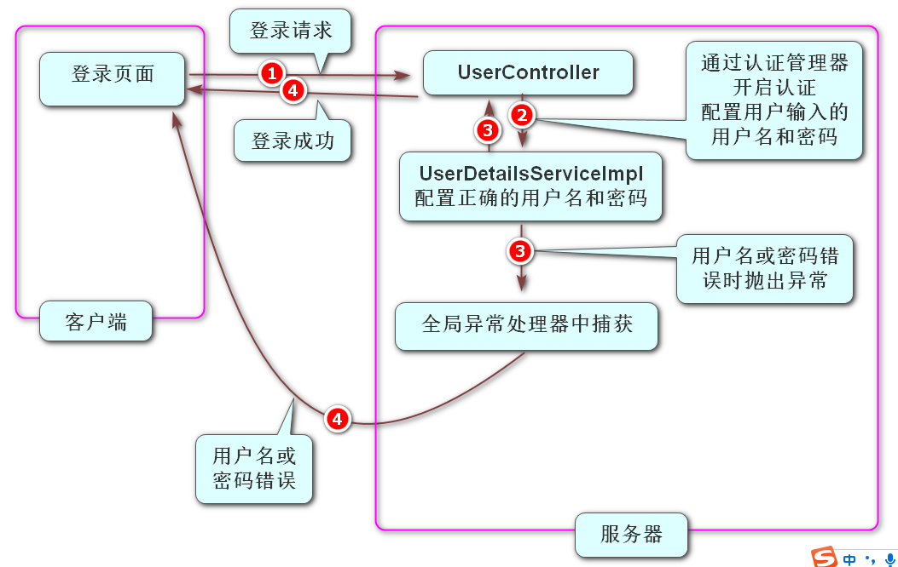
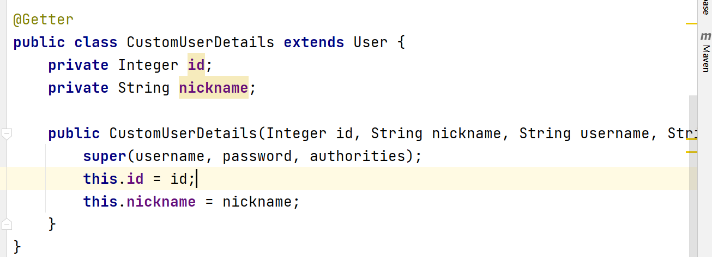
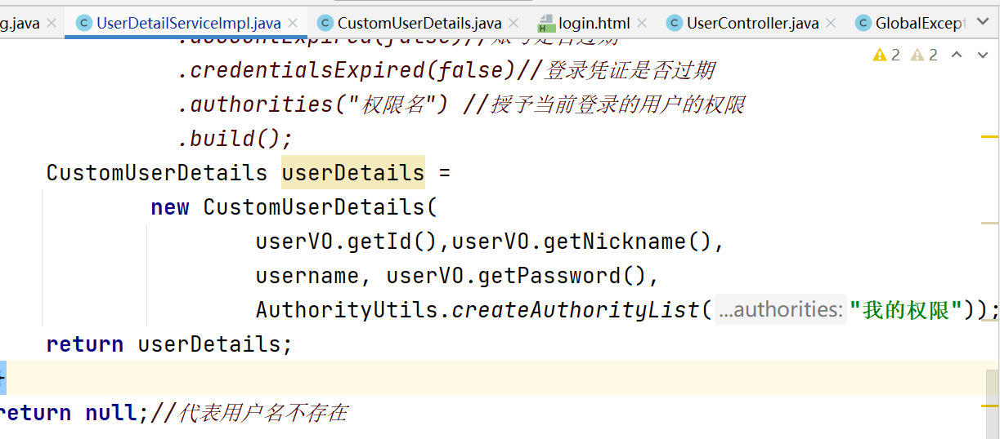

### Security框架认证流程:

1. 在pom.xml里面添加Security框架的依赖, 然后刷新Maven, 此时工程访问任何资源都会跳转到Security框架自带的登录页面

   ```xml
   <!-- Spring Boot支持Spring Security的依赖项，用于处理认证与授权 -->
   <dependency>
       <groupId>org.springframework.boot</groupId>
       <artifactId>spring-boot-starter-security</artifactId>
   </dependency>
   ```

2. 创建Security框架的配置类,重写configure方法并删除掉调用父类方法的代码, 在里面配置了自己的登录页面,设置白名单,关闭跨域攻击防御 

​		

```java
@Slf4j
@Configuration
public class SecurityConfig extends WebSecurityConfigurerAdapter {

    @Override
    protected void configure(HttpSecurity http) throws Exception {
        //super.configure(http);
        //配置自己的登录页面 当判断没有登录的时候 自动跳转到自己的登录页面
        http.formLogin().loginPage("/login.html");

        //配置白名单(无需登录也可以访问的资源)
        String[] urls = {"/reg.html","/login.html","/reg","/login"};
        http.authorizeRequests()
                .mvcMatchers(urls)//匹配某些路径
                .permitAll() //直接放行(不需要登录可以访问)
                .anyRequest()//其它请求
                .authenticated();  //需要登录认证才能访问

        //关闭默认开启的跨域攻击防御
        http.csrf().disable();
    }
}
```

	3. 创建了UserDetailServiceImpl.java这是UserDetailService接口的实现类,在类名上添加@Service注解, 在里面实现了loadUserByUsername方法,  此方法是当开启Security框架的认证时自动调用的方法, 此方法里面如果return出的是一个null代表用户输入的用户名是不存在的, 如果想要出的是一个UserDetails对象 代表用户名存在,密码是否正确由框架内部的代码进行判断.

```java
@Override //此方法的username代表用户输入的用户名
public UserDetails loadUserByUsername(String username) throws UsernameNotFoundException {
    //此方法当Security框架进行登录认证时,自动调用
    //当此方法响应null时 代表用户名不存在, 下面模拟用户输入的用户名是没问题的
    //假设tom和123456是从数据库里面查询出来的数据
    if (username.equals("tom")){
        UserDetails userDetails = User.builder()
                .username("tom").password("123456")
                .disabled(false)//账号是否禁用
                .accountLocked(false)//账号是否锁定
                .accountExpired(false)//账号是否过期
                .credentialsExpired(false)//登录凭证是否过期
                .authorities("权限名") //授予当前登录的用户的权限
                .build();
        return userDetails;
    }
    return null;//代表用户名不存在
}
```

4. 在UserController中接收到客户端的登录请求时开启Security框架的登录认证

   - 在Security框架的配置类中配置认证管理器

     ```java
     //配置认证管理器
     @Bean //添加此注解是为了能够在Controller中自动装配
     @Override
     protected AuthenticationManager authenticationManager() throws Exception {
         return super.authenticationManager();
     }
     ```

   - 在Controller里面 装配认证管理器并在方法中调用认证方法,同时把用户输入的用户名和密码传给Security框架 

     ```java
     @Autowired
     AuthenticationManager manager;
     
     @RequestMapping("/login")
     public JsonResult login(@RequestBody UserLoginDTO userLoginDTO){
     
         //开启Security框架的认证流程,会自动调用UserDetailsServiceImpl里面的方法
         Authentication result = manager.authenticate(
                 new UsernamePasswordAuthenticationToken(
                         userLoginDTO.getUsername(),userLoginDTO.getPassword()
                 ));
         //把认证完成之后的结果保存到Security框架的上下文中
         SecurityContextHolder.getContext().setAuthentication(result);
         //当顺利执行完上面两行代码时说明登录无异常 代表登录成功
         //如果用户名错误或密码错误时,Security框架会抛出对应的异常,
         // 我们需要在全局异常处理的地方处理这两个异常
         return JsonResult.ok();//登录成功
     }
     ```

5. 此时如果登录成功会直接响应给客户端JsonResult.ok()  ,如果用户名或密码错误时Security框架会抛出对应的两个异常, 需要在全局异常处理器中进行捕获,捕获后响应给客户端

   ```java
   @ExceptionHandler({InternalAuthenticationServiceException.class,
           BadCredentialsException.class})
   public JsonResult handleAuthenticationException(
           AuthenticationException e){
       if (e instanceof InternalAuthenticationServiceException){
           log.warn("用户名不存在!");
           return new JsonResult(StatusCode.USERNAME_ERROR);
       }
       log.warn("密码错误!");
       return new JsonResult(StatusCode.PASSWORD_ERROR);
   }
   ```

6. 在Security配置类中,设置密码无加密

   ```java
   //配置密码的加密方式
   @Bean
   public PasswordEncoder passwordEncoder(){
       //下面代码是获取了一个不加密的实例
       return NoOpPasswordEncoder.getInstance();
   }
   ```

7. 运行工程测试!

- Security框架认证流程图

  

- 当登录成功后需要获取当前登录用户的信息时,使用UserDetails只能获取到用户名,如果需要获取其它信息需要自定义UserDetails

  

​	


### 烘焙坊项目后端

- 创建工程:

  - 创建SpringBoot工程, 工程名 baking

  - 勾选 Spring Web, LOmbok, MyBatis Framework, MySQL Driver

  - 在pom.xml里面添加 以下两个依赖   , 刷新maven

    ```xml
    <!--添加Knife4j依赖-->
    <dependency>
        <groupId>com.github.xiaoymin</groupId>
        <artifactId>knife4j-openapi2-spring-boot-starter</artifactId>
        <version>4.1.0</version>
    </dependency>
    
    <!-- Spring Boot支持Spring Validation的依赖项，用于检查参数的基本有效性 -->
    <dependency>
        <groupId>org.springframework.boot</groupId>
        <artifactId>spring-boot-starter-validation</artifactId>
    </dependency>
    ```

  - 把boot01工程中application.properties里面的内容赋值到新工程, 把数据库名blog改成baking

  - 把老师工程中的static里面的页面和imgs文件夹 copy到自己工程的static里面

  - 把老师工程中baking.sql 导入到自己的数据库里面,  把文件复制到自己的工程中 在上面右键Run

### 首页轮播图展示功能

- 创建Banner实体类和BannerVO
- 创建BannerMapper.java和BannerMapper.xml
- 创建MyBatis配置类 
- 在首页中引入Axios  ,添加created方法, 在方法中向/v1/banners/发请求获取轮播图数据, 把得到的数据赋值给bannerArr数组, 让页面轮播图内容和bannerArr数组进行绑定
- 在application.properties中添加以下配置信息

```properties
# 配置当表字段名和实体对象的属性名命名规范不一致时 自动匹配
mybatis.configuration.map-underscore-to-camel-case=true
```

- 创建BannerController, 在里面添加方法处理/v1/banners/请求, 方法中调用mapper的select方法把得到的装着BannerVO的List集合响应给客户端  


