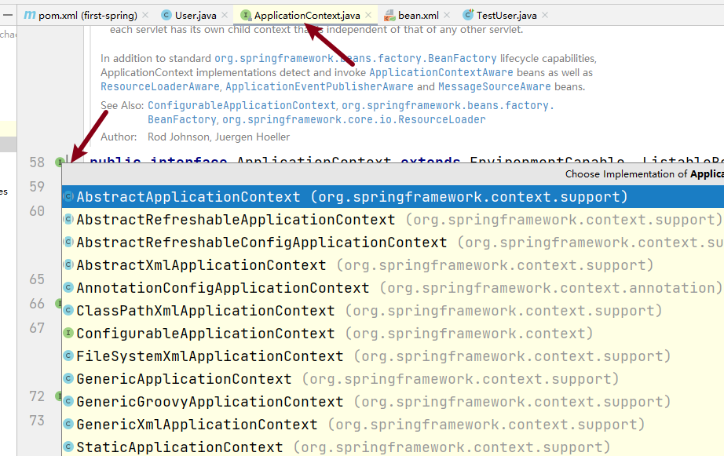
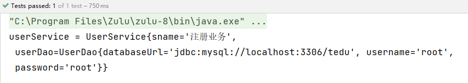
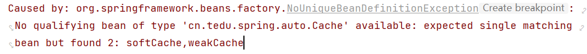
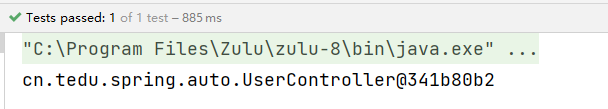
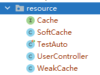

[toc]

# Spring


## spring概述

### 1 Spring定义

Spring是一款主流的 Java EE 开源框架，目的是用于简化Java企业级引用的开发难度和开发周期。从简单性、可测试性和松耦合度的角度而言，任何Java应用都可以从Spring中受益。Spring框架提供自己提供功能外，还提供整合其他技术和框架的能力。

自2004年4月，Spring1.0 版正式发布以来，Spring已经步入到了第6个大版本，即 Spring6，本课程采用 **Spring5.3.24** 正式版本。

Spring官网地址：https://spring.io/


### 2 Spring核心

Spring指的是Spring Framework，通常我们称之为Spring框架。

Spring的两个核心模块

* IoC控制反转

  Inverse of Control的简写，为 控制反转，指把创建对象交给Spring进行管理。

  即：反转资源获取方向，把自己创建资源、向环境索取资源的方式变为环境自动将资源准备好，我们享受资源注入。

* AOP面向切面编程

  Aspect Oriented Programming 的简写，为 面向切面编程。AOP用来封装多个类的公共行为，将那些与业务无关，却为业务模块共同调用的逻辑封装起来，减少系统的重复代码，降低模块间的耦合度。


## 入门案例

### 1 环境要求

* JDK：Java8-15
* Spring：5.3.24

### 2 构建工程

#### 2.1 构建子工程 _03spring


#### 2.2 入门案例

**① 在_03SPRING/pom.xml中引入相关依赖，并 刷新maven**

```xml
<dependencies>
    <!-- 引入spring context依赖-->
    <dependency>
        <groupId>org.springframework</groupId>
        <artifactId>spring-context</artifactId>
        <version>5.3.24</version>
    </dependency>
</dependencies>
```

**② 在工程中（java目录下）创建包 cn.tedu.spring.example**

**③ 在 cn.tedu.spring.example 下创建类 User，并添加 @Component注解**

```java
package cn.tedu.spring.example;
import org.springframework.stereotype.Component;

/**
 * @Component 注解描述的类，表示此类交给Spring框架管理。
 */
@Component
public class User {
    public void doSomething(){
        System.out.println("User is do something~~");
    }
}
```

**④ 创建测试类cn.tedu.spring.example.TestUser进行测试**

```java
package cn.tedu.spring.example;
import org.springframework.context.ApplicationContext;
import org.springframework.context.annotation.AnnotationConfigApplicationContext;

public class TestUser {
    public static void main(String[] args) {
        // AnnotationConfigApplicationContext扫描这个包中所有带有@Component注解的类,并根据这些类创建相应的Spring组件
        ApplicationContext context = new AnnotationConfigApplicationContext("cn.tedu.spring.example");
        // getBean()方法法获取User对象，并调用它的run方法
        User user = context.getBean(User.class);
        System.out.println("user = " + user);
        user.doSomething();
    }
}
```


## 相关概念

### 1 IoC

IoC（Inversion of Control，控制反转）是一种编程思想；

是将对象的创建和管理交由框架来完成，而不是由开发人员手动创建和管理。

### 2 IoC容器

IoC容器是用来实现IoC思想的一个工具或者说技术手段；

它能够自动扫描应用程序中的对象，将它们实例化，并自动注入它们所需要的依赖对象;

使应用程序的开发人员能够更加专注于业务逻辑的实现，而不用关心对象的创建和管理。

Spring通过IoC容器来管理所有的Java对象的实例化和初始化，控制着对象与对象之间的依赖关系。我们将由IoC容器管理的Java对象成为 Spring Bean，它与使用关键字 new 创建的Java对象没有任何区别。

### 3 依赖注入DI

DI （Dependency Injection）：依赖注入，依赖注入实现了控制反转的思想，是指Spring创建对象的过程中，将对象依赖属性通过配置进行注入。

所以 IoC 是一种控制反转的思想，而 DI 是对 IoC 的一种具体实现。

Bean管理：指Bean对象的创建，以及Bean对象中属性的赋值


## IoC容器实现

Spring中的IoC容器就是IoC思想的一个落地产品实现。IoC容器中管理的组件也叫做bean。在创建bean之前，首先需要创建IoC容器，Spring提供了IoC容器的两种实现方式

* BeanFactory

  这是IoC容器的基本实现，是Spring内部使用的接口，面向Spring本身，不提供给开发人员使用。

* ApplicationContext

  BeanFactory的子接口，提供了更多高级特性，面向Spring的使用者，几乎所有场合都使用 ApplicationContext，而不使用底层的BeanFactory。

<font color=red>**源码说明：**</font>




* ApplicationContext的主要实现类

  |                类型                |                 说明                  |
  | :--------------------------------: | :-----------------------------------: |
  | AnnotationConfigApplicationContext |        使用注解方式构建IoC容器        |
  |   ClassPathXmlApplicationContext   | 使用XML配置文件方式构建Spring IoC容器 |

  

## 基于注解管理bean

### 1 Bean对象定义及获取

在Spring框架规范中，所有由spring管理的对象都称之为Bean对象。

#### 1.1 Bean对象定义

Spring提供了以下多个注解，这些注解可以直接标注在java类上，将它们定义成Spring Bean。

|    注解     |                             说明                             |
| :---------: | :----------------------------------------------------------: |
| @Component  | 该注解用于描述Spring中的Bean，它是一个泛化的概念，仅仅标识容器中的一个组件（Bean），并且可以作用在任何层次，例如Service层、Dao层等，使用时只需将该注解标注在相应的类上即可。 |
| @Repository | 该注解用于数据访问层（Dao层）的类标识为Spring中的Bean，功能与@Component相同。 |
|  @Service   | 该注解通常作用在业务层（Service层），用于将业务层的类标识为Spring中的Bean，其功能与@Component相同。 |
| @Controller | 该注解通常作用在控制层（如SpringMVC的Controller），用于将控制层的类标识为Spring中的Bean，其功能与@Component相同。 |

#### 1.2 Bean对象获取

通过ApplicationContext对象获取：调用ApplicationContext对象的getBean()方法，传入对应类的类型即可获取该Bean对象，示例：

```java
ApplicationContext context = new AnnotationConfigApplicationContext("包扫描路径");
User user = context.getBean(类名.class);
```

#### 1.3 应用分析

在 **cn.tedu.spring** 下创建子包 **bean** ，进行 bean 对象的创建及获取

第1步：在bean包下创建类：**UserDao**

```java
@Repository
public class UserDao {
    private String databaseUrl;
    private String username;
    private String password;
}
```

第2步：在bean包下创建测试类：**UserDaoTest**

```java
public class TestUserDao {
    @Test
    public void testBean(){
        ApplicationContext context = new AnnotationConfigApplicationContext("cn.tedu.spring.bean");
        UserDao userDao = context.getBean(UserDao.class);
        System.out.println("userDao = " + userDao);
    }
}
```

**说明：将java类中的 @Repository注解 替换为 @Component注解、@Service注解、@Controller注解 都是可以的。**


### 2 依赖注入DI

#### 2.1 @Value注解

@Value注入是将属性值直接注入到bean中，主要用于注入一些简单类型的属性（如字符串、基本类型等；

使用时需要注意属性的类型和格式，否则会导致注入失败。


**示例：在UserDao中进行属性值注入**

第1步：在UserDao的属性中通过@Value注解注入属性值

```java
@Repository
public class UserDao {
    @Value("jdbc:mysql://localhost:3306/tedu")
    private String databaseUrl;
    @Value("root")
    private String username;
    @Value("root")
    private String password;

    @Override
    public String toString() {
        return "UserDao{" +
                "databaseUrl='" + databaseUrl + '\'' +
                ", username='" + username + '\'' +
                ", password='" + password + '\'' +
                '}';
    }
}
```

第2步：执行测试方法进行测试


#### 2.2 @Autowired注解

@Autowired注入是将对象注入到bean中，并且在注入对象时会根据依赖注入容器中bean的类型进行匹配。如果容器中有多个类型匹配的bean存在，则会抛出异常。因此，@Autowired注入常用于注入复杂对象、接口类型的属性或其他bean实例。

##### 2.2.1 根据类型注入

**定义UserService类，并注入UserDao对象**

第1步：在包bean下创建 `UserService` 类

```java
@Service
public class UserService {
    @Value("注册业务")
    private String sname;
    // Autowired自动装配
    @Autowired
    private UserDao userDao;

    @Override
    public String toString() {
        return "UserService{" +
                "sname='" + sname + '\'' +
                ", userDao=" + userDao +
                '}';
    }
}
```

第2步：调整测试方法

```java
@Test
public void testAuto(){
    ApplicationContext context = new AnnotationConfigApplicationContext("cn.tedu.spring.bean");
    UserService userService = context.getBean(UserService.class);
    System.out.println("userService = " + userService);
}
```

第3步：执行测试方法测试




##### 2.2.2 根据接口注入

进行依赖注入时，如果指定的是接口Interface，Spring框架会自动找到该接口对应的实现类并创建bean对象注入吗？

**在 cn.tedu.spring 下创建子包 auto**

第1步：创建接口 `Cache`

```java
package cn.tedu.spring.auto;

public interface Cache {
}
```


第2步：创建该接口实现类 `SoftCache` ，并添加 `@Component注解`

```java
package cn.tedu.spring.auto;

import org.springframework.stereotype.Component;

@Component
public class SoftCache implements Cache{
}
```


第3步：创建类 `UserController` ，并注入 `SoftCache对象`

```java
@Component
public class UserController {
    @Autowired
    private Cache cache;
}
```


第4步：创建测试类 `TestAuto` 进行测试

```java
public class TestAuto {
    @Test
    public void test01(){
        ApplicationContext context = new AnnotationConfigApplicationContext("cn.tedu.spring.auto");
        UserController userController = context.getBean(UserController.class);
        System.out.println(userController);
    }
}
```


**总结：** 当一个接口有一个唯一的实现类时，Spring框架会通过接口找到该接口对应的实现类，并进行bean对象的创建以及DI注入操作。

那么如果一个接口有多个实现类，Spring框架会创建对应的 java bean 对象吗？


第1步：创建 Cache 接口的实现类 `WeakCache`

```java
@Component
public class WeakCache implements Cache{
}
```


第2步：执行测试方法，确认是否成功




<font color=red>总结： 当一个接口有多个实现类时，Spring无法确定注入哪个实现类对象，因此会报错，可以结合 `@Qualifier注解` 来解决这个问题。</font>


#### 2.3 @Qualifier注解

@Qualifier注解是用于限定一个接口有多个实现类时，根据指定的限定条件来选择具体的实现类的注解；

当Spring容器中存在多个实现同一接口的bean时，在注入时，由于不能确定注入哪一个实现类，就需要通过@Qualifier注解来明确指定要注入的bean的名称。


第1步：在 `UserController` 中添加 `@Autowired注解` 和 `@Qualifier注解`

```java
@Component
public class UserController {
    @Autowired
    @Qualifier("softCache")
    private Cache cache;
}
```


第2步：在 `SoftCache` 实现类中 `@Component注解` 中添加组件名

```java
@Component("softCache")
public class SoftCache implements Cache{
}
```


第3步：执行测试方法进行测试




<font color=red>总结：在@Component注解中可以不用指定组件名称，默认为当前类的 类名首字母小写。</font>


#### 2.4 @Resource注解（了解）

`@Resource` 注解是JavaEE提供的注解之一，也支持在Spring Framework中使用。在Spring中，它可以用来注入Bean实例，与`@Autowired`注解的作用类似，但其也有自己的一些特点。

* @Resource注解是JDK扩展包中的，也就是说属于JDK的一部分。所以该解释是标准注解，而@Autowired注解是Spring框架自己的。

* 装配规则

  * `@Resource` 注解默认根据名称装配byName；

  * 当未指定 name 时，则使用属性名作为 name 进行装配；

  * 如果通过name也未找到，则会自动启动通过类型byType装配。

  **而@Autowired注解默认根据类型装配byType，如果想根据名称匹配，需要配合@Qualifier注解一起使用。**

  

##### 示例

第1步：**cn.tedu.spring** 下创建子包 `resource` ，将上个案例包auto中所有文件拷贝到此包下




第2步：将之前所有关于 `@Autowired` 注解去掉，使用 `@Resource` 注解

```java
@Component
public class UserController {
    /**
     * 根据名称进行装配
     */
    @Resource(name = "softCache")
    /**
     * 如果未指定名称name，则会使用属性名作为名称进行装配
     */
    //@Resource
    /**
     * 如果未指定名称name，属性名也不匹配，则会默认根据类型进行匹配
     */
    private Cache cache;
}
```


第3步：修改测试方法中的包扫描路径，执行测试方法进行测试


**总结**

1. 指定@Resource中的name，则根据名称装配
2. 未指定name时，则根据属性名装配
3. 未指定name，属性名也不一致，则根据类型装配


### 3 bean对象作用域分析

#### 3.1 说明

在Spring框架中，Bean是按照作用域来创建的，常见的作用域有两种：Singleton和Prototype。其中，Singleton (单例)是指整个应用中只有一个实例，并在第一次请求时创建实例。而Prototype(多例)是指每次请求都会创建一个新的实例并返回，每个实例之间是相互独立的。可以通过 `@Scope` 注解来指定，默认是单实例。

#### 3.2 单实例与多实例

* 单实例

  单实例（Singleton）是指某个类只能创建唯一的一个实例对象，并且该类提供一个全局的访问点（静态方法）来让外界获取这个实例，常常用在那些只需要一个实例来处理所有任务的场景下，例如数据库连接池。

* 多实例

  多实例（Multiple Instance）则是指可以在同一个类的定义下，创建多个实例对象。每个对象都是相互独立的，有自己的状态和行为；常常用于需要同时处理多个任务的场景。


在Spring中可以通过 `@Scope` 注解来指定bean的作用域范围，具体如下

|              取值               |                含义                 |
| :-----------------------------: | :---------------------------------: |
| @Scope("singleton")（**默认**） | 在IoC容器中，这个bean的对象为单实例 |
|       @Scope("prototype")       |    这个bean在IoC容器中有多个实例    |

#### 3.3 应用分析

第1步：在 **cn.tedu.spring** 下创建子包 **scope** ，并创建类 `DBConnect`

```java
@Scope(value = "singleton")
@Component
public class DBConnect {
}
```


第2步：创建测试类进行测试

```java
public class TestDBConnect {
    @Test
    public void testScope(){
        ApplicationContext context = new AnnotationConfigApplicationContext("cn.tedu.spring.scope");
        // 第一次获取
        DBConnect dbConnect1 = context.getBean(DBConnect.class);
        System.out.println(dbConnect1);
        // 第二次获取
        DBConnect dbConnect2 = context.getBean(DBConnect.class);
        System.out.println(dbConnect2);
    }
}
```


**总结**

* **当为单例模式 singleton 时，多次获取bean实例的地址是相同的**

  

* **当为多例模式 prototype 时，多次获取bean实例的地址是不同的**

  


<font color=red>单例模式适用于需要共享数据并且需要避免重复创建实例的情况。而多例模式适用于需要动态地创建对象并提供独立实例的情况。</font>


### 4 bean对象生命周期管理

#### 4.1 说明

程序中的每个对象都有生命周期，对象的创建、初始化、应用、销毁的整个过程称之为对象的生命周期；

在对象创建以后需要初始化，应用完成以后需要销毁时执行的一些方法，可以称之为是生命周期方法；

在spring中，可以通过 `@PostConstruct` 和 `@PreDestroy` 注解实现 bean对象 生命周期的初始化和销毁时的方法。

* `@PostConstruct` 注解

  生命周期初始化方法，在对象构建以后执行。

* `@PreDestroy` 注解

  生命周期销毁方法，比如此对象存储到了spring容器，那这个对象在spring容器移除之前会先执行这个生命周期的销毁方法（注：prototype作用域对象不执行此方法）。


**问题：为什么要将对象交给spring管理？**

spring框架管理对象时，会为对象提供一些更加科学的特性，比如作用域Scope、生命周期方法以及对象与对象之间的解耦，通常这些特性的植入，可以让我们更好的应用对象。


#### 4.2 完整生命周期

1. 实例化阶段（bean对象创建）

   在这个阶段中，容器会创建一个Bean的实例，并为其分配空间。这个过程可以通过构造方法完成。

2. 属性赋值阶段

   在实例化完Bean之后，容器会把Bean中的属性值注入到Bean中，这个过程可以通过set方法完成。

3. 初始化阶段（bean对象初始化）

   在属性注入完成后，容器会对Bean进行一些初始化操作；

4. 使用阶段

   初始化完成后，Bean就可以被容器使用了

5. 销毁阶段

   容器在关闭时会对所有的Bean进行销毁操作，释放资源。


#### 4.3 生命周期验证

第1步：`DBConnect` 类中打印生命周期过程

```java
@Scope(value = "singleton")
@Component
public class DBConnect {
    private String username;

    /**
     * 1.调用无参构造方法进行bean对象创建
     */
    public DBConnect() {
        System.out.println("1-bean对象创建，调用无参构造");
    }

    /**
     * 2.通过setter()方法进行属性赋值
     */
    @Value("root")
    public void setUsername(String username) {
        this.username = username;
        System.out.println("2-通过set方法给bean对象赋值");
    }

    /**
     * 3.对象创建后可以通过此方法进行初始化
     */
    @PostConstruct
    public void init(){
        System.out.println("3-初始化阶段");
    }

    /**
     * 5.对象销毁前可以通过此方法进行资源释放
     */
    @PreDestroy
    public void destroy(){
        System.out.println("5-bean对象销毁，释放资源");
    }
}
```


第2步：测试类中打印生命周期过程

```java
public class TestDBConnect {
    @Test
    public void testScope(){
        AnnotationConfigApplicationContext context = new AnnotationConfigApplicationContext("cn.tedu.spring.scope");
        DBConnect dbConnect = context.getBean(DBConnect.class);
        // 4.bean对象初始化完成，可以使用
        System.out.println("4-应用程序使用bean对象阶段");
        // 销毁bean
        context.close();
    }
}
```


第3步：生命周期结果验证


#### 4.4 生命周期扩展

Bean初始化和销毁方法很有用，它们可以在Bean生命周期的特定时机执行自定义逻辑，方便地对Bean进行管理和配置。

* 初始化常见应用场景
  - 创建连接池
  - 加载资源文件
  - 进行数据校验
* 销毁常见应用场景
  - 关闭连接池
  - 保存数据
  - 释放占用的资源


### 5 引用外部属性文件

#### 5.1 说明

实际开发中，很多情况下我们需要对一些变量或属性进行动态配置，而这些配置可能不应该硬编码到我们的代码中，因为这样会降低代码的可读性和可维护性。

我们可以将这些配置放到外部属性文件中，比如`database.properties`文件，然后在代码中引用这些属性值，例如`jdbc.url`和`jdbc.username`等。这样，我们在需要修改这些属性值时，只需要修改属性文件，而不需要修改代码，这样修改起来更加方便和安全。

而且，通过将应用程序特定的属性值放在属性文件中，我们还可以将应用程序的配置和代码逻辑进行分离，这可以使得我们的代码更加通用、灵活。


#### 5.2 使用流程

1. 创建外部属性文件：`resources/database.properties`
2. 引入外部属性文件：`@PropertySource`
3. 获取外部属性文件中的变量值：`"${变量名}"`
4. 进行属性值注入


#### 5.3 应用分析

第1步：在 `resources` 目录下创建文件 ：`database.properties`

```properties
jdbc.user=root
jdbc.password=root
jdbc.url=jdbc://mysql://localhost:3306/test
jdbc.driver=com.mysql.cj.jdbc.Driver
```


第2步：工程目录下创建子包 `file` 并创建类 `Database`

* 通过 `@PropertySource` 注解引入外部文件
* 通过 `${变量名}` 获取属性值
* 通过 `@Value()` 注解进行属性值注入

```java
@Component
@PropertySource("classpath:database.properties")
public class Database {
    @Value("${jdbc.url}")
    private String url;
    @Value("${jdbc.user}")
    private String username;
    @Value("${jdbc.password}")
    private String password;
    @Value("${jdbc.driver}")
    private String driver;

    @Override
    public String toString() {
        return "Database{" +
                "url='" + url + '\'' +
                ", username='" + username + '\'' +
                ", password='" + password + '\'' +
                ", driver='" + driver + '\'' +
                '}';
    }
}
```


第3步：创建测试类 `TestDatabase` 进行测试

```java
public class TestDatabase {
    @Test
    public void testFile(){
        ApplicationContext context = new AnnotationConfigApplicationContext("cn.tedu.spring.file");
        Database database = context.getBean(Database.class);
        System.out.println(database);
    }
}
```


### 6 自动扫描配置

#### 6.1 说明

自动扫描配置是 Spring 框架提供的一种基于注解（Annotation）的配置方式，用于自动发现和注册 Spring 容器中的组件。当我们使用自动扫描配置的时候，只需要在需要被 Spring 管理的组件（比如 Service、Controller、Repository 等）上添加对应的注解，Spring 就会自动地将这些组件注册到容器中，从而可以在其它组件中使用它们。

在 Spring 中，通过 `@ComponentScan` 注解来实现自动扫描配置。`@ComponentScan` 注解用于指定要扫描的包或类。Spring 会在指定的包及其子包下扫描所有被 `@Component`（或 `@Service`、`@Controller`、`@Repository` 等）注解的类，把这些类注册为 Spring 的 Bean，并纳入 Spring 容器进行管理。


#### 6.2 使用示例

```java
@Configuration
@ComponentScan("com.example.app")
public class AppConfig {

}
```

在此示例中，

* `@Configuration` 注解

  表示将类 `AppConfig` 标识为一个 Spring 配置类，Spring 会来加载这个类，并且读取其中的配置。

* `@ComponentScan` 注解

  用于指定扫描的包路径 `com.example.app`。

  Spring 会自动在 `com.example.app` 包及其子包下扫描所有被 `@Component` 等注解标注的类，并将这些类注册为 Spring 的 Bean。


#### 6.3 应用分析

第1步： 工程下创建包 **config**，并在此包下创建类 **SpringConfig**

```java
/**
 * @Configuration注解： 将类 SpringConfig 标识为一个 Spring 配置类
 */
/**
 * @ComponentScan注解：指定要扫描的包路径 cn.tedu.spring，包含该包下的子包
 */
@Configuration
@ComponentScan("cn.tedu.spring")
public class SpringConfig {

}
```


第2步：创建测试类 **TestScan** 进行测试

```java
public class TestScan {
    @Test
    public void testScan(){
        // 指定配置类:SpringConfig
        ApplicationContext context = new AnnotationConfigApplicationContext(SpringConfig.class);
        // 获取bean对象
        Database database = context.getBean(Database.class);
        System.out.println(database);
		// 获取bean对象
        SoftCache softCache = context.getBean(SoftCache.class);
        System.out.println(softCache);
    }
}
```


