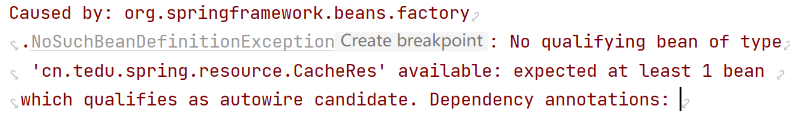
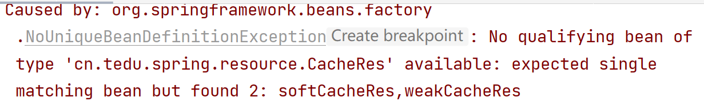

[toc]

## 1 重点（必须记住）

### 1.1 Spring Framework核心

* IoC控制反转
* AOP面向切面编程

### 1.2 Spring Framework相关概念

* IoC控制反转

  编程思想，将对象的创建和管理交由框架来管理，无需开发人员手动创建和管理对象

* IoC容器

  实现IoC控制反转思想技术工具（**ApplicationContext**）

  Spring通过IoC容器进行对象的实例化、初始化、销毁等操作

* DI依赖注入

  Spring在创建对象的过程中，将属性值注入到对象中

### 1.3 什么是Spring Bean对象

由Spring的IoC容器创建和管理的对象叫做：Spring Bean对象，和普通的Java对象没有区别

### 1.4 注解

|      注解      |           添加位置           |          功能          |
| :------------: | :--------------------------: | :--------------------: |
|   @Component   |              类              | 标记为普通的spring组件 |
|  @Controller   |              类              | 标记为控制层spring组件 |
|    @Service    |              类              | 标记为业务层spring组件 |
|  @Repository   |              类              | 标记为数据层spring组件 |
|     @Value     |      属性、setter()方法      |        依赖注入        |
|   @Autowired   | 属性、构造方法、setter()方法 |     自动装配[类型]     |
|   @Qualifier   |             属性             |      根据名称装配      |
| @Configuration |              类              |      标记为配置类      |

### 1.5 Bean生命周期

1. 实例化阶段（bean对象创建）

   在这个阶段中，容器会创建一个Bean的实例，并为其分配空间。这个过程可以通过构造方法完成。

2. 属性赋值阶段

   在实例化完Bean之后，容器会把Bean中的属性值注入到Bean中，这个过程可以通过set方法完成。

3. 初始化阶段（bean对象初始化）

   在属性注入完成后，容器会对Bean进行一些初始化操作；

4. 使用阶段

   初始化完成后，Bean就可以被容器使用了

5. 销毁阶段

   容器在关闭时会对所有的Bean进行销毁操作，释放资源。

### 1.6 `@Autowired` 和 `@Resource` 区别

* `@Autowired` 是Spring框架的注解，`@Resource` 是JDK的标准注解

* `@Autowired` 注解是根据 `类型` 进行装配，如果需要指定名称则需要配合 `@Qualifier` 注解

  `@Resource` 注解首先根据名称进行装配，

  ​                     如果未找到，则以属性名作为名称进行装配，

  ​                     如果未找到，则根据类型进行装配

## 2 了解

### 2.1 IoC容器实现

ApplicationContext接口

**实现类**

* AnnotationConfigApplicationContext：基于注解方式构建IoC容器
* ClassPathXmlApplicationContext：基于xml配置文件方式构建IoC容器

### 2.2 注解

|      注解       | 位置 |                  功能                  |
| :-------------: | :--: | :------------------------------------: |
|    @Resource    | 属性 |          对象类型数据自动装配          |
|     @Scope      |  类  | 单实例singleton[默认]和多实例prototype |
| @PropertySource |  类  |            引入外部属性文件            |
| @ComponentScan  |  类  |                自动扫描                |
| @PostConstruct  | 方法 |   Bean对象生命周期初始化时的执行方法   |
|   @PreDestroy   | 方法 |    Bean对象生命周期销毁时的执行方法    |

### 2.3 作用域

* 单实例：某个类只能创建唯一的一个实例对象，比如：数据库的连接池。
* 多实例：某个类可以创建多个实例对象，比如：每个用户的购物车功能。

## 3 常见异常

* 未找到需要装配的bean对象
  * 在类上确认是否添加 `@Component` 注解
  * 确认 `@Resource(name="xxx")` 或 `@Qualifier(value="xxx")` 中的名字是否和 `@Component(value="xxx")` 中的名字是否一致

* 预期装配一个bean对象，但是找到了多个(接口中有多个实现类时)
  * `@Resource` 注解中，添加name参数
  * `@Qualifier` 注解中，添加value参数

### 复制包路径的快捷键

* Windows

  * 没有Fn按键

    复制：Ctrl + Shift + Alt + c

    粘贴：Ctrl + v

  * 有Fn按键

    复制：Fn + Ctrl + Shift + Alt + c

    粘贴：Ctrl + v

* Mac

  * 复制：Command + Shift + c
  * 粘贴：Command + v

  

