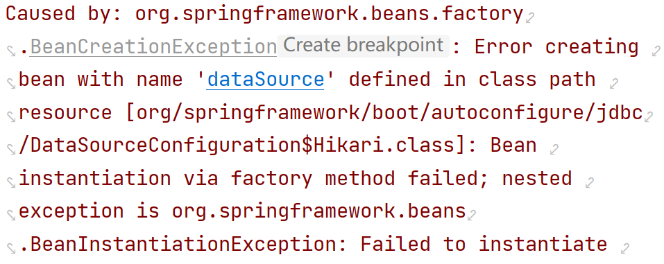
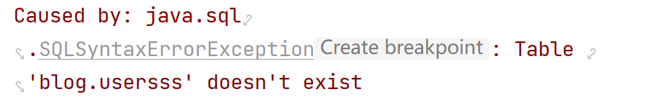
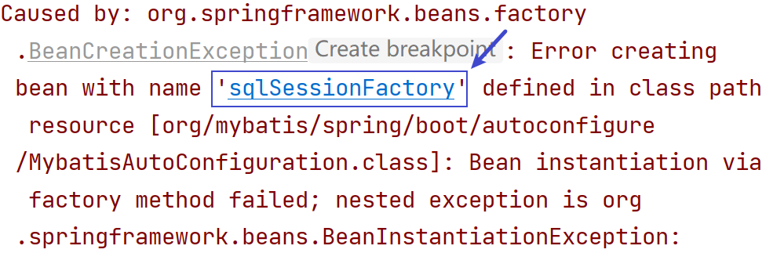
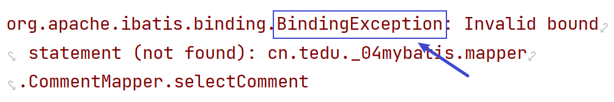
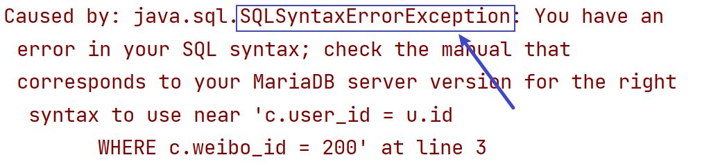

### 1 MyBatis介绍

MyBatis是一个数据持久层框架，目的是为了数据库的操作更加简便、灵活；

将JAVA对象和数据库的操作语句分离，通过注解或者XML映射文件的方式将Java对象和数据表映射；

可以自动将SQL语句转为JDBC代码，并根据指定的返回值类型生成对应的结果，提供给开发者使用。

### 2 MyBatis使用流程

1. 配置MyBatis环境

   在 `pom.xml` 中添加 MyBatis 和 MySQL 的依赖

2. 在配置文件中配置数据库连接

   数据库连接的URL地址、用户名、密码

3. 在配置文件中配置xml文件映射的位置

4. 编写数据层接口，添加 `@Mapper` 注解，并定义接口方法

5. 在XML文件中配置SQL语句

6. 在应用程序中进行依赖注入，并调用接口方法使用

### 3 管理MyBatis方式

#### 3.1 注解方式

##### 1）说明

基于注解方式可以使代码更简洁，省去了XML配置文件的编写工作，适合一些简单的CRUD操作。

##### 2）常用注解

* @Insert("SQL语句")
* @Delete("SQL语句")
* @Update("SQL语句")
* @Select("SQL语句")

#### 3.2 XML方式

##### 1）优点

* SQL和JAVA代码分离
* 更好的复用性（`sql标签和include标签`）
* 更好的支持动态SQL

##### 2）常用标签

* 增删改

  * 增：`<insert id="">标签`
  * 删：`<delete id="">标签`
  * 改：`<update id="">标签`

  <font color=red>返回值为整数类型，受影响的数据条数。</font>

* 查询：

  * `<select id="" resultType="类名完整路径">`

    * resultType属性值：实体类

    * resultType属性值：VO类

  * `<select id="" resultMap="resultMap标签的id属性值"`>

* 动态删除：

  ```xml
  <!-- <foreach>标签
        collection属性：需要遍历的对象类型,数组为array，集合为list
        item属性：遍历出每个元素的变量名称
        separator属性：不同元素间的分隔符(一切以SQL语法为准)
  -->
  <foreach collection="对象类型" item="变量名" separator="分隔符">
      #{变量名}
  </foreach>
  ```

* 动态修改

  ```xml
  <!--注意逗号 , 的问题-->
  UPDATE 表名
  <set>
  	<if test="属性名!=null">字段名=#{属性名},</if>
      <if test="属性名!=null">字段名=#{属性名}</if>
  </set>
  ```

* SQL语句重用

  ```xml
  <!--定义重复的SQL语句-->
  <sql id="xxx">重复SQL</sql>
  <!--引用sql标签中重复的SQL语句-->
  <include refid="sql标签的id"></include>
  ```

* ResultMap标签

  用来封装结果，一般用于一对多和多对多查询。

  * `<resultMap>标签`
    * `id` 属性：唯一标识
    * `type` 属性：指定映射的JAVA类型
  * `<id>标签` ：指定映射的主键字段，包含 `column属性` 和 `property属性`
    * `column属性` ：查询语句中的列名（或别名）
    * `property属性` ：JAVA对象中的属性名
  * `<result>标签` ：指定映射的非主键字段，包含 `column属性` 和 `property属性`
    * `column属性` ：查询语句中的列名（或别名）
    * `property属性` ：JAVA对象中的属性名
  * `<collection>标签` ：映射一对多或多对多关系
    * `property属性` ：JAVA对象中的属性名
    * `ofType属性` ：集合中元素的类型


### 4 对象关系映射

|    JAVA    |   数据库   |
| :--------: | :--------: |
|   一个类   |   一张表   |
| 一个类属性 | 一个表字段 |
|  一个对象  | 一条表记录 |


### 5 常见异常

##### 1）数据库连接配置错误



##### 2）SQL语法错误



##### 3）xml配置文件有错误

找到异常中提示的 xml 文件，去检查



##### 4）方法绑定异常

1. 检查接口方法名和xml文件中标签的 id 属性值是否一致
2. 检查配置文件中映射文件的配置路径是否正确：`mybatis.mapper-locations`



##### 5）SQL语法错误异常

检查XML文件中对应的SQL语句的语法




<font color=red>以下为详细的流程，仅供课上参考</font>

### 1 使用MyBatis流程-注解方式

1. 创建工程

   SpringBoot版本：2.7.12

   勾选2个依赖：MyBatis Framework、MySQL Driver

2. 配置连接数据库信息：application.properties （**sdu  sdu  sdp**）

3. 创建数据库、数据表

4. 创建实体类对象（用于和数据表中的字段一 一对应）

5. 创建映射接口（mapper/XxxMapper）,并添加 `@Mapper` 注解

6. 定义接口方法：添加 `@Insert` 注解，定义好SQL语句（占位符: #{xxx}）

7. 测试

   ```java
   // 自动装配
   @Autowired
   private XxxMapper xxxMapper;
   
   xxxMapper.接口方法(参数);
   ```

   

### 2 使用MyBatis流程-xml配置文件方式

1. 创建工程

   SpringBoot版本：2.7.12

   勾选2个依赖：MyBatis Framework、MySQL Driver

2. 配置文件：application.properties

   * 数据库：`sdu sdu sdp`
   * xml文件路径：`mybatis.mapper-locations=classpath:mappers/*.xml`

3. 创建 `resources/mappers` 目录，并存放 `XxxMapper.xml` 文件

4. 创建实体类对象（用于和数据表中的字段一 一对应）

5. 创建映射接口（mapper/XxxMapper）,并添加 `@Mapper` 注解

6. 定义接口方法

7. 配置xml文件

   * 配置namespace：指定映射接口的完整路径
   * xml标签：`<insert> <update> <select> <delete>`

8. 测试

   ```java
   // 自动装配
   @Autowired
   private XxxMapper xxxMapper;
   
   xxxMapper.接口方法(参数);
   ```

   

### 作业

**客户信息表**

创建客户信息表customers，包含字段如下表所示，并插入数据

| 字段名称  | 中文名称 | 类型       | 长度 | 备注 |
| --------- | -------- | ---------- | ---- | ---- |
| cust_id   | 客户编号 | 字符串类型 | 32   | 主键 |
| cust_tel  | 电话号码 | 字符串类型 | 11   |      |
| cust_name | 客户姓名 | 字符串类型 | 64   |      |
| address   | 送货地址 | 字符串类型 | 128  |      |


**订单表**

创建订单表(user_orders)，包含字段如下所示，并插入数据

| 字段名称     | 中文名称 | 类型         | 长度 | 备注                   |
| ------------ | -------- | ------------ | ---- | ---------------------- |
| order_id     | 订单编号 | 字符串类型   | 32   | 主键                   |
| cust_id      | 客户编号 | 字符串类型   | 32   |                        |
| order_date   | 下单时间 | 日期时间类型 |      |                        |
| status       | 订单状态 | 字符串类型   | 10   |                        |
| products_num | 商品数量 | 整数类型     |      |                        |
| amt          | 订单金额 | 浮点数       |      | 总位数10位,保留2位小数 |


**建库建表语句**

```mysql
CREATE DATABASE IF NOT EXISTS mybatisdb DEFAULT CHARSET=UTF8;
USE mybatisdb;

CREATE TABLE customers (
    cust_id VARCHAR(32) PRIMARY KEY,
    cust_tel VARCHAR(32),
    cust_name VARCHAR(64),
    address VARCHAR(128)
) CHARSET = UTF8;
INSERT INTO customers VALUES
('0001', '13512345678', 'Jerry', '北京'),
('0002', '13222334455', 'Tom', '成都'),
('0003', '13811112222', 'Dekie', '北京');

CREATE TABLE user_orders (
    order_id VARCHAR(32) primary key,
    cust_id VARCHAR(32),
    order_date DATETIME,
    status VARCHAR(10),
    products_num INT,
    amt DOUBLE(10,2)
) CHARSET=UTF8;
INSERT INTO user_orders VALUES('202301010001', '0001', '1999-01-01 00:00:00', '1', 2, 100);
INSERT INTO user_orders VALUES('202301010002', '0001', '1999-01-01 00:00:00', '1', 1, 200);
INSERT INTO user_orders VALUES('202301020001', '0002', '1999-01-01 00:00:00', '4', 1, 70);
INSERT INTO user_orders VALUES('202301020002', '0002', '1999-01-01 00:00:00', '2', 3, 450.34);
INSERT INTO user_orders VALUES('202301020003', '0003', '1999-01-01 00:00:00', '3', 4, 800.45);

```

**练习**

1. 创建工程 egmybatis3 （注意SpringBoot版本和添加依赖）

2. 配置工程文件（数据库）及xml文件映射位置，并创建xml文件对应目录

3. pojo下创建实体类（**2个**），和相关表做好映射关系

4. 要求（使用xml方式管理数据库）

   1. 在客户信息表中插入一条数据：`'0004', '13811112222', 'Tony', '成都'`

   2. 根据客户编号查询某个客户信息，结果：`Customers`

   3. 查询所有客户的信息，结果放到 List 集合中

   4. 查询指定城市的客户信息，结果集放到 List集合 中，比如查询北京的客户信息

   5. 查询指定城市的客户信息，只查询 姓名`cust_name` 和 城市 `address` ，查询结果放到 `List<CustomersVO>` 中

   6. 根据客户的id动态修改客户信息

   7. 根据订单编号动态删除订单信息（数组方式和List集合方式都可以）

      **注意：尽量删除不存在的订单编号，能测出是否成功即可，尽量不要真删除表中数据**

   8. SQL语句重用优化

   9. 查询所有订单信息，放到List集合中

   10. 查询指定订单状态的信息，放到List集合中，比如：查询订单状态为待付款 '1' 的订单
   
   11. 根据客户编号，查询该客户所有订单，
   
       要求显示：客户姓名、客户地址、订单编号、订单状态、订单总金额
   
   12. 根据客户编号，查询该客户的所有订单，
   
       要求显示：
   
       客户编号 cust_id、
   
       客户名字 cust_name、
   
       送货地址 address、
   
       该客户成交的所有订单，放到 `List<UserOrders>` 集合中


### 作业

1. 根据微博的id查询该微博下所有的评论（**ResultMap**）

   显示：微博id、微博内容、评论的所有信息（放到 `List<>` 集合中）

2. 把客户信息和订单信息的12道题重新建个工程写一遍


