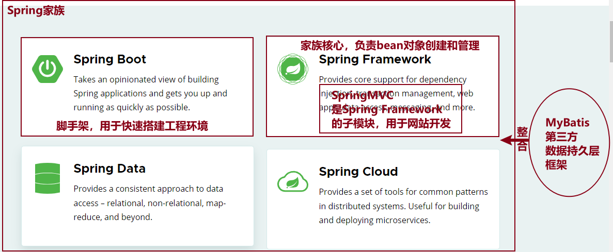

### 知识点1

Spring、Spring Boot、Spring MVC、MyBatis 关系

* Spring Framework：核心，包括IoC控制反转、AOP面向切面编程、Spring MVC等子模块
* Spring Boot：基于Spring Framework的快速开发项目环境的脚手架，快速构建工程环境
* Spring MVC：Spring Framework的子模块，用来做Web应用开发
* MyBatis：第三方持久层框架，大大减少了开发人员编写JDBC的工作量



### 知识点2

ORM（**对象关系映射**）框架

|              JAVA              |   数据库   |
| :----------------------------: | :--------: |
|             一个类             |   一张表   |
| 一个类属性(可以和字段名不一样) | 一个表字段 |
|            一个对象            | 一条表记录 |

### 知识点3

Spring整合MyBatis流程

第1步：创建工程

​	Spring Boot版本：2.7.12  <font color=red>因为3版本最低版本支持：JAVA 17</font>

​	勾选依赖项：MyBatis Framework 和 MySQL Driver

第2步：配置数据库连接信息 `application.properties`

```properties
spring.datasource.url=jdbc:mysql://localhost:3306/mybatisdb?
spring.datasource.username=root
spring.datasource.password=root
```

第3步：创建实体类，和数据表做好映射关系

工程目录下创建包pojo，在pojo包下创建实体类(**entity**)

```java
public class User{
    // 注意类型、数量和数据表中表字段保持一致
    // 名字可以不一致，后期使用别名
    private Integer id;
}
```


第4步：创建Mapper接口

工程目录下创建包mapper，创建对应接口

```java
@Mapper
public interface XxxMapper{
    @Insert("SQL语句")
    int insertUser(User user);
}
```


第5步：应用程序中(Controller)注入使用

```java
// 自动装配
@Autowired
private XxxMapper xxxMapper;

@RequestMapping("/v1/users/register")
public String register(){
    // 获取用户信息
    // 校验是否被占用 - MyBatis
    UserVO userVO = xxxMapper.selectByUsername(String username);
    if (UserVO != null){
        return "用户名被占用";
    }
    // 注册-插入数据
    int i = xxxMapper.insertUser(User user);
    if (i > 0){
        return "注册成功";
    }
    return "注册失败";
}
```


### 知识点4：

MyBatis管理数据库的方式

* 注解方式

  一般用于单表增删改查，比较方便

* xml配置文件方式

  一般用于多表查询或者复杂查询


