[toc]

## 1 MVC

MVC是一种软件开发的设计模式；

目的是为了降低项目中各个模块间的耦合度，提高代码的可维护性和可扩展性。

<font color=red>**模型 视图 控制器**</font>

- M：Model 模型层，业务逻辑处理，与数据库交互；
- V： View 视图层，页面及数据展示，通常是由网页、图片等组成；
- C： Controller控制器层，负责接收请求，调用模型层处理请求，并返回响应给客户端。

## 2 SringMVC

### 2.1 SpringMVC工作流程

SpringMVC是Spring Framework的子模块，是一种使用MVC架构模式实现Web应用的框架，目标是为了简化Web的开发。

**描述一下Spring MVC的工作流程**

1. 客户端发送请求至前端控制器DispatcherServlet
2. DispatcherServlet收到请求后，调用处理器映射器HandlerMapping
3. HandlerMapping根据请求URL找到具体的Controller
4. Controller处理请求，并返回ModelAndView，其中的View只是视图名，并不指向具体的视图组件
5. DispatcherServlet通过ViewReslover（视图解析器）确定负责显示数据的具体View
6. DispatcherServlet对View进行渲染视图（即将Model填充至视图组件中），并将完整的视图响应到客户端

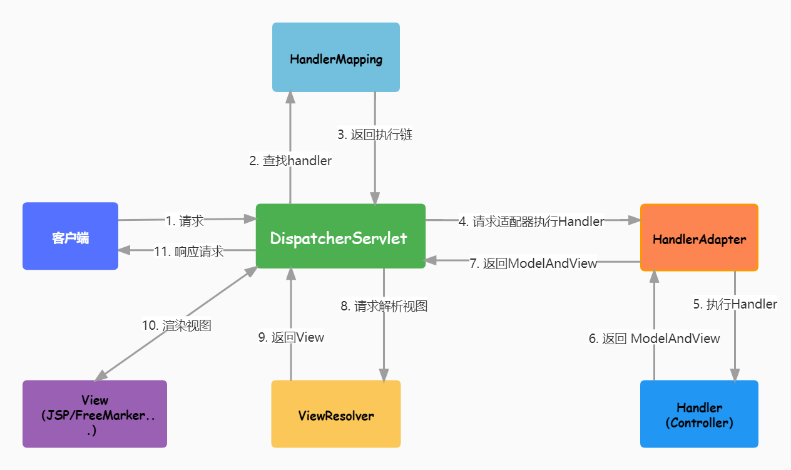


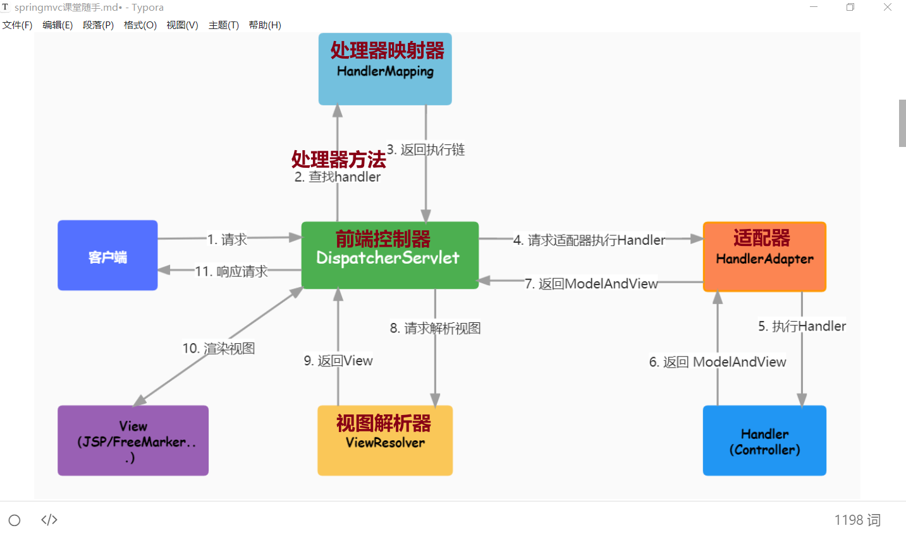


### 2.2 注意

* 静态资源：更新后一定 Rebuild Static
* 动态请求：修改代码后一定要 重启工程
* 刷新页面：Shfit + F5


### 2.3 常用注解

1. `@Controller`：将类标记为控制器，用于接收请求并处理请求的方法

2. `@Responsebody` ：允许控制器方法以返回值方式返回给客户端数据

3. `@RestController`

   复合注解，相当于 `@Controller` 和 `@ResponseBody` 的组合；

   添加在控制器类上，控制器方法中无需添加 `@ResponseBody` 注解

4. `@RequestMapping`

   请求注解；

   - `@GetMapping("/v1/users/login")` ：处理GET请求

   - `@PostMapping("/v1/users/login")`：处理POST请求

     

   **注意：类上使用@RequestMapping()，方法上使用限制请求方式的注解；**

   **如果请求方法和对应的注解不匹配，则会显示405状态码**

5. `@MapperScan`

   用于指定Mapper接口所在的包，并让MyBatis框架自动扫描这些接口，从而生成Mapper的实现类

   ```java
   @Configuration
   @MapperScan("cn.tedu.xxx.mapper1")
   public class MyBatisConfig{
   }
   ```


### 2.4 常见的错误状态码

1. 404状态码

   当请求的URL地址没有找到对应的资源或者处理器方法时，会返回404状态码

   解决：确认请求的地址是否与Controller中的 `@RequestMapping` 地址相同

2. 405状态码

   控制器方法的请求映射与客户端发起的请求方法不匹配

3. 500状态码

   服务器错误，根据服务端 run 终端报错调整mvc的代码


## 3 POJO

简单Java对象，不继承任何类或实现任何接口的对象，通常包含了纯粹的数据。

* 实体类 - entity ：映射数据库表及表字段
* 视图对象 - VO ： 封装服务端 传给 客户端的数据
* 数据传输对象 - DTO ：封装 客户端 传给 服务端的数据


## 4 常见异常

### 4.1 工程未启动

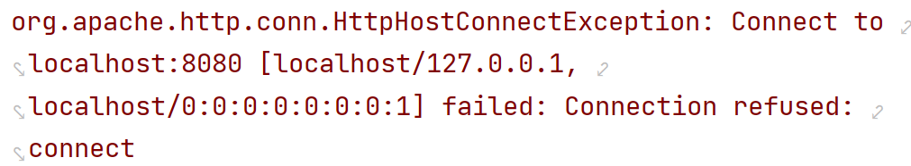


### 4.2 地址匹配错误

检查 路径 和 RequestMapping 注解中的是否一致

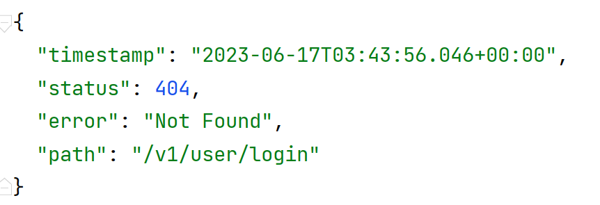

### 4.3 项目启动失败报错

​	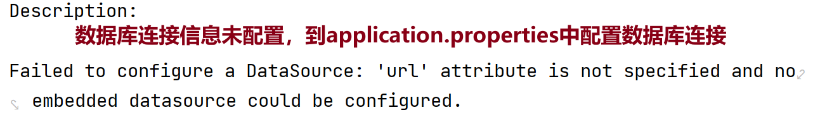


### 4.4 项目启动失败报错

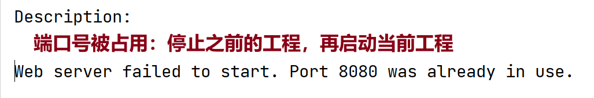


## 5 整体设计思路

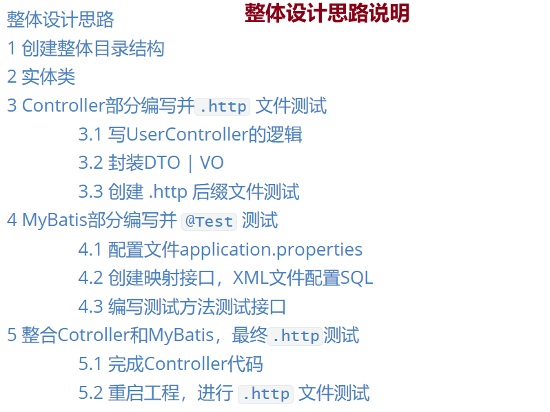


### 5.1 创建整体目录结构

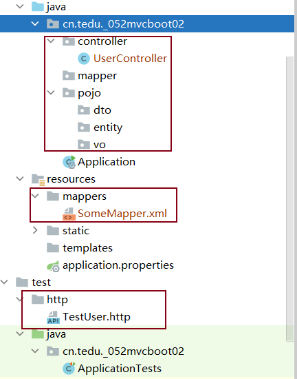

### 5.2 实体类

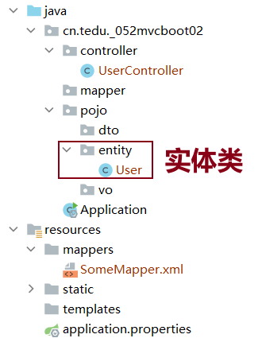

### 5.3 Controller部分编写并`.http` 文件测试

#### 5.3.1 写UserController的逻辑

```java
@Controller
public class UserController {
    @RequestMapping("/v1/users/insert")
    @ResponseBody
    public String addUser(UserAddDTO userAddDTO){
        // 1.获取数据
        // 2.数据表中插入数据
        return "插入成功";
    }
}
```

#### 5.3.2 封装DTO | VO

```java
public class UserAddDTO {
    private String username;
    private String password;
    private String nickname;
    // 省略setter() getter() 
}
```

#### 5.3.3 创建 .http 后缀文件测试

<font color=red>**切记：重启工程**</font>


### 5.4 MyBatis部分编写并 `@Test` 测试

#### 5.4.1 配置文件application.properties

#### 5.4.2 创建映射接口，XML文件配置SQL

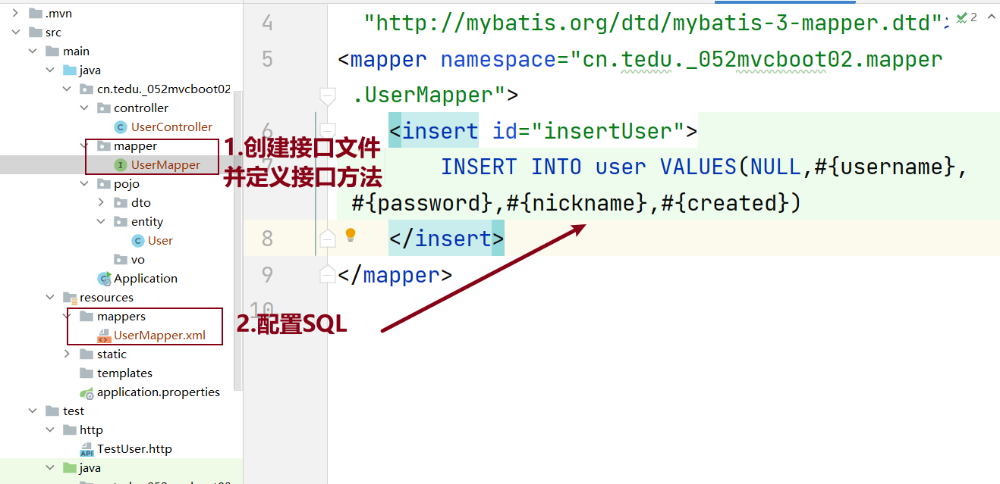

#### 5.4.3 编写测试方法测试接口

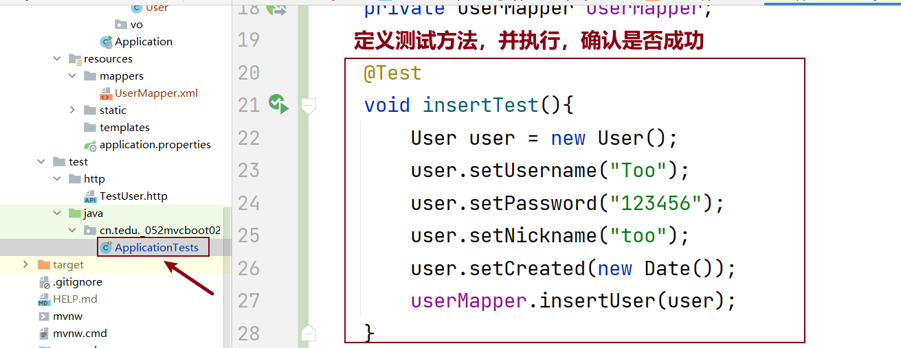

### 5.5 整合Cotroller和MyBatis，最终`.http`测试

##### 5.5.1 完成Controller代码

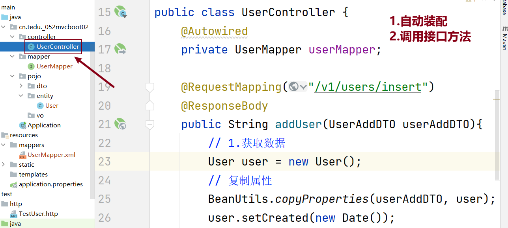

##### 5.5.2 重启工程，进行 `.http` 文件测试

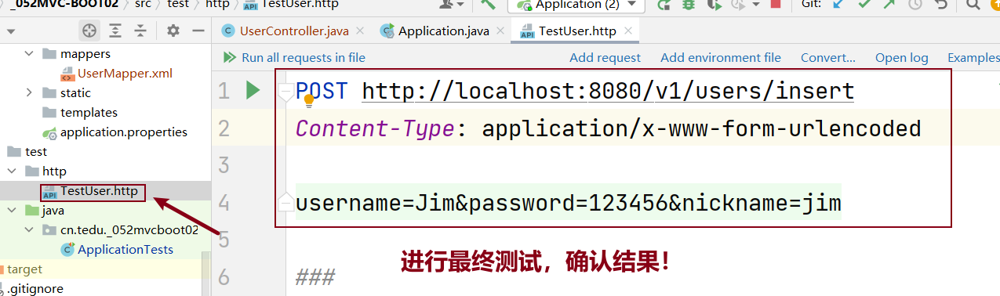


## 6 工程优化

* `@RestController` ：控制器类上，无需再添加 `@ResponseBody` 注解

* `@RequestMapping` ：控制器类上，写多个地址相同的部分

* `@Configuration` ：加载为配置类

* `@MapperScan("")` ：MyBatis自动扫描，所有mapper包下的映射接口无需再加 `@Mapper` 注解

  注意：设置完成后，自动装配时IDEA会误报错，添加 `required=false` 参数

  ```java
  @Autowired(required=false)
  private UserMapper userMapper;
  ```

* `@GetMapping("xxx")` ：只接收处理GET请求，其他方式的请求 <font color=red>**405状态码**</font>

* `@PostMapping("xxx")` ：只接收处理POST请求，其他方式的请求 <font color=red>**405状态码**</font>


