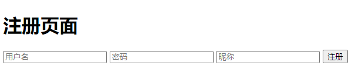
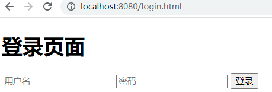
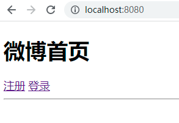
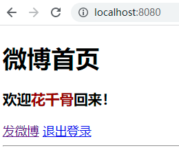
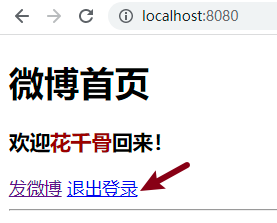
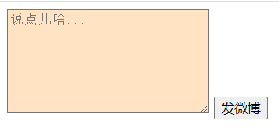
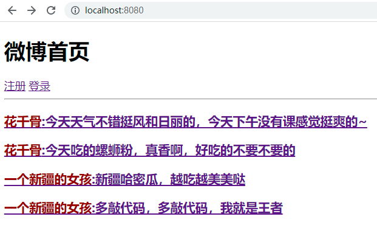
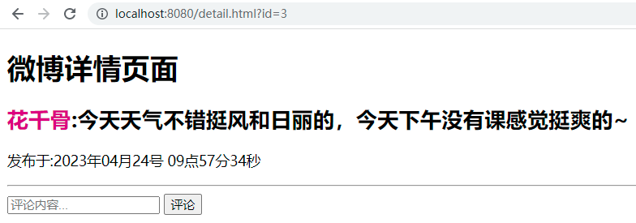
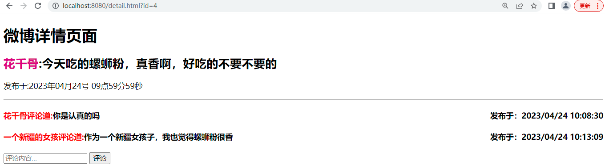

[TOC]

# 微博项目

## 项目概述

该项目是一款社交媒体应用，用户可以在平台上发表短文信息，分享自己的想法、心情和生活。微博的用户群体广泛，包括个人、娱乐明星、公司、政府官方等。

## 项目功能

1. 用户管理

   用户可以注册微博账号，登录登出微博网站。

2. 发布微博

   用户可以在平台上发布文本形式的微博。

3. 查看微博

   用户可以查看所有的微博。

4. 评论功能

   用户可以对所有微博进行评论，并且查看某条微博的所有评论。

## 数据库设计

* 本项目共计3张表
  * 用户表：存储用户信息；
  * 微博表：存储发布的微博信息；
  * 评论表：存储每条微博的评论。
* 表关系
  * 用户表和微博表：一对多，一个用户可以发布多条微博，一条微博只能归属于一个用户；
  * 用户表和评论表：一对多，一个用户可以发布多条评论，一条评论只能归属于一个用户；
  * 微博表和评论表：一对多，一条微博下可以有多条评论，一条评论只能归于与一条微博。
* 表字段设计
  * 用户表user
    * 用户编号：id
    * 用户名：username
    * 密码：password
    * 昵称：nickname
    * 注册时间：created
  * 微博表weibo
    * 微博编号：id
    * 微博内容：content
    * 发布时间：created
    * 用户编号：user_id
  * 评论表comment
    * 评论编号：id
    * 评论内容：content
    * 评论时间：created
    * 用户编号：user_id
    * 微博编号：weibo_id

## 数据初始化

### 1.建库建表及插入数据

* 库名：blog

* SQL语句

  ```mysql
  DROP DATABASE IF EXISTS blog;
  CREATE DATABASE IF NOT EXISTS blog DEFAULT CHARSET=UTF8;
  USE blog;
  CREATE TABLE IF NOT EXISTS user(
      id INT PRIMARY KEY AUTO_INCREMENT,
      username VARCHAR(50),
      password VARCHAR(50),
      nickname VARCHAR(50),
      created TIMESTAMP
  )CHARSET=UTF8;
  
  CREATE TABLE IF NOT EXISTS weibo(
      id INT PRIMARY KEY AUTO_INCREMENT,
  	content VARCHAR(255),
      created TIMESTAMP,
      user_id INT
  )CHARSET=UTF8;
  
  CREATE TABLE IF NOT EXISTS comment(
  	id INT PRIMARY KEY AUTO_INCREMENT,
      content VARCHAR(255),
      created TIMESTAMP,
      user_id INT,
      weibo_id INT
  )CHARSET=UTF8;
  
  USE blog;
  DELETE FROM user;
  DELETE FROM weibo;
  DELETE FROM comment;
  INSERT INTO user VALUES (100, 'Lucy', '123456', 'lucy', '1987-10-16 00:00:00');
  INSERT INTO user VALUES (101, 'Tom', '123456', 'tom', '1987-10-16 00:00:00');
  INSERT INTO user VALUES (102, 'Jim', '123456', 'jim', '1987-10-16 00:00:00');
  
  INSERT INTO weibo VALUES (200, 'lucy的第1条微博', '2000-01-01 00:00:00', 100);
  INSERT INTO weibo VALUES (201, 'lucy的第2条微博', '2000-01-01 00:00:00', 100);
  INSERT INTO weibo VALUES (202, 'tom的第1条微博', '2000-01-01 00:00:00', 101);
  INSERT INTO weibo VALUES (203, 'tom的第2条微博', '2000-01-01 00:00:00', 101);
  INSERT INTO weibo VALUES (204, 'tom的第3条微博', '2000-01-01 00:00:00', 101);
  
  INSERT INTO comment VALUES (300, 'lucy对第1条微博的评论', '2008-01-01 00:00:00', 100, 200);
  INSERT INTO comment VALUES (301, 'tom对第1条微博的评论', '2008-01-01 00:00:00', 101, 200);
  INSERT INTO comment VALUES (302, 'lucy对第2条微博的评论', '2008-01-01 00:00:00', 100, 201);
  INSERT INTO comment VALUES (303, 'tom对第2条微博的评论', '2008-01-01 00:00:00', 101, 201);
  INSERT INTO comment VALUES (304, 'jim对第2条微博的评论', '2008-01-01 00:00:00', 102, 201);
  
  ```

### 2 项目准备

* 创建工程 **_053MVC-WEIBO**

  勾选3个依赖；

  SpringBoot版本选择 2.7.12；

* application.properties中配置数据库连接信息及xml文件映射路径

  ```properties
  spring.datasource.url=jdbc:mysql://localhost:3306/blog?serverTimezone=Asia/Shanghai&characterEncoding=utf8
  spring.datasource.username=root
  spring.datasource.password=root
  # 设置MyBatis框架的映射（Mapper）配置文件的位置
  mybatis.mapper-locations=classpath:mappers/*.xml
  ```

* 启动工程


# 01.用户模块

## 注册功能



**接口地址**:`/v1/users/reg`

**请求方式**:`POST`

**请求数据类型**:`application/json`

**响应数据类型**:`int`


**请求示例**:


```javascript
{
  "nickname": "liying",
  "password": "123456",
  "username": "zhaoliying"
}
```

**请求参数 UserRegDTO**:


| 参数名称             | 参数说明   | 请求类型 | 是否必须 | 数据类型   |
| -------------------- | ---------- | -------- | -------- | ---------- |
| userRegDTO           | userRegDTO | body     | true     | UserRegDTO |
| &emsp;&emsp;nickname | 昵称       |          | true     | string     |
| &emsp;&emsp;password | 密码       |          | true     | string     |
| &emsp;&emsp;username | 用户名     |          | true     | string     |

**响应参数**:


整型 int

**响应示例**:

| 参数名称 | 参数说明     | 类型 |
| -------- | ------------ | ---- |
| 1        | 注册成功     | int  |
| 2        | 用户名被占用 | int  |


## 登录功能



**接口地址**:`/v1/users/login`

**请求方式**: `POST`

**请求数据类型**:`application/json`

**响应数据类型**:`int`


**请求示例 UserLoginDTO**:


```javascript
{
  "password": "123456",
  "username": "zhaoliying"
}
```

**请求参数**:


| 参数名称             | 参数说明     | 请求类型 | 是否必须 | 数据类型     |
| -------------------- | ------------ | -------- | -------- | ------------ |
| userLoginDTO         | userLoginDTO | body     | true     | UserLoginDTO |
| &emsp;&emsp;password | 密码         |          | true     | string       |
| &emsp;&emsp;username | 用户名       |          | true     | string       |

**响应参数**:


整型 int


**响应示例**:

| 参数名称 | 参数说明   | 类型 |
| -------- | ---------- | ---- |
| 1        | 登录成功   | int  |
| 2        | 密码错误   | int  |
| 3        | 用户名错误 | int  |


## 获取当前用户

### 1）说明

进入首页时，会自动向后端发请求，获取当前用户的登录状态，分为以下两种情况：

如果未登录，则显示注册登录页面；

如果是登录状态，则显示欢迎xxx回来，并显示退出登录按钮。

* 未登录显示首页面

  

* 登录显示首页面

  


### 2）接口文档

**接口地址**:`/v1/users/currentUser`

**请求方式**:`GET`

**请求数据类型**:`application/x-www-form-urlencoded`

**响应数据类型**:`userVO`


**请求参数**:


暂无

**响应参数**:

**UserVO 不为null，则说明处于登录状态**

**UserVO 为null，则说明处于未登录状态**


| 参数名称 | 参数说明 | 类型 |
| -------- | -------- | ----- |
|id|用户id|integer(int32)|
|nickname|用户昵称|string|
|password|用户密码|string|

**响应示例 UserVO**:

null

或

```javascript
{
	"id": 0,
	"nickname": "",
	"password": ""
}
```


## 登出功能




**接口地址**:`/v1/users/logout`

**请求方式**:`GET`


**请求数据类型**:`application/x-www-form-urlencoded`

**响应数据类型**:`见响应参数`


**请求参数**:


暂无

**响应参数**:


暂无


# 02.微博模块

## 发布微博功能




**接口地址**:`/v1/weibo/insert`

**请求方式**:`POST`

**请求数据类型**:`application/json`

**响应数据类型**:`int`


**请求示例 WeiboDTO**:


```javascript
{
  "content": "微博内容"
}
```


**请求参数**:


| 参数名称            | 参数说明 | 请求类型 | 是否必须 | 数据类型 |
| ------------------- | -------- | -------- | -------- | -------- |
| weiboDTO            | weiboDTO | body     | true     | WeiboDTO |
| &emsp;&emsp;content | 微博内容 |          | true     | string   |


**响应参数**:


整型 int

**响应示例**:

| 参数名称 | 参数说明         | 类型 |
| -------- | ---------------- | ---- |
| 1        | 发布成功         | int  |
| 2        | 未登录，发布失败 | int  |


## 首页微博列表功能




**接口地址**:`/v1/weibo/selectIndex`

**请求方式**:`GET`

**请求数据类型**:`application/x-www-form-urlencoded`

**响应数据类型**:`见响应参数`


**请求参数**:


暂无

**响应参数 List<WeiboIndexVO>**:


| 参数名称 | 参数说明 | 类型           |
| -------- | -------- | -------------- |
| content  | 微博内容 | string         |
| wid      | 微博id   | integer(int32) |
| nickname | 用户昵称 | string         |

**响应示例** List<WeiboIndexVO>:

```javascript
[
	{
		"content": "",
		"wid": 0,
		"nickname": ""
	}
]
```


## 微博详情功能




**接口地址**:`/v1/weibo/selectById`

**请求方式**:`GET`

**请求数据类型**:`application/x-www-form-urlencoded`

**响应数据类型**:`见响应参数`


**请求参数**:


| 参数名称 | 参数说明 | 请求类型    | 是否必须 | 数据类型 |
| -------- | -------- | ----- | -------- | -------- |
|id|微博id|query|true|integer(int32)|

**响应参数 WeiboDetailVO**:


| 参数名称 | 参数说明 | 类型 |
| -------- | -------- | ----- |
|content|微博内容|string|
|created|微博发布时间|string(date-time)|
|id|微博id|integer(int32)|
|nickname|用户昵称|string|

**响应示例 WeiboDetailVO**:

```javascript
{
	"content": "",
	"created": "",
	"id": 0,
	"nickname": ""
}
```


# 03.评论模块

## 发布评论功能


**接口地址**:`/v1/comment/insert`

**请求方式**:`POST`

**请求数据类型**:`application/json`

**响应数据类型**:`int`


**请求示例**:


```javascript
{
  "content": "果然高手都在评论区",
  "weiboId": 1
}
```

**请求参数 CommentDTO**:


| 参数名称 | 参数说明 | 请求类型    | 是否必须 | 数据类型 |
| -------- | -------- | ----- | -------- | -------- |
|commentDTO|commentDTO|body|true|CommentDTO|
|&emsp;&emsp;content|评论内容||true|string|
|&emsp;&emsp;weiboId|微博id||true|integer(int32)|


**响应参数**:


整型 int


**响应示例**:

| 参数名称 | 参数说明         | 类型 |
| -------- | ---------------- | ---- |
| 1        | 评论成功         | int  |
| 2        | 未登录，评论失败 | int  |


## 获取评论功能




**接口地址**:`/v1/comment/selectByWeiboId`

**请求方式**:`GET`

**请求数据类型**:`application/x-www-form-urlencoded`

**响应数据类型**:`见响应参数`


**请求参数**:


| 参数名称 | 参数说明 | 请求类型    | 是否必须 | 数据类型 |
| -------- | -------- | ----- | -------- | -------- |
|id|id|query|false|integer(int32)|

**响应参数 List<CommentVO>**:


| 参数名称 | 参数说明 | 类型 |
| -------- | -------- | ----- |
|content|评论内容|string|
|created|评论发布时间|string(date-time)|
|id|评论id|integer(int32)|
|nickname|用户昵称|string|

**响应示例 List<CommentVO>**:

```javascript
[
	{
		"content": "",
		"created": "",
		"id": 0,
		"nickname": ""
	}
]
```
