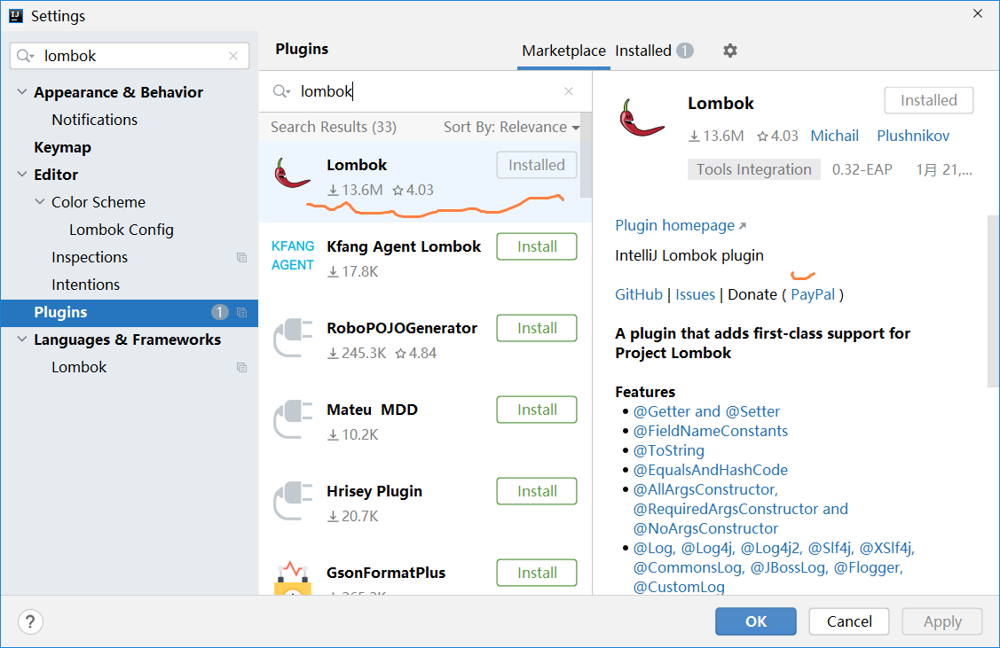

[toc]


## 整合Lombok基础组件

### 1 Lombok简介

Lombok 是一个 Java 库，可以通过在代码中添加注解来消除模板代码，以简化 Java 代码的编写过程；

Lombok 支持自动生成 getter、setter、toString等方法，减少了重复性的开发工作。


### 2 安装和配置 Lombok

- pom.xml中引入 Lombok 的依赖并刷新Maven

  ```xml
  <!--引入Lombok依赖-->
  <dependency>
      <groupId>org.projectlombok</groupId>
      <artifactId>lombok</artifactId>
  </dependency>
  ```

- 在Idea中确认是否安装Lombok 插件

  * 引入 Lombok 的依赖是让编译器能够找到 Lombok 提供的注解并对其进行处理，但是这不足以让 IDE 可以正常地识别和支持 Lombok 的注解。       

  * 为了在 IDE 中正常地使用 Lombok，需要安装 IDE 插件来支持 Lombok 的注解。插件会将 Lombok 的注解转换为相应的代码，以便能够在 IDE 中正确地显示代码提示等功能。      

  * 所以，为了使 Lombok 的注解在 IDE 中正常运行，需要同时引入 Lombok 的依赖并安装对应的 IDE 插件。
  
  
  
  <font color=red>**如果没有安装请安装此插件**</font>
  
  1. 打开 IntelliJ IDEA，点击 File -> Settings -> Plugins。
  
  2. 在搜索框中输入 lombok，并点击搜索按钮。
  
  3. 选择 Lombok 插件，点击 Install 按钮进行安装。
  
     
  
  4. 安装完成后，弹出提示框，一般会提示重启 IntelliJ IDEA 以激活 Lombok 插件。点击 Restart IntelliJ IDEA 按钮进行重启。
  
  5. 重启后，即可使用 Lombok 注解。


### 3 Lombok常用注解

Lombok 提供了许多注解，每个注解用来生成特定的代码块。下面是一些常用的注解：

#### 3.1 `@Getter` 和 `@Setter`

用来生成 getter 和 setter 方法。

```java
@Getter
@Setter
public class Student {
    private String name;
    private int age;
}
```

这将自动生成 `getName()`, `setName()`, `getAge()`, `setAge()` 方法。

#### 3.2 `@ToString`

用来生成 toString 方法。

```java
@ToString
public class Student {
    private String name;
    private int age;
}
```

这将自动生成 `toString()` 方法。

#### 3.3 `@AllArgsConstructor` 和 `@NoArgsConstructor`

用来生成带参数的和无参的构造函数。

```java
@AllArgsConstructor
@NoArgsConstructor
public class Student {
    private String name;
    private int age;
}
```

这将自动生成一个有参构造函数和一个无参构造函数。

#### 3.4 `@Data`

是一个组合的注解，它等价于同时使用了 `@Getter`、`@Setter`、`@NoArgsConstructor`、`@AllArgsConstructor` 和 `@ToString` 注解。

```java
@Data
public class Student {
    private String name;
    private int age;
}
```

这将自动生成 `getName()`, `setName()`, `getAge()`, `setAge()`，有参构造函数、无参构造函数，以及 `toString()` 方法。


### 4 @Slf4j 日志注解

`@Slf4j` 是 lombok 中的注解；

此注解描述类时会在类中创建一个日志对象，基于日志对象可以输出一些日志。

#### 4.1 使用方法

在需要使用日志的类上加上 `@Slf4j` 注解即可。

* `log.debug("日志信息")`
* `log.info("日志信息")`

示例：

```java
@Slf4j
public class MyClass{
    public void myMethod(){
        log.info("myMethod方法被执行");
    }
}
```

在上述代码中， `@Slf4j` 注解被加在了 `MyClass` 类上。这样就可以在 `MyClass` 中直接使用 `log` 对象输出日志了。

#### 4.2 日志级别

<font color=red>**日志级别：TRACE<DEBUG<INFO<WARN<ERROR**</font>

* TRACE

  用于输出程序运行过程中的细节信息，通常用于调试。

  此级别的日志信息最详细，虽然对于大多数问题的解决都很有帮助，但是产生大量信息会对性能会造成一定影响。

* DEBUG

  用于输出程序中详细的运行信息，通常用于调试或诊断问题。

  相对于 TRACE 级别，DEBUG 级别不太详细，但是在调试或诊断问题时也有用，不过这种级别的日志信息也可能会产生较多，对性能也会有一定影响。

* INFO（**默认的级别**）

  用于记录程序运行的基本信息，例如，程序启动、配置信息等。

  通常在正式运行时才会输出此级别的日志信息。此级别的日志信息比较基础，能够充分说明程序运行的核心情况。

* WARN

  用于输出警告信息，例如，接口调用失败、处理异常情况等。

  此级别的日志信息一般不会影响程序的正常运行，但需要注意，并及时处理。这种日志信息属于一种中等级别，需要引起注意，但不是必须的。

* ERROR

  ERROR 级别的日志用于记录程序中的错误信息，此级别的日志信息表示出现严重错误，需要及时处理，以避免程序无法正常运行。


注意：在 `@Slf4j` 注解中，日志级别的选择应根据具体情况而定，要保证日志输出足够详细，但又不能浪费过多的系统资源。

#### 4.3 设置日志级别

`@Slf4j` 注解默认的日志级别为 INFO，即只会输出 INFO级别 以及 比INFO日志级别更高级别的日志信息，如需配置则需要在配置文件 `application.properties` 配置文件中进行配置

```properties
# 设置日志级别为WARN
logging.level.root=WARN

# 将cn.tedu包及其包中的所有类的日志级别设置为DEBUG级别
logging.level.cn.tedu=DEBUG
```

#### 4.4 `@Slf4j` 注解优点

使用 `@Slf4j` 注解相比 `System.out.println("xxx")` 的好处

* 更加高效

  使用 `@Slf4j` 注解输出日志，可以避免产生大量的无用日志信息，减少对内存和磁盘等资源的消耗。

  而使用 `System.out.println()` 会产生大量冗余的输出信息，不仅对调试造成困扰，而且会对应用程序的性能产生影响。

* 日志级别更加明确

  使用 `@Slf4j` 注解，可以根据需要输出不同级别的日志，例如，警告、错误等。通过灵活控制日志输出的级别，可以及时发现并解决问题。

  而使用 `System.out.println()` 输出的日志级别是不可控的，并且无法选择性地过滤日志。


### 5 微博项目优化

* `@Data` 注解优化微博项目

  在微博项目的所有pojo类中添加 `@data` 注解，将原来的 `setter() getter() toString()` 方法都去掉；

  重启工程后测试项目功能是否能够成功执行。

* `@Slf4j` 注解优化微博项目

  在微博项目中将打印调试的代码，使用 `@Slf4j` 注解完成调试，在配置文件 `application.properties` 中设置日志级别。


