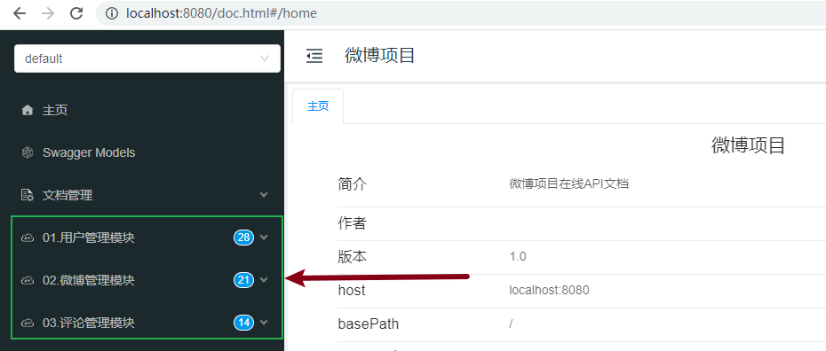
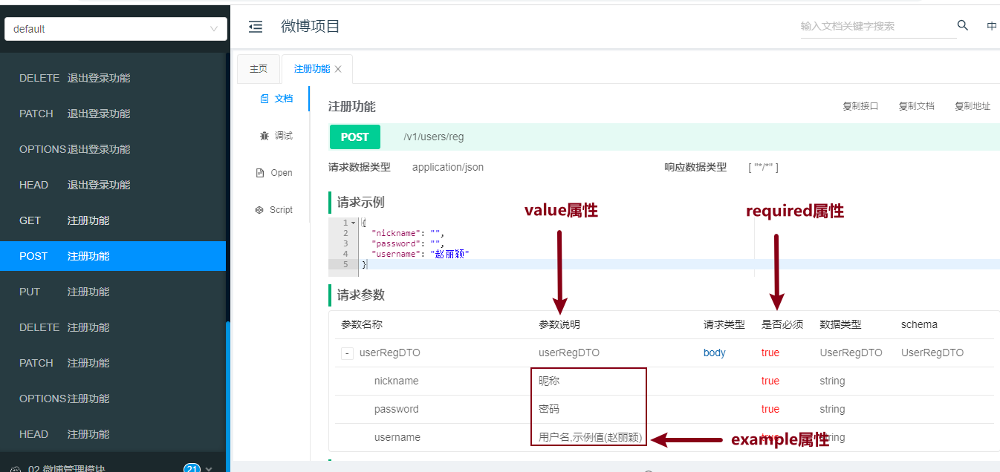
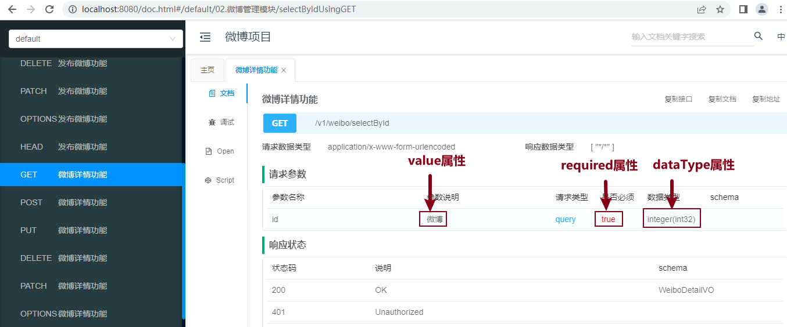
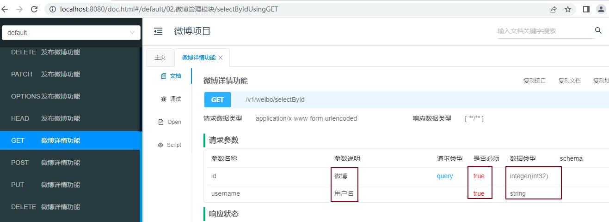
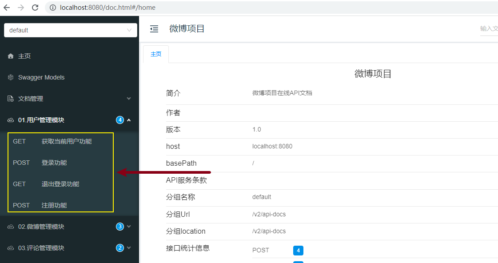
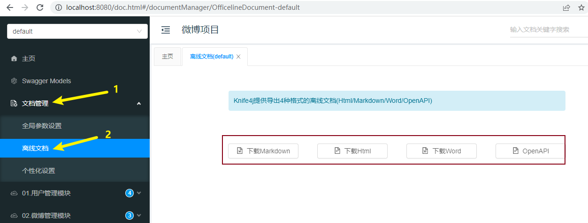

[toc]

# Knife4j

Knife4j是基于SpringBoot构建的一个文档生成工具，它可以让开发者为我们的应用生成API文档；

目的是可以更加方便的基于API文档进行测试。

生成的文档还可以导出，然后给到前端开发团队，前端开发团队可以基于API接口写具体的调用。

## 1 Knife4j的优点

- Knife4j 功能强大，易于操作。
- Knife4j 的UI界面非常美观，使用流畅。
- Knife4j 可以高度定制化，让其符合你的项目需求。

## 2 Knife4j快速上手

### 2.1 pom.xml添加依赖

在你的SpringBoot项目的pom.xml文件中，添加如下依赖：

```xml
<!--添加Knife4j依赖-->
<dependency>
    <groupId>com.github.xiaoymin</groupId>
    <artifactId>knife4j-openapi2-spring-boot-starter</artifactId>
    <version>4.1.0</version>
</dependency>
```

### 2.2 配置Swagger的相关信息

<font color=red>**工程目录下创建config.Knife4jConfig**</font>

```java
package cn.tedu._053mvcweibo.config;

import org.springframework.context.annotation.Bean;
import org.springframework.context.annotation.Configuration;
import springfox.documentation.builders.ApiInfoBuilder;
import springfox.documentation.builders.PathSelectors;
import springfox.documentation.builders.RequestHandlerSelectors;
import springfox.documentation.service.ApiInfo;
import springfox.documentation.spi.DocumentationType;
import springfox.documentation.spring.web.plugins.Docket;
import springfox.documentation.swagger2.annotations.EnableSwagger2WebMvc;

@Configuration
@EnableSwagger2WebMvc
public class Knife4jConfig {
    //配置Swagger2的Docket的Bean实例
    @Bean
    public Docket createRestApi() {
        return new Docket(DocumentationType.SWAGGER_2)
                // apiInfo()：配置 API 的一些基本信息，比如：文档标题title，文档描述description，文档版本号version
                .apiInfo(apiInfo())
                // select()：生成 API 文档的选择器，用于指定要生成哪些 API 文档
                .select()
                // apis()：指定要生成哪个包下的 API 文档
                .apis(RequestHandlerSelectors.basePackage("cn.tedu._053mvcweibo.controller"))
                // paths()：指定要生成哪个 URL 匹配模式下的 API 文档。这里使用 PathSelectors.any()，表示生成所有的 API 文档。
                .paths(PathSelectors.any())
                .build();
    }

    //文档信息配置
    private ApiInfo apiInfo() {
        return new ApiInfoBuilder()
                // 文档标题
                .title("微博项目")
                // 文档描述信息
                .description("微博项目在线API文档")
                // 文档版本号
                .version("1.0")
                .build();
    }
}
```

### 2.3 查看生成的接口文档

在 SpringBoot 项目启动后，访问 `http://localhost:8080/doc.html` 地址即可查看生成的Knife4j接口文档。


## 3 常用注解应用分析

- **@Api注解**

  添加在控制器类上的注解；

  通过此注解的tags属性可以修改原本显示控制器类名称的位置的文本；

  通常建议在配置的tags属性值上添加序号，例如：“01. 用户模块”、“02. 微博模块”，则框架会根据值进行排序。

  * 参数说明
    * tags：配置模块名称

  * 代码示例

    ```java
    // 1. UserController
    @Api(tags = "01.用户管理模块")
    public class UserController {...}
    
    // 2. WeiboController
    @Api(tags = "02.微博管理模块")
    public class WeiboController {...}
    
    // 3. CommentController
    @Api(tags = "03.评论管理模块")
    public class CommentController {...}
    ```

  * 文档效果（**重启工程并刷新页面：http://localhost:8080/doc.html#/home**）

    

  

- **@ApiOperation注解**

  添加在控制器类中处理请求的方法上的注解；

  用于配置此方法处理的请求在API文档中显示的文本。

  * 参数说明
    * value：配置业务名称

  * 代码示例

    **此处以注册功能为例，其他所有方法请添加说明**

    ```java
    /**注册功能*/
    @PostMapping("reg")
    @ApiOperation(value = "注册功能")
    public int reg(@RequestBody UserRegDTO userRegDTO){...}
    ```

  * 文档效果（**重启工程并刷新页面：http://localhost:8080/doc.html#/home**）

    

- **@ApiModelProperty注解**

  是添加在POJO类的属性上的注解；

  用于对请求参数或响应结果中的某个属性进行说明；

  主要通过其value属性配置描述文本，并可通过example属性配置示例值。

  * 参数说明

    * value属性：配置参数名称
    * required属性：配置是否必须提交此请求参数
    * example属性：配置示例值

    <font color=red>注意：如果配置了 required=true,只是一种显示效果，Knife4j框架并不具备检查功能</font>

  * 代码示例

    **以注册功能UserRegDTO为例**

    ```java
    @Data
    public class UserRegDTO {
        @ApiModelProperty(value = "用户名", required = true, example = "赵丽颖")
        private String username;
        @ApiModelProperty(value = "密码", required = true)
        private String password;
        @ApiModelProperty(value = "昵称", required = true)
        private String nickname;
    }
    ```

  * 文档效果（**重启工程并刷新页面：http://localhost:8080/doc.html#/home**）

    

- **@ApiImplicitParam注解**

  添加在控制器类中处理请求的方法上的注解；

  主要用于配置非封装的参数

  * 参数说明

    * name：指定参数名称（**参数变量名**）
    * value：配置参数名称
    * dataType：配置数据类型
    * required：配置是否必须提交此请求参数
    * example：配置参数的示例值

    <font color=red>注意：一旦使用此注解，各个参数的数据类型默认都会显示String，可以通过dataType指定数据类型</font>

  * 代码示例

    **此处以微博详情功能为例**

    ```java
    @ApiImplicitParam(name = "id", value = "微博", required=true, dataType = "int")
    public WeiboDetailVO selectById(int id){...}
    ```

  * 文档效果（**重启工程并刷新页面：http://localhost:8080/doc.html#/home**）

    

- **@ApiImplicitParams注解**

  添加在控制器类中处理请求的方法上的注解；

  当方法有多个非封装的参数时，在方法上添加此注解，并在注解内部通过@ApiImplicitParam数组配置多个参数。

  * 代码示例

    **此处以微博详情功能为例**
  
    ```java
    /**微博详情页功能*/
    @GetMapping("selectById")
    @ApiOperation(value = "微博详情功能")
    @ApiImplicitParams(value = {
        @ApiImplicitParam(name = "id", value = "微博", required=true, dataType = "int"),
        @ApiImplicitParam(name = "username", value = "用户名", required=true)
    })
    // 额外增加username参数，仅仅用于测试
    public WeiboDetailVO selectById(int id, String username){
        return weiboMapper.selectById(id);
    }
    ```

  * 文档效果（**重启工程并刷新页面：http://localhost:8080/doc.html#/home**）
  
    

* **@ApiIgnore注解**

  添加在处理请求的方法的参数上；

  用于表示API文档框架应该忽略此参数。

  **以发布微博功能的HttpSession参数为例**

  * 代码示例
  
    ```java
    // 参数中添加@ApiIgnore注解
    public int insert(@RequestBody WeiboDTO weiboDTO, @ApiIgnore HttpSession session){...}
    ```

  * 文档效果（**重启工程并刷新页面：http://localhost:8080/doc.html#/home**）
  
    

## 4 限制请求方式

API文档中默认每个功能会展示7种请求方式，遵循RESTful规则将 `@RequestMapping` 注解修改为对应请求方法的注解，比如：`@GetMapping  @PostMapping  @PutMapping  @DeleteMapping` 注解，重启工程后刷新测试。



## 5 导出离线API文档

1. 文档管理 - 离线文档 中存在多种格式的导出格式

   

2. 选择合适的文档格式，导出即可到本地磁盘


