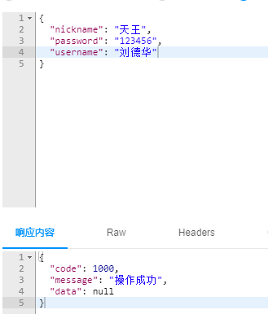

[toc]

# 统一响应结果的处理

## 1 为什么需要统一响应结果处理

在实际开发中，我们往往需要在多个控制器方法中返回相同的响应结构；

例如，统一返回接口调用成功的状态码、提示信息、以及请求结果数据。但是，如果对于每个接口都单独进行处理的话，不仅逻辑复杂，而且容易出现疏漏，进而增加前端调用的难度。

所以为了更好定义服务端返回值的格式，统一客户端对服务端响应结果的处理，我们需要将服务端返回到客户端的数据再次进行封装。

* 响应状态码 `code`
* 提示信息 `msg`
* 响应数据 `data`

## 2 统一状态码设计

当项目中的状态码越来越多时，对状态码的定义如果没有统一规划，后续对状态的理解就会相当的困难，而且容易导致操作上的失败。

**状态码设计**

| 自定义状态码 |     含义     |
| :----------: | :----------: |
|     1000     |    未登录    |
|     1001     |   登录成功   |
|     1002     |   密码错误   |
|     1003     |  用户名错误  |
|     1004     | 用户名已存在 |
|     2001     |   操作成功   |
|     2002     |   操作失败   |


## 3 统一响应结果处理的代码实现

### 3.1 `JsonResult`类的创建

首先，在工程目录中创建一个新的类`common.response.JsonResult`；该类作为统一的响应结果类；

其包含了响应结果的状态码（code）、提示信息（msg）和请求结果数据（data）三个属性：

```java
@Getter
@Setter
@NoArgsConstructor
@AllArgsConstructor
public class JsonResult {
    /**响应状态码*/
    private Integer code;
    /**服务端要返回给客户端的消息*/
    private String msg;
    /**服务端要返回给客户端的具体数据(业务数据)*/
    private Object data;

    public JsonResult(Integer code, String msg, Object data) {
        this.code = code;
        this.msg = msg;
        this.data = data;
    }
    
    public JsonResult(Integer code, String msg){
        this.code = code;
        this.msg = msg;
    }
}
```

### 3.2 `controller`代码重构

以 `UserController` 中的 **注册功能** 为例

对 `Controller`中的代码进行重构，将结果封装成 `JsonResult` 类型的结果，并返回给客户端

```java
@ApiOperation(value = "注册功能")
@PostMapping("reg")
public JsonResult reg(@RequestBody UserRegDTO userRegDTO){
    /**
     * 1.确认用户名是否被占用
     * 2.注册用户
    */
    log.debug("userRegDTO = " + userRegDTO);
    UserVO userVO = userMapper.selectByUsername(userRegDTO.getUsername());
    if (userVO != null){
        return new JsonResult(1004, "用户名被占用"); // 用户名被占用
    }

    User user = new User();
    BeanUtils.copyProperties(userRegDTO, user);
    user.setCreated(new Date());
    userMapper.insert(user);
    return new JsonResult(1001, "操作成功"); // 注册成功
}
```

### 3.3 使用 `Knife4j` 进行测试

重启工程后，使用 `Knife4j` 进行测试




# 自定义枚举状态码(StatusCode)

## 1 简介

在Spring MVC中，一般通过HTTP响应状态码来表示请求是否成功。但是HTTP状态码的语义有时候比较笼统，不能够很好地表达业务逻辑。

为了解决这一问题，我们可以定义自己的状态码，将它们作为HTTP响应状态码的补充，以更加精准地表示请求的处理结果。

通常我们使用枚举类来定义自定义状态码，并且将它们应用到Spring MVC的实践中。


## 2 自定义枚举状态码

工程目录下创建 `common.response.StatusCode` 来自定义枚举状态码

```java
@Getter
@AllArgsConstructor
@NoArgsConstructor
public enum StatusCode {
    NOT_LOGIN(1000,"未登录"), //所有实例必须是在最上面的
    LOGIN_SUCCESS(1001,"登录成功"),
    PASSWORD_ERROR(1002,"密码错误"),
    USERNAME_ERROR(1003,"用户名错误"),
    USERNAME_ALREADY_EXISTS(1004,"用户名已存在"),
    OPERATION_SUCCESS(2001,"操作成功"),
    OPERATION_FAILED(2002,"操作失败");

    /**表示状态码*/
    private int code;
    /**状态码信息*/
    private String msg;
}
```


## 3 使用自定义枚举状态码

### 3.1 `JsonResult` 构造方法

```java
public JsonResult(StatusCode statusCode){
    this.code = statusCode.getCode();
    this.msg = statusCode.getmsg();
}

public JsonResult(StatusCode statusCode, Object data){
    this.code = statusCode.getCode();
    this.msg = statusCode.getmsg();
    this.data = data;
}

```


### 3.2 `controller` 代码重构

**注册功能**

```java
//用户名被占用
return new JsonResult(StatusCode.USERNAME_ALREADY_EXISTS);

//注册成功
return new JsonResult(StatusCode.OPERATION_SUCCESS);
```


### 3.3 使用 `Knife4j` 进行测试


## 4 扩展练习

微博项目优化

将微博项目中 用户模块、微博模块 和 评论模块 中所有的功能使用 自定义枚举状态码 和 统一响应结果处理 实现优化。


