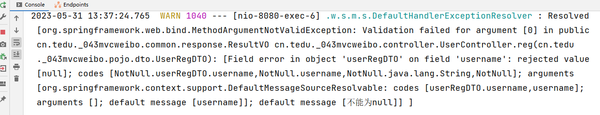
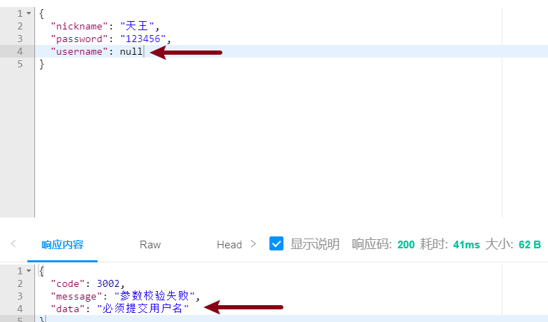

[toc]

# Spring Validation

## 1 关于Spring Validation

在实际项目我们需要对客户端传递到服务端的参数进行校验，用于判定请求参数的合法性，假如请求参数不合法则不可以再去执行后续的业务了。那如何校验呢？

一种方式是我们在控制层方法中每次都自己进行参数有效值的判断，不合法可以抛出异常，但是工作量和代码复杂度会比较高；

第二种方式就是采用市场上主流的 `Spring Validation` 框架去实现校验，所以 `Spring Validation` 框架的主要作用是  检查参数的基本有效性。

## 2 使用流程

在Spring Boot工程中，使用此框架需要添加依赖，并刷新maven

```xml
<!-- Spring Boot支持Spring Validation的依赖项，用于检查参数的基本有效性 -->
<dependency>
    <groupId>org.springframework.boot</groupId>
    <artifactId>spring-boot-starter-validation</artifactId>
</dependency>
```


## 3 快速入门

1. 在处理请求的方法的参数列表中，在POJO类型的参数上添加`@Validated`注解，表示需要通过Spring Validation框架检查此参数，例如UserController中注册功能：

   ```java
   @ApiOperation(value = "注册功能")
   @PostMapping("reg")
   public JsonResult reg(@RequestBody @Validated UserRegDTO userRegDTO){}
   ```

2. 在此POJO类中的属性上，添加对应的检查注解，以配置检查规则，

   例如，添加`@NotNull`注解，就表示“不允许为`null`”的规则！

   在`UserRegDTO`类

   ```java
   @Data
   public class UserRegDTO {
       @NotNull
       @ApiModelProperty(value = "用户名", required = true, example = "赵丽颖")
       private String username;
       @ApiModelProperty(value = "密码", required = true, example = "123456")
       private String password;
       @ApiModelProperty(value = "昵称", required = true, example = "萤火虫")
       private String nickname;
   }
   ```

3. 重启工程，在Knife4j中测试，当提交请求时，如果没有提交username参数，服务器端将响应`400`错误。

   

   **同时在终端也会出现异常**

   


## 4 运行异常处理

### 4.1 说明

在使用Spring Validation框架执行参数的检查时，如果检查不通过，除了响应`400`错误以外，在控制台还会抛出错误：<font color=red>`MethodArgumentNotValidException` 使用全局异常处理器解决。</font>

```java
[org.springframework.web.bind.MethodArgumentNotValidException: Validation failed for argument [0] in public cn.tedu._043mvcweibo.common.response.JsonResult cn.tedu._043mvcweibo.controller.UserController.reg(cn.tedu._043mvcweibo.pojo.dto.UserRegDTO): [Field error in object 'userRegDTO' on field 'username': rejected value [null]; codes [NotNull.userRegDTO.username,NotNull.username,NotNull.java.lang.String,NotNull]; arguments [org.springframework.context.support.DefaultMessageSourceResolvable: codes [userRegDTO.username,username]; arguments []; default message [username]]; default message [不能为null]] ]
```


### 4.2 处理异常

**使用全局异常处理器来处理 `MethodArgumentNotValidException` 异常**

第1步：全局异常处理器 `GlobalExceptionHandler` 中定义处理异常方法

```java
@ExceptionHandler
public JsonResult handleBindException(MethodArgumentNotValidException ex){
    return new JsonResult(3002, "请求参数错误");
}
```


第2步：重启工程，在Knife4j中测试


### 4.3 明确提示消息

当提交的`username`的值为 null 时，可以发现异常已被处理！

但是，处理结果并不合适，因为，客户端得到此结果后，仍无法明确出现了什么错误！

所有的检查注解都可以配置`message`参数，用于对错误进行描述。


第1步：`@NotNull` 注解中添加 `message` 参数

```java
@NotNull(message = "必须提交用户名")
private String username;
```


第2步：自定义枚举状态码 `StatusCode`

```java
VALIDATE_ERROR(3002, "参数校验失败")
```


第3步：异常方法中获取提示信息 `message`

在处理异常时，需要调用`MethodArgumentNotValidException`对象的`getFieldError().getDefaultMessage()`获取以上配置的描述文本

```java
@ExceptionHandler
public JsonResult handleBindException(MethodArgumentNotValidException ex){
    /*
    	ex.getFieldError().getDefaultMessage():获取 @NotNull(message="xxx") 中message的消息
    */
    String message = ex.getFieldError().getDefaultMessage();
    return new JsonResult(StatusCode.VALIDATE_ERROR, message);
}
```


第3步：重启工程，在Knife4j中测试




## 5 常用注解

### 5.1 `@NotNull`注解

* 作用：用于验证对象是否为 null

* 用法：`@NotNull` 注解用于对象类型上

* 示例

  ```java
  @NotNull(message = "用户名不能为null")
  private String username;
  ```

  

### 5.2 `@NotEmpty` 注解

* 作用：用于验证字符串是否为空，并且会检查是否为 null 值（为null值时报错）

* 用法：用于字符串类型上

* 示例

  ```java
  @NotEmpty(message = "用户名不能为空")
  private String username;
  ```

  

### 5.3 `@NotBlank` 注解

* 作用：不允许为空白，即不允许是“仅由空格、TAB等空白值组成的字符串”，也不允许为空字符串，也不允许为空值null

* 用法：用于字符串类型上

* 示例

  ```java
  @NotBlank(message = "用户名不能为空白串")
  private String username;
  ```


### 5.4 `@Size` 注解

* 作用：可以指定最小值和最大值限制字符串的长度

* 用法：用于字符串类型参数

* 示例

  ```java
  @Size(min = 6, max = 20, message = "用户名长度必须在6到20之间")
  private String username;
  ```


### 5.5 `@Range` 注解

* 作用：用于验证数字类型字段的取值范围，通过配置min和max属性来限制数值类型参数的值区间包括最小值和最大值

* 用法：用于数值类型参数

* 示例

  ```java
  @Range(min = 1, max = 10, message = "年龄必须在1-10岁之间")
  private int age;
  
  @Range(min = 0.1, max = 1.0, message = "成绩必须在0.1到1.0之间")
  private double score;
  ```

  

## 6 非POJO参数校验

在 Spring Validation 中，除了对 POJO（Plain Old Java Object）进行校验的功能外，还支持对非 POJO 进行校验，比如 String、Integer、Double 等类型的参数。

### 6.1 使用流程

* <font color=red>**在当前方法所在的类上添加 `@Validated` 注解**</font>
* 在参数上添加对应的检查注解

### 6.2 使用示例

对于微博详情页的 id 参数进行范围校验，范围只能在1-10之间

第1步：在类 `WeiboController` 中添加 `@Validated` 注解

```java
@Validated
public class WeiboController {}
```


第2步：在控制器方法参数 `id` 上添加对应的检查注解

```java
public JsonResult selectById(@Range(min = 1, max=10, message = "请提交合法的ID值！") int id)
```


第3步：重启工程，在Knife4j或者浏览器中测试


