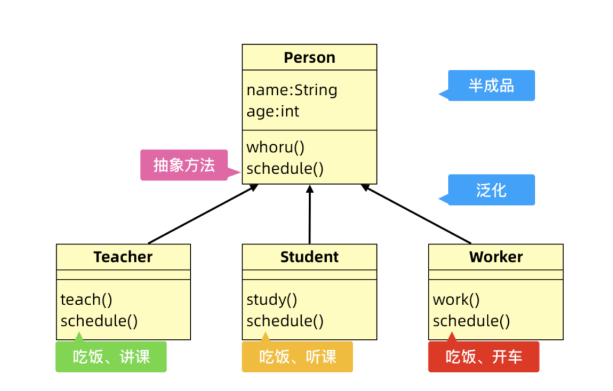
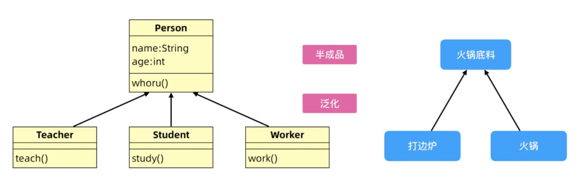

## **1.** 串讲内容

### 1. 抽象方法和抽象類

#### 1.1 抽象方法

- 定義：使用 abstract 關鍵字聲明，不包含方法體的方法稱之為抽象方法
- 原因：在利用泛化設計父類的時候，將全體子類都共有的方法抽取到父類中，但是每個具體的方法實現都不相同，這樣只能在父類中聲明方法的定義，在子類中去實現，因此在父類中的方法就是一個不完整的方法，需要定義為抽象方法。



- 抽取規則：

  ￮ 將每個子類都有，但是每個子類實現都不同的方法泛化為抽象方法

  ￮ 將每個子類都有，並且實現都一樣的方法泛化到父類中

- 語法規則：

  ￮ 使用 abstract 聲明方法，不能有方法體

  ￮ 包含抽象方法的類必須聲明為抽象類，因為包含抽象方法的類一定是不完整的半成品類

  ￮ 子類繼承抽象類時必須重寫（實現）抽象方法，否則出現編譯錯誤

  ​		▪ 可以將抽象方法看做時父類對子類的行為約定，必須被子類重寫實現

- 好處：

  ￮ 使用抽象方法的好處是：可以將抽象方法看作時父類對子類聲明的行為約定，必須由子類遵守實現，由於 Java 編譯器的語法檢查子類是否實現了方法，這樣則可以避免開發者實現的時候意外落下沒有重寫的方法。

#### 1.2 抽象類

- 定義：使用抽象關鍵字 abstract 聲明的類是抽象類，抽象類不能直接實例化創建對象。
- 原因：在面向對象設計的時候，會利用”泛化“將子類的共同屬性和方法抽取出來設計出父類，此時的父類往往是半成品類，只包含部分屬性和方法，甚至屬性值都沒有合理初始化，如果直接創建對象並且使用會造成各種不理想的結果，甚至是異常故障。



- 定義規則：面向對象設計時根據子類泛化得到的半成品父類，應該定義為抽象類，這樣可以限制創建半成品類的對象，減少意外的錯誤發生


- 如何使用：


​		￮ 在類名前面添加 abstract 關鍵字

​		￮ 抽象類可以作為父類被子類繼承，可以定義變量，可以定義抽象方法，也可以定義非抽象方法

​		￮ 抽象類不能直接創建對象，需要被子類繼承

- 抽象類的意義：


​		￮ 封裝子類共有的屬性和行為----以便達到代碼覆用

​		￮ 可以包含抽象方法，為所有子類提供統一的入口（方法名統一），並要求子類必須強制重寫


### **2.** 接口

#### **2.1** 接口的語法

- 接口是一種引用數據類型，可以定義引用類型變量，由 interface 聲明
- 接口中只能定義常量和抽象方法


​		￮ 可以省略常量的修飾詞 public static final

​		￮ 可以省略抽象方法修飾符 public abstract

​		￮ 在 JDK1.8 之後接口中可以定義非抽象的有方法實現的方法，但是需要使用 default 關鍵字聲明

```java
public interface Inter {
	void print();
	default void test(){} //默認方法
	static void print(){} //靜態方法
}
```

- 接口不能實例化創建對象，可以作為父類型被子類實現（繼承）

- 接口用於定義多個類的共同行為和規範，需要被子類實現，通過 implements 關鍵字實現接口

- 一個類可以實現多個接口，用逗號分隔

- 子類實現接口時必須重寫接口中的全部抽象方法


#### **2.2** 抽取規則

在 Java 編程語言中接口是一個抽象類型，這樣就會帶來一個矛盾，抽象類也是抽象的，接口也是抽象的，區別在哪里？

- 統一種類的公共行為和屬性可以抽取到抽象類


​		￮ 如果所有子類的行為都一樣，設計為普通方法

​		￮ 如果所有子類的行為不一樣，設計為抽象方法

- 不同種類的公共行為抽取到接口中


​		￮ 接口是對繼承的單根性的擴展**----**實現多繼承

​		￮ 符合既是也是的原則

- 例如：


​		￮ 鳥 Bird

​			▪ 飛行方法，覓食方法￮ 狗 Dog

​			▪ 爬行方法，覓食方法

​		￮ 老虎 Tiger

​			▪ 跑方法，覓食方法

​		￮ 青蛙 Frog

​			▪ 跳方法，覓食方法

​		￮ 以上子類都有覓食方法，根據 java 繼承的抽取歸納原則，將所有子類所共有的方法抽取到父類，又由於每		   個子類的實現不同，所以將父類中的方法定義為抽象方法

￮ 父類 Animal 類

```java
public abstract class Animal{
		public abstract void food();
}
```

￮ 而飛行這些都是部分子類所具備的行為，所以定義為接口，讓擁有這個能力的子類去實現

```java
interface Swim{
		void swim();
}
interface crawl{
		void crawl();
}
```

#### **2.3** 接口的多繼承

在生活中是存在多繼承現象的：

- 銀幣：即是銀子，也是錢

- 紙幣：即是紙張，也是錢


Java 不支持“類的多繼承”，也就是一個 Java 類不能繼承多個父類，但是 Java 支持一個類繼承一個父類實現多個接口，Java 利用這種方式實現了多繼承：Java 利用接口實現了多繼承一個接口可以同時繼承多個接口，中間用逗號隔開

```java
public interface Inter extends Inter1,Inter2{
		default void test(){} //默認方法
		static void print(){} //靜態方法
}

interface Inter1{}

interface Inter2{}
```

#### **2.4** 接口的多實現

接口不允許實例化對象，接口需要被類實現，一個類可以同時實現多個接口

- 注意：


​		￮ 在一個類既有繼承，又有實現的時候，是先繼承後實現

​		￮ 類和類之間是繼承關系----單繼承

​		￮ 接口和接口之間也是繼承關系----多繼承

​		￮ 類和接口之間是實現關系----多實現

- 例如：


​		￮ 定義動物抽象類，聲明所有動物所具備的行為，例如覓食行為

​		￮ 爬行和遊泳是部分動物所具備的行為，分別定義兩個接口，讓具體此行為的動物來實現

​		￮ 定義子類青蛙類

- Animal 類


```Java
abstract class Animal{
		public abstract void food(); //所有子類共有的
}
```

- 爬行接口 Crawl，遊泳接口 Swim


```java
interface Swim{ //遊泳接口
		void swim();
}
interface crawl{ //爬行接口
		void crawl();
}
```

- 青蛙類 frog,青蛙即是動物又會爬行還會遊泳，所以需要繼承動物類，並實現遊泳接口和爬行接口

```java
class Frog extends Animal implements Swim,crawl{

		@Override
		public void food() {
				System.out.println("青蛙吃蟲子");
		}

		@Override
		public void swim() {
				System.out.println("青蛙會遊泳");
		}

		@Override
		public void crawl() {
				System.out.println("青蛙會爬行");
		}
}
```

- 當既有繼承又有實現的時候，類先繼承一個類，再實現接口


### **3.** 多態

多態：多種表現形態

多態有兩種表現形式：

- 行為（方法）多態：同一個方法，在不同的對象身上有不同的表現

- 對象多態：同一個對象，被造型成不同的形態時，所具備的功能不同


#### **3.1** 向上造型

- 定義


Java 中可以將⼦ 類型對象賦值給⽗類型變量，這種現象成為向上造型。 向上造型的好處是⽗類型變量可以引⽤各種⼦類型的實例，這樣就可以實現多態。

父類引用指向了子類對象

- 優點

父類型變量可以引用各種子類型的實例，這樣就可以實現多態。

*其實不管是行為多態也好，還是對象多態也罷，他們都是在造型，所以多態一定免不了向上造型，如果只有一種形態的話，是沒有多態的。*

- 能造型成的類型：父類+所實現的接口

- 例如：定義一個 Animal 父類，飛行 Flight 接口，以及 Crawl 接口


```java
abstract class Animal{ //父類
		public abstract void eat();
}
interface Crawl{ // 爬行接口
		void crawl();
}
interface Flight{ //飛行接口
		void flight();
}
```

- 定義三個子類，分別繼承父類，實現對應的接口


```java
//小貓類繼承動物類實現爬行接口
class Cat extends Animal implements Crawl{

		@Override
		public void eat() {
				System.out.println("小貓吃貓糧");
		}

		@Override
		public void crawl() {
				System.out.println("小貓爬行");
		}
}

//青蛙類繼承動物類實現爬行接口
class Frog extends Animal implements Crawl{

		@Override
		public void crawl() {
				System.out.println("青蛙會爬");
		}

		@Override
		public void eat() {
				System.out.println("青蛙吃蚊子");
		}
}

//小鳥類繼承動物類實現飛行接口
class Bird extends Animal implements Flight{

		@Override
		public void flight() {
				System.out.println("小鳥會飛");
		}

		@Override
		public void eat() {
				System.out.println("小鳥吃蟲子");
		}
}
```

- 測試


```java
/**
	* 方法多態：
	* 同一個類型，作用於不同對象的時候，調用同一個方法，所具備的實現不同。
	* 通過向上造型實現：所能造型的類型為 父類+所實現的接口
	* 當向上造型的時候，所能點出哪些方法，看聲明的類型中有哪些方法
	*/
Animal animal; //聲明父類類型
animal=new Cat(); //將父類類型造型為小貓對象
animal.eat(); //小貓吃貓糧

animal=new Frog(); //將父類類型造型為青蛙對象
animal.eat(); //青蛙吃蚊子

animal=new Bird(); //將父類類型造型為小鳥對象
animal.eat(); //小鳥吃蟲子

Crawl crawl; //聲明爬行接口
crawl = new Cat();
crawl.crawl(); //小貓爬行
crawl = new Frog();
crawl.crawl(); //青蛙會爬
```

#### **3.2** 向下轉型

- 定義


​		與向上造型相反，將父類型引用的對象賦值給子類型變量

- 使用場景


​		父類型的引用只能調用父類型的方法,如果調用子類型方法不可以,通過向下轉型可以解決這一問題

- 弊端


​		“向下轉型”存在造型異常風險， 因為父類型引用的對象有可能不是具體子類型的對象

- 做向下轉型的時候，引用類型轉換的話可能會有異常，成功的條件只有如下兩種


​		￮ 引用所指向的對象，就是該類型

​		￮ 引用所指向的對象，實現了該接口

- 案例：父類和接口同上


```java
/**
  * 向下轉型：將父類型引用的對象賦值給子類型變量
  * 當向上造型時，能調用哪些方法看的是引用的類型，就無法調用全部的子類方法
  * 可以通過向下轉型來實現
  *
  * 弊端：向下轉型存在風險，所造型的對象並不是同一類型
  */
Cat cat=(Cat) animal;
cat.crawl();
cat.eat();
cat.play();
```

### 4. 內部類

- 成員內部類：應用率低，了解


​		￮ 類中套類，外面的稱為外部類，里面的稱為內部類

​		￮ 內部類通常只服務於外部類，對外不具備可見性

​		￮ 內部類對象通常在外部類中創建

​		￮ 內部類可以直接訪問外部類的成員，在內部類中有個隱式的引用指向創建它的外部類對象

- 隱式的引用：外部類名 *.this*


​		￮ 何時用：若 A 類(Baby)只讓B 類(Mama)用，並且A 類(Baby)還想訪問B 類(Mama)的成員時，可以設計成員						   內部類

- 匿名內部類：應用率高，掌握


​		￮ 何時用：若想創建一個派生類的對象，並且對象只創建一次，可以設計為匿名內部類，可以大大簡化代碼

​		￮ 注意：匿名內部類中不能修改外面局部變量的值

​		￮ 小面試題：

​			▪ 問：內部類有獨立的.class 嗎?

​			▪ 答：有

- final：最終的、不能改變的------------單獨應用幾率低


​		￮ 修飾變量：變量不能被改變

​		￮ 修飾方法：方法不能被重寫

​		￮ 修飾類：類不能被繼承

- static：靜態的


​		￮ 靜態變量：

​			▪ 由static 修飾

​			▪ 屬於類，存儲在方法區中，只有一份

​			▪ 常常通過類名點來訪問

​			▪ 何時用：對象所共享的數據

​		￮ 靜態塊：

​			▪ 由static 修飾▪ 屬於類，在類被加載期間自動執行，一個類只被加載一次，所以靜態塊也只執行一次

​			▪ 何時用：初始化/加載靜態資源/靜態變量

​		￮ 靜態方法：

​			▪ 由static 修飾

​			▪ 屬於類，存儲在方法區中，只有一份

​			▪ 常常通過類名點來訪問

​			▪ 靜態方法中沒有隱式this 傳遞，所以靜態方法中不能直接訪問實例成員(實例變量/實例方法)

​			▪ 何時用：方法的操作與對象無關(不需要訪問對象的屬性/行為)

- static final 常量：應用率高


​		￮ 必須聲明同時初始化

​		￮ 常常通過類名點來訪問，不能被改變

​		￮ 建議：常量名所有字母都大寫，多個單詞之間用_分隔

​		￮ 編譯器在編譯時，會將常量直接替換為具體的數，效率高

​		￮ 何時用：在程序運行過程中數據永遠不變，並且經常使用

- 枚舉：


​		￮ 是一種引用數據類型

​		￮ 特點：枚舉類型的對象數目是固定的，常常用於定義一組常量

- 例如：季節、星期、月份、訂單狀態、性別*......*


​		￮ 所有枚舉都繼承自 Enum 類，其中提供了一組方法供我們使用

​		￮ 枚舉的構造方法都是私有的


## **2.** 面試題

#### **2.1** 接口和抽象類的區別

接口（Interface）和抽象類（Abstract Class）是Java 中兩種不同的機制，用於實現面向對象編程中的抽象和多態性。它們在定義和使用上有以下區別：

1. 定義方式：

   - 接口：使用 interface關鍵字定義，可以包含常量和抽象方法，不包含具體實現的方法。

   - 抽象類：使用abstract關鍵字修飾的類，可以包含抽象方法和具體實現的方法，也可以包含字段和構造方法。

2. 多繼承限制：

   - 接口：一個類可以實現多個接口，實現了接口的類可以同時具備多個接口的特性。


   - 抽象類：一個類只能繼承一個抽象類，因為 Java 不支持多繼承，但可以通過實現多個接口來獲得類似的效果。


3. 方法實現：

   - 接口：接口中的方法都是抽象方法，沒有方法體，需要由實現接口的類提供具體實現。


   - 抽象類：抽象類中可以包含抽象方法和具體實現的方法，子類可以直接繼承和使用具體實現的方法，也可以選擇重寫抽象方法。


4. 構造方法：

   - 接口：接口不能有構造方法，因為接口主要是用於定義規範，不涉及具體的實例化過程。


   - 抽象類：抽象類可以有構造方法，用於初始化抽象類的屬性和調用父類的構造方法。


5. 成員變量：

   - 接口：接口中只能定義常量，而且常量默認為public static final 類型。


   - 抽象類：抽象類可以包含普通字段和常量，字段的訪問修飾符可以根據需要進行定義。


6. 使用場景：

   - 接口：適用於定義多個類的共同行為和規範，實現類通過實現接口來達到多態性的目的。


   - 抽象類：適用於定義一組相關的類的基本行為和屬性，子類通過繼承抽象類來獲取共同的特性。


總結：

接口主要用於定義規範和多態性，強調行為的一致性；抽象類主要用於封裝共同行為和屬性，強調類的層次結構。在使用上，接口適合用於設計多個具有不同特征的類，而抽象類適合用於構建具有相似特征的類的繼承關系。


#### **2.2** 實例變量和靜態變量的區別

實例變量（Instance Variables）和靜態變量（Static Variables）是Java 中兩種不同類型的變量，它們在定義、作用域和內存分配等方面有以下區別：在類中定義的數據

```java
class A{
	int a; //實例變量
	static int b ; //靜態變量
	static final int MAX； //靜態常量
}
```

1. 定義：

   - 實例變量：實例變量是定義在類中，但在方法、構造方法和代碼塊之外的變量。每個類的實例（對象）都有自己的一組實例變量，它們的值在每個對象中可以是不同的。


   - 靜態變量：靜態變量是用 static 關鍵字聲明的變量，它屬於類本身而不是類的實例。所有該類的對象共享相同的靜態變量，即它們具有相同的值。


2. 作用域：

   - 實例變量：實例變量的作用域在對象級別，即每個對象都有自己的一組實例變量。可以通過對象訪問實例變量。


   - 靜態變量：靜態變量的作用域在類級別，它屬於整個類而不是類的任何特定實例。可以通過類名直接訪問靜態變量。


3. 內存分配：

   - 實例變量：每個對象都有自己的實例變量，它們在對象創建時分配內存，在對象被銷毀時釋放內存。


   - 靜態變量：靜態變量在類加載時分配內存，並在整個程序運行期間保持不變，直到程序結束或顯式修改其值。


4. 訪問方式：

   - 實例變量：實例變量需要通過對象訪問，即使用對象名來訪問。


   - 靜態變量：靜態變量可以直接通過類名訪問，也可以通過對象訪問，但推薦使用類名來訪問。


5. 初始化時機：

   - 實例變量：實例變量可以在定義時初始化，也可以在構造方法中初始化。


   - 靜態變量：靜態變量可以在定義時初始化，也可以在靜態代碼塊中初始化。


總結：

實例變量是每個對象特有的變量，具有對象級別的作用域和內存分配，需要通過對象訪問；靜態變量屬於類本身，具有類級別的作用域和內存分配，可以通過類名直接訪問。實例變量適用於描述對象的特征和狀態，靜態變量適用於描述類的特征和共享數據。


#### **2.3 java** 參數傳遞是值傳遞還是引用傳遞

在 **Java** 中無論是基本類型還是引用類型，參數傳遞都是值傳遞

```java
class A{
	public void a(int a){
	}
	public void b(Student s){
	}
	public void c(){
		a(3);
		b(new Student())
	}
}
```

- 在值傳遞中，方法調用時，實際參數的值被覆制給對應的形式參數，方法內部操作的是這個副本，而不是原始參數本身，這意味著，在方法內部修改形式參數的值不會影響原始參數的值

- 當將一個引用類型作為參數傳遞給方法時，實際上傳遞的是該引用的副本（也就是引用的值），而不是引用所指向的對象本身，因此，方法內部對於引用類型參數的修改只影響了副本的值，而不會改變原始引用的指向。

- 總結：

  - Java 中采用值傳遞，即方法調用時，實參的值被賦值給形參，方法內部操作的是這個副本，對於引用類型的變量，副本是引用的值，因此可以通過引用來訪問和修改對象的狀態，但是無論如何，方法內部的修改都不會影響原始參數的值，這是因為方法內部操作的是副本，而不是原始參數本身。


#### **2.4** 為什麽構造方法不能被繼承

構造方法不能被繼承是因為構造方法的作用是用於創建對象並初始化對象的狀態，它在對象創建過程中起到了特殊的作用。構造方法具有以下特點：

1. 構造方法的名稱必須與類名相同，並且沒有返回類型。
2. 構造方法在對象創建時自動調用，用於初始化對象的實例變量和執行其他必要的操作。

3. 構造方法可以有多個重載形式，根據參數的不同進行重載。

當子類繼承父類時，子類會繼承父類的屬性和方法，但構造方法並不會被繼承。這是因為構造方法具有以下特殊性：
1. 構造方法的作用是創建對象並初始化其狀態，這個過程是針對特定類的，子類的構造方法用於初始化子類自己的實例變量，而不是父類的實例變量。

2. 父類的構造方法中可能包含特定於父類的邏輯和操作，這些邏輯在子類中可能不適用或者需要不同的處理方式。

如果構造方法可以被繼承，那麽子類就會自動繼承父類的構造方法，這可能導致以下問題：

1. 子類對象的創建和初始化可能無法滿足子類特定的需求，因為子類可能有自己獨特的屬性需要初始化。

2. 父類構造方法中的邏輯和操作可能不適用於子類，導致不一致的行為。

因此，為了確保對象的正確初始化和保持邏輯的一致性，構造方法不能被繼承，子類需要自己

定義並實現自己的構造方法，以滿足子類的特定需求。
