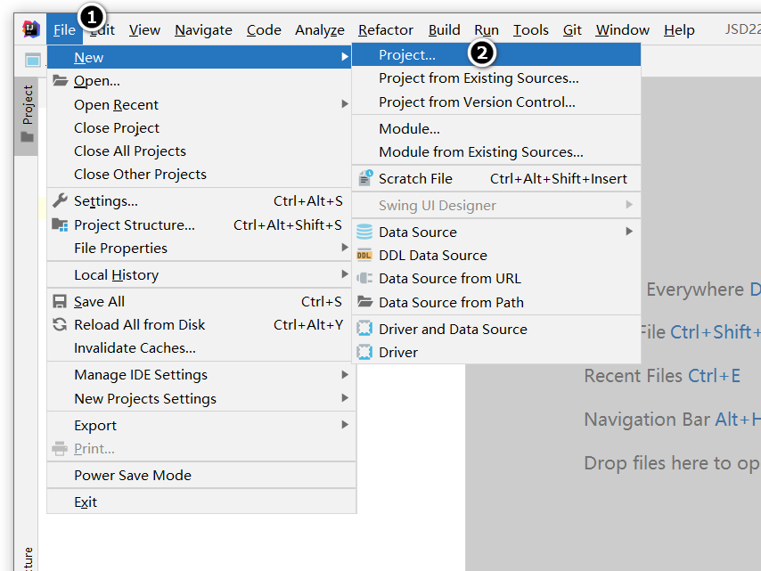
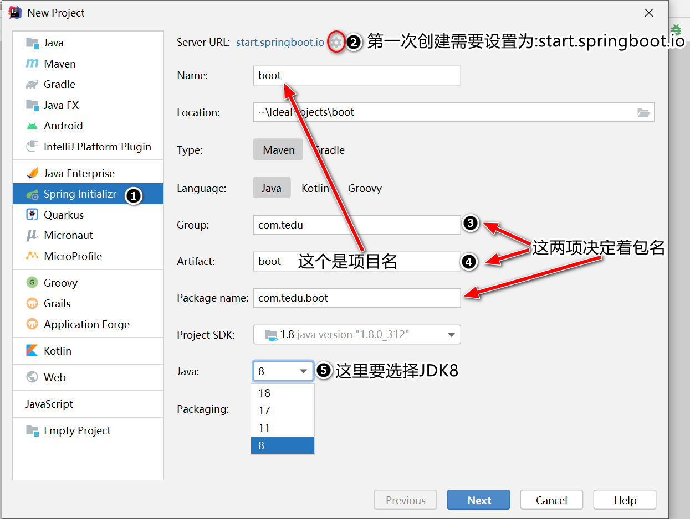
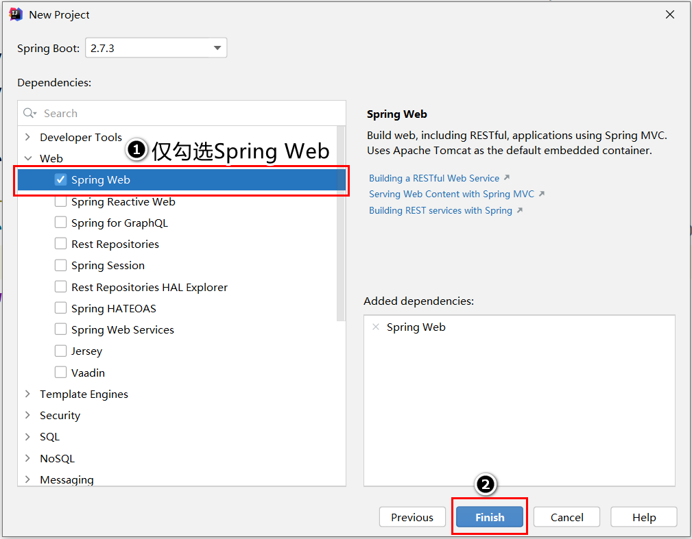
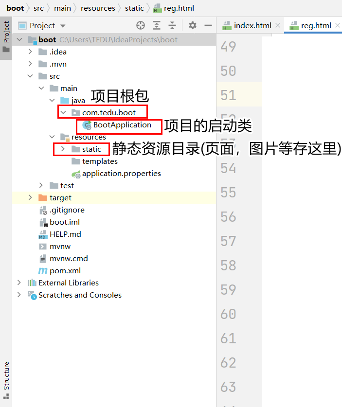
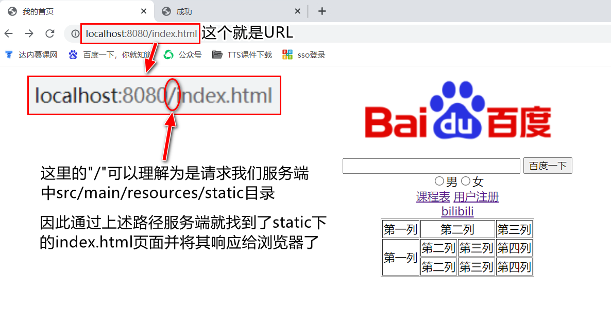
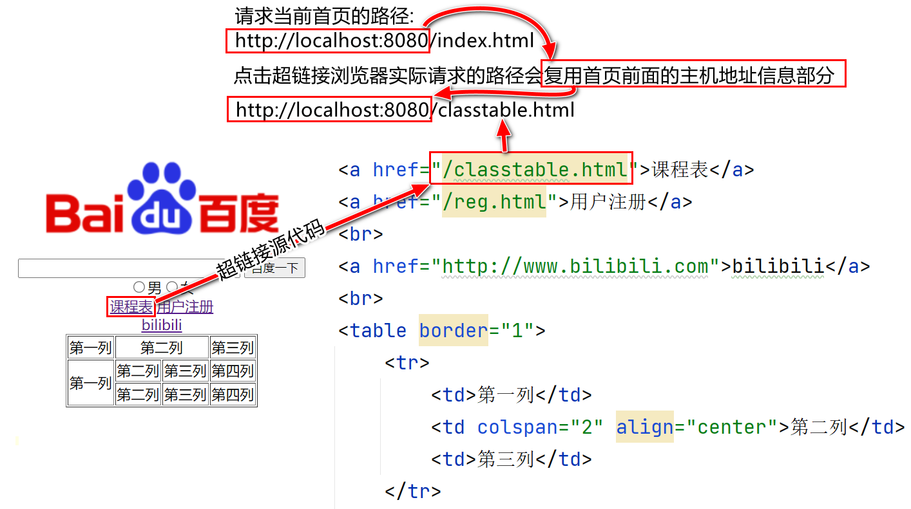
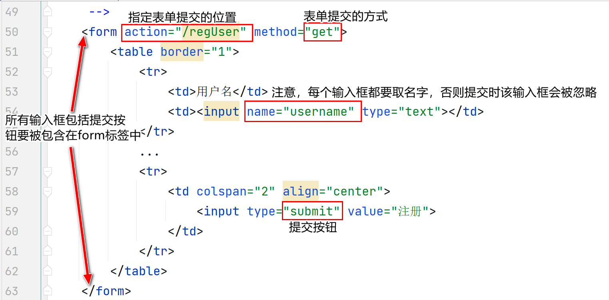
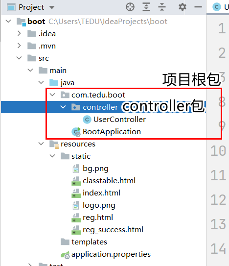
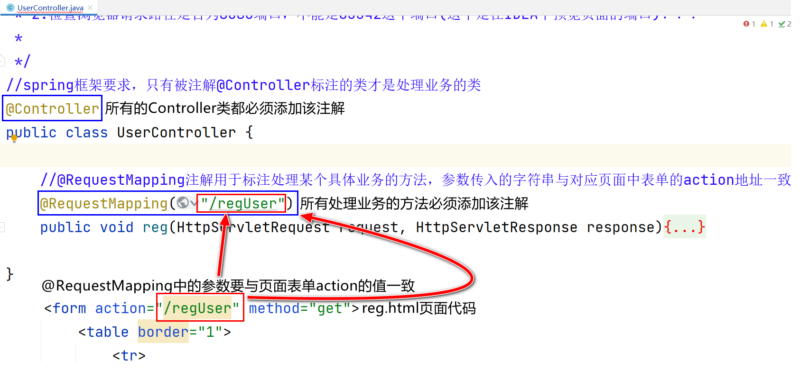
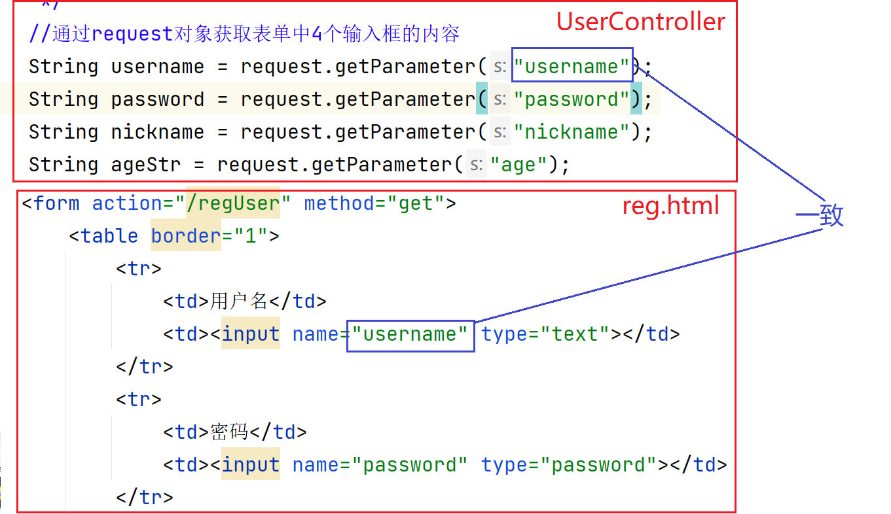

# SpringBoot項目

## 創建SpringBoot項目

步驟:

第一步:新建一個項目



第二步:選擇SpringBoot項目，按照圖上的步驟選擇並輸入對應內容，之後點擊next進行下一步。
注:第二小步可改用阿里雲:https://start.aliyun.com



第三步:勾選Spring Web，並點擊finish完成項目的創建




## SpringBoot項目結構

項目根包:SpringBoot項目要求我們將來定義的類和包必須放在這個包下

項目啟動類:SpringBoot項目自動生成，里面包含main方法，用來啟動

靜態資源目錄:用來保存當前web應用(我們的網站)中所有的靜態資源(頁面，圖片和其他素材)




## html基礎

HTML是超文本標記語言，用來構成一個"網頁"的語言。由W3C(萬維網)制定。

#### 構成一個頁面的基本結構:

```
<!DOCTYPE html>
<html lang="en">
<head>
    <meta charset="UTF-8">
    <title>title</title>
</head>
<body>

</body>
</html>
```

html標簽是html頁面的根標簽，里面包含兩個子標簽head和body

head標簽是頭信息，用來指定頁面的元數據，這里定義的東西都是給瀏覽器看的。包括後期用到的CSS，JS的加載

body標簽是體信息，里面定義的內容都會呈現在瀏覽器中給用戶看到。

#### html常用標簽介紹:

```html
<h1>-<h6>標簽:標題。每級標題的字體大小不同，標題獨占一行

<center>標簽:將標簽中間的內容全部基於瀏覽器居中顯示。該標簽在HTML5中已經不再
            建議使用了

<input>標簽:輸入組件，用於在瀏覽器中獲取用戶輸入的組件。組件有多種，使用type屬性
           定義不同輸入組件，常用的有:
           type="text" 默認值，表示一個文本輸入框
           type="password" 密碼框
           type="button" 按鈕
           type="submit" 提交表單按鈕
           type="checkbox" 多選框
           type="radio" 單選框
           注:單選框和覆選框使用name屬性分組，名字相同的為一組。

<br>標簽:換行

<a>標簽:超鏈接。標簽中間的文本是超鏈接上提示的文字，屬性href用於指定跳轉路徑

<table>標簽:表格。屬性border用於指定邊框。
            <table>標簽中包含<tr>標簽用於表示行
            <tr>標簽中包含<td>標簽用於表示列
            <td>標簽中常見屬性:
            align:對其方式。left左對齊,right右對齊,center劇中對其
            colspan:跨列合並列，合並是從左向右合並列
            rowspan:跨行合並列，合並是從上向下合並列

標簽:圖片。屬性src用於指定圖片的路徑
```


### URL-統一資源定位


#### 請求服務端頁面時，瀏覽器地址欄上輸入URL地址的規則:

```
根據URL的主機地址信息我們可以找到我們的服務器(Tomcat),抽象路徑部分最開始的"/"則是讓服務器去項目的static目錄下找對應的資源文件
```




#### 在頁面上指定其他資源的路徑時的規則：

```
我們在html頁面上經常會使用超鏈接或者圖片組件，這時我們需要指定路徑，這里的路徑都是從"/"開始的
這里的"/"就是URL地址中抽象路徑部分最開始的"/"
```




#### 表單的使用:

```
form表單是用於將用戶在頁面上輸入的信息提交給服務端使用的組件。
form表單中應當包含若幹的輸入組件.
注意:只有包含早form標簽中間的輸入組件中用戶輸入的信息才會提交給服務端!!

form上有兩個重要的屬性:
action:用於指定表單提交的路徑，該路徑需要服務端配合處理
method:表單提交的形式，有兩個可選項:
       GET:地址欄形式提交，表單數據會拼接到地址欄的URL中傳遞
       POST:表單數據會被包含在請求的消息正文中被提交
       當表單數據含有用戶隱私信息或附件上傳時應當使用POST。

       method屬性不指定時，默認是GET請求提交。

表單中應當包含一個提交按鈕，該按鈕點擊後會將這個表單進行提交。
```




## Controller的創建

Controller是所有處理業務請求的類的統稱，我們可以創建一個包controller保存實際處理業務的所有Controller類，需要注意幾個事項:

1. controller包需要放在項目的根包下

   

2. Controller上要定義@Controller注解，否則Spring MVC框架不識別該類

3. 處理業務的方法要定義@RequestMapping注解，且參數要與頁面表單中action的值一致

   

4. 獲取表單信息

   使用請求對象:request.getParameter()獲取，這里方法參數為一個字符串要與表單中輸入框名字一致

   

   
