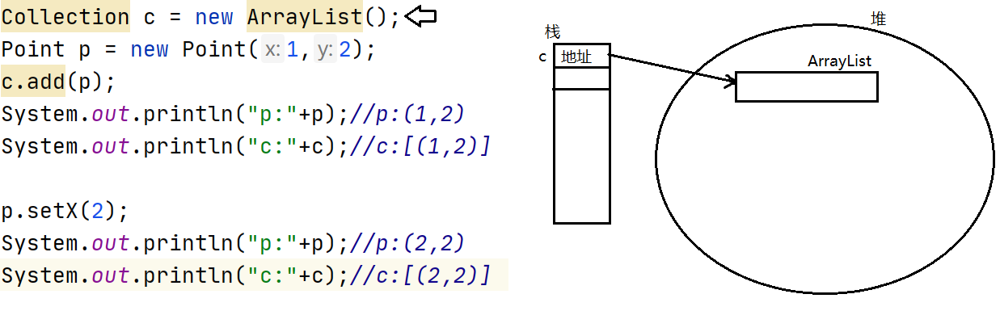
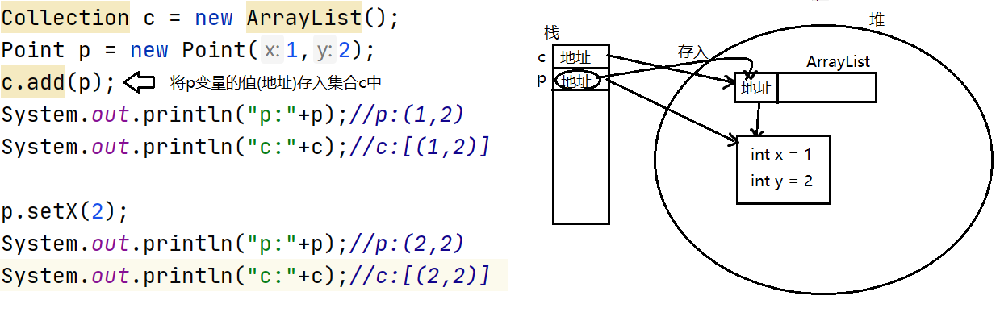
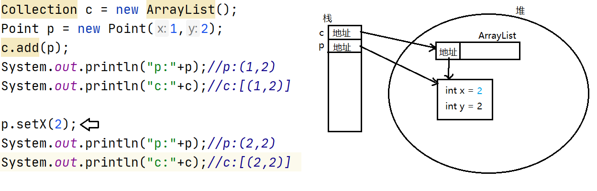

# day03

##  集合框架

#### 什麽是集合

集合與數組一樣,可以保存一組元素,並且提供了操作元素的相關方法,使用更方便.

#### java集合框架中相關接口

#### java.util.Collection接口:

java.util.Collection是所有集合的頂級接口.Collection下面有多種實現類,因此我們有更多的數據結構可供選擇.

#### Collection下面有兩個常見的子接口:

- java.util.List:線性表.是可重覆集合,並且有序.
- java.util.Set:不可重覆的集合,大部分實現類是無序的.

這里可重覆指的是集合中的元素是否可以重覆,而判定重覆元素的標準是依靠元素自身equals比較

的結果.為true就認為是重覆元素.

```java
package collection;

import java.util.ArrayList;
import java.util.Collection;

public class CollectionDemo {
    public static void main(String[] args) {
        Collection c = new ArrayList();
        /*
            boolean add(E e)
            向當前集合中添加一個元素.當元素成功添加後返回true
         */
        c.add("one");
        c.add("two");
        c.add("three");
        c.add("four");
        c.add("five");
        System.out.println(c);
        /*
            int size()
            返回當前集合的元素個數
         */
        int size = c.size();
        System.out.println("size:"+size);
        /*
            boolean isEmpty()
            判斷當前集合是否為空集(不含有任何元素)
         */
        boolean isEmpty = c.isEmpty();
        System.out.println("是否為空集:"+isEmpty);
        /*
           清空集合
         */
        c.clear();
        System.out.println(c);
        System.out.println("size:"+c.size());//0
        System.out.println("是否為空集:"+c.isEmpty());


    }
}
```


#### 集合與元素equals方法相關的方法

```java
package collection;

import java.util.ArrayList;
import java.util.Collection;
import java.util.HashSet;

/**
 * 集合的很多操作有與元素的equals方法相關。
 */
public class CollectionDemo2 {
    public static void main(String[] args) {
//        Collection c = new ArrayList();
        Collection c = new HashSet();
        c.add(new Point(1,2));
        c.add(new Point(3,4));
        c.add(new Point(5,6));
        c.add(new Point(7,8));
        c.add(new Point(1,2));
        /*
            集合重寫了Object的toString方法，輸出的格式為:
            [元素1.toString(), 元素2.toString(), ....]
         */
        System.out.println(c);

        Point p = new Point(1,2);
        /*
            boolean contains(Object o)
            判斷當前集合是否包含給定元素，這里判斷的依據是給定元素是否與集合
            現有元素存在equals比較為true的情況。
         */
        boolean contains = c.contains(p);
        System.out.println("包含:"+contains);
        /*
            remove用來從集合中刪除給定元素，刪除的也是與集合中equals比較
            為true的元素。注意，對於可以存放重覆元素的集合而言，只刪除一次。
         */
        c.remove(p);
        System.out.println(c);
    }
}
```

#### 集合存放的是元素的引用

集合只能存放引用類型元素,並且存放的是元素的引用

```java
package collection;

import java.util.ArrayList;
import java.util.Collection;

/**
 * 集合只能存放引用類型元素，並且存放的是元素的引用(地址)
 */
public class CollectionDemo3 {
    public static void main(String[] args) {
        Collection c = new ArrayList();
        Point p = new Point(1,2);
        c.add(p);
        System.out.println("p:"+p);//p:(1,2)
        System.out.println("c:"+c);//c:[(1,2)]

        p.setX(2);
        System.out.println("p:"+p);//p:(2,2)
        System.out.println("c:"+c);//c:[(2,2)]

    }
}
```









#### 集合間的操作

集合提供了如取並集,刪交集,判斷包含子集等操作

```java
package collection;

import java.util.ArrayList;
import java.util.Collection;
import java.util.HashSet;

/**
 * 集合間的操作
 */
public class CollectionDemo4 {
    public static void main(String[] args) {
//        Collection c1 = new ArrayList();
        Collection c1 = new HashSet();//不可重覆元素
        c1.add("java");
        c1.add("c");
        c1.add("c++");
        System.out.println("c1:"+c1);
        Collection c2 = new ArrayList();
        c2.add("android");
        c2.add("ios");
        c2.add("java");
        System.out.println("c2:"+c2);
         /*
            boolean addAll(Collection c)
            將給定集合中的所有元素添加到當前集合中。當前集合若發生了改變則返回true
         */
        boolean tf = c1.addAll(c2);
        System.out.println(tf);
        System.out.println("c1:"+c1);
        System.out.println("c2:"+c2);

        Collection c3 = new ArrayList();
        c3.add("ios");
        c3.add("c++");
        c3.add("php");
        System.out.println("c3:"+c3);
        /*
            boolean containsAll(Collection c)
            判斷當前集合是否包含給定集合中的所有元素
         */
        boolean contains = c1.containsAll(c3);
        System.out.println("包含所有元素:"+contains);

        /*
            boolean removeAll(Collection c)
            刪除當前集合中與給定集合中的共有元素
         */
        c1.removeAll(c3);
        System.out.println("c1:"+c1);
        System.out.println("c3:"+c3);
    }
}
```


### 集合的遍歷

#### Collection提供了統一的遍歷集合方式:叠代器模式

Iterator iterator()

該方法會獲取一個用於遍歷當前集合元素的叠代器.

#### java.util.Iterator接口

叠代器接口,定義了叠代器遍歷集合的相關操作.

不同的集合都實現了一個用於遍歷自身元素的叠代器實現類,我們無需記住它們的名字,用多態的角度把他們看做為Iterator即可.

叠代器遍歷集合遵循的步驟為:問,取,刪.其中刪除元素不是必要操作

```java
package collection;

import java.util.ArrayList;
import java.util.Collection;
import java.util.Iterator;

/**
 * Collection接口沒有定義單獨獲取某一個元素的操作，因為不通用。
 * 但是Collection提供了遍歷集合元素的操作。該操作是一個通用操作，無論什麽類型的
 * 集合都支持此種遍歷方式:叠代器模式。
 *
 * Iterator iterator()           die(二聲)
 * 該方法會獲取一個用於遍歷當前集合元素的叠代器
 *
 * java.util.Iterator接口，是叠代器接口，規定了叠代器遍歷集合的相關操作，不同的
 * 集合都提供了一個用於遍歷自身元素的叠代器實現類，不過我們不需要直到它們的名字，以
 * 多態的方式當成Iterator使用即可。
 * 叠代器遍歷集合遵循的步驟為:問->取->刪
 * 其中刪除不是必須操作。
 *
 */
public class IteratorDemo {
    public static void main(String[] args) {
        Collection c = new ArrayList();
        c.add("one");
        c.add("two");
        c.add("three");
        c.add("four");
        c.add("five");
        System.out.println(c);
        //獲取叠代器
        Iterator it = c.iterator();
        /*
            叠代器提供的相關方法：
            boolean hasNext()
            判斷集合是否還有元素可以遍歷

            E next()
            獲取集合下一個元素(第一次調用時就是獲取第一個元素，以此類推)
         */
        while(it.hasNext()){
            String str = (String)it.next();
            System.out.println(str);         
        }
        System.out.println(c);

    }
}
```

####  叠代器遍歷過程中不得通過集合的方法增刪元素

```java
package collection;

import java.util.ArrayList;
import java.util.Collection;
import java.util.Iterator;

/**
 * Collection接口沒有定義單獨獲取某一個元素的操作，因為不通用。
 * 但是Collection提供了遍歷集合元素的操作。該操作是一個通用操作，無論什麽類型的
 * 集合都支持此種遍歷方式:叠代器模式。
 *
 * Iterator iterator()           die(二聲)
 * 該方法會獲取一個用於遍歷當前集合元素的叠代器
 *
 * java.util.Iterator接口，是叠代器接口，規定了叠代器遍歷集合的相關操作，不同的
 * 集合都提供了一個用於遍歷自身元素的叠代器實現類，不過我們不需要直到它們的名字，以
 * 多態的方式當成Iterator使用即可。
 * 叠代器遍歷集合遵循的步驟為:問->取->刪
 * 其中刪除不是必須操作。
 *
 */
public class IteratorDemo {
    public static void main(String[] args) {
        Collection c = new ArrayList();
        c.add("one");
        c.add("#");
        c.add("two");
        c.add("#");
        c.add("three");
        c.add("#");
        c.add("four");
        c.add("#");
        c.add("five");
        System.out.println(c);
        //獲取叠代器
        Iterator it = c.iterator();
        /*
            叠代器提供的相關方法：
            boolean hasNext()
            判斷集合是否還有元素可以遍歷

            E next()
            獲取集合下一個元素(第一次調用時就是獲取第一個元素，以此類推)
         */
        while(it.hasNext()){
            String str = (String)it.next();
            System.out.println(str);
            if("#".equals(str)){
                /*
                    叠代器要求遍歷的過程中不得通過集合的方法增刪元素
                    否則會拋出異常:ConcurrentModificationException
                 */
//                c.remove(str);
                /*
                    叠代器的remove方法可以將通過next方法獲取的元素從集合
                    中刪除。
                 */
                it.remove();
            }
        }
        System.out.println(c);

    }
}
```


### 增強型for循環

JDK5之後推出了一個特性:增強型for循環

- 也稱為新循環,使得我們可以使用相同的語法遍歷集合或數組.
- 語法:

```
for(元素類型 變量名 : 集合或數組){
    循環體
}
```

```java
package collection;

import java.util.ArrayList;
import java.util.Collection;
import java.util.Iterator;

/**
 * JDK5推出時，推出了一個新的特性:增強型for循環
 * 也稱為新循環，它可以用相同的語法遍歷集合或數組。
 *
 * 新循環是java編譯器認可的，並非虛擬機。
 */
public class NewForDemo {
    public static void main(String[] args) {
        String[] array = {"one","two","three","four","five"};
        for(int i=0;i<array.length;i++){
            String str = array[i];
            System.out.println(str);
        }

        for(String str : array){
            System.out.println(str);
        }


        Collection c = new ArrayList();
        c.add("one");
        c.add("two");
        c.add("three");
        c.add("four");
        c.add("five");
        //叠代器遍歷
        Iterator it = c.iterator();
        while(it.hasNext()){
            String str = (String)it.next();
            System.out.println(str);
        }
        //新循環遍歷
        for(Object o : c){
            String str = (String)o;
            System.out.println(str);
        }

    }
}
```


### 泛型

JDK5之後推出的另一個特性:泛型

泛型也稱為參數化類型,允許我們在使用一個類時指定它當中屬性,方法參數或返回值的類型.

- 泛型在集合中被廣泛使用,用來指定集合中的元素類型.
- 有泛型支持的類在使用時若不指定泛型的具體類型則默認為原型Object

```java
package collection;

import java.util.ArrayList;
import java.util.Collection;
import java.util.Iterator;

/**
 * JDK5推出時，推出了一個新的特性:增強型for循環
 * 也稱為新循環，它可以用相同的語法遍歷集合或數組。
 *
 * 新循環是java編譯器認可的，並非虛擬機。
 */
public class NewForDemo {
    public static void main(String[] args) {
        String[] array = {"one","two","three","four","five"};
        for(int i=0;i<array.length;i++){
            String str = array[i];
            System.out.println(str);
        }

        for(String str : array){
            System.out.println(str);
        }

        /*
         *  泛型 JDK5之後推出的另一個特性。
         * 泛型也稱為參數化類型，允許我們在使用一個類時指定它里面屬性的類型，
         * 方法參數或返回值的類型，使得我們使用一個類時可以更靈活。
         * 泛型被廣泛應用於集合中，用來指定集合中的元素類型。
         * 支持泛型的類在使用時如果未指定泛型，那麽默認就是原型Object
         *
         * Collection接口的定義
         * public interface Collection<E> ... {
         *
         * Collection<E> 這里的<E>就是泛型
         *
         * Collection中add方法的定義，參數為E
         * boolean add(E e)
         */
        Collection<String> c = new ArrayList<>();
        c.add("one");//編譯器會檢查add方法的實參是否為String類型
        c.add("two");
        c.add("three");
        c.add("four");
        c.add("five");
//        c.add(123);//編譯不通過
        //叠代器遍歷
        //叠代器也支持泛型，指定的與其遍歷的集合指定的泛型一致即可
        Iterator<String> it = c.iterator();
        while(it.hasNext()){
            //編譯器編譯代碼時會根據叠代器指定的泛型補充造型代碼
            String str = it.next();//獲取元素時無需在造型
            System.out.println(str);
        }
        //新循環遍歷
        for(String str : c){
            System.out.println(str);
        }

    }
}
```


### List集

java.util.List接口,繼承自Collection.

List集合是可重覆集,並且有序,提供了一套可以通過下標操作元素的方法

常用實現類:

- java.util.ArrayList:內部使用數組實現,查詢性能更好.
- java.util.LinkedList:內部使用鏈表實現,首尾增刪元素性能更好.

### List集合常見方法

#### get()與set()

```java
package collection;

import java.util.ArrayList;
import java.util.List;

/**
 *  List集合
 *  List是Collection下面常見的一類集合。
 *  java.util.List接口是所有List的接口，它繼承自Collection。
 *  常見的實現類:
 *  java.util.ArrayList:內部由數組實現，查詢性能更好。
 *  java.util.LinkedList:內部由鏈表實現，增刪性能更好。
 *
 *  List集合的特點是:可以存放重覆元素，並且有序。其提供了一套可以通過下標
 *  操作元素的方法。
 */
public class ListDemo {
    public static void main(String[] args) {
        List<String> list = new ArrayList<>();
//        List<String> list = new LinkedList<>();

        list.add("one");
        list.add("two");
        list.add("three");
        list.add("four");
        list.add("five");

        /*
            E get(int index)
            獲取指定下標對應的元素
         */
        //獲取第三個元素
        String e = list.get(2);
        System.out.println(e);

        for(int i=0;i<list.size();i++){
            e = list.get(i);
            System.out.println(e);
        }

        /*
            E set(int index,E e)
            將給定元素設置到指定位置，返回值為該位置原有的元素。
            替換元素操作
         */
        //[one,six,three,four,five]
        String old = list.set(1,"six");
        System.out.println(list);
        System.out.println("被替換的元素是:"+old);
    }
}
```


####  重載的add()和remove()

```java
package collection;

import java.util.ArrayList;
import java.util.List;

/**
 * List集合提供了一對重載的add,remove方法
 */
public class ListDemo2 {
    public static void main(String[] args) {
        List<String> list = new ArrayList<>();
        list.add("one");
        list.add("two");
        list.add("three");
        list.add("four");
        list.add("five");
        System.out.println(list);
        /*
            void add(int index,E e)
            將給定元素插入到指定位置
         */
        //[one,two,six,three,four,five]
        list.add(2,"six");
        System.out.println(list);

        /*
            E remove(int index)
            刪除並返回指定位置上的元素
         */
        //[one,six,three,four,five]
        String e = list.remove(1);
        System.out.println(list);
        System.out.println("被刪除的元素:"+e);
    }
}
```


#### subList()方法

```java
package collection;

import java.util.ArrayList;
import java.util.List;

/**
 *  List subList(int start,int end)
 *  獲取當前集合中指定範圍內的子集。兩個參數為開始與結束的下標(含頭不含尾)
 */
public class ListDemo3 {
    public static void main(String[] args) {
        List<Integer> list = new ArrayList<>();
        for(int i=0;i<10;i++){
            list.add(i);
        }
        System.out.println(list);
        //獲取3-7這部分
        List<Integer> subList = list.subList(3,8);
        System.out.println(subList);
        //將子集每個元素擴大10倍
        for(int i=0;i<subList.size();i++){
            subList.set(i,subList.get(i) * 10);
        }
        //[30,40,50,60,70]
        System.out.println(subList);
        /*
            對子集元素的操作就是對原集合對應元素的操作
         */
        System.out.println(list);

        //刪除list集合中的2-8
        list.subList(2,9).clear();
        System.out.println(list);

    }
}
```