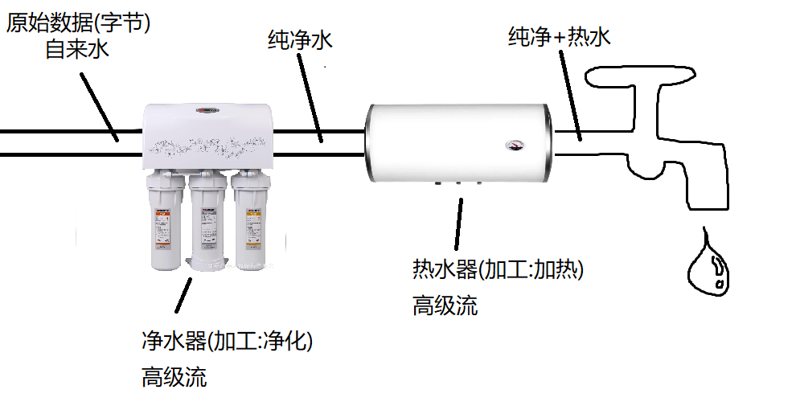
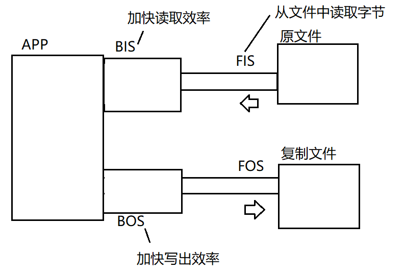
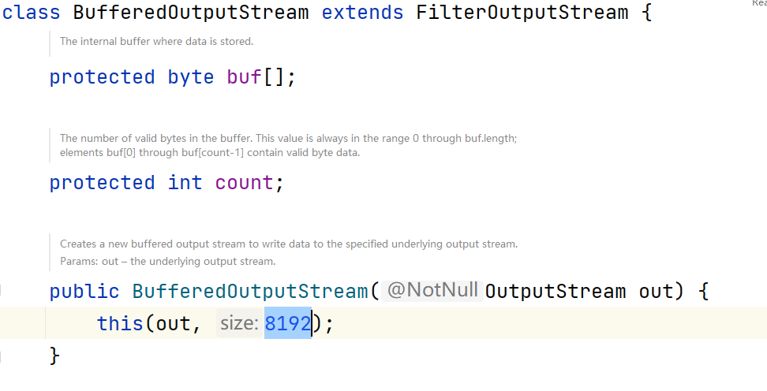
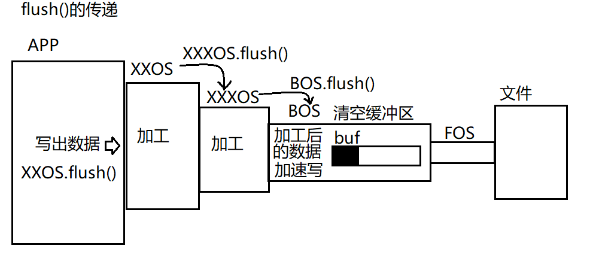
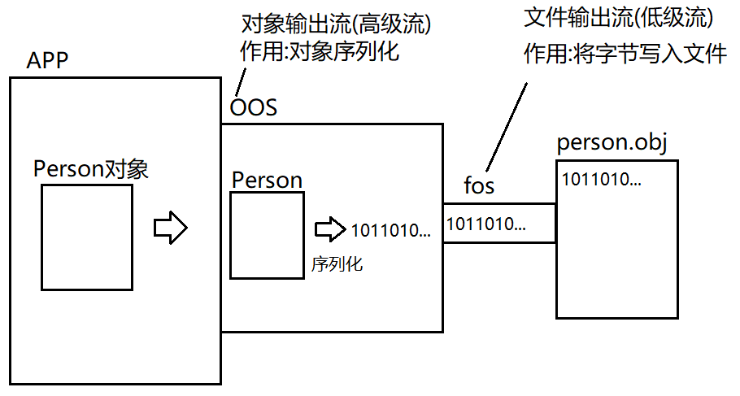
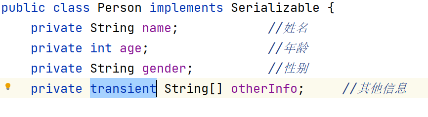
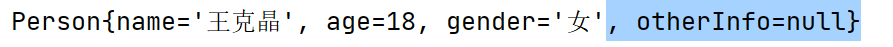
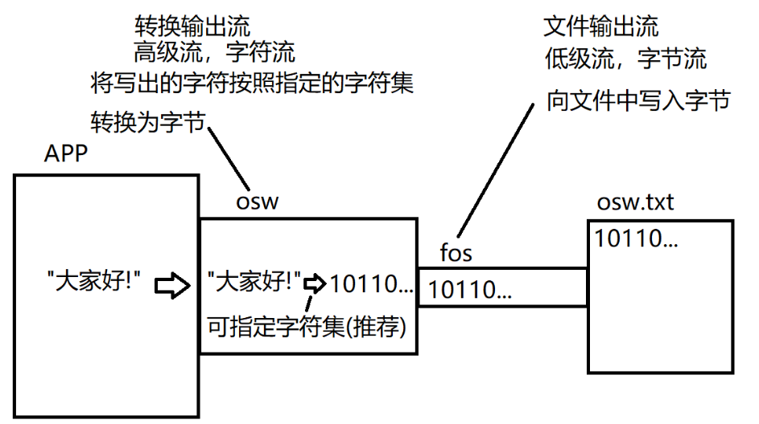
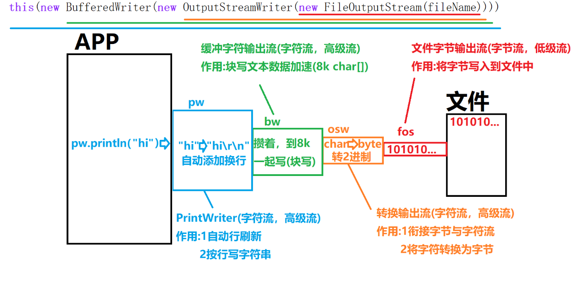

# day06

### 高級流

java將IO分為了兩類

- 節點流:又稱為"低級流"
  - 特點:直接鏈接程序與另一端的"管道"，是真實讀寫數據的流
  - IO一定是建立在節點流的基礎上進行的。
  - 文件流就是典型的節點流(低級流)
- 處理流:又稱為"高級流"
  - 特點:不能獨立存在，必須鏈接在其他流上
  - 目的:當數據經過當前高級流時可以對數據進行某種加工操作，來簡化我們的同等操作
  - 實際開發中我們經常"串聯"一組高級流最終到某個低級流上，使讀寫數據以流水線式的加工處理完成。這一操作也被稱為使"**流的鏈接**"。流鏈接也是JAVA IO的精髓所在。




#### 緩沖流

java.io.**BufferedInputStream**和**BufferedOutputStream**

##### 功能

在流鏈接中的作用:**加快讀寫效率**

通常緩沖是最終鏈接在低級流上的流

##### 構造器

- 緩沖字節輸出流

  ```java
  BufferedOutputStream(OutputStream out)
  實例化一個緩沖字節輸出流並鏈接在指定的字節輸出流上。默認緩沖區大小8kb(內部維護的byte[] buf數組長度8192)
  
  BufferedOutputStream(OutputStream out,int size)
  實例化一個指定緩沖區大小的緩沖字節輸出流並鏈接在指定的字節輸出流上。
  ```

  

- 緩沖字節輸入流

  ```java
  BufferedInputStream(InputStream in)
  實例化一個緩沖字節輸入流並鏈接在指定的字節輸入流上。默認緩沖區大小8kb(內部維護的byte[] buf數組長度8192)
  
  BufferedInputStream(InputStream in,int size)
  實例化一個指定緩沖區大小的緩沖字節輸入流並鏈接在指定的字節輸入流上。    
  ```


##### 例



```java
package io;

import java.io.*;

/**
 * 使用緩沖流完成文件覆制操作
 */
public class CopyDemo3 {
    public static void main(String[] args) throws IOException {
        FileInputStream fis = new FileInputStream("image.png");
        BufferedInputStream bis = new BufferedInputStream(fis);

        FileOutputStream fos = new FileOutputStream("image_cp3.png");
        BufferedOutputStream bos = new BufferedOutputStream(fos);
        int d;
        long start = System.currentTimeMillis();
        while((d=bis.read())!= -1){
            bos.write(d);
        }
        long end = System.currentTimeMillis();
        System.out.println("覆制完畢!耗時:"+(end-start)+"ms");
        bis.close();
        bos.close();

    }
}
```

##### 原理

內部定義了一個屬性byte buf[]。它等同於我們之前練習覆制案例時的塊寫操作。

並且默認創建時，該buf數組的長度為8192(8kb)長度。

緩沖流在讀寫數據時**總是以塊讀寫數據**(默認是8kb)來保證讀寫效率的

**緩沖流提供了多種構造器，可以自行指定緩沖區大小。**




##### 寫緩沖問題

由於緩沖輸出流會將寫出的數據裝滿內部緩沖區(默認8kb的字節數組)後才會進行一次真實的寫出操作。當我們的數據不足時，如果想要及時寫出數據，可以調用緩沖流的flush()方法，強制將緩沖區中已經緩存的數據寫出一次。

```java
package io;

import java.io.BufferedOutputStream;
import java.io.FileNotFoundException;
import java.io.FileOutputStream;
import java.io.IOException;
import java.nio.charset.StandardCharsets;

/**
 * 緩沖輸出流的寫緩沖問題
 */
public class BosFlushDemo {
    public static void main(String[] args) throws IOException {
        FileOutputStream fos = new FileOutputStream("bos.txt");
        BufferedOutputStream bos = new BufferedOutputStream(fos);
        String line = "super idol的笑容都沒你的甜~";
        byte[] data = line.getBytes(StandardCharsets.UTF_8);
        bos.write(data);
        /*
            void flush()
            強制將緩沖流的緩沖取(內部維護的字節數組)中已經緩存的字節一次性寫出
         */
//        bos.flush();
        System.out.println("寫出完畢!");
        bos.close();//緩沖輸出流的close()方法內部會自動調用一次flush()方法確保數據寫出
    }
}

```

##### flush的傳遞

flush()方法是被定義在java.io.Flushable中。而字節輸出流的超類java.io.OutputStream實現了

該接口，這意味著所有的字節輸出流都有flush方法。而除了緩沖流之外的高級流的flush方法作用就是調用它鏈接的流的flush方法將該動作傳遞下去。最終傳遞給緩沖流來清空緩沖區。




#### 對象流

java.io.**ObjectInputStream**和**ObjectOutputStream**

##### 作用

- 對象輸出流:將我們的java對象進行序列化
- 對象輸入流:將java對象進行反序列化

##### 序列化

將一個對象轉換為一組**可被傳輸或保存**的字節。這組字節中除了包含對象本身的數據外，還會包含結構信息。

##### 序列化的意義

實際開發中，我們通常會將對象

- 寫入磁盤，進行長久保存
- 在網絡間兩台計算機中的java間進行傳輸

無論是保存在磁盤中還是傳輸，都需要將對象轉換為字節後才可以進行。

##### 對象輸出流的序列化操作

```java
void writeObject(Object obj)
將給定的對象轉換為一組可保存或傳輸的字節然後通過其鏈接的流將字節寫出
```


##### 例:



```java
package io;

import java.io.*;

/**
 * 對象流
 * 使用對象輸出流完成對象序列化操作並最終保存到文件person.obj中
 */
public class OOSDemo {
    public static void main(String[] args) throws IOException {
        String name = "王克晶";
        int age = 18;
        String gender = "女";
        String[] otherInfo = {"黑","嗓門大","java技術好","大家的啟蒙老師","來自廊坊佳木斯"};
        Person p = new Person(name,age,gender,otherInfo);
        FileOutputStream fos = new FileOutputStream("person.obj");
        ObjectOutputStream oos = new ObjectOutputStream(fos);
        /*
            對象輸出流提供的序列化對象方法:
            void writeObject(Object obj)
            將給定的對象轉換為一組可保存或傳輸的字節然後通過其鏈接的流將字節寫出

            序列化對象時要求該對象對應的類必須實現接口:java.io.Serializable
            如果寫出的對象對應的類沒有實現該接口，那麽writeObject會拋出下面異常
            java.io.NotSerializableException

         */
        oos.writeObject(p);
        System.out.println("對象寫出完畢");
        oos.close();
    }
}
```


##### 序列化要求

**對象輸出流要求寫出的對象必須實現接口:java.io.Serializable**

上述案例中我們看到，如果寫出的對象Person沒有實現java.io.Serializable時會拋出異常:

**java.io.NotSerializableException**


##### 對象輸入流

**java.io.ObjectInputStream**使用對象流可以進行**對象反序列化**

###### 構造器

```java
ObjectInputStream(InputStream in)
將當前創建的對象輸入流鏈接在指定的輸入流上   
```

###### 方法

```java
Object readObject()
進行對象反序列化並返回。該方法會從當前對象輸入流鏈接的流中讀取若幹字節並將其還原為對象。這里要注意讀取的字節必須是由ObjectOutputStream序列化一個對象所得到的字節。
```


###### 例

```java
package io;

import java.io.FileInputStream;
import java.io.FileNotFoundException;
import java.io.IOException;
import java.io.ObjectInputStream;

/**
 * 對象輸入流，用來進行對象反序列化
 */
public class OISDemo {
    public static void main(String[] args) throws IOException, ClassNotFoundException {
        //讀取person.obj文件並將其中保存的數據進行反序列化
        FileInputStream fis = new FileInputStream("person.obj");
        ObjectInputStream ois = new ObjectInputStream(fis);

        Person person = (Person)ois.readObject();
        System.out.println(person);

        ois.close();
    }
}

```


##### transient關鍵字

當一個屬性被transient關鍵字修飾後，該對象在進行序列化時，轉換出來的字節中是不包含該屬性的。忽略不必要的屬性可以達到對象"瘦身"的操作。

對象瘦身可以在對象持久化時減少磁盤開銷。在進行傳輸時可以縮短傳輸速度。

如果該對象不需要序列化，那麽該關鍵字不發揮其他任何效果



序列化時不包含otherInfo屬性，並且反序列化時該屬性值為null




### 字符流

- java將流按照讀寫單位劃分為**字節流與字符流.**
- java.io.InputStream和OutputStream是所有字節流的超類
- **而java.io.Reader和Writer則是所有字符流的超類,它們和字節流的超類是平級關系**.
- Reader和Writer是兩個抽象類,里面規定了所有字符流都必須具備的讀寫字符的相關方法.
- **字符流最小讀寫單位為字符(char)**,但是底層實際還是讀寫字節,只是字符與字節的轉換工作由字符流完成.
- **字符流都是高級流**

#### 超類

- java.io.Writer 所有字符輸入流的超類

  **常用方法**

  ```java
  void write(int c):寫出一個字符,寫出給定int值”低16”位表示的字符。
  void write(char[] chs):將給定字符數組中所有字符寫出。
  void write(String str):將給定的字符串寫出
  void write(char[] chs,int offset,int len):將給定的字符數組中從offset處開始連續的len個字符寫出
  ```

- java.io.Reader 所有字符輸出流的超類

  **常用方法**

  ```java
  int read():讀取一個字符，返回的int值“低16”位有效。當返回值為-1時表達流讀取到了末尾。
  int read(char[] chs):從該流中讀取一個字符數組的length個字符並存入該數組，返回值為實際讀取到的字符量。當返回值為-1時表達流讀取到了末尾。
  
  ```

  

#### 轉換流

java.io.InputStreamReader和OutputStreamWriter是常用的字符流的實現類。

實際開發中我們不會直接操作他們，但是他們在流連接中是必不可少的一環。

##### 流連接中的作用

- 銜接字節流與其他字符流
- 將字符與字節相互轉換

##### 意義

實際開發中我們還有功能更好用的字符高級流.但是其他的字符高級流都有一個共通點:不能直接連接在字節流上.而實際操作設備的流都是低級流同時也都是字節流.因此不能直接在流連接中串聯起來.轉換流是一對可以連接在字節流上的字符流,其他的高級字符流可以連接在轉換流上.在流連接中起到"轉換器"的作用(負責字符與字節的實際轉換)

##### 輸出流

###### 構造器

```java
OutputStreamWriter(OutputStream out,Charset cs)
基於給定的字節輸出流以及字符編碼創建OSW
    
OutputStreamWriter(OutputStream out)
該構造方法會根據系統默認字符集創建OSW
```

示意




例

```java
package io;

import java.io.FileNotFoundException;
import java.io.FileOutputStream;
import java.io.IOException;
import java.io.OutputStreamWriter;
import java.nio.charset.StandardCharsets;

/**
 * 轉換流寫出文本數據
 */
public class OSWDemo {
    public static void main(String[] args) throws IOException {
        //向文件osw.txt中寫出文本數據
        FileOutputStream fos = new FileOutputStream("osw.txt");
        OutputStreamWriter osw = new OutputStreamWriter(fos, StandardCharsets.UTF_8);

        osw.write("夜空中最亮的星，能否聽清，");
        osw.write("那仰望的人心底的孤獨和嘆息。");
        System.out.println("寫出完畢");
        osw.close();

    }
}

```


##### 輸入流

###### 構造器

```java
InputStreamWriter(InputStream in,Charset cs)
基於給定的字節輸入流以及字符編碼創建當前轉換流
    
InputStreamWriter(InputStream in)
該構造方法會根據系統默認字符集創建當前轉換流
```

例

```java
package io;

import java.io.FileInputStream;
import java.io.FileNotFoundException;
import java.io.IOException;
import java.io.InputStreamReader;
import java.nio.charset.StandardCharsets;

/**
 * 使用轉換流讀取文本數據
 */
public class ISRDemo {
    public static void main(String[] args) throws IOException {
        //將osw.txt文件中的文本信息讀取回來
        FileInputStream fis = new FileInputStream("osw.txt");
        InputStreamReader isr = new InputStreamReader(fis, StandardCharsets.UTF_8);
        //00000000 00000000 10011101 01110010
        int d;
        while(( d = isr.read()) != -1) {
            System.out.print((char) d);
        }
        isr.close();
    }
}

```


### 緩沖字符流

#### 緩沖字符輸出流-java.io.PrintWriter

- **java.io.BufferedWriter和BufferedReader**

- 緩沖字符流內部也有一個緩沖區,讀寫文本數據以塊讀寫形式加快效率.並且緩沖流有一個特別的功能:**可以按行讀寫文本數據**.**緩沖流內部維護一個char數組**，**默認長度8192**.**以塊讀寫方式讀寫字符數據保證效率**

- java.io.PrintWriter具有自動行刷新的緩沖字符輸出流,實際開發中更常用.**它內部總是會自動連BufferedWriter作為塊寫加速使用**.

##### 工作原理



**特點**

- 可以按行寫出字符串

- 具有自動行刷新功能

  

##### 對文件寫操作的構造器

```java
PrintWriter(File file)
PrintWriter(String path)
    
還支持指定字符集
PrintWriter(File file,String csn)
PrintWriter(String path,String csn)  
    
上述構造器看似PW可以直接對文件進行操作，但是它是一個高級流，實際內部會進行流連接:
this(new BufferedWriter(new OutputStreamWriter(new FileOutputStream(fileName))),false);
如上面工作原理圖
```

##### 例

```java
package io;

import java.io.FileNotFoundException;
import java.io.PrintWriter;
import java.io.UnsupportedEncodingException;
import java.nio.charset.StandardCharsets;

/**
 * 緩沖字符輸出流:java.io.PrintWriter
 * 特點:
 * 1:按行寫出字符串
 * 2:具有自動的行刷新功能
 *
 */
public class PWDemo {
    public static void main(String[] args) throws FileNotFoundException, UnsupportedEncodingException {
        //向文件中寫入文本數據
        /*
            PrintWriter(File file)
            PrintWriter(String path)
         */
        PrintWriter pw = new PrintWriter("pw.txt");
//        PrintWriter pw = new PrintWriter("pw.txt", "UTF-8");
        pw.println("我祈禱擁有一顆透明的心靈，和會流淚的眼睛。");
        pw.println("給我再去相信的勇氣，oh越過黃昏去擁抱你。");
        System.out.println("寫出完畢");
        pw.close();
    }
}
```


##### 其他構造器

```java
PritWriter(Writer writer)
將當前實例化的PrintWriter鏈接在指定的字符輸出流上    
    
PrintWriter(OutputStream out)    
將當前實例化的PrintWriter鏈接在指定的字節輸出流上
由於除了轉換流外的其他字符流都不能直接連在字節流上，因此這個構造器內部會自動鏈接在BufferedWriter上
並且讓BufferedWriter鏈接在轉換流OutputStream上，最後再讓轉換流鏈接再指定的字節輸出流上
```

##### 例

```java
package io;

import java.io.*;
import java.nio.charset.StandardCharsets;

/**
 *  自行完成流連接向文件寫出字符串
 */
public class PWDemo2 {
    public static void main(String[] args) throws FileNotFoundException {
        //負責:將寫出的字節寫入到文件中
        FileOutputStream fos = new FileOutputStream("pw2.txt");
        //負責:將寫出的字符全部轉換為字節(可以按照指定的字符集轉換)
        OutputStreamWriter osw = new OutputStreamWriter(fos, StandardCharsets.UTF_8);
        //負責:塊寫文本數據(攢夠8192個字符一次性寫出)
        BufferedWriter bw = new BufferedWriter(osw);
        //負責:按行寫出字符串
        PrintWriter pw = new PrintWriter(bw);

        pw.println("你停在了這條我們熟悉的街,");
        pw.println("把你準備好的台詞全念一遍。");

        System.out.println("寫出完畢");
        pw.close();
    }
}
```


##### 自動行刷新

PrintWriter支持自動行刷新，每當我們調用println方法寫出一行內容後自動flush一次。

```java
對應的構造器
PritWriter(Writer writer,boolean autoflush)
如果第二個參數為true則開啟自動行刷新 
```

例

```
package io;

import java.io.*;
import java.nio.charset.StandardCharsets;
import java.util.Scanner;

/**
 * 實現一個簡易的記事本工具
 * 利用流連接
 * 在文件輸出流上最終鏈接到PrintWriter上。
 * 然後將用戶在控制台上輸入的每一行字符串都可以按行寫入到對應的文件中。
 * 當用戶在控制台上單獨輸入"exit"時程序退出。
 */
public class AutoFlushDemo {
    public static void main(String[] args) throws FileNotFoundException {
        //負責:將寫出的字節寫入到文件中
        FileOutputStream fos = new FileOutputStream("note.txt");
        //負責:將寫出的字符全部轉換為字節(可以按照指定的字符集轉換)
        OutputStreamWriter osw = new OutputStreamWriter(fos, StandardCharsets.UTF_8);
        //負責:塊寫文本數據(攢夠8192個字符一次性寫出)
        BufferedWriter bw = new BufferedWriter(osw);
        //負責:按行寫出字符串
        PrintWriter pw = new PrintWriter(bw,true);//開啟自動行刷新

        Scanner scanner = new Scanner(System.in);
        System.out.println("請開始輸入內容，單獨輸入exit退出");
        while(true){
            String line = scanner.nextLine();
            //String可以忽略大小寫比較字符串內容:equalsIgnoreCase
            if("exit".equalsIgnoreCase(line)){
                break;
            }
            pw.println(line);//每當println後自動flush。注意:print方法並不會自動flush
        }
        System.out.println("再見!");
        pw.close();
    }
}

```

#### 緩沖字符輸入流-java.io.BufferedReader

緩沖字符輸入流內部維護一個默認8192長度的char數組，總是以塊讀取文本數據保證讀取效率。

緩沖輸入流提供了一個**按行讀取文本**數據的方法

```java
String readLine()
返回一行字符串。方法內部會連續掃描若幹個字符，直到遇到換行符為止，將換行符之前的內容以一個字符串形式返回。
返回的字符串中不含有最後的換行符。
返回值有三種情況:
1:正常一行內容
2:空字符串。當讀取了一個空行時(這一行只有一個換行符)。
3:null。當流讀取到了末尾時。  
    
當我們第一次調用readLine()時，流並不是只讀取了一行字符串，而是先進行塊讀操作(一次性讀取8192個字符並轉入到內部的char數組中)，然後掃描內部的char數組，然後將第一行字符串返回。第二次調用後再繼續掃描後去的內容以此類推。    
```

##### 例

```java
package io;

import java.io.*;

/**
 * 使用緩沖字符輸入流讀取文本數據
 */
public class BRDemo {
    public static void main(String[] args) throws IOException {
        //將當前源代碼輸出到控制台上
        /*
            1:創建文件輸入流讀取當前源代碼文件
            2:進行流連接最終鏈接到BufferedReader上
            3:讀取每一行字符串並輸出到控制台上
         */
        FileInputStream fis = new FileInputStream(
                "./src/main/java/io/BRDemo.java"
        );
        InputStreamReader isr = new InputStreamReader(fis);
        BufferedReader br = new BufferedReader(isr);

        String line;
        while((line = br.readLine())!=null) {
            System.out.println(line);
        }
        br.close();
    }
}

```


### IO總結


## 總結

### JAVA IO必會概念:

- java io可以讓我們用標準的讀寫操作來完成對不同設備的讀寫數據工作.
- java將IO按照方向劃分為輸入與輸出,參照點是我們寫的程序.
- **輸入**:用來讀取數據的,是從外界到程序的方向,用於獲取數據.
- **輸出**:用來寫出數據的,是從程序到外界的方向,用於發送數據.

java將IO比喻為"流",即:stream. 就像生活中的"電流","水流"一樣,它是以同一個方向順序移動的過程.只不過這里流動的是字節(2進制數據).所以在IO中有輸入流和輸出流之分,我們理解他們是連接程序與另一端的"管道",用於獲取或發送數據到另一端.

**因此流的讀寫是順序讀寫的，只能順序向後寫或向後讀，不能回退。**

##### Java定義了兩個超類(抽象類):

- **java.io.InputStream**:所有字節輸入流的超類,其中定義了讀取數據的方法.因此將來不管讀取的是什麽設備(連接該設備的流)都有這些讀取的方法,因此我們可以用相同的方法讀取不同設備中的數據

  ```
  常用方法:
  
  int read()：讀取一個字節，返回的int值低8位為讀取的數據。如果返回值為整數-1則表示讀取到了流的末尾
  
  int read(byte[] data)：塊讀取，最多讀取data數組總長度的數據並從數組第一個位置開始存入到數組中，返回值表示實際讀取到的字節量，如果返回值為-1表示本次沒有讀取到任何數據，是流的末尾。
  ```

- **java.io.OutputStream**:所有字節輸出流的超類,其中定義了寫出數據的方法.

  常用方法:

  void write(int d)：寫出一個字節，寫出的是給定的int值對應2進制的低八位。

  void write(byte[] data)：塊寫，將給定字節數組中所有字節一次性寫出。

  void write(byte[]data,int off,int len)：塊寫，將給定字節數組從下標off處開始的連續len個字節一次性寫出。

##### java將流分為兩類:節點流與處理流:

- **節點流**:也稱為**低級流**.

  節點流的另一端是明確的,是實際讀寫數據的流,讀寫一定是建立在節點流基礎上進行的.

- **處理流**:也稱為**高級流**.

  處理流不能獨立存在,必須連接在其他流上,目的是當數據流經當前流時對數據進行加工處理來簡化我們對數據的該操作.

##### 實際應用中,我們可以通過串聯一組高級流到某個低級流上以流水線式的加工處理對某設備的數據進行讀寫,這個過程也成為流的連接,這也是IO的精髓所在.

### 文件流

文件流是一對低級流，**用於讀寫文件的流**。

#### java.io.FileOutputStream文件輸出流，繼承自java.io.OutputStream

#### 常用構造器

##### 覆蓋模式對應的構造器

```
覆蓋模式是指若指定的文件存在，文件流在創建時會先將該文件原內容清除。
```

- FileOutputStream(String pathname)：創建文件輸出流用於向指定路徑表示的文件做寫操作

- FileOutputStream(File file)：創建文件輸出流用於向File表示的文件做寫操作。

  注:如果寫出的文件不存在文件流自動創建這個文件，但是如果該文件所在的目錄不存在會拋出異常:java.io.FileNotFoundException

##### 追加寫模式對應的構造器

```
追加模式是指若指定的文件存在，文件流會將寫出的數據陸續追加到文件中。
```

- FileOutputStream(String pathname,boolean append)：如果第二個參數為true則為追加模式，false則為覆蓋模式
- FileOutputStream(File file,boolean append)：同上

##### 常用方法:

```
void write(int d)：向文件中寫入一個字節，寫入的是int值2進制的低八位。

void write(byte[] data)：向文件中塊寫數據。將數組data中所有字節一次性寫入文件。

void write(byte[] data,int off,int len)：向文件中快寫數據。將數組data中從下標off開始的連續len個字節一次性寫入文件。
```

#### java.io.FileInputStream文件輸入流，繼承自java.io.InputStream

##### 常用構造器

FileInputStream(String pathname) 創建讀取指定路徑下對應的文件的文件輸入流，如果指定的文件不存在則會拋出異常java.io.FileNotFoundException

FileInputStream(File file) 創建讀取File表示的文件的文件輸入流，如果File表示的文件不存在則會拋出異常java.io.IOException。

##### 常用方法

```
int read()：從文件中讀取一個字節，返回的int值低八位有效，如果返回的int值為整數-1則表示讀取到了文件末尾。

int read(byte[] data)：塊讀數據，從文件中一次性讀取給定的data數組總長度的字節量並從數組第一個元素位置開始存入數組中。返回值為實際讀取到的字節數。如果返回值為整數-1則表示讀取到了文件末尾。
```


## 緩沖流

緩沖流是一對高級流，在流鏈接中鏈接它的**目的是加快讀寫效率**。緩沖流內部**默認緩沖區為8kb**，緩沖流**總是塊讀寫數據來提高讀寫效率**。

#### java.io.BufferedOutputStream緩沖字節輸出流，繼承自java.io.OutputStream

##### 常用構造器

- BufferedOutputStream(OutputStream out)：創建一個默認8kb大小緩沖區的緩沖字節輸出流，並連接到參數指定的字節輸出流上。
- BufferedOutputStream(OutputStream out,int size)：創建一個size指定大小(單位是字節)緩沖區的緩沖字節輸出流，並連接到參數指定的字節輸出流上。

##### 常用方法

```
flush()：強制將緩沖區中已經緩存的數據一次性寫出

緩沖流的寫出方法功能與OutputStream上一致，需要知道的時write方法調用後並非實際寫出，而是先將數據存入緩沖區(內部的字節數組中)，當緩沖區滿了時會自動寫出一次。
```

#### java.io.BufferedInputStream緩沖字節輸出流，繼承自java.io.InputStream

##### 常用構造器

- BufferedInputStream(InputStream in)：創建一個默認8kb大小緩沖區的緩沖字節輸入流，並連接到參數指定的字節輸入流上。
- BufferedInputStream(InputStream in,int size)：創建一個size指定大小(單位是字節)緩沖區的緩沖字節輸入流，並連接到參數指定的字節輸入流上。

##### 常用方法

```java
緩沖流的讀取方法功能與InputStream上一致，需要知道的時read方法調用後緩沖流會一次性讀取緩沖區大小的字節數據並存入緩沖區，然後再根據我們調用read方法讀取的字節數進行返回，直到緩沖區所有數據都已經通過read方法返回後會再次讀取一組數據進緩沖區。即:塊讀取操作
```


## 對象流

對象流是一對高級流，在流鏈接中的作用是完成對象的**序列化**與**反序列化**

序列化：是對象輸出流的工作，將一個對象按照其結構轉換為一組字節的過程。

反序列化：是對象輸入流的工作，將一組字節還原為對象的過程。

#### java.io.ObjectInputStream對象輸入流，繼承自java.io.InputStream

##### 常用構造器

ObjectInputStream(InputStream in)：創建一個對象輸入流並連接到參數in這個輸入流上。

##### 常用方法

Object readObject()：進行對象反序列化，將讀取的字節轉換為一個對象並以Object形式返回(多態)。

如果讀取的字節表示的不是一個java對象會拋出異常:java.io.ClassNotFoundException

#### java.io.ObjectOutputStream對象輸出流，繼承自java.io.OutputStream

##### 常用構造器

ObjectOutputStream(OutputStream out)：創建一個對象輸出流並連接到參數out這個輸出流上

##### 常用方法

void writeObject(Object obj)：進行對象的序列化，將一個java對象序列化成一組字節後再通過連接的輸出流將這組字節寫出。

**如果序列化的對象沒有實現可序列化接口:java.io.Serializable就會拋出異常:java.io.NotSerializableException**

#### 序列化接口java.io.Serrializable

該接口沒有任何抽象方法，但是只有實現了該接口的類的實例才能進行序列化與反序列化。

實現了序列化接口的類建議顯示的定義常量:static final long serialVersionUID = 1L;

可以為屬性添加關鍵字**transient**，被該關鍵字修飾的屬性在序列化是會被忽略，達到對象**序列化瘦身**的目的。


## 字符流

java將流按照讀寫單位劃分為字節與字符流。字節流以字節為單位讀寫，字符流以字符為單位讀寫。

### 轉換流java.io.InputStreamReader和OutputStreamWriter

功能無需掌握，了解其核心意義:

1:銜接其它字節與字符流

2:將字符與字節進行轉換

相當於是現實中的"轉換器"

### 緩沖字符輸出流

緩沖字符輸出流需要記住的是PrintWriter和BufferedReader

作用:

1:塊寫或塊讀文本數據加速

2:可以按行寫或讀字符串

#### java.io.PrintWriter 具有自動行刷新的緩沖字符輸出流

##### 常用構造器

PrintWriter(String filename) :可以直接對給定路徑的文件進行寫操作

PrintWriter(File file):可以直接對File表示的文件進行寫操作

上述兩種構造器內部會自動完成流連接操作。

PrintWriter(OutputStream out):將PW鏈接在給定的字節流上(構造方法內部會自行完成轉換流等流連接)

PrintWriter(Writer writer):將PW鏈接在其它字符流上

PrintWriter(OutputStream out,boolean autoflush)

PrintWriter(Writer writer,boolean autoflush)

上述兩個構造器可以在鏈接到流上的同時傳入第二個參數，如果該值為true則開啟了自動行刷新功能。

##### 常用方法

void println(String line)：按行寫出一行字符串

##### 特點

自動行刷新，當打開了該功能後，每當使用println方法寫出一行字符串後就會自動flush一次
