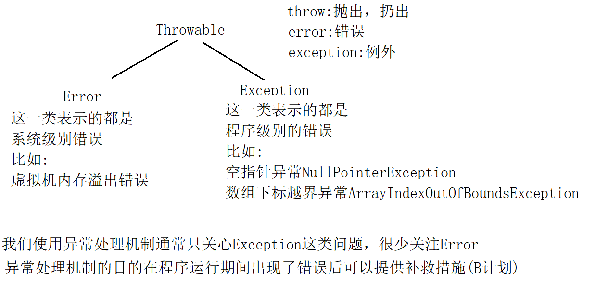
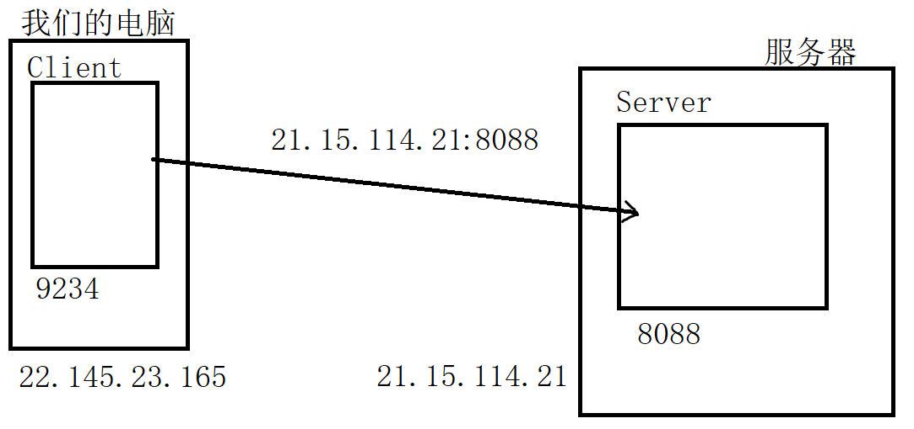
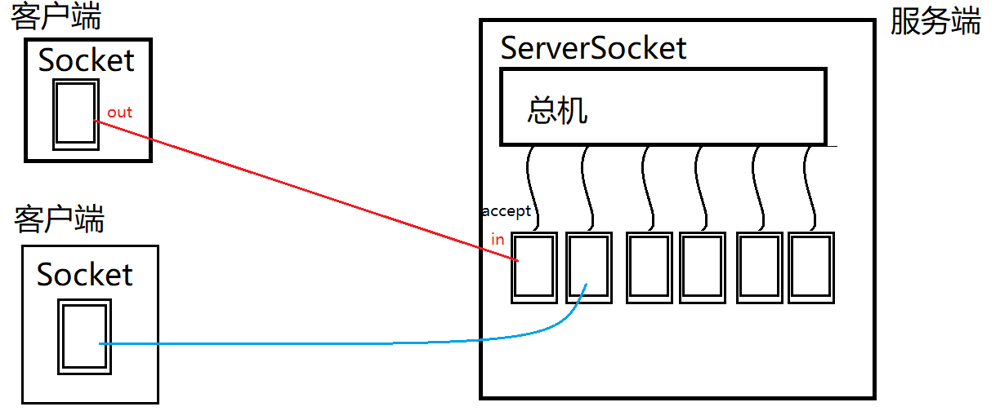

# day07

## JAVA 異常處理

###  java異常處理機制

- java中所有錯誤的超類為:Throwable。其下有兩個子類:Error和Exception
- Error的子類描述的都是系統錯誤，比如虛擬機內存溢出等。
- Exception的子類描述的都是程序錯誤，比如空指針，下表越界等。
- 通常我們程序中處理的異常都是Exception。




### try-catch


```
package exception;

/**
 * 異常處理機制中的try-catch
 * 語法:
 * try{
 *     代碼片段...
 * }catch(XXXException e){
 *     出現錯誤後的補救措施(B計劃)
 * }
 */
public class TryCatchDemo {
    public static void main(String[] args) {
        System.out.println("程序開始了...");
        /*
            try{}語句塊不能單獨寫，後面要麽跟catch語句塊要麽跟finally語句塊

            異常處理機制關注的是:明知道程序可能出現某種錯誤，但是該錯誤無法通過修改邏輯
            完全規避掉時，我們會使用異常處理機制，在出現該錯誤是提供一種補救辦法。
            凡是能通過邏輯避免的錯誤都屬於bug！就應當通過邏輯去避免!
         */
        try {
//            String str = null;
//            String str = "";
            String str = "a";
        /*
            若str=null的情況
            當JVM執行到下面代碼時:str.length()會出現空指針，此時虛擬機就會根據該情況
            實例化一個對應的異常實例出來，即:空指針異常實例 NullPointerException實例
            然後將程序從一開始執行到報錯這句話的過程設置到該異常實例中，此時該異常通過
            類型名字可以表達出現了什麽錯誤，並將來可以通過輸出錯誤信息來得知錯誤出現在那里
            虛擬機會將該異常拋出
            當某句代碼拋出了一個異常時，JVM會做如下操作:
            1:檢查報錯這句話是否有被異常處理機制控制(有沒有try-catch)
              如果有，則執行對應的catch操作，如果沒有catch可以捕獲該異常則視為沒有
              異常處理動作
            2:如果沒有異常處理，則異常會被拋出當當前代碼所在的方法之外由調用當前方法的
              代碼片段處理該異常
         */
            System.out.println(str.length());//拋出空指針異常
            System.out.println(str.charAt(0));
            System.out.println(Integer.parseInt(str));
            /*
                當try中某句代碼報錯後，就會跳出try執行下面對應的catch塊，執行後就會
                退出catch繼續向後執行。因此try語句塊中報錯代碼以下的內容都不會被執行
             */
            System.out.println("!!!!!!!!!!!!!!");
//        }catch(NullPointerException e){
//            //這里實際開發中是寫補救措施的，通常也會將異常信息輸出便於debug
//            System.out.println("出現了空指針，並解決了!");
//        }catch(StringIndexOutOfBoundsException e){
//            System.out.println("處理字符串下標越界問題!");
//        }
        /*
            當try語句塊中可能出現的幾種不同異常對應的處理辦法相同時，可以采取合並
            catch的做法，用同一個catch來捕獲這幾種可能出現的異常，而執行措施使用
            同一個。
         */
        }catch(NullPointerException|StringIndexOutOfBoundsException e){
            System.out.println("處理空指針或下標越界!");
        /*
            當catch捕獲某個超類型異常時，那麽try語句塊中出現它類型異常時都可以被這個
            catch塊捕獲並處理。

            如果多個catch捕獲的異常之間存在繼承關系時，一定是子類異常在上超類異常在下
         */
        }catch(Exception e){
            System.out.println("反正就是出了個錯!");
        }
        System.out.println("程序結束了...");
    }
}
```


### finally塊

finally塊是異常處理機制中的最後一塊

- finally可以直接跟在try語句塊之後
- finally可以跟在**最後一個**catch塊之後
- fianlly下面不能再定義catch塊

#### 特點:

只要程序執行到異常處理機制中(執行到try語句塊中)，無論try中的代碼是否出現異常，finally最終都**必定執行**

#### 作用:

通常用來執行釋放資源這一類操作。例如IO操作完畢後的流關閉。


#### 例

```java
package exception;

/**
 * finally塊
 */
public class FinallyDemo {
    public static void main(String[] args) {
        System.out.println("程序開始了");
        try {
            String str = "null";
            System.out.println(str.length());
            return;//結束方法，結束前finally還是要執行的
        } catch (Exception e) {
            System.out.println("出錯了");
        }finally {
            System.out.println("finally中的代碼執行了");
        }
        System.out.println("程序結束了");
    }
}

```

#### 在IO中的應用

```java
package exception;

import java.io.FileNotFoundException;
import java.io.FileOutputStream;
import java.io.IOException;

/**
 * 異常處理機制在IO中的應用
 */
public class FinallyDemo2 {
    public static void main(String[] args) {
        FileOutputStream fos = null;
        try {
            fos = new FileOutputStream("./fos.dat");
            fos.write(1);
        } catch (IOException e) {
            System.out.println("出錯了");
        } finally {
            try {
                if(fos!=null) {
                    fos.close();
                }
            } catch (IOException e) {
                e.printStackTrace();
            }
        }
    }
}
```


### 自動關閉特性

JDK7之後java推出了一個新特性:自動關閉特性可以更優雅的在異常處理機制中關閉IO

#### 語法

```java
try(
   聲明並初始化IO對象
){
   IO操作
}catch(IOException e){//catch各種IO異常
   ...
}
```

#### 例

```java
package exception;

import java.io.FileOutputStream;
import java.io.IOException;

/**
 * JDK7之後java推出了一個新特性:自動關閉特性
 * 可以更優雅的在異常處理機制中關閉IO
 */
public class AutoCloseableDemo {
    public static void main(String[] args) {
        //自動關閉特性是編譯器認可的，編譯後就變成FinallyDemo2的樣子
        try(
                FileOutputStream fos = new FileOutputStream("fos.dat");
        ){
            fos.write(1);
        } catch (IOException e) {
            e.printStackTrace();
        }
    }
}

```


### throw關鍵字

throw用來對外主動拋出一個異常，通常下面兩種情況我們主動對外拋出異常:

- 當程序遇到一個滿足語法，但是不滿足業務要求時，可以拋出一個異常告知調用者。
- 程序執行遇到一個異常，但是該異常不應當在當前代碼片段被解決時可以拋出給調用者。

##### 例

```java
package exception;

/**
 * 測試異常的拋出
 */
public class Person {
    private int age;

    public int getAge() {
        return age;
    }

    public void setAge(int age) throws Exception {
        if(age<0||age>100){
            //使用throw對外拋出一個異常
            throw new RuntimeException("年齡不合法!");
        }
        this.age = age;
    }
}
```

```java
package exception;

/**
 * throw關鍵字，用來對外主動拋出一個異常。
 * 通常下面兩種情況我們主動對外拋出異常:
 * 1:當程序遇到一個滿足語法，但是不滿足業務要求時，可以拋出一個異常告知調用者。
 * 2:程序執行遇到一個異常，但是該異常不應當在當前代碼片段被解決時可以拋出給調用者。
 */
public class ThrowDemo {
    public static void main(String[] args) {
        Person p = new Person();
        p.setAge(10000);//符合語法，但是不符合業務邏輯要求。
        System.out.println("此人年齡:"+p.getAge());
    }
}
```


### throws關鍵字

throws用來在聲明方法時同時聲明該方法可能拋出的異常，用於通知調用方添加處理該異常的手段。

當一個方法中使用throw拋出一個非RuntimeException的異常時，就要在該方法上使用throws聲明這個異常的拋出。此時調用該方法的代碼就必須處理這個異常，否則編譯不通過。

#### 例

```java
package exception;

/**
 * 測試異常的拋出
 */
public class Person {
    private int age;

    public int getAge() {
        return age;
    }

    /**
     * 當一個方法使用throws聲明異常拋出時,調用此方法的代碼片段就必須處理這個異常
     */
    public void setAge(int age) throws Exception {
        if(age<0||age>100){
            //使用throw對外拋出一個異常
//            throw new RuntimeException("年齡不合法!");
            //除了RuntimeException之外,拋出什麽異常就要在方法上聲明throws什麽異常
            throw new Exception("年齡不合法!");
        }
        this.age = age;
    }
}
```

當我們調用一個含有throws聲明異常拋出的方法時，編譯器要求我們必須處理這個異常，否則編譯不通過。 處理手段有兩種:

- 使用try-catch捕獲並處理這個異常
- 在當前方法(本案例就是main方法)上繼續使用throws聲明該異常的拋出給調用者解決。 具體選取那種取決於異常處理的責任問題。

```java
package exception;

/**
 * throw關鍵字，用於主動對外拋出一個異常
 */
public class ThrowDemo {
    public static void main(String[] args){
        System.out.println("程序開始了...");
        try {
            Person p = new Person();
            /*
                當我們調用一個含有throws聲明異常拋出的方法時,編譯器要求
                我們必須添加處理異常的手段,否則編譯不通過.而處理手段有兩種
                1:使用try-catch捕獲並處理異常
                2:在當前方法上繼續使用throws聲明該異常的拋出
                具體用哪種取決於異常處理的責任問題
             */
            p.setAge(100000);//典型的符合語法，但是不符合業務邏輯要求
            System.out.println("此人年齡:"+p.getAge()+"歲");
        } catch (Exception e) {
            e.printStackTrace();
        }

        System.out.println("程序結束了...");
    }
}
```

 **注意，永遠不應當在main方法上使用throws!!**


### throws的重寫規則

當一個子類重寫超類含有throws聲明異常拋出的方法時，針對throws的重寫規則

- **允許**不再拋出任何異常
- **允許**僅拋出部分異常
- **允許**拋出超類方法聲明拋出異常的子類型異常
- **不允許**拋出額外異常(超類方法沒有聲明的且不存在繼承關系的)
- **不允許**拋出超類方法拋出異常的超類型異常

#### 例

子類方法的幾種重寫分別解開注釋就可以觀察編譯器是否允許該種重寫方式

```java
package exception;

import java.awt.*;
import java.io.FileNotFoundException;
import java.io.IOException;
import java.sql.SQLException;

/**
 * 當子類重寫超類含有throws聲明異常拋出的方法時，對throws的重寫規則
 */
public class ThrowsDemo {
    public void dosome()throws IOException, AWTException {
    }
}
class SubClass extends ThrowsDemo{
//    public void dosome()throws IOException, AWTException {
//    }

    //允許不再拋出任何異常
//    public void dosome(){
//    }

    //允許僅拋出部分異常
//    public void dosome()throws IOException{
//    }

    //允許拋出超類方法聲明拋出異常的子類型異常
//    public void dosome()throws FileNotFoundException {
//    }

    //不允許拋出額外異常(超類方法沒有聲明的且不存在繼承關系的)
//    public void dosome()throws SQLException {
//    }

    //不允許拋出超類方法拋出異常的超類型異常
//    public void dosome()throws Exception {
//    }
}

```


### 異常分類

####  Java異常可以分為可檢測異常，非檢測異常：

- **可檢測異常**：可檢測異常經編譯器驗證，對於聲明拋出異常的任何方法，編譯器將強制執行處理或聲明規則，不捕捉這個異常，編譯器就通不過，不允許編譯
- **非檢測異常**：非檢測異常不遵循處理或者聲明規則。在產生此類異常時，不一定非要采取任何適當操作，編譯器不會檢查是否已經解決了這樣一個異常
- **RuntimeException** 類屬於非檢測異常，因為普通JVM操作引起的運行時異常隨時可能發生，此類異常一般是由特定操作引發。但這些操作在java應用程序中會頻繁出現。因此它們不受編譯器檢查與處理或聲明規則的限制。**實際上RuntimeException及其子類型表達的都是因為程序漏洞(BUG),即:邏輯不嚴謹等原因導致的。這類異常都是通過修覆代碼可完全避免的異常，因此不應當由異常處理機制來處理**

####  常見的RuntimeException子類

- IllegalArgumentException：拋出的異常表明向方法傳遞了一個不合法或不正確的參數
- NullPointerException：當應用程序試圖在需要對象的地方使用 null 時，拋出該異常
- ArrayIndexOutOfBoundsException：當使用的數組下標超出數組允許範圍時，拋出該異常
- ClassCastException：當試圖將對象強制轉換為不是實例的子類時，拋出該異常
- NumberFormatException：當應用程序試圖將字符串轉換成一種數值類型，但該字符串不能轉換為適當格式時，拋出該異常。

### 異常API

Exception上有一些常用的方法

- void printStackTrace():用於輸出當前異常的堆棧跟蹤信息

  便於程序員找到錯誤根源，分析錯誤原因制定B計劃

- String getMessage():用於獲取當前錯誤消息

  多用於提示給用戶或記錄日志使用

#### 例

```java
package exception;

/**
 * 異常常用方法
 */
public class ExceptionAPIDemo {
    public static void main(String[] args) {
        System.out.println("程序開始了");
        try {
            String str = "abc";
            System.out.println(Integer.parseInt(str));
        } catch (NumberFormatException e) {
            //輸出錯誤堆棧跟蹤信息便於程序員找到錯誤根源，分析錯誤原因制定B計劃
            e.printStackTrace();//輸出錯誤信息
            //錯誤消息多用於提示給用戶或記錄日志使用
            String message = e.getMessage();//獲取錯誤消息
            System.out.println(message);
        }
        System.out.println("程序結束了");
    }
}
```


### 自定義異常

自定義異常通常用來定義那些業務上的異常問題。

定義自定義異常需要注意以下問題:

- 異常的類名要做到見名知義
- 需要是Exception的子類
- 提供超類異常提供的所有種類構造器

#### 例

```java
package exception;

/**
 * 非法的年齡異常
 *
 * 自定義異常通常用來說明業務上的錯誤.
 * 自定義異常要注意以下問題:
 * 1:定義的類名要做到見名知義
 * 2:必須是Exception的子類
 * 3:提供Exception所定義的所有構造方法
 */
public class IllegalAgeException extends Exception{
    public IllegalAgeException() {
    }

    public IllegalAgeException(String message) {
        super(message);
    }

    public IllegalAgeException(String message, Throwable cause) {
        super(message, cause);
    }

    public IllegalAgeException(Throwable cause) {
        super(cause);
    }

    public IllegalAgeException(String message, Throwable cause, boolean enableSuppression, boolean writableStackTrace) {
        super(message, cause, enableSuppression, writableStackTrace);
    }
}
```

```java
package exception;

/**
 * 測試異常的拋出
 */
public class Person {
    private int age;

    public int getAge() {
        return age;
    }

    /**
     * 當一個方法使用throws聲明異常拋出時,調用此方法的代碼片段就必須處理這個異常
     */
    public void setAge(int age) throws IllegalAgeException {
        if(age<0||age>100){
            //使用throw對外拋出一個異常
//            throw new RuntimeException("年齡不合法!");
            //除了RuntimeException之外,拋出什麽異常就要在方法上聲明throws什麽異常
//            throw new Exception("年齡不合法!");

            //拋出自定義異常
            throw new IllegalAgeException("年齡超範圍:"+age);

        }
        this.age = age;
    }
}
```

```java
package exception;

/**
 * throw關鍵字，用於主動對外拋出一個異常
 */
public class ThrowDemo {
    public static void main(String[] args){
        System.out.println("程序開始了...");
        try {
            Person p = new Person();
            /*
                當我們調用一個含有throws聲明異常拋出的方法時,編譯器要求
                我們必須添加處理異常的手段,否則編譯不通過.而處理手段有兩種
                1:使用try-catch捕獲並處理異常
                2:在當前方法上繼續使用throws聲明該異常的拋出
                具體用哪種取決於異常處理的責任問題
             */
            p.setAge(100000);//典型的符合語法，但是不符合業務邏輯要求
            System.out.println("此人年齡:"+p.getAge()+"歲");
        } catch (IllegalAgeException e) {
            e.printStackTrace();
        }

        System.out.println("程序結束了...");
    }
}
```

### 總結:

##### java異常處理機制:

- 異常處理機制是用來處理那些可能存在的異常，但是無法通過修改邏輯完全規避的場景。
- 而如果通過修改邏輯可以規避的異常是bug，不應當用異常處理機制在運行期間解決！應當在編碼時及時修正

try語句塊用來包含可能出錯的代碼片段

catch用來捕獲並處理對應的異常，可以定義多個，也可以合並多個異常在一個catch中。

finally是異常的最後一塊，只要程序執行到try中則必走。一般用於釋放資源這類操作。

throw用於主動對外拋出異常。要麽是滿足語法不滿足業務主動拋出異常，要麽就是實際發生了異常但是不應當在當前代碼片段被解決是拋出。具體情況要結合實際業務分析。

throws用於在方法聲明時聲明該異常的拋出，使得調用者必須處理該異常。

## 網絡編程

### 網絡應用模型

- **C/S**：這里的C是指**Client**，即客戶端。而S是指**Server**，即服務端。網絡上的的應用本質上就是兩台計算機上的軟件進行交互。而客戶端和服務端就是對應的兩個應用程序，即客戶端應用程序和服務端應用程序

- **B/S**：這里的B是**Browser**，即瀏覽器，而S是指**Server**。瀏覽器是一個通用的客戶端，可以與不同的服務端進行交互。但是本質上B/S還是C/S結構，只不過瀏覽器是一個通用的客戶端而已。

### 可靠傳輸與不可靠傳輸

TCP協議與UDP協議都是**傳輸協議**，客戶端程序與服務端程序基於這些協議完成網絡間的數據交互。

- TCP是可靠傳輸協議，是面向連接的協議，保證數據傳輸中的可靠性和完整性。

  TCP保證可靠傳輸，但是傳輸效率低，占用帶寬高。

- UDP是不可靠傳輸協議，不保證數據傳輸的完整性。

  UDP不保證可靠傳輸，但是傳輸速度塊，占用帶寬小。


### Socket與ServerSocket

- **java.net.Socket**

  **Socket**(套接字)封裝了**TCP**協議的通訊細節，是的我們使用它可以與服務端建立網絡鏈接，並通過 它獲取兩個流(一個輸入一個輸出)，然後使用這兩個流的讀寫操作完成與服務端的數據交互


- **java.net.ServerSocket**
- ServerSocket運行在服務端，作用有兩個:
  - 向系統申請服務端口，客戶端的Socket就是通過這個端口與服務端建立連接的。
  - 監聽服務端口，一旦一個客戶端通過該端口建立連接則會自動創建一個Socket，並通過該Socket與客戶端進行數據交互。



- #####  如果我們把Socket比喻為電話，那麽ServerSocket相當於是某客服中心的總機。

  


###  與服務端建立連接案例

```java
package socket;

import java.io.IOException;
import java.net.Socket;

/**
 * 聊天室客戶端
 */
public class Client {
    /*
        java.net.Socket 套接字
        Socket封裝了TCP協議的通訊細節，我們通過它可以與遠端計算機建立鏈接，
        並通過它獲取兩個流(一個輸入，一個輸出)，然後對兩個流的數據讀寫完成
        與遠端計算機的數據交互工作。
        我們可以把Socket想象成是一個電話，電話有一個聽筒(輸入流)，一個麥克
        風(輸出流)，通過它們就可以與對方交流了。
     */
    private Socket socket;

    /**
     * 構造方法，用來初始化客戶端
     */
    public Client(){
        try {
            System.out.println("正在鏈接服務端...");
            /*
                實例化Socket時要傳入兩個參數
                參數1:服務端的地址信息
                     可以是IP地址，如果鏈接本機可以寫"localhost"
                參數2:服務端開啟的服務端口
                我們通過IP找到網絡上的服務端計算機，通過端口鏈接運行在該機器上
                的服務端應用程序。
                實例化的過程就是鏈接的過程，如果鏈接失敗會拋出異常:
                java.net.ConnectException: Connection refused: connect
             */
            socket = new Socket("localhost",8088);
            System.out.println("與服務端建立鏈接!");
        } catch (IOException e) {
            e.printStackTrace();
        }
    }

    /**
     * 客戶端開始工作的方法
     */
    public void start(){

    }

    public static void main(String[] args) {
        Client client = new Client();
        client.start();
    }
}
```

```java
package socket;

import java.io.IOException;
import java.net.ServerSocket;
import java.net.Socket;

/**
 * 聊天室服務端
 */
public class Server {
    /**
     * 運行在服務端的ServerSocket主要完成兩個工作:
     * 1:向服務端操作系統申請服務端口，客戶端就是通過這個端口與ServerSocket建立鏈接
     * 2:監聽端口，一旦一個客戶端建立鏈接，會立即返回一個Socket。通過這個Socket
     *   就可以和該客戶端交互了
     *
     * 我們可以把ServerSocket想象成某客服的"總機"。用戶打電話到總機，總機分配一個
     * 電話使得服務端與你溝通。
     */
    private ServerSocket serverSocket;

    /**
     * 服務端構造方法，用來初始化
     */
    public Server(){
        try {
            System.out.println("正在啟動服務端...");
            /*
                實例化ServerSocket時要指定服務端口，該端口不能與操作系統其他
                應用程序占用的端口相同，否則會拋出異常:
                java.net.BindException:address already in use

                端口是一個數字，取值範圍:0-65535之間。
                6000之前的的端口不要使用，密集綁定系統應用和流行應用程序。
             */
            serverSocket = new ServerSocket(8088);
            System.out.println("服務端啟動完畢!");
        } catch (IOException e) {
            e.printStackTrace();
        }
    }

    /**
     * 服務端開始工作的方法
     */
    public void start(){
        try {
            System.out.println("等待客戶端鏈接...");
            /*
                ServerSocket提供了接受客戶端鏈接的方法:
                Socket accept()
                這個方法是一個阻塞方法，調用後方法"卡住"，此時開始等待客戶端
                的鏈接，直到一個客戶端鏈接，此時該方法會立即返回一個Socket實例
                通過這個Socket就可以與客戶端進行交互了。
                
                可以理解為此操作是接電話，電話沒響時就一直等。
             */
            Socket socket = serverSocket.accept();
            System.out.println("一個客戶端鏈接了！");
        } catch (IOException e) {
            e.printStackTrace();
        }
    }

    public static void main(String[] args) {
        Server server = new Server();
        server.start();
    }
}
```
