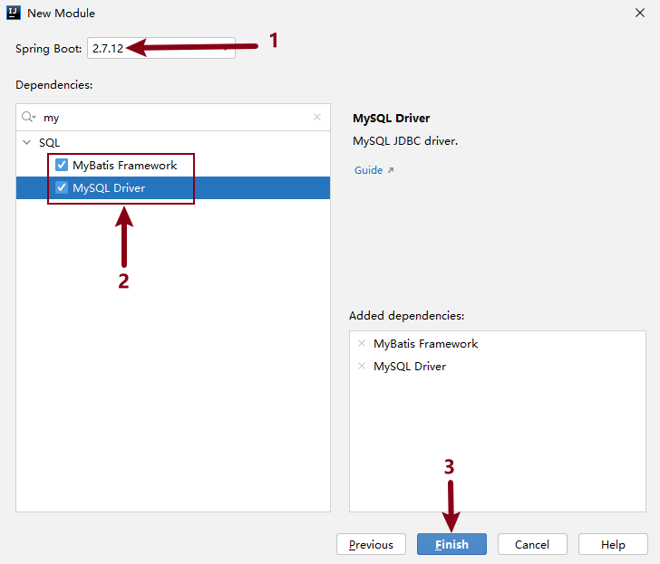
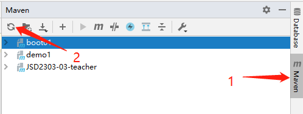
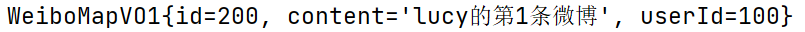
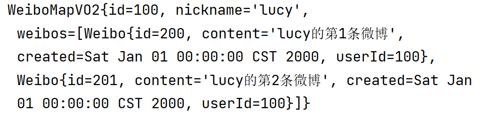

[toc]

## SSM框架

### 1 SSM框架說明


* Spring

  指 `Spring Framework`，是Spring家族的核心。

* Spring MVC

  `SpringMVC` 是 `Spring Framework` 的核心子項目，提供了一系列功能，使得開發者能夠快速開發靈活、易於維護的Web應用程序。

* MyBatis

  `MyBatis` 是基於 Java 的持久層框架，用於和數據庫映射；

  `MyBatis` 避免了幾乎所有的JDBC代碼和手動設置參數以及獲取結果集的工作；

  `MyBatis` 通過注解方式或者xml配置文件的方式來配置SQL和映射關系，靈活性非常高。


### 2 SpringBoot

#### 2.1 SpringBoot簡述

Spring Boot是一個Java軟件開發框架（腳手架）；

設計目的：簡化項目的初始搭建以及開發過程，該框架機制使開發人員不再需要大量的手動依賴管理。

#### 2.3 SpringBoot核心特性

* 起步依賴

  創建項目時，會默認添加基礎依賴，簡化我們自己查找依賴的過程。

* 嵌入式服務(Tomcat)

  SpringBoot工程支持內嵌的web服務，可以將tomcat這樣的服務直接嵌套到web依賴中。

### 3 創建SpringBoot工程

#### 3.1 創建SpringBoot工程

1. 創建工程 **_04MYBATIS**

   * 創建SpringBoot工程時需要將地址改為：https://start.spring.io  https://start.springboot.io 

   * 選擇SpringBoot來創建工程：**Spring Initalizr**

     

2. **Spring Boot版本為2.7.12**

   **勾選依賴項：MyBatis Framework 和 MySQL Driver**

   

   


#### 3.2 創建工程失敗排查

* 創建完工程後，查看Build頁卡中是否顯示了綠色的對鉤


* 如果沒有顯示綠色對鉤而是紅色報錯，解決方案如下

  * 檢查maven配置

    

  * 刷新maven

    

  * 如果刷新之後還沒有成功

    檢查Maven配置是否正確，檢查 .m2 目錄下是否包含 settings.xml 文件


## MyBatis框架-注解管理

### 1 概述

Mybatis是一個優秀的持久層框架，底層基於JDBC實現與數據庫的交互；

使用此框架程序員只需要通過注解或者修改xml配置文件的方式配置好需要執行的SQL語句，MyBatis框架會根據SQL語句生成對應的JDBC代碼並對數據庫中數據進行增刪改查操作。

Mybatis框架的簡單應用架構，如圖所示：


​		

### 2 數據初始化

#### 2.1 概述

該項目是一款社交媒體應用，用戶可以在平台上發表短文等信息，分享自己的想法、心情和生活。共設計3張表。

#### 2.2 數據初始化

* 數據表說明

  * 用戶表user：存儲微博用戶信息；

  * 微博表weibo：存儲用戶所發布的微博信息內容；

  * 評論表comment：存儲每條微博的所有評論。

* 表關系說明

  * 用戶表和微博表：一對多，一個用戶可以發布多條微博，一條微博只能歸屬於一個用戶；
  * 用戶表和評論表：一對多，一個用戶可以發布多條評論，一條評論只能歸屬於一個用戶；
  * 微博表和評論表：一對多，一條微博下可以有多條評論，一條評論只能歸於與一條微博。

* 初始化數據表

  ```mysql
  DROP DATABASE IF EXISTS blog;
  CREATE DATABASE blog CHARSET=UTF8;
  USE blog;
  CREATE TABLE user(
      id INT PRIMARY KEY AUTO_INCREMENT,
      username VARCHAR(50),
      password VARCHAR(50),
      nickname VARCHAR(50),
      created TIMESTAMP
  )CHARSET=UTF8;
  
  CREATE TABLE weibo(
      id INT PRIMARY KEY AUTO_INCREMENT,
  	content VARCHAR(255),
      created TIMESTAMP,
      user_id INT
  )CHARSET=UTF8;
  
  CREATE TABLE comment(
  	id INT PRIMARY KEY AUTO_INCREMENT,
      content VARCHAR(255),
      created TIMESTAMP,
      user_id INT,
      weibo_id INT
  )CHARSET=UTF8;
  ```

  

### 3 環境說明

* 工程名稱：_04MYBATIS
* SpringBoot版本：2.7.12
* 依賴項：MySQL Driver、MyBatis Framework

### 4 整合MyBatis初步分析

* **application.properties配置文件中添加連接數據庫信息**

  ```properties
  spring.datasource.url=jdbc:mysql://localhost:3306/blog?serverTimezone=Asia/Shanghai&characterEncoding=utf8
  spring.datasource.username=root
  spring.datasource.password=root
  ```

### 5 整合MyBatis完成用戶數據操作

#### 5.1 知識點設計

基於本業務實現MyBatis基本操作，掌握MyBatis中xml配置SQL的應用。

#### 5.2 用戶表設計

用戶表的設計如下(**假如庫中已經存在這個表了，不需要再創建了**)，例如：

```mysql
USE blog;
CREATE TABLE user(
    id INT PRIMARY KEY AUTO_INCREMENT,
    username VARCHAR(50),
    password VARCHAR(50),
    nickname VARCHAR(50),
    created TIMESTAMP
)CHARSET=UTF8;
```

#### 5.3 Pojo對象設計

在工程目錄中創建pojo包，並創建User類，和數據表中的字段一 一對應。

```java
import java.util.Date;

public class User {
    private Integer id;
    private String username;
    private String password;
    private String nickname;
    private Date created;
	
    // 生成 setter() getter() toString()
}
```

#### 5.4 Dao接口設計

基於MyBatis規範設計用戶數據訪問接口，在工程目錄下創建包mapper，並創建UserMapper**接口**

* @Mapper注解

  是由MyBatis框架提供，用於描述數據層接口，告訴系統底層為此接口創建其實現類，在實現類中定義數據訪問邏輯，執行與數據庫的會話(交互)

* @Insert注解

  使 MyBatis 框架根據接口方法的參數類型自動生成插入數據的代碼。

* 占位符 `#{}`

  `#{}` 是 MyBatis 框架中用來表示占位符的語法。

  在 `@Insert` 注解中，`#{} `所代表的是一個占位符，它可以接受 Java 對象作為輸入參數，並將其轉換為預編譯的 SQL 語句中的參數。使用 `#{} `可以幫助我們避免 SQL 注入等問題，同時也讓 SQL 寫起來更加簡單。

```java
@Mapper
public interface UserMapper {
    /**在User表中插入一條表記錄*/
    @Insert("INSERT INTO user VALUES(NULL,#{username},#{password},#{nickname},#{created})")
    int insert(User user);
}
```

#### 5.5 Dao單元測試實現

新建測試方法進行測試

```java
// 1.自動裝配
@Autowired
private UserMapper userMapper;

// 2.測試插入數據
@Test
void testInsert(){
    User user = new User();
    user.setUsername("熊二");
    user.setPassword("123456");
    user.setNickname("很可愛");
    user.setCreated(new Date());
    // 調用接口方法
    System.out.println(userMapper.insert(user));
}
```


### 6 整合MyBatis完成標簽業務操作

#### 6.1 業務描述

基於SpringBoot腳手架工程對MyBatis框架的整合，實現對微博內容weibo表進行操作。

#### 6.2 知識點設計

本業務中重點講解@Select,@Insert,@Update,@Delete注解應用。

#### 6.3 weibo表設計

標簽表設計如下(**這個表已經存在則無需創建**)

```mysql
CREATE TABLE weibo(
    id INT PRIMARY KEY AUTO_INCREMENT,
	content VARCHAR(255),
    created TIMESTAMP,
    user_id INT
)CHARSET=UTF8;
```

#### 6.4 Pojo對象設計

在pojo下創建**Weibo**類，用於和數據庫中weibo做映射

```java
import java.util.Date;

public class Weibo {
    private Integer id;
    private String content;
    private Date Created;
    private Integer UserId;

    // setter() getter() toString()
}
```

#### 6.5 Dao接口設計

在mapper先新建WeiboMapper**接口**

```java
@Mapper
public interface WeiboMapper {
    /**在微博表中插入數據*/
    @Insert("INSERT INTO weibo VALUES(NULL,#{content},#{created},#{userId})")
    int insert(Weibo weibo);

    /**根據微博id查詢數據*/
    @Select("SELECT * FROM weibo WHERE id=#{id}")
    Weibo selectByWeiboId(int id);
    
    /**查詢所有微博信息*/
    @Select("SELECT * FROM weibo")
    List<Weibo> selectWeibo();

    /**更新微博表數據*/
    @Update("UPDATE weibo SET content=#{content},created=#{created},user_id=#{userId} WHERE id=#{id}")
    int updateById(Weibo weibo);

    /**刪除微博表數據*/
    @Delete("DELETE FROM weibo WHERE id=#{id}")
    int deleteById(int id);
}
```

#### 6.6 Dao單元測試實現

在測試類中新建測試方法進行測試

```java
/**自動裝配*/
@Autowired
private WeiboMapper weiboMapper;

/**在微博表中插入數據-測試方法*/
@Test
void InsertWeibo(){
    Weibo weibo = new Weibo();
    weibo.setContent("今天天氣真不錯呀");
    weibo.setCreated(new Date());
    weibo.setUserId(1);
    weiboMapper.insert(weibo);
}

/**根據微博id查詢數據*/
@Test
void selectByWeiboIdTest(){
    System.out.println(weiboMapper.selectByWeiboId(2));
}

/**查詢所有微博信息*/
@Test
void selectWeiboTest(){
    System.out.println(weiboMapper.selectWeibo());
}

/**更新微博表數據-測試*/
@Test
void updateById(){
    Weibo weibo = new Weibo();
    weibo.setId(1);
    weibo.setContent("這是我修改後的微博");
    weibo.setCreated(new Date());
    weibo.setUserId(1);

    System.out.println(weiboMapper.updateById(weibo));
}

/**刪除微博表數據-測試*/
@Test
void deleteByIdTest(){
    System.out.println(weiboMapper.deleteById(1));
}
```

注：insert、update、delete返回值為受影響的數據條數int。

### 7 整合MyBatis完成評論業務操作

#### 7.1 評論表設計

評論表的設計如下(**假如表已經存在則無需創建**)

```mysql
CREATE TABLE comment(
	id INT PRIMARY KEY AUTO_INCREMENT,
    content VARCHAR(255),
    created TIMESTAMP,
    user_id INT,
    weibo_id INT
);
```

#### 7.2 Pojo對象設計

**在pojo下新建Comment類，實現和評論表的映射關系**

```java
public class Comment {
    private Integer id;
    private String content;
    private Date created;
    private Integer userId;
    private Integer weiboId;

    // setter() getter() toString()
}
```

#### 7.3 練習

1. mapper目錄下創建CommentMapper接口，並添加對應注解

2. 定義方法 `insertComment`，實現在評論表中插入一條數據，並編寫測試方法測試（數據庫表中確認）

3. 定義方法 `updateComment`，實現修改某一條評論的內容，並編寫測試方法測試（數據庫表中確認）


## MyBatis框架-xml管理（重點）

### 1 xml與注解比較

#### 1.1 xml定義

XML是一種可擴展性語言，用戶可以自己定義標簽，用來描述特定類型的數據；

XML的語法嚴格，每個標簽都必須有一個結束標簽，標簽的嵌套關系也必須合法；

#### 1.2 和SQL注解比較


  * xml配置SQL，可以將SQL語句和JAVA代碼分離開

  * xml配置SQL，支持動態SQL語句

  * xml配置SQL，支持SQL語句的覆用

### 2 環境初始化

依然使用 **_04MYBATIS工程**

* SpringBoot版本：2.7.12

* 依賴項

  * MyBatis Framework

  * MySQL Driver
* 注釋掉 **UserMapper、WeiboMapper、CommentMapper中的所有 @Insert() @Update() @Select() @Delete 注解**

### 3 使用流程

1. 在resources目錄下創建 mappers目錄，用來存放xml配置文件

2. 在文檔服務器中下載映射文件模板

   http://doc.canglaoshi.org/

   配置文件下載 - MyBatis Mapper映射文件，下載後解壓得到：**someMapper.xml**

   <font color=red>**並將該文件拷貝到resources/mappers目錄下**</font>

   

3. application.properties中添加配置：mybatis框架映射配置文件的位置

   ```properties
   # 設置MyBatis框架的映射（Mapper）配置文件的位置
   mybatis.mapper-locations=classpath:mappers/*.xml
   ```

### 4 xml配置SQL標簽

* 說明

  在 Mybatis 的 XML 文件中，SQL 語句都是使用 SQL 標簽來定義的。

* 常用的SQL標簽

  * select

    用於查詢操作，包括多表查詢、條件查詢等。可以使用 resultType 來指定返回結果的類型。

  * insert

    用於插入操作，並將其自動注入實體類中。

  * update

    用於更新操作，包括更新一條記錄或者批量更新。

  * delete

    用於刪除操作，包括刪除一條記錄或者批量刪除。

  * if、foreach、set

    用於條件控制，可以根據不同的條件進行查詢、插入、更新和刪除操作。if 標簽用於指定可以為空的查詢條件，foreach 標簽用於循環查詢，set 標簽用於指定更新操作的字段值。

  * sql：用於定義可重用的 SQL 片段，通常是一些較為覆雜的 SQL 片段。可以在其它 SQL 語句中使用 include 標簽來引用 SQL 片段。

  * include：用於引入外部的 SQL 片段。可以在 include 標簽的 refid 屬性中指定外部 SQL 片段的名字，然後在當前 SQL 中使用它。

  

  		這些 SQL 標簽可以隨意組合，可以使 SQL 語句變得很靈活和強大。通常需要根據實際業務場景選擇合適的標簽來實現相應的 SQL 操作。

### 5 整合MyBatis完成用戶數據操作

#### 5.1 知識點設計

基於本業務實現MyBatis基本操作，掌握MyBatis中xml配置SQL的應用。

**將SomeMapper.xml重命名為UserMapper.xml**

#### 5.2 Dao接口設計

**UserMapper.java**

```java
@Mapper
public interface UserMapper {
    /**在User表中插入一條表記錄*/
    int insert(User user);
}
```

#### 5.3 定義映射文件

**UserMapper.xml**

```xml
<?xml version="1.0" encoding="UTF-8" ?>
<!DOCTYPE mapper
  PUBLIC "-//mybatis.org//DTD Mapper 3.0//EN"
  "http://mybatis.org/dtd/mybatis-3-mapper.dtd">

<!-- 1.填寫namespace，填寫UserMapper的絕對路徑 -->
<mapper namespace="cn.tedu._04mybatis.mapper.UserMapper">
    <!-- id的屬性值要和UserMapper中定義的方法名一致 -->
    <insert id="insert">
        INSERT INTO user VALUES (NULL,#{username},#{password},#{nickname},#{created})
    </insert>
</mapper>
```

#### 5.4 Dao接口單元測試

```java
// 自動裝配
@Autowired
private UserMapper userMapper;

// 測試插入數據
@Test
void testInsert(){
    User user = new User();
    user.setUsername("熊三");
    user.setPassword("123456");
    user.setNickname("只手遮天");
    user.setCreated(new Date());
    // 調用接口方法
    System.out.println(userMapper.insert(user));
}
```

### 6 整合MyBatis完成標簽業務操作

#### 6.1 業務描述

基於SpringBoot腳手架工程對MyBatis框架的整合，實現對微博內容weibo表進行操作。

#### 6.2 Dao接口設計

**WeiboMapper.java**

```java
package cn.tedu._04mybatis.mapper;

import cn.tedu._04mybatis.pojo.Weibo;
import org.apache.ibatis.annotations.*;

import java.util.List;

@Mapper
public interface WeiboMapper {
    /**在微博表中插入數據*/
    int insert(Weibo weibo);

    /**根據微博id查詢數據*/
    Weibo selectByWeiboId(int id);
    
    /**查詢所有微博信息*/
    List<Weibo> selectWeibo();

    /**更新微博表數據*/
    int updateById(Weibo weibo);

    /**刪除微博表數據*/
    int deleteById(int id);
}
```

#### 6.3 定義映射文件WeiboMapper.xml

```xml
<?xml version="1.0" encoding="UTF-8" ?>
<!DOCTYPE mapper
        PUBLIC "-//mybatis.org//DTD Mapper 3.0//EN"
        "http://mybatis.org/dtd/mybatis-3-mapper.dtd">

<!-- 1.填寫namespace，填寫WeiboMapper的絕對路徑 -->
<mapper namespace="cn.tedu._04mybatis.mapper.WeiboMapper">

    <!--在微博表中插入數據-->
    <insert id="insert">
        INSERT INTO weibo
        VALUES (NULL, #{content}, #{created}, #{userId})
    </insert>

    <!--根據微博id查詢數據-->
    <select id="selectByWeiboId" resultType="cn.tedu._04mybatis.pojo.Weibo">
        SELECT *
        FROM weibo
        WHERE id = #{id}
    </select>
    
    <!--查詢所有微博信息-->
    <select id="selectWeibo" resultType="cn.tedu._04mybatis.pojo.Weibo">
        SELECT *
        FROM weibo
    </select>

    <!--更新微博表數據-->
    <update id="updateById">
        UPDATE weibo
        SET content=#{content},
            created=#{created},
            user_id=#{userId}
        WHERE id = #{id}
    </update>

    <!--刪除微博表數據-->
    <delete id="deleteById">
        DELETE
        FROM weibo
        WHERE id = 2
    </delete>

</mapper>
```

#### 6.4 Dao接口單元測試

```java
/**自動裝配*/
@Autowired
private WeiboMapper weiboMapper;

/**在微博表中插入數據-測試方法*/
@Test
void InsertWeibo(){
    Weibo weibo = new Weibo();
    weibo.setContent("今天天氣真不錯呀");
    weibo.setCreated(new Date());
    weibo.setUserId(1);
    weiboMapper.insert(weibo);
}

/**查詢所有微博信息-測試方法*/
@Test
void selectWeiboTest(){
    System.out.println(weiboMapper.selectWeibo());
}

/**根據微博id查詢數據*/
@Test
void selectByWeiboIdTest(){
    System.out.println(weiboMapper.selectByWeiboId(2));
}

/**更新微博表數據-測試*/
@Test
void updateById(){
    Weibo weibo = new Weibo();
    weibo.setId(2);
    weibo.setContent("人生得意須盡歡");
    weibo.setCreated(new Date());
    weibo.setUserId(2);

    System.out.println(weiboMapper.updateById(weibo));
}

/**刪除微博表數據-測試*/
@Test
void deleteByIdTest(){
    System.out.println(weiboMapper.deleteById(2));
}
```

### 7 整合MyBatis完成標簽業務操作

#### 7.1 練習

1. mapper目錄下創建CommentMapper接口，並添加對應注解
2. 實現使用xml配置SQL方式，在評論表中插入一條數據，並編寫測試方法測試
3. 實現使用xml配置SQL方式，修改某一條評論的內容，並編寫測試方法測試

### 8 動態SQL語句

* 什麽是動態SQL

  動態SQL是指在程序運行時動態生成SQL語句的技術。它允許開發人員在程序運行時根據不同的條件拼接SQL語句，從而靈活地構建各種查詢。


		<font color=red>DELETE FROM comment WHERE id in(2,3,5)  此處id的值不確定，數量也不確定！</font>

#### 8.1 動態刪除數據

演示 `<foreache>` 標簽的使用

##### 8.1.1 Dao接口設計

**文件：CommentMapper**

```java
/**1.第一種批量刪除: 傳遞Integer的數組*/
int deleteByIds1(Integer[] ids);
/**2.第二種批量刪除：傳遞集合參數*/
int deleteByIds3(List<Integer> ids);
```

##### 8.1.2 定義映射文件UserMapper.xml

```xml
<!-- 批量刪除-數組格式：
     collection用來設置遍歷對象的類型，
     item設置遍歷出每一個變量的名稱
     separator設置分隔符
     注意：注釋一定要放在delete標簽的外面，不能放在里面，放在里面會被當做sql語句執行！
-->
<delete id="deleteByIds1">
    DELETE FROM comment WHERE id IN(
    <foreach collection="array" item="id" separator=",">
        #{id}
    </foreach>
    )
</delete>

<!-- 集合傳參，需要把collection改為 list -->
<delete id="deleteByIds2">
    DELETE FROM comment WHERE id IN(
    <foreach collection="list" item="id" separator=",">
        #{id}
    </foreach>
    )
</delete>
```

##### 8.1.3 Dao接口單元測試

```java
/**1.第一種批量刪除: 傳遞Integer的數組-測試*/
@Test
void delete1(){
    // 測試數組方式刪除
    Integer[] ids = {2, 8};
    commentMapper.deleteByIds1(ids);
}

/**2.第二種批量刪除：傳遞集合參數-測試*/
@Test
void delete3(){
    // 測試集合方式刪除
    ArrayList<Integer> ids = new ArrayList<>();
    ids.add(18);
    ids.add(20);
    ids.add(22);
    commentMapper.deleteByIds2(ids);
}
```

#### 8.2 動態修改數據

* 說明

  如果表中字段很多，但是只改部分字段數據，比如只修改部分字段的值，不修改其他字段的值，如果使用對象作為參數則會將其他字段的值也修改為null，如果使用傳參方式解決，參數過多也會很麻煩，所以可以使用動態修改。

* 實現

  使用xml中的 `<set></set>`  和 `<if></if>` 標簽組合

  語法示例：

  ```xml
  UPDATE product SET title=#{title},price=#{price},num=#{num}
  <update id="dynamicUpdate">
      UPDATE product
      <set>
          <if test="title!=null">title=#{title},</if>
          <if test="price!=null">price=#{price},</if>
          <if test="num!=null">num=#{num}</if>
      </set>
      WHERE id=#{id};
  </update>
  ```


##### 8.1.1 Dao接口設計

**文件：CommentMapper**

```java
/**動態修改數據*/
int dynamicUpdate(Comment comment);
```

##### 8.1.2 定義映射文件UserMapper.xml

```xml
<!-- 動態修改-->
<update id="dynamicUpdate">
    UPDATE comment
    <set>
        <if test="content!=null">content=#{content},</if>
        <if test="created!=null">created=#{created},</if>
        <if test="userId!=null">user_id=#{userId},</if>
        <if test="weiboId!=null">weibo_id=#{weiboId}</if>
    </set>
    WHERE id=#{id};
</update>
```

##### 8.1.3 Dao接口單元測試

```java
/**動態修改數據-測試*/
@Test
void dynamicUpdateTest(){
    Comment comment = new Comment();
    comment.setId(27);
    comment.setContent("莫使金樽空對月");
    comment.setUserId(666);
    commentMapper.dynamicUpdate(comment);
}
```


### 9 SQL語句重用

#### 9.1 說明

SQL語句重用是指在數據庫應用程序中，多次執行相同或類似的SQL語句時，通過重用這些語句來提高性能，減少系統消耗的資源。

#### 9.2 實現

使用 `<sql></sql>`  和 `<include></include>` 標簽組合實現

`<sql><sql>` 標簽中存放重覆的SQL語句，使用 `<include></include>` 標簽獲取重覆的SQL

#### 9.3 示例

在三種動態刪除的SQL語句中，都有重覆的SQL語句：`DELETE FROM comment WHERE id IN`，可以將重覆的語句抽取出來，來簡化SQL。

1. mappers.CommentMapper.xml 將刪除語句重覆的SQL抽取出來

   ```xml
   <!-- 1.重覆SQL抽取-sql標簽 -->
   <sql id="deleteSql">
       DELETE FROM comment WHERE id in
   </sql>
   
   
   <delete id="deleteByIds1">
       <!--2.通過include標簽覆用-include標簽-->
       <include refid="deleteSql"></include>(
       <foreach collection="array" item="id" separator=",">
           #{id}
       </foreach>
       )
   </delete>
   
   <delete id="deleteByIds2">
       <!--2.通過include標簽覆用-include標簽-->
       <include refid="deleteSql"></include>(
       <foreach collection="list" item="id" separator=",">
           #{id}
       </foreach>
       )
   </delete>
   ```

2. 執行對應的測試用例測試

### 10 多表聯查

#### 10.1 首頁微博列表展示

* 展示內容

  ```text
  用戶昵稱: 微博內容
  花千骨說：今天天氣不錯挺風和日麗的
  ```

* 查詢內容

  微博id、微博內容、用戶昵稱

* 實現

  1. mapper.WeiboMapper

     ```java
     // 首頁微博列表數據
     List<WeiboIndexVO> selectIndex();
     ```

  2. mappers.WeiboMapper.xml

     ```xml
     <select id="selectIndex" resultType="cn.tedu.weibo.pojo.vo.WeiboIndexVO">
         SELECT w.id, w.content, u.nickname 
         FROM weibo w JOIN user u ON w.user_id=u.id;
     </select>
     ```

  3. pojo.vo.WeiboIndexVO

     ```java
     public class WeiboIndexVO {
         // 顯示微博的id content , 再顯示一個nickname
         private Integer id;
         private String content;
         private String nickname;
     }
     ```

  4. 測試方法

     ```java
     @Test
     void weiboIndexTest(){
         System.out.println(weiboMapper.selectIndex());
     }
     ```

#### 10.2 微博詳情頁展示

* 展示內容

  ```java
  //用戶昵稱: 微博內容
    花千骨說：今天天氣不錯挺風和日麗的
  //發布時間
    發布於：1987年10月16日 10點10分10秒
  ```

* 查詢內容

  微博id、微博內容、微博發布時間、用戶昵稱

* 實現

  1. mapper.WeiboMapper

     ```java
     // 微博詳情頁數據
     WeiboDetailVO selectById(int id);
     ```

  2. mappers.WeiboMapper.xml

     ```xml
     <select id="selectById" resultType="cn.tedu.weibo.pojo.vo.WeiboDetailVO">
         SELECT w.id, w.content, w.created, u.nickname
         FROM weibo w JOIN user u ON w.user_id=u.id
         WHERE w.id=#{id}
     </select>
     ```

  3. pojo.vo.WeiboDetailVO

     ```java
     public class WeiboDetailVO {
         // 原則：用啥查啥
         private Integer id;
         private String content;
         private Date created;
         private String nickname;
     }
     ```

  4. 測試方法

     ```java
     @Test
     void weiboIndexTest(){
         System.out.println(weiboMapper.selectById(1));
     }
     ```

#### 10.3 微博詳情頁中評論展示

* 展示內容

  ```java
  //用戶昵稱:     評論內容              評論時間
    花千骨評論道：你是認真的嗎      發布於：1987/10/16 00:00:00
  ```

* 查詢內容

  評論id、評論內容、評論發布時間、用戶昵稱

* 實現

  1. mapper.WeiboMapper

     ```java
     // 微博詳情頁評論數據
     List<CommentVO> selectByWeiboId(int id);
     ```

  2. mappers.WeiboMapper.xml

     ```xml
     <select id="selectByWeiboId" resultType="cn.tedu.weibo.pojo.vo.CommentVO">
         SELECT c.id,c.content,c.created,u.nickname
         FROM comment c JOIN user u ON c.user_id=u.id
         WHERE weibo_id=#{id}
     </select>
     ```

  3. pojo.vo.CommentVO

     ```java
     public class CommentVO {
         private Integer id;
         private String content;
         private Date created;
         private String nickname;
     }
     ```

  4. 測試方法

     ```java
     @Test
     void weiboIndexTest(){
         System.out.println(weiboMapper.selectByWeiboId(1));
     }
     ```


### 11 ResultMap

resultMap屬性是用來定義查詢結果和Java對象屬性之間的映射關系；

通過resultMap屬性可以**自定義**查詢結果與Java對象屬性的映射關系。

#### 11.1 常用標簽及屬性說明

* `<resultMap>標簽`
  * `id` 屬性：唯一標識
  * `type` 屬性：指定映射的JAVA類型
* `<id>標簽` ：指定映射的主鍵字段，包含 `column屬性` 和 `property屬性`
  * `column屬性` ：查詢語句中的列名（或別名）
  * `property屬性` ：JAVA對象中的屬性名
* `<result>標簽` ：指定映射的非主鍵字段，包含 `column屬性` 和 `property屬性`
  * `column屬性` ：查詢語句中的列名（或別名）
  * `property屬性` ：JAVA對象中的屬性名
* `<collection>標簽` ：映射一對多或多對多關系
  * `property屬性` ：JAVA對象中的屬性名
  * `ofType屬性` ：集合中元素的類型

#### 11.2 單表

根據微博的id查詢該條微博的信息，只顯示：微博編號id、內容content、用戶編號user_id

第1步：定義接口方法

第2步：創建VO類 **WeiboMapVO1**

第3步：配置xml 


```xml
<!--
    resultMap示例
    1.id屬性：唯一標識
    2.type屬性：指定映射的JAVA類型
    3.<id>標簽：映射主鍵字段
    4.<result>標簽：映射非主鍵字段
    5.column屬性：查詢語句中的列名(別名)
    6.property屬性：java中的屬性名
-->
<resultMap id="aaa" type="cn.tedu._04mybatis.pojo.WeiboMapVO1">
    <id column="id" property="id"/>
    <result column="content" property="content"/>
    <result column="user_id" property="userId"/>
</resultMap>

<select id="selectMapById" resultMap="aaa">
    SELECT id,
    content,
    user_id
    FROM weibo
    WHERE id = #{wid}
</select>
```

第4步：測試及結果

```java
/**resultMap屬性:單表查詢測試*/
@Test
void selectMapByIdTest(){
    System.out.println(weiboMapper.selectMapById(200));
}
```




#### 11.3 多表

**一對多查詢**

查詢指定的用戶發布的所有的 **微博信息** ，要求將 **微博信息** 放到一個集合中

要求顯示：用戶的id、用戶昵稱、`List<Weibo>集合`

第1步：定義接口方法 **selectMapByUserId**

第2步：創建VO類 **WeiboMapVO2**

```java
public class WeiboMapVO2 {
    private Integer id;
    private String nickname;
    // 指定用戶發的所有微博信息
    private List<Weibo> weibos;
    // 省略setter() getter() toString()方法
}
```

第3步：配置XML

```xml
<!--
    查詢指定的用戶發布的所有的 **微博信息** ，要求將 **微博信息** 放到一個集合中
    要求顯示：用戶的id、用戶昵稱、`List<Weibo>集合`
    resultMap示例
    1.id屬性：唯一標識
    2.type屬性：指定映射的JAVA類型
    3.<id>標簽：映射主鍵字段
    4.<result>標簽：映射非主鍵字段
    5.column屬性：查詢語句中的列名(別名)
    6.property屬性：java中的屬性名
    7.<collection>標簽：映射一對多或多對多關系
    8.ofType屬性：集合中元素的類型
-->
<resultMap id="ccc" type="cn.tedu._04mybatis.pojo.WeiboMapVO2">
    <id column="id" property="id"/>
    <result column="nickname" property="nickname"/>
    <collection property="weibos" ofType="cn.tedu._04mybatis.pojo.Weibo">
        <id column="wid" property="id"/>
        <result column="content" property="content"/>
        <result column="created" property="created"/>
        <result column="user_id" property="userId"/>
    </collection>
</resultMap>

<select id="selectMapByUserId" resultMap="ccc">
    SELECT u.id,
    u.nickname,
    w.id wid,
    w.content,
    w.created,
    w.user_id
    FROM user u
    JOIN weibo w ON w.user_id = u.id
    WHERE u.id = #{uid}
</select>
```

第4步：測試及結果

```java
@Test
void selectMapByUserIdTest(){
    System.out.println(weiboMapper.selectMapByUserId(100));
}
```




#### 11.4 何時使用 ResultMap

在實際應用中，使用 `ResultMap` 主要針對覆雜的查詢場景，

例如：多表關聯查詢、一對多、多對多查詢等；

此時，使用 `ResultMap` 可以將查詢結果中的數據轉化為對象，方便後續的業務處理。


## 練習

### 1 訂單管理系統練習

#### 1.1 工程準備

* 在mybatisdb庫中創建訂單表orders

  包括訂單編號id，訂單狀態status，訂單總金額amount，訂單創建created時間四個字段

  ```mysql
  CREATE DATABASE IF NOT EXISTS mybatisdb DEFAULT CHARSET=UTF8;
  USE mybatisdb;
  CREATE TABLE orders(
  	id INT PRIMARY KEY AUTO_INCREMENT,
      state VARCHAR(20),
  	amount DOUBLE(10,2),
      created TIMESTAMP
  )CHARSET=UTF8;
  ```

* 創建工程 **egmybatis2**，2個鉤，SpringBoot版本為2.7.12

* application.properties配置文件中添加連接數據庫的配置

* application.properties配置文件中添加xml文件的路徑

#### 1.2 要求

- 添加一個訂單：**insert**

- 查詢所有訂單：**selectAll**

- 通過id查詢1個訂單：**selectOne**

- 通過一個id刪除訂單：**deleteById**

- 通過多個id批量刪除訂單：**deleteMany**  （**數組|集合**）

- 動態修改訂單：**dynamicUpdate**

- 統計訂單總數：**selectCount**   `<select id="名字" resultType="int">`

  **SELECT COUNT(id) FROM orders**

#### 1.3 實現

##### 1.3.1 準備工作

1. 工程目錄下創建pojo包並在其中創建類Orders

   ```java
   public class Orders {
       private Integer id;
       private String state;
       private Double amount;
       private Date created;
       
       // Getter()  Setter()  toString()
   }
   ```

2. 創建mapper.OrdersMapper

   ```java
   @mapper
   public interface OrdersMapper {
   }
   ```

3. 創建目錄mappers,拷貝xml配置文件

   ```xml
   <mapper namespace="">
   </mapper>
   ```

##### 1.3.2 操作實現

- **添加一個訂單：insert**

  1. mapper.OrderMapper

     ```java
     int insert(Orders orders);
     ```

  2. mappers.OrderMapper.xml

     ```xml
     <mapper namespace="cn.tedu.mybatisexercise2.mapper.OrdersMapper">
         <insert id="insert">
             INSERT INTO orders VALUES (NULL,#{state},#{amount},#{created})
         </insert>
     </mapper>
     ```

  3. ApplicationTests

     ```java
     @Autowired(required = false)
     OrdersMapper mapper;
     
     @Test
     void insert() {
         Orders o = new Orders();
         o.setState("已完成");
         o.setAmount(8000.0);
         o.setCreated(new Date());
         System.out.println(mapper.insert(o));
     }
     ```

- **查詢所有訂單：selectAll**

  1. mapper.OrderMapper

     ```java
     List<Orders> selectAll();
     ```

  2. mappers.OrderMapper.xml

     ```xml
     <select id="selectAll" resultType="cn.tedu.mybatisexercise2.pojo.Orders">
         SELECT * FROM orders
     </select>
     ```

  3. ApplicationTests

     ```java
     @Test
     void selectAll(){
         System.out.println(mapper.selectAll());
     }
     ```

- **通過id查詢1個訂單：selectOne**

  1. mapper.OrderMapper

     ```java
     Orders selectById(int id);
     ```

  2. mappers.OrderMapper.xml

     ```xml
     <select id="selectById" resultType="cn.tedu.mybatisexercise2.pojo.Orders">
         SELECT * FROM orders WHERE id=#{id}
     </select>
     ```

  3. ApplicationTests

     ```java
     @Test
     void selectById(){
         System.out.println(mapper.selectById(1));
     }
     ```

- **動態修改訂單-只修改訂單狀態：dynamicUpdate**

  1. mapper.OrderMapper

     ```java
     int dynamicUpdate(Orders orders);
     ```

  2. mappers.OrderMapper.xml

     ```xml
     <update id="dynamicUpdate">
         UPDATE orders
         <set>
             <if test="state!=null">state=#{state},</if>
             <if test="amount!=null">amount=#{amount},</if>
             <if test="created!=null">created=#{created}</if>
         </set>
         WHERE id=#{id}
     </update>
     ```

  3. ApplicationTests

     ```java
     @Test
     void dynamicUpdate(){
         Orders o = new Orders();
         o.setId(1);
         o.setState("已完成");
         System.out.println(mapper.dynamicUpdate(o));
     }
     ```

- **通過一個id刪除訂單：deleteById**

  1. mapper.OrderMapper

     ```java
     int deleteById(int id);
     ```

  2. mappers.OrderMapper.xml

     ```xml
     <delete id="deleteById">
         DELETE FROM orders WHERE id=#{id}
     </delete>
     ```

  3. ApplicationTests

     ```java
     @Test
     void deleteById(){
         System.out.println(mapper.deleteById(1));
     }
     ```

- **通過多個id批量刪除訂單：deleteMany**

  1. mapper.OrderMapper

     ```java
     int deleteMany1(Integer[] ids);
     
     int deleteMany2(List<Integer> ids);
     ```

  2. mappers.OrderMapper.xml

     ```xml
     <delete id="deleteMany1">
         DELETE FROM orders WHERE id in(
         <foreach collection="array" item="id" separator=",">
             #{id}
         </foreach>
         )
     </delete>
     
     <delete id="deleteMany2">
         DELETE FROM orders WHERE id in(
         <foreach collection="list" item="id" separator=",">
             #{id}
         </foreach>
         )
     </delete>
     ```

  3. ApplicationTests

     ```java
     @Test
     void deleteMany1(){
         Integer[] ids = {1,3,5};
         System.out.println(mapper.deleteMany1(ids));
     }
     
     @Test
     void deleteMany2(){
         ArrayList<Integer> ids = new ArrayList<>();
         ids.add(10);
         ids.add(11);
         ids.add(13);
         System.out.println(mapper.deleteMany3(ids));
     }
     
     ```

- **統計訂單總數：selectCount**

  1. mapper.OrderMapper

     ```java
     int selectCount();
     ```

  2. mappers.OrderMapper.xml

     ```xml
     <select id="selectCount" resultType="int">
         SELECT COUNT(*) FROM orders
     </select>
     ```

  3. ApplicationTests

     ```java
     @Test
     void selectCount(){
         System.out.println(mapper.selectCount());
     }
     ```

- **SQL重用優化**

  ```xml
  <sql id="selectSql">
      SELECT * FROM orders
  </sql>
  
  <select id="selectAll" resultType="cn.tedu.boot051.entity.Orders">
      <include refid="selectSql"></include>
  </select>
  
  <select id="selectById" resultType="cn.tedu.boot051.entity.Orders">
      <include refid="selectSql"></include> WHERE id=#{id}
  </select>
  ```


