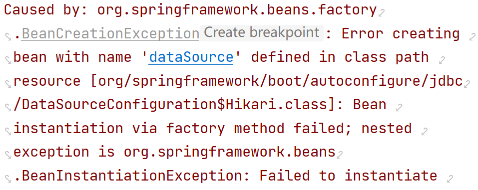
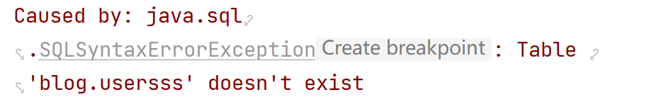
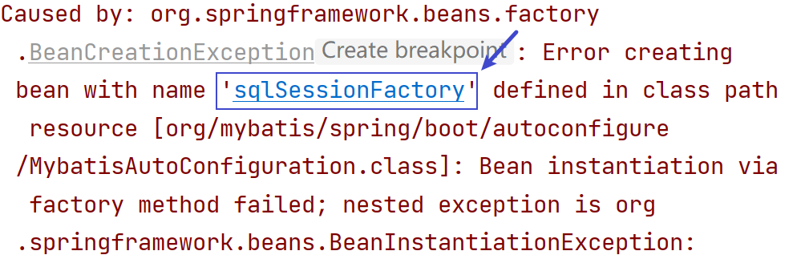
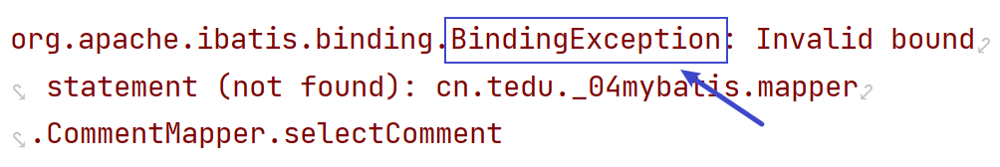
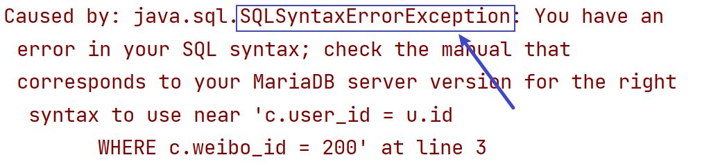

### 1 MyBatis介紹

MyBatis是一個數據持久層框架，目的是為了數據庫的操作更加簡便、靈活；

將JAVA對象和數據庫的操作語句分離，通過注解或者XML映射文件的方式將Java對象和數據表映射；

可以自動將SQL語句轉為JDBC代碼，並根據指定的返回值類型生成對應的結果，提供給開發者使用。


### 2 MyBatis使用流程

1. 配置MyBatis環境

   在 `pom.xml` 中添加 MyBatis 和 MySQL 的依賴

2. 在配置文件中配置數據庫連接

   數據庫連接的URL地址、用戶名、密碼

3. 在配置文件中配置xml文件映射的位置

4. 編寫數據層接口，添加 `@Mapper` 注解，並定義接口方法

5. 在XML文件中配置SQL語句

6. 在應用程序中進行依賴注入，並調用接口方法使用
   

### 3 管理MyBatis方式

#### 3.1 注解方式

##### 1）說明

基於注解方式可以使代碼更簡潔，省去了XML配置文件的編寫工作，適合一些簡單的CRUD操作。

##### 2）常用注解

* @Insert("SQL語句")
* @Delete("SQL語句")
* @Update("SQL語句")
* @Select("SQL語句")

#### 3.2 XML方式

##### 1）優點

* SQL和JAVA代碼分離
* 更好的覆用性（`sql標簽和include標簽`）
* 更好的支持動態SQL

##### 2）常用標簽

* 增刪改

  * 增：`<insert id="">標簽`
  * 刪：`<delete id="">標簽`
  * 改：`<update id="">標簽`

  <font color=red>返回值為整數類型，受影響的數據條數。</font>

* 查詢：

  * `<select id="" resultType="類名完整路徑">`

    * resultType屬性值：實體類

    * resultType屬性值：VO類

  * `<select id="" resultMap="resultMap標簽的id屬性值"`>

* 動態刪除：

  ```xml
  <!-- <foreach>標簽
        collection屬性：需要遍歷的對象類型,數組為array，集合為list
        item屬性：遍歷出每個元素的變量名稱
        separator屬性：不同元素間的分隔符(一切以SQL語法為準)
  -->
  <foreach collection="對象類型" item="變量名" separator="分隔符">
      #{變量名}
  </foreach>
  ```

* 動態修改

  ```xml
  <!--注意逗號 , 的問題-->
  UPDATE 表名
  <set>
  	<if test="屬性名!=null">字段名=#{屬性名},</if>
      <if test="屬性名!=null">字段名=#{屬性名}</if>
  </set>
  ```

* SQL語句重用

  ```xml
  <!--定義重覆的SQL語句-->
  <sql id="xxx">重覆SQL</sql>
  <!--引用sql標簽中重覆的SQL語句-->
  <include refid="sql標簽的id"></include>
  ```

* ResultMap標簽

  用來封裝結果，一般用於一對多和多對多查詢。

  * `<resultMap>標簽`
    * `id` 屬性：唯一標識
    * `type` 屬性：指定映射的JAVA類型
  * `<id>標簽` ：指定映射的主鍵字段，包含 `column屬性` 和 `property屬性`
    * `column屬性` ：查詢語句中的列名（或別名）
    * `property屬性` ：JAVA對象中的屬性名
  * `<result>標簽` ：指定映射的非主鍵字段，包含 `column屬性` 和 `property屬性`
    * `column屬性` ：查詢語句中的列名（或別名）
    * `property屬性` ：JAVA對象中的屬性名
  * `<collection>標簽` ：映射一對多或多對多關系
    * `property屬性` ：JAVA對象中的屬性名
    * `ofType屬性` ：集合中元素的類型


### 4 對象關系映射

|    JAVA    |   數據庫   |
| :--------: | :--------: |
|   一個類   |   一張表   |
| 一個類屬性 | 一個表字段 |
|  一個對象  | 一條表記錄 |


### 5 常見異常

##### 1）數據庫連接配置錯誤



##### 2）SQL語法錯誤



##### 3）xml配置文件有錯誤

找到異常中提示的 xml 文件，去檢查



##### 4）方法綁定異常

1. 檢查接口方法名和xml文件中標簽的 id 屬性值是否一致
2. 檢查配置文件中映射文件的配置路徑是否正確：`mybatis.mapper-locations`



##### 5）SQL語法錯誤異常

檢查XML文件中對應的SQL語句的語法




<font color=red>以下為詳細的流程，僅供課上參考</font>

### 1 使用MyBatis流程-注解方式

1. 創建工程

   SpringBoot版本：2.7.12

   勾選2個依賴：MyBatis Framework、MySQL Driver

2. 配置連接數據庫信息：application.properties （**sdu  sdu  sdp**）

3. 創建數據庫、數據表

4. 創建實體類對象（用於和數據表中的字段一 一對應）

5. 創建映射接口（mapper/XxxMapper）,並添加 `@Mapper` 注解

6. 定義接口方法：添加 `@Insert` 注解，定義好SQL語句（占位符: #{xxx}）

7. 測試

   ```java
   // 自動裝配
   @Autowired
   private XxxMapper xxxMapper;
   
   xxxMapper.接口方法(參數);
   ```

   

### 2 使用MyBatis流程-xml配置文件方式

1. 創建工程

   SpringBoot版本：2.7.12

   勾選2個依賴：MyBatis Framework、MySQL Driver

2. 配置文件：application.properties

   * 數據庫：`sdu sdu sdp`
   * xml文件路徑：`mybatis.mapper-locations=classpath:mappers/*.xml`

3. 創建 `resources/mappers` 目錄，並存放 `XxxMapper.xml` 文件

4. 創建實體類對象（用於和數據表中的字段一 一對應）

5. 創建映射接口（mapper/XxxMapper）,並添加 `@Mapper` 注解

6. 定義接口方法

7. 配置xml文件

   * 配置namespace：指定映射接口的完整路徑
   * xml標簽：`<insert> <update> <select> <delete>`

8. 測試

   ```java
   // 自動裝配
   @Autowired
   private XxxMapper xxxMapper;
   
   xxxMapper.接口方法(參數);
   ```

   

### 作業

**客戶信息表**

創建客戶信息表customers，包含字段如下表所示，並插入數據

| 字段名稱  | 中文名稱 | 類型       | 長度 | 備注 |
| --------- | -------- | ---------- | ---- | ---- |
| cust_id   | 客戶編號 | 字符串類型 | 32   | 主鍵 |
| cust_tel  | 電話號碼 | 字符串類型 | 11   |      |
| cust_name | 客戶姓名 | 字符串類型 | 64   |      |
| address   | 送貨地址 | 字符串類型 | 128  |      |


**訂單表**

創建訂單表(user_orders)，包含字段如下所示，並插入數據

| 字段名稱     | 中文名稱 | 類型         | 長度 | 備注                   |
| ------------ | -------- | ------------ | ---- | ---------------------- |
| order_id     | 訂單編號 | 字符串類型   | 32   | 主鍵                   |
| cust_id      | 客戶編號 | 字符串類型   | 32   |                        |
| order_date   | 下單時間 | 日期時間類型 |      |                        |
| status       | 訂單狀態 | 字符串類型   | 10   |                        |
| products_num | 商品數量 | 整數類型     |      |                        |
| amt          | 訂單金額 | 浮點數       |      | 總位數10位,保留2位小數 |


**建庫建表語句**

```mysql
CREATE DATABASE IF NOT EXISTS mybatisdb DEFAULT CHARSET=UTF8;
USE mybatisdb;

CREATE TABLE customers (
    cust_id VARCHAR(32) PRIMARY KEY,
    cust_tel VARCHAR(32),
    cust_name VARCHAR(64),
    address VARCHAR(128)
) CHARSET = UTF8;
INSERT INTO customers VALUES
('0001', '13512345678', 'Jerry', '北京'),
('0002', '13222334455', 'Tom', '成都'),
('0003', '13811112222', 'Dekie', '北京');

CREATE TABLE user_orders (
    order_id VARCHAR(32) primary key,
    cust_id VARCHAR(32),
    order_date DATETIME,
    status VARCHAR(10),
    products_num INT,
    amt DOUBLE(10,2)
) CHARSET=UTF8;
INSERT INTO user_orders VALUES('202301010001', '0001', '1999-01-01 00:00:00', '1', 2, 100);
INSERT INTO user_orders VALUES('202301010002', '0001', '1999-01-01 00:00:00', '1', 1, 200);
INSERT INTO user_orders VALUES('202301020001', '0002', '1999-01-01 00:00:00', '4', 1, 70);
INSERT INTO user_orders VALUES('202301020002', '0002', '1999-01-01 00:00:00', '2', 3, 450.34);
INSERT INTO user_orders VALUES('202301020003', '0003', '1999-01-01 00:00:00', '3', 4, 800.45);

```

**練習**

1. 創建工程 egmybatis3 （注意SpringBoot版本和添加依賴）

2. 配置工程文件（數據庫）及xml文件映射位置，並創建xml文件對應目錄

3. pojo下創建實體類（**2個**），和相關表做好映射關系

4. 要求（使用xml方式管理數據庫）

   1. 在客戶信息表中插入一條數據：`'0004', '13811112222', 'Tony', '成都'`

   2. 根據客戶編號查詢某個客戶信息，結果：`Customers`

   3. 查詢所有客戶的信息，結果放到 List 集合中

   4. 查詢指定城市的客戶信息，結果集放到 List集合 中，比如查詢北京的客戶信息

   5. 查詢指定城市的客戶信息，只查詢 姓名`cust_name` 和 城市 `address` ，查詢結果放到 `List<CustomersVO>` 中

   6. 根據客戶的id動態修改客戶信息

   7. 根據訂單編號動態刪除訂單信息（數組方式和List集合方式都可以）

      **注意：盡量刪除不存在的訂單編號，能測出是否成功即可，盡量不要真刪除表中數據**

   8. SQL語句重用優化

   9. 查詢所有訂單信息，放到List集合中

   10. 查詢指定訂單狀態的信息，放到List集合中，比如：查詢訂單狀態為待付款 '1' 的訂單

   11. 根據客戶編號，查詢該客戶所有訂單，

       要求顯示：客戶姓名、客戶地址、訂單編號、訂單狀態、訂單總金額

   12. 根據客戶編號，查詢該客戶的所有訂單，

       要求顯示：

       客戶編號 cust_id、

       客戶名字 cust_name、

       送貨地址 address、

       該客戶成交的所有訂單，放到 `List<UserOrders>` 集合中


### 作業

1. 根據微博的id查詢該微博下所有的評論（**ResultMap**）

   顯示：微博id、微博內容、評論的所有信息（放到 `List<>` 集合中）

2. 把客戶信息和訂單信息的12道題重新建個工程寫一遍
