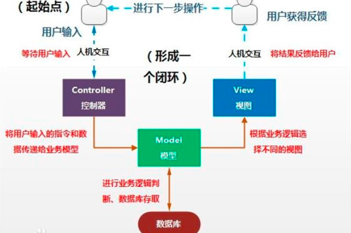
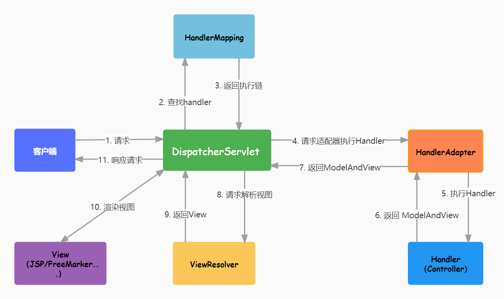
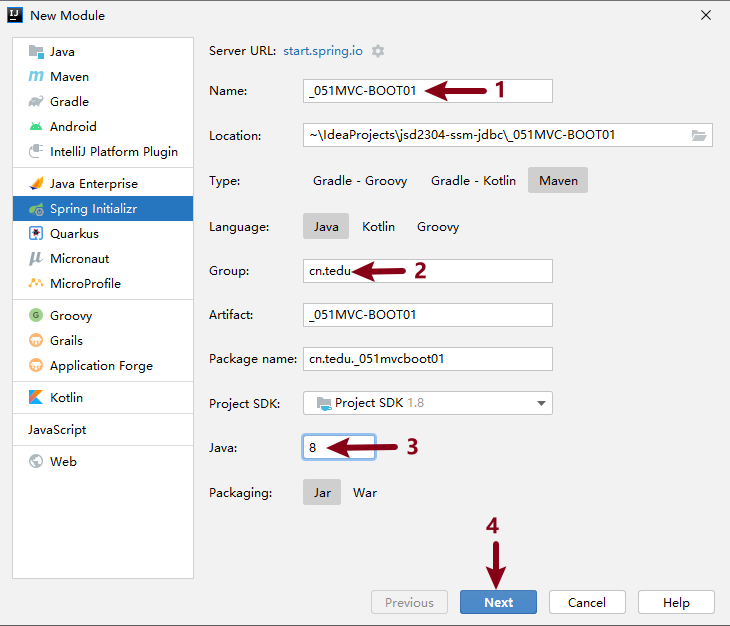
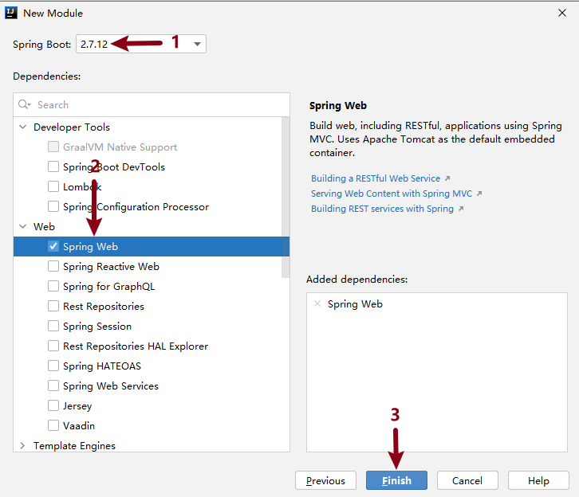
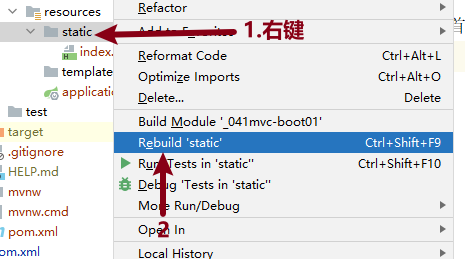
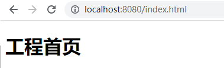
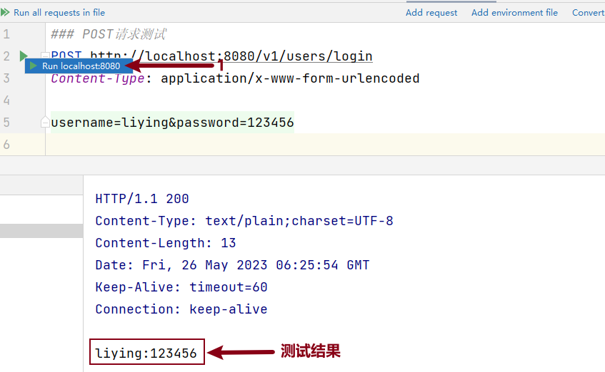

[toc]

# SpringMVC

## 1 什麽是MVC

### 1.1 MVC設計思想

MVC是一種軟件架構的思想，將軟件按照模型、視圖、控制器來劃分。

* M

  Model，模型層，負責業務邏輯判斷，數據庫存取

* V

  View，視圖層，負責界面展示，向用戶呈現數據的方式（html頁面、圖片、文本等）

* C

  Controller，控制器，負責接收用戶請求，並根據請求調用相應的模型來處理業務邏輯




### 1.2 Spring MVC

SpringMVC是一種基於MVC（模型-視圖-控制器）模式的Web框架，它是基於Spring框架的一個子項目。

它通過將請求分派給相應的控制器來處理Web請求，然後將處理結果發送回客戶端。

處理流程如圖：




1. 客戶端發送請求至前端控制器DispatcherServlet
2. DispatcherServlet收到請求後，調用處理器映射器HandlerMapping
3. HandlerMapping根據請求URL找到具體的Controller。
4. Controller處理請求，並返回ModelAndView，其中的View只是視圖名，並不指向具體的視圖組件
5. DispatcherServlet通過ViewReslover（視圖解析器）確定負責顯示數據的具體View
6. DispatcherServlet對View進行渲染視圖（即將Model填充至視圖組件中），並將完整的視圖響應到客戶端


## 2 SpringMVC快速入門

1. 創建工程 **_051MVC-BOOT01**

   

2. 選擇 `2.7.12` 版本，並勾選 `Spring Web` 依賴項

   

3. 啟動工程

4. 在resources/static目錄下創建index.html

   ```html
   <h1>
       工程首頁
   </h1>
   ```

5. Rebuid  static

   

6. 瀏覽器訪問工程首頁

   http://localhost:8080/index.html

## 3 SpringMVC處理請求

### 3.1 請求分類及處理方式

- 靜態請求

  * 定義

    指請求的頁面由服務器上預先準備好的靜態web資源組成，如HTML、CSS、JS、IMG等，返回給客戶端的信息內容是不變的。

  * 處理方式

    由服務器直接將請求的資源返回給客戶端，服務器不處理任何邏輯，只是將預先準備好的資源返回給客戶端。

- 動態請求

  * 定義

    服務器會根據用戶的請求動態生成內容，將數據返回到客戶端顯示頁面內容。

  * 處理方式

    由服務器從數據庫中獲取數據，並進行相應的邏輯處理後將處理結果返回客戶端。


### 3.2 處理靜態請求

* **處理html文件請求**

  1. 創建index.html（**已經創建**）瀏覽器輸入地址測試

     http://localhost:8080/index.html

  2. 顯示工程首頁

     

  

* **處理圖片等請求**

  1. 覆制任意一張圖片到static下

  2. 右鍵static目錄，Rebuild static

    3. 瀏覽器測試

       瀏覽器：http://localhost:8080/liying.jpg

### 3.3 處理動態請求

通過在 `controller`  中定義對應的類及方法實現動態請求的業務邏輯處理。

#### 1）注解說明

* `@Controller` 注解

  標注一個類；

  表示該類是一個控制器，負責處理用戶的請求，並將處理結果生成響應返回給客戶端。

* `@RequestMapping` 注解

  請求注解；

  添加在控制器類或控制器方法上；

  將HTTP請求映射到控制器中的方法，指定處理請求的路徑

  * 控制器類上：為整個控制器指定一個基礎路徑
  * 控制器方法上：指定相對於基礎路徑的具體路徑

* `@ResponseBody` 注解

  響應注解；

  添加在控制器方法上；

  可以使控制器方法通過返回值的方式將響應返回給客戶端。

  

#### 2）示例

處理用戶查詢訂單的請求

* 請求地址：http://localhost:8080/selectOrder
* 返回響應：String "查詢訂單成功~~"


第1步： 工程目錄下新建controller.OrderController

```java
// @Controller:用於將一個類標識為SpringMVC中的控制器，負責處理用戶的請求並將響應返回給客戶端
@Controller
public class OrderController {
    // 1.請求注解
    @RequestMapping("/selectOrder")
    // 2.響應體注解，添加此注解後，可以通過返回值的方式響應給客戶端數據
    @ResponseBody
    public String selectOrder(){
        return "查詢訂單成功~~";
    }
}
```


第2步：**重啟工程** 後瀏覽器測試

http://localhost:8080/selectOrder


### 3.4 常見問題

* 工程已修改，但是瀏覽器刷新未出現效果
  * 工程static目錄下文件修改後必須 Rebuild static
  * 瀏覽器有之前頁面的緩存，Shift + F5 刷新頁面
* 404錯誤碼代表找不到資源
  * 找不到靜態資源
    * 檢查請求的路徑是否正確   
    * 檢查靜態資源文件的存儲位置是否在static里面  
    * 選中static文件夾 ReBuild 重新編譯再測試
  * 找不到動態資源

    - 檢查請求的路徑是否正確   
    - 檢查@Controller注解是否添加
    - 檢查@RequestMapping注解里面的處理路徑是否正確 


## 4 HTTP請求方法

### 4.1 GET請求

GET請求通常用於獲取服務器資源，將請求參數放在URL中。

#### 1）URL統一資源定位符

是標準的Web地址，用於唯一地標識互聯網上的資源（如網頁、圖片、文檔等）

```java
http://www.example.com/search?q=keyword
```

其中`http`是協議名，`www.example.com`是域名，`search`是路徑名，`q`是查詢參數，`keyword`是查詢參數。

#### 2）特點

* 如果請求參數過多，GET請求會導致URL變長，並且傳輸的數據量也有一定限制；

* 安全性較低；

所以GET請求適合於請求數據不敏感的情況，如查詢信息、瀏覽網頁等。


### 4.2 POST請求

* POST請求是將請求參數放在請求體中發送的；

* POST請求相對於GET請求傳輸的數據量更大，數據更加安全；

所以POST請求適合於請求數據敏感的情況，如登錄、注冊等。


## 5 客戶端傳遞參數

客戶端負責發送請求，服務端負責處理請求；

客戶端在發送請求時可能需要向服務端傳遞數據，具體傳遞數據的方式有如下幾種方式。

### 5.1 GET請求[查詢參數]

在瀏覽器地址欄中輸入URL地址，在URL中添加查詢參數，默認發送的是 <font color=red>**GET請求**</font>。

**比如：登錄功能**

完成登錄功能，客戶端需要將用戶名 `username` 和 密碼 `password` 傳遞給服務端

http://localhost:8080/v1/users/login?username=liying&password=123456


第1步：新建controller.UserController 處理請求

```java
@Controller
public class UserController {
    @RequestMapping("/v1/users/login")
    @ResponseBody
    public String login(HttpServletRequest request){
        String username = request.getParameter("username");
        String password = request.getParameter("password");
        
        return username + ":" + password;
    }
}
```


第2步：重啟工程後瀏覽器輸入地址測試

http://localhost:8080/v1/users/login?username=liying&password=123456


### 5.2 POST請求[請求體]

POST請求無法在瀏覽器地址欄中發送，一般會通過如下方式發送：

* html中：Form表單完成POST請求方式的發送
* IDEA中：`.http` 後綴文件完成POST請求的發送


### 5.3 .http文件測試接口

使用SpringMVC中提供的 `.http` 後綴的文件來測試 Controller 層接口。

<font color=red>使用三個 # 號 作為不同測試方法的分隔符，也可以作為注釋說明。</font>


第1步：在test目錄下創建 Directory ：http

第2步：創建 `.http` 後綴的文件進行測試：testUserController.http

```http
### GET請求測試
GET http://localhost:8080/v1/users/login?username=liying&password=123456
Accept: application/json

### POST請求測試
POST http://localhost:8080/v1/users/login
Content-Type: application/x-www-form-urlencoded

username=liying&password=123456
```

第3步：執行對應的請求方法測試




## 6 服務端接收參數

### 6.1 HttpServletRequest接收

以上述案例為準，客戶端把用戶名和密碼信息傳遞給服務端，服務端接收傳遞過來的用戶名和密碼信息。

第1步：controller.UserController 處理請求

```java
/**方式1：使用HttpServletRequest接收數據*/
@RequestMapping("/v1/users/login")
@ResponseBody
public String login(HttpServletRequest request){
    String username = request.getParameter("username");
    String password = request.getParameter("password");

    return username + ":" + password;
}
```

第2步：重啟工程後執行對應的測試腳本（**testCase.http**）測試


### 6.2 聲明參數接收

可以在處理請求的方法中通過 **聲明參數的方式** 來接收客戶端傳遞過來的數據。

**應用分析**

第1步：controller.UserController處理登錄請求

```java
/**方式2：通過聲明參數的方式接收*/
@RequestMapping("/v1/users/login")
@ResponseBody
// 好處：代碼簡潔，並且可以自動根據聲明的類型進行轉換
public String login(String username, String password){
    return "username = " + username + ", password = " + password;
}
```

第2步：重啟工程，執行測試腳本測試


### 6.3 聲明POJO類接收

如果客戶端傳遞數據過多，

通過 `HttpServletRequest` 方式接收覆用性較差，通過 `聲明參數接收` 很繁瑣；

所以可以將數據封裝到 `POJO類` 中來接收。


**操作步驟**

第1步：controller.UserController處理登錄請求

```java
/**方式3：通過聲明Pojo類接收*/
@RequestMapping("/v1/users/login")
@ResponseBody
public String login(User user){
    return user.toString();
}
```

第2步：自定義pojo類，工程目錄下創建entity.User

```java
public class User {
    // 客戶端傳遞幾個參數，此處就有幾個屬性
    private String username;
    private String password;
    
    // 省略 setter()  getter()  和 toString() 方法
}
```

第3步：重啟工程，執行測試腳本測試


### 6.4 練習

**使用當前工程實現：BMI身體質量指數測試**

客戶端將用戶的 身高`height`和 體重`weight` 傳遞給服務端，服務端接收參數並計算用戶的身體健康指數。

```text
計算公式：bmi = 體重kg/(身高m*身高)
<18.5 偏瘦
<24 正常
<27 微胖
>=27 該減肥了
```

#### 6.4.1 接口說明

* 請求地址：/bmi
* 請求方法：GET
* 傳遞數據：height=用戶身高   weight=體重

* 返回響應：String   偏瘦 | 正常 | 微胖 | 該減肥了

#### 6.4.2 步驟梳理

1. 創建controller.BMIController

   在其中定義bmi方法處理 `/bmi `請求，在參數列表中通過 **聲明變量的方式** 接收傳遞過來的身高和體重


  2. 在bmi方法中通過bmi的計算公式得到結果，然後根據取值範圍給客戶端響應

     偏瘦/正常/微胖/該減肥了

  3. 測試成功後，請用 **POJO類方式** 接收數據再次實現


## 7 POJO

### 7.1 定義

Plain Ordinary Java Object：簡單的Java對象；

是沒有繼承任何類或實現任何接口的簡單 Java 對象，也不依賴於其他覆雜的框架或技術；

POJO 對象通常包含了純粹的數據和簡單的業務邏輯，是一種用於簡化 Java 應用程序開發的編程模型；

是entity實體類、VO（Value Object或View Object）視圖對象、DTO（Data Transfer Object）數據傳輸對象 這3個對象的總稱。


### 7.2 entity實體類|DTO|VO

* entity實體類作用

  用來和數據庫中的表字段一一對應的，比如UserEntity(id,username,password,nickname)；

* DTO作用

  用來接收客戶端傳遞給服務器的數據的，比如：UserLoginDTO(username,password)    實現登錄功能，客戶端向服務器端傳遞數據；

* VO作用

  用來處理服務器響應給客戶端的數據的，比如：UserListVO(id,username,nickname)  登錄成功後的列表頁顯示當前用戶信息。

  

## 8 用戶管理系統

### 8.1 數據初始化

* 庫名：blog

* 表名：user

  用戶id、用戶名username、密碼password、昵稱nickname、創建時間created

* 建庫建表語句

  ```mysql
  CREATE DATABASE IF NOT EXISTS blog DEFAULT CHARSET = UTF8;
  USE blog;
  CREATE TABLE IF NOT EXISTS user
  (
      id       INT PRIMARY KEY AUTO_INCREMENT,
      username VARCHAR(50),
      password VARCHAR(50),
      nickname VARCHAR(50),
      created  TIMESTAMP
  );
  ```

### 8.2 工程準備

* 創建工程：**_052MVC-BOOT02**

  * SprintBoot版本為2.7.12
  * 勾選依賴
    * Spring Web
    * MyBatis Framework
    * MySQL Driver

* application.properties配置文件中定義連接數據庫信息

  可覆制之前工程中的，但是庫名要改為：**blog**

  ```properties
  spring.datasource.url=jdbc:mysql://localhost:3306/blog?serverTimezone=Asia/Shanghai&characterEncoding=utf8
  spring.datasource.username=root
  spring.datasource.password=root
  ```

* application.properties配置文件中定義xml文件配置路徑

  ```properties
  # 設置MyBatis框架的映射（Mapper）配置文件的位置
  mybatis.mapper-locations=classpath:mappers/*.xml
  ```

* static目錄下創建工程首頁：index.html

* 啟動工程，瀏覽器訪問測試

  http://localhost:8080/index.html

### 8.3 添加用戶

#### 8.3.1 接口說明

用戶將：用戶名、密碼、昵稱 數據傳遞給服務端，服務端處理請求並將數據存入數據表。

* 請求地址：/v1/users/insert
* 請求方法：POST
* 請求體數據：用戶名username、密碼password、昵稱nickname
* 返回響應：添加成功

#### 8.3.2 操作步驟

* 創建實體類：`pojo.entity.User`

* 創建DTO類：`pojo.dto.UserDTO`

* 創建控制器並定義方法：

  * 控制器：`controler.UserController`   
  * 控制器方法： `addUser()` 

* 創建映射接口及接口方法：

  * 映射接口：`mapper.UserMapper` 
  * 接口方法： `insert()` 

* xml配置SQL

* UserController中自動裝配，完成添加用戶功能並返回響應

* 重啟工程，完成測試(`.http` 後綴文件)

  

### 8.4 用戶列表

#### 8.4.1 接口說明

* 請求地址：`/v1/users/userList`
* 請求方法：GET
* 查詢參數：無
* 返回響應：`List<User>`

#### 8.4.2 操作步驟

* 定義映射接口方法：`mapper.UserMapper` 
* xml 配置 SQL

* 處理請求並返回響應：`UserController` 

* 測試


### 8.5 刪除用戶

#### 8.5.1 接口說明

* 請求地址：/v1/users/delete?id=用戶id
* 請求方法：GET
* 查詢參數：用戶id
* 返回響應：String "刪除成功"

#### 8.5.2 操作步驟

* 定義映射接口方法：`mapper.UserMapper` 
* xml 配置 SQL

* 處理請求並返回響應：`UserController` 

* 測試


### 8.6 更新用戶

#### 8.6.1 接口說明

* 請求地址：/v1/users/update
* 請求方法：POST
* 請求體數據：用戶id、用戶名username、密碼password、昵稱nickname
* 返回響應：String "修改成功"

<font color=red>注意：如果用戶提交給服務端的為空字符串 或者 NULL，則不修改該用戶的該項信息。</font>

#### 8.6.2 操作步驟

* 定義接口方法：UserMapper
* xml 配置 SQL
* UserController 處理請求並返回響應


### 8.7 工程優化

#### 8.7.1 @RestController注解優化

* 問題

  controller中能否不要每個方法都寫 @Responsebody 注解？

* 解決

  在類上將原來的 `@Controller` 注解替換為：`@RestController`

* 說明

  `@RestController`注解作用於類上；

  作用是將類中的方法返回值直接作為HTTP響應的內容；

  在控制器類中加入該注解後，無需在每個方法上添加`@ResponseBody`注解；

  可以讓Spring框架自動將方法的返回值序列化並填充到HTTP響應中，實現Web服務端點的快速開發。

#### 8.7.2 @RequestMapping注解優化

* 問題

  @RequestMapping注解中每個都有 /v1/users/xxx，能否簡化一下？

* 解決

  在類上添加@RequestMapping注解，填寫相同部分的地址，比如

  ```java
  1.類中注解：@RequestMapping("/v1/users/")
  2.方法注解：@RequestMapping("login")
  ```

#### 8.7.3 @Mapper注解優化

* 問題

  能否不用在每個XxxMapper映射接口上都添加 `@Mapper` 注解？

* 解決

  創建配置類，設置自動掃描 `@Mapper` 注解

  在工程中新建config.MyBatisConfig類，添加 `@MapperScan` 注解設置自動掃描。

* `@MapperScan` 注解說明

  添加在 **Spring配置類** 上；

  **用於告訴 Spring 掃描 MyBatis Mapper 接口並創建對應的 Mapper 實現；**

  可以指定掃描 MyBatis 映射器接口的包名。

  ```java
  // 1.Configuration注解：設置當前類為配置類，啟動工程時會自動運行
  @Configuration
  // 2.MapperScan為掃描注解，省去了每個Mapper映射接口上面添加@Mapper注解
  //   參數為mapper的包的完整路徑
  @MapperScan("cn.tedu._052mvcboot02.mapper")
  public class MybatisConfig {
  }
  ```

  

## 9 練習實操

### 9.1 員工管理系統練習

**創建獨立的子工程，實現數據表的增刪改查**

員工管理系統，實現公司對員工的增刪改查操作。

員工表emp字段包含：員工編號id，員工姓名title，員工工資salary，員工崗位job


#### 9.1.1 項目準備

* 創建 **egmvc1** 工程

  * SpringBoot版本為 2.7.12
  * 勾選3項依賴：Spring Web、MyBatis Framework、MySQL Driver

* 配置文件中配置數據庫連接信息和xml映射文件位置

* 建庫建表

  ```mysql
  DROP DATABASE IF EXISTS mvcdb;
  CREATE DATABASE IF NOT EXISTS mvcdb DEFAULT CHARSET=UTF8;
  USE mvcdb;
  CREATE TABLE emp(
  id INT PRIMARY KEY AUTO_INCREMENT,
  title VARCHAR(20),
  salary DOUBLE(10,2),
  job VARCHAR(20)
  )CHARSET=UTF8;
  ```

* 啟動工程


#### 9.1.2 項目接口

##### 1）添加員工

* 請求地址：/emp/insert
* 請求方法：POST
* 請求體數據：員工姓名title、員工工資salary、員工崗位job
* 返回響應：String  "添加成功"


##### 2）查詢所有員工

* 請求地址：/emp/select
* 請求方法：GET
* 查詢參數：無
* 返回響應：`List<Emp>`


##### 3）修改員工信息

* 請求地址：/emp/update?id=員工編號&title=新名字&salary=新工資&job=新崗位
* 請求方法：GET
* 查詢參數：id=員工編號&title=新名字&salary=新工資&job=新崗位
* 返回響應：String  "修改成功"


##### 4）刪除員工信息

* 請求地址：/emp/delete?id=員工編號
* 請求方法：GET
* 查詢參數：id=員工編號
* 返回響應：字符串 "刪除成功"


### 9.2 地址管理系統練習

#### 9.2.1 項目準備

本工程為收貨地址管理，用戶可以添加收貨地址，查詢收貨地址，刪除收貨地址，修改收貨地址，請實現收貨地址的增刪改查操作。

##### 1）數據表：收貨地址表

1. 收貨地址id  INT PRIMARY KEY AUTO_INCREMENT,

2. 收件人receiver  VARCHAR(20),

3. 收貨地址address VARCHAR(255),

4. 收件人郵箱email VARCHAR(255),

5. 收件人手機號mobile CHAR(11),

6. 地址標簽（**家、公司、宿舍等**）tag VARCHAR(10)

   ```mysql
   CREATE DATABASE mvcdb IF NOT EXISTS mvcdb DEFAULT CHARSET=UTF8;
   USE mvcdb;
   CREATE TABLE IF NOT EXISTS address
   (
       id       INT PRIMARY KEY AUTO_INCREMENT,
       receiver VARCHAR(20),
       address  VARCHAR(255),
       email    VARCHAR(255),
       mobile   CHAR(11),
       tag      VARCHAR(10)
   );
   ```


##### 2）工程

* 創建 **egmvc2** 工程，勾選3項依賴，SpringBoot版本為2.7.12
* 配置文件中配置數據庫信息及xml映射文件位置
* 啟動工程


#### 9.2.2 項目接口

##### 1）添加收貨地址

* 請求地址：/address/insert
* 請求方法：POST
* 請求體數據：receiver=收件人、address=收件地址、email=郵箱、mobile=手機號、tag=標簽
* 返回響應：String "添加成功"


##### 2）查詢收貨地址

* 請求地址：/address/select

* 請求方法：GET

* 查詢參數：無

* 返回響應：`List<Address>`

  

##### 3）刪除收貨地址

* 請求地址：/address/delete

* 請求方法：POST

* 請求體數據：id=地址id

* 返回響應：String "刪除成功"

  

##### 4）修改收貨地址

* 請求地址：/address/update
* 請求方法：POST
* 親球體數據：id=xx&receiver=xx&address=xx&email=xxx&mobile=xx&tag=xx
* 返回響應：String "修改成功"


## 10 注解總結

* `@Controller` 注解

  標注一個類；

  表示該類是一個控制器，負責處理用戶的請求，並將處理結果生成響應返回給客戶端。

* `@RequestMapping` 注解

  請求注解；

  添加在控制器類或控制器方法上；

  將HTTP請求映射到控制器中的方法，指定處理請求的路徑

  * 控制器類上：為整個控制器指定一個基礎路徑
  * 控制器方法上：指定相對於基礎路徑的具體路徑

* `@ResponseBody` 注解

  響應注解；

  添加在控制器方法上；

  可以使控制器方法通過返回值的方式將響應返回給客戶端。

* `@RestController` 注解

  作用於類上；

  作用是將類中的方法返回值直接作為HTTP響應的內容；

  在控制器類中加入該注解後，無需在每個方法上添加`@ResponseBody`注解；

  可以讓Spring框架自動將方法的返回值序列化並填充到HTTP響應中，實現Web服務端點的快速開發。

* `@MapperScan` 注解說明

  添加在 **Spring配置類** 上；

  **用於告訴 Spring 掃描 MyBatis Mapper 接口並創建對應的 Mapper 實現；**

  可以指定掃描 MyBatis 映射器接口的包名。
