[toc]

## 1 MVC

MVC是一種軟件開發的設計模式；

目的是為了降低項目中各個模塊間的耦合度，提高代碼的可維護性和可擴展性。

<font color=red>**模型 視圖 控制器**</font>

- M：Model 模型層，業務邏輯處理，與數據庫交互；
- V： View 視圖層，頁面及數據展示，通常是由網頁、圖片等組成；
- C： Controller控制器層，負責接收請求，調用模型層處理請求，並返回響應給客戶端。

## 2 SringMVC

### 2.1 SpringMVC工作流程

SpringMVC是Spring Framework的子模塊，是一種使用MVC架構模式實現Web應用的框架，目標是為了簡化Web的開發。

**描述一下Spring MVC的工作流程**

1. 客戶端發送請求至前端控制器DispatcherServlet
2. DispatcherServlet收到請求後，調用處理器映射器HandlerMapping
3. HandlerMapping根據請求URL找到具體的Controller
4. Controller處理請求，並返回ModelAndView，其中的View只是視圖名，並不指向具體的視圖組件
5. DispatcherServlet通過ViewReslover（視圖解析器）確定負責顯示數據的具體View
6. DispatcherServlet對View進行渲染視圖（即將Model填充至視圖組件中），並將完整的視圖響應到客戶端


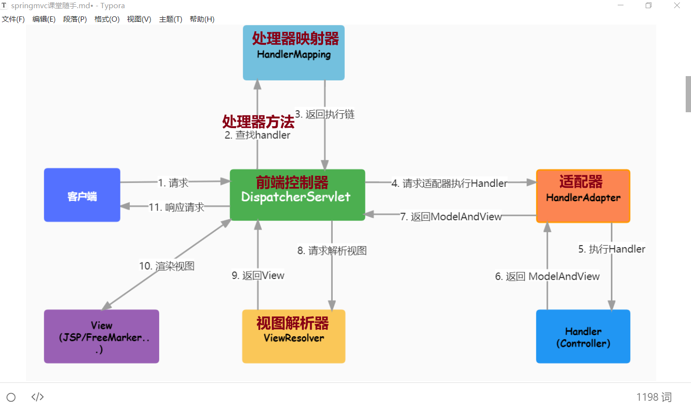


### 2.2 注意

* 靜態資源：更新後一定 Rebuild Static
* 動態請求：修改代碼後一定要 重啟工程
* 刷新頁面：Shfit + F5


### 2.3 常用注解

1. `@Controller`：將類標記為控制器，用於接收請求並處理請求的方法

2. `@Responsebody` ：允許控制器方法以返回值方式返回給客戶端數據

3. `@RestController`

   覆合注解，相當於 `@Controller` 和 `@ResponseBody` 的組合；

   添加在控制器類上，控制器方法中無需添加 `@ResponseBody` 注解

4. `@RequestMapping`

   請求注解；

   - `@GetMapping("/v1/users/login")` ：處理GET請求

   - `@PostMapping("/v1/users/login")`：處理POST請求

     

   **注意：類上使用@RequestMapping()，方法上使用限制請求方式的注解；**

   **如果請求方法和對應的注解不匹配，則會顯示405狀態碼**

5. `@MapperScan`

   用於指定Mapper接口所在的包，並讓MyBatis框架自動掃描這些接口，從而生成Mapper的實現類

   ```java
   @Configuration
   @MapperScan("cn.tedu.xxx.mapper1")
   public class MyBatisConfig{
   }
   ```


### 2.4 常見的錯誤狀態碼

1. 404狀態碼

   當請求的URL地址沒有找到對應的資源或者處理器方法時，會返回404狀態碼

   解決：確認請求的地址是否與Controller中的 `@RequestMapping` 地址相同

2. 405狀態碼

   控制器方法的請求映射與客戶端發起的請求方法不匹配

3. 500狀態碼

   服務器錯誤，根據服務端 run 終端報錯調整mvc的代碼


## 3 POJO

簡單Java對象，不繼承任何類或實現任何接口的對象，通常包含了純粹的數據。

* 實體類 - entity ：映射數據庫表及表字段
* 視圖對象 - VO ： 封裝服務端 傳給 客戶端的數據
* 數據傳輸對象 - DTO ：封裝 客戶端 傳給 服務端的數據


## 4 常見異常

### 4.1 工程未啟動

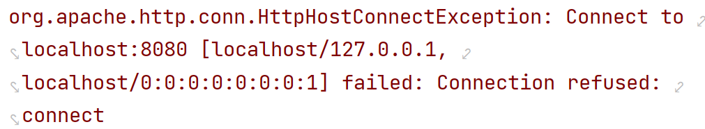


### 4.2 地址匹配錯誤

檢查 路徑 和 RequestMapping 注解中的是否一致

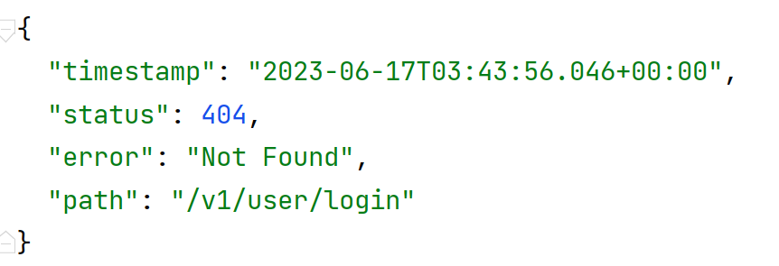

### 4.3 項目啟動失敗報錯

	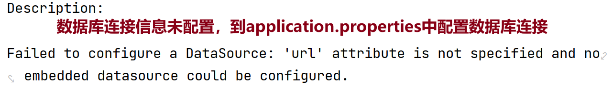


### 4.4 項目啟動失敗報錯

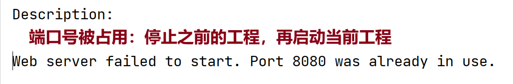


## 5 整體設計思路

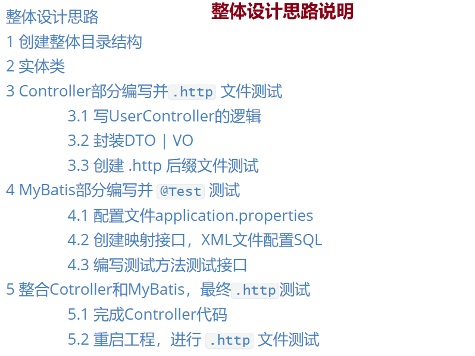


### 5.1 創建整體目錄結構

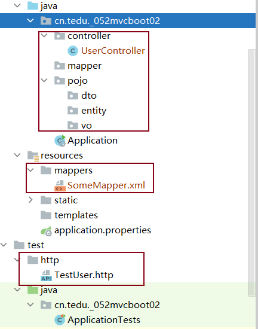

### 5.2 實體類

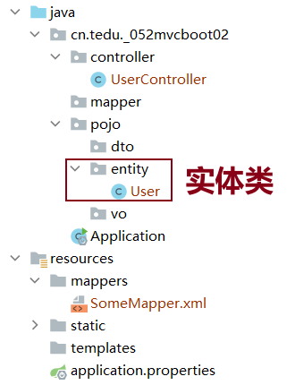

### 5.3 Controller部分編寫並`.http` 文件測試

#### 5.3.1 寫UserController的邏輯

```java
@Controller
public class UserController {
    @RequestMapping("/v1/users/insert")
    @ResponseBody
    public String addUser(UserAddDTO userAddDTO){
        // 1.獲取數據
        // 2.數據表中插入數據
        return "插入成功";
    }
}
```

#### 5.3.2 封裝DTO | VO

```java
public class UserAddDTO {
    private String username;
    private String password;
    private String nickname;
    // 省略setter() getter() 
}
```

#### 5.3.3 創建 .http 後綴文件測試

<font color=red>**切記：重啟工程**</font>

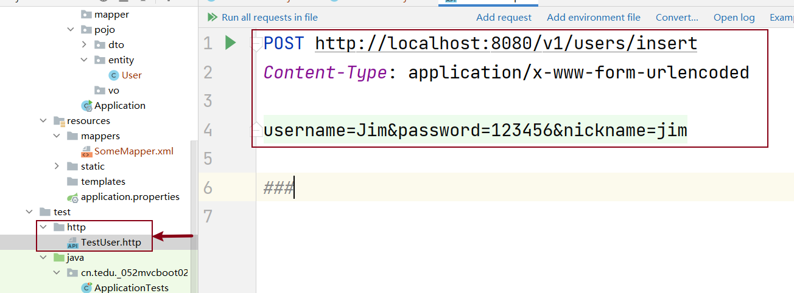


### 5.4 MyBatis部分編寫並 `@Test` 測試

#### 5.4.1 配置文件application.properties

#### 5.4.2 創建映射接口，XML文件配置SQL

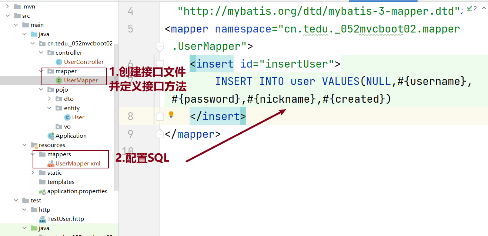

#### 5.4.3 編寫測試方法測試接口

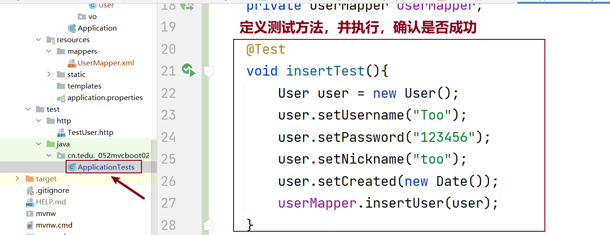

### 5.5 整合Cotroller和MyBatis，最終`.http`測試

##### 5.5.1 完成Controller代碼

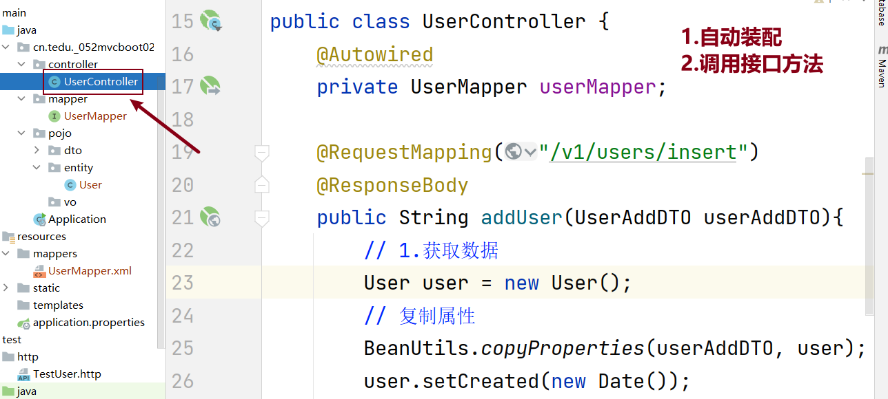

##### 5.5.2 重啟工程，進行 `.http` 文件測試

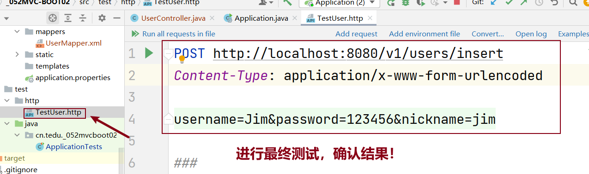


## 6 工程優化

* `@RestController` ：控制器類上，無需再添加 `@ResponseBody` 注解

* `@RequestMapping` ：控制器類上，寫多個地址相同的部分

* `@Configuration` ：加載為配置類

* `@MapperScan("")` ：MyBatis自動掃描，所有mapper包下的映射接口無需再加 `@Mapper` 注解

  注意：設置完成後，自動裝配時IDEA會誤報錯，添加 `required=false` 參數

  ```java
  @Autowired(required=false)
  private UserMapper userMapper;
  ```

* `@GetMapping("xxx")` ：只接收處理GET請求，其他方式的請求 <font color=red>**405狀態碼**</font>

* `@PostMapping("xxx")` ：只接收處理POST請求，其他方式的請求 <font color=red>**405狀態碼**</font>
