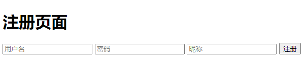
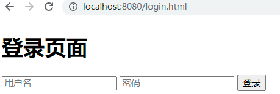
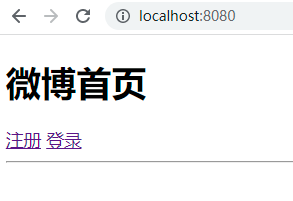
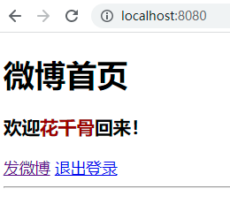
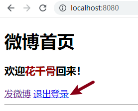
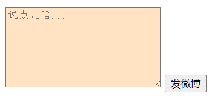
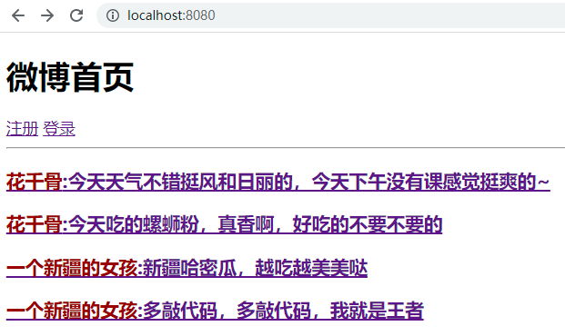
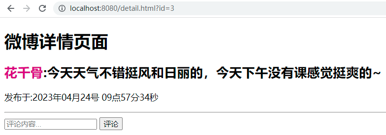
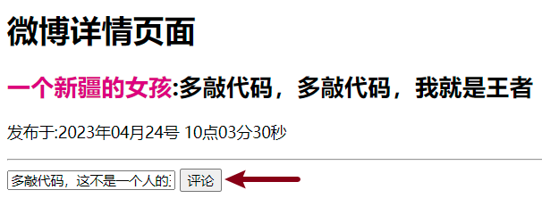
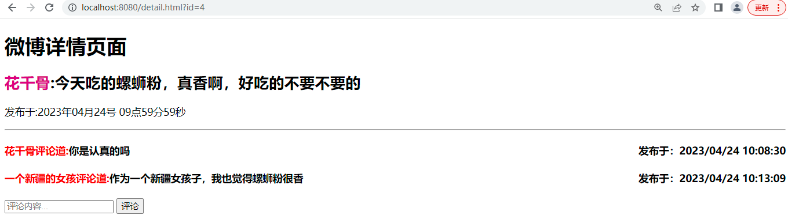

[TOC]

# 微博項目

## 項目概述

該項目是一款社交媒體應用，用戶可以在平台上發表短文信息，分享自己的想法、心情和生活。微博的用戶群體廣泛，包括個人、娛樂明星、公司、政府官方等。

## 項目功能

1. 用戶管理

   用戶可以注冊微博賬號，登錄登出微博網站。

2. 發布微博

   用戶可以在平台上發布文本形式的微博。

3. 查看微博

   用戶可以查看所有的微博。

4. 評論功能

   用戶可以對所有微博進行評論，並且查看某條微博的所有評論。

## 數據庫設計

* 本項目共計3張表
  * 用戶表：存儲用戶信息；
  * 微博表：存儲發布的微博信息；
  * 評論表：存儲每條微博的評論。
* 表關系
  * 用戶表和微博表：一對多，一個用戶可以發布多條微博，一條微博只能歸屬於一個用戶；
  * 用戶表和評論表：一對多，一個用戶可以發布多條評論，一條評論只能歸屬於一個用戶；
  * 微博表和評論表：一對多，一條微博下可以有多條評論，一條評論只能歸於與一條微博。
* 表字段設計
  * 用戶表user
    * 用戶編號：id
    * 用戶名：username
    * 密碼：password
    * 昵稱：nickname
    * 注冊時間：created
  * 微博表weibo
    * 微博編號：id
    * 微博內容：content
    * 發布時間：created
    * 用戶編號：user_id
  * 評論表comment
    * 評論編號：id
    * 評論內容：content
    * 評論時間：created
    * 用戶編號：user_id
    * 微博編號：weibo_id

## 數據初始化

### 1.建庫建表及插入數據

* 庫名：blog

* SQL語句

  ```mysql
  DROP DATABASE IF EXISTS blog;
  CREATE DATABASE IF NOT EXISTS blog DEFAULT CHARSET=UTF8;
  USE blog;
  CREATE TABLE IF NOT EXISTS user(
      id INT PRIMARY KEY AUTO_INCREMENT,
      username VARCHAR(50),
      password VARCHAR(50),
      nickname VARCHAR(50),
      created TIMESTAMP
  )CHARSET=UTF8;
  
  CREATE TABLE IF NOT EXISTS weibo(
      id INT PRIMARY KEY AUTO_INCREMENT,
  	content VARCHAR(255),
      created TIMESTAMP,
      user_id INT
  )CHARSET=UTF8;
  
  CREATE TABLE IF NOT EXISTS comment(
  	id INT PRIMARY KEY AUTO_INCREMENT,
      content VARCHAR(255),
      created TIMESTAMP,
      user_id INT,
      weibo_id INT
  )CHARSET=UTF8;
  
  USE blog;
  DELETE FROM user;
  DELETE FROM weibo;
  DELETE FROM comment;
  INSERT INTO user VALUES (100, 'Lucy', '123456', 'lucy', '1987-10-16 00:00:00');
  INSERT INTO user VALUES (101, 'Tom', '123456', 'tom', '1987-10-16 00:00:00');
  INSERT INTO user VALUES (102, 'Jim', '123456', 'jim', '1987-10-16 00:00:00');
  
  INSERT INTO weibo VALUES (200, 'lucy的第1條微博', '2000-01-01 00:00:00', 100);
  INSERT INTO weibo VALUES (201, 'lucy的第2條微博', '2000-01-01 00:00:00', 100);
  INSERT INTO weibo VALUES (202, 'tom的第1條微博', '2000-01-01 00:00:00', 101);
  INSERT INTO weibo VALUES (203, 'tom的第2條微博', '2000-01-01 00:00:00', 101);
  INSERT INTO weibo VALUES (204, 'tom的第3條微博', '2000-01-01 00:00:00', 101);
  
  INSERT INTO comment VALUES (300, 'lucy對第1條微博的評論', '2008-01-01 00:00:00', 100, 200);
  INSERT INTO comment VALUES (301, 'tom對第1條微博的評論', '2008-01-01 00:00:00', 101, 200);
  INSERT INTO comment VALUES (302, 'lucy對第2條微博的評論', '2008-01-01 00:00:00', 100, 201);
  INSERT INTO comment VALUES (303, 'tom對第2條微博的評論', '2008-01-01 00:00:00', 101, 201);
  INSERT INTO comment VALUES (304, 'jim對第2條微博的評論', '2008-01-01 00:00:00', 102, 201);
  
  ```

### 2 項目準備

* 創建工程 **_053MVC-WEIBO**

  勾選3個依賴；

  SpringBoot版本選擇 2.7.12；

* application.properties中配置數據庫連接信息及xml文件映射路徑

  ```properties
  spring.datasource.url=jdbc:mysql://localhost:3306/blog?serverTimezone=Asia/Shanghai&characterEncoding=utf8
  spring.datasource.username=root
  spring.datasource.password=root
  # 設置MyBatis框架的映射（Mapper）配置文件的位置
  mybatis.mapper-locations=classpath:mappers/*.xml
  ```

* 啟動工程


# 01.用戶模塊

## 注冊功能



**接口地址**:`/v1/users/reg`

**請求方式**:`POST`

**請求數據類型**:`application/json`

**響應數據類型**:`int`


**請求示例**:


```javascript
{
  "nickname": "liying",
  "password": "123456",
  "username": "zhaoliying"
}
```

**請求參數 UserRegDTO**:


| 參數名稱             | 參數說明   | 請求類型 | 是否必須 | 數據類型   |
| -------------------- | ---------- | -------- | -------- | ---------- |
| userRegDTO           | userRegDTO | body     | true     | UserRegDTO |
| &emsp;&emsp;nickname | 昵稱       |          | true     | string     |
| &emsp;&emsp;password | 密碼       |          | true     | string     |
| &emsp;&emsp;username | 用戶名     |          | true     | string     |

**響應參數**:


整型 int

**響應示例**:

| 參數名稱 | 參數說明     | 類型 |
| -------- | ------------ | ---- |
| 1        | 注冊成功     | int  |
| 2        | 用戶名被占用 | int  |


## 登錄功能



**接口地址**:`/v1/users/login`

**請求方式**: `POST`

**請求數據類型**:`application/json`

**響應數據類型**:`int`


**請求示例 UserLoginDTO**:


```javascript
{
  "password": "123456",
  "username": "zhaoliying"
}
```

**請求參數**:


| 參數名稱             | 參數說明     | 請求類型 | 是否必須 | 數據類型     |
| -------------------- | ------------ | -------- | -------- | ------------ |
| userLoginDTO         | userLoginDTO | body     | true     | UserLoginDTO |
| &emsp;&emsp;password | 密碼         |          | true     | string       |
| &emsp;&emsp;username | 用戶名       |          | true     | string       |

**響應參數**:


整型 int


**響應示例**:

| 參數名稱 | 參數說明   | 類型 |
| -------- | ---------- | ---- |
| 1        | 登錄成功   | int  |
| 2        | 密碼錯誤   | int  |
| 3        | 用戶名錯誤 | int  |


## 獲取當前用戶

### 1）說明

進入首頁時，會自動向後端發請求，獲取當前用戶的登錄狀態，分為以下兩種情況：

如果未登錄，則顯示注冊登錄頁面；

如果是登錄狀態，則顯示歡迎xxx回來，並顯示退出登錄按鈕。

* 未登錄顯示首頁面

  

* 登錄顯示首頁面

  


### 2）接口文檔

**接口地址**:`/v1/users/currentUser`

**請求方式**:`GET`

**請求數據類型**:`application/x-www-form-urlencoded`

**響應數據類型**:`userVO`


**請求參數**:


暫無

**響應參數**:

**UserVO 不為null，則說明處於登錄狀態**

**UserVO 為null，則說明處於未登錄狀態**


| 參數名稱 | 參數說明 | 類型           |
| -------- | -------- | -------------- |
| id       | 用戶id   | integer(int32) |
| nickname | 用戶昵稱 | string         |
| password | 用戶密碼 | string         |

**響應示例 UserVO**:

null

或

```javascript
{
	"id": 0,
	"nickname": "",
	"password": ""
}
```


## 登出功能




**接口地址**:`/v1/users/logout`

**請求方式**:`GET`


**請求數據類型**:`application/x-www-form-urlencoded`

**響應數據類型**:`見響應參數`


**請求參數**:


暫無

**響應參數**:


暫無


# 02.微博模塊

## 發布微博功能




**接口地址**:`/v1/weibo/insert`

**請求方式**:`POST`

**請求數據類型**:`application/json`

**響應數據類型**:`int`


**請求示例 WeiboDTO**:


```javascript
{
  "content": "微博內容"
}
```


**請求參數**:


| 參數名稱            | 參數說明 | 請求類型 | 是否必須 | 數據類型 |
| ------------------- | -------- | -------- | -------- | -------- |
| weiboDTO            | weiboDTO | body     | true     | WeiboDTO |
| &emsp;&emsp;content | 微博內容 |          | true     | string   |


**響應參數**:


整型 int

**響應示例**:

| 參數名稱 | 參數說明         | 類型 |
| -------- | ---------------- | ---- |
| 1        | 發布成功         | int  |
| 2        | 未登錄，發布失敗 | int  |


## 首頁微博列表功能




**接口地址**:`/v1/weibo/selectIndex`

**請求方式**:`GET`

**請求數據類型**:`application/x-www-form-urlencoded`

**響應數據類型**:`見響應參數`


**請求參數**:


暫無

**響應參數 List<WeiboIndexVO>**:


| 參數名稱 | 參數說明 | 類型           |
| -------- | -------- | -------------- |
| content  | 微博內容 | string         |
| wid      | 微博id   | integer(int32) |
| nickname | 用戶昵稱 | string         |

**響應示例** List<WeiboIndexVO>:

```javascript
[
	{
		"content": "",
		"wid": 0,
		"nickname": ""
	}
]
```


## 微博詳情功能




**接口地址**:`/v1/weibo/selectById`

**請求方式**:`GET`

**請求數據類型**:`application/x-www-form-urlencoded`

**響應數據類型**:`見響應參數`


**請求參數**:


| 參數名稱 | 參數說明 | 請求類型 | 是否必須 | 數據類型       |
| -------- | -------- | -------- | -------- | -------------- |
| id       | 微博id   | query    | true     | integer(int32) |

**響應參數 WeiboDetailVO**:


| 參數名稱 | 參數說明     | 類型              |
| -------- | ------------ | ----------------- |
| content  | 微博內容     | string            |
| created  | 微博發布時間 | string(date-time) |
| id       | 微博id       | integer(int32)    |
| nickname | 用戶昵稱     | string            |

**響應示例 WeiboDetailVO**:

```javascript
{
	"content": "",
	"created": "",
	"id": 0,
	"nickname": ""
}
```


# 03.評論模塊

## 發布評論功能




**接口地址**:`/v1/comment/insert`

**請求方式**:`POST`

**請求數據類型**:`application/json`

**響應數據類型**:`int`


**請求示例**:


```javascript
{
  "content": "果然高手都在評論區",
  "weiboId": 1
}
```

**請求參數 CommentDTO**:


| 參數名稱            | 參數說明   | 請求類型 | 是否必須 | 數據類型       |
| ------------------- | ---------- | -------- | -------- | -------------- |
| commentDTO          | commentDTO | body     | true     | CommentDTO     |
| &emsp;&emsp;content | 評論內容   |          | true     | string         |
| &emsp;&emsp;weiboId | 微博id     |          | true     | integer(int32) |


**響應參數**:


整型 int


**響應示例**:

| 參數名稱 | 參數說明         | 類型 |
| -------- | ---------------- | ---- |
| 1        | 評論成功         | int  |
| 2        | 未登錄，評論失敗 | int  |


## 獲取評論功能




**接口地址**:`/v1/comment/selectByWeiboId`

**請求方式**:`GET`

**請求數據類型**:`application/x-www-form-urlencoded`

**響應數據類型**:`見響應參數`


**請求參數**:


| 參數名稱 | 參數說明 | 請求類型 | 是否必須 | 數據類型       |
| -------- | -------- | -------- | -------- | -------------- |
| id       | id       | query    | false    | integer(int32) |

**響應參數 List<CommentVO>**:


| 參數名稱 | 參數說明     | 類型              |
| -------- | ------------ | ----------------- |
| content  | 評論內容     | string            |
| created  | 評論發布時間 | string(date-time) |
| id       | 評論id       | integer(int32)    |
| nickname | 用戶昵稱     | string            |

**響應示例 List<CommentVO>**:

```javascript
[
	{
		"content": "",
		"created": "",
		"id": 0,
		"nickname": ""
	}
]
```
