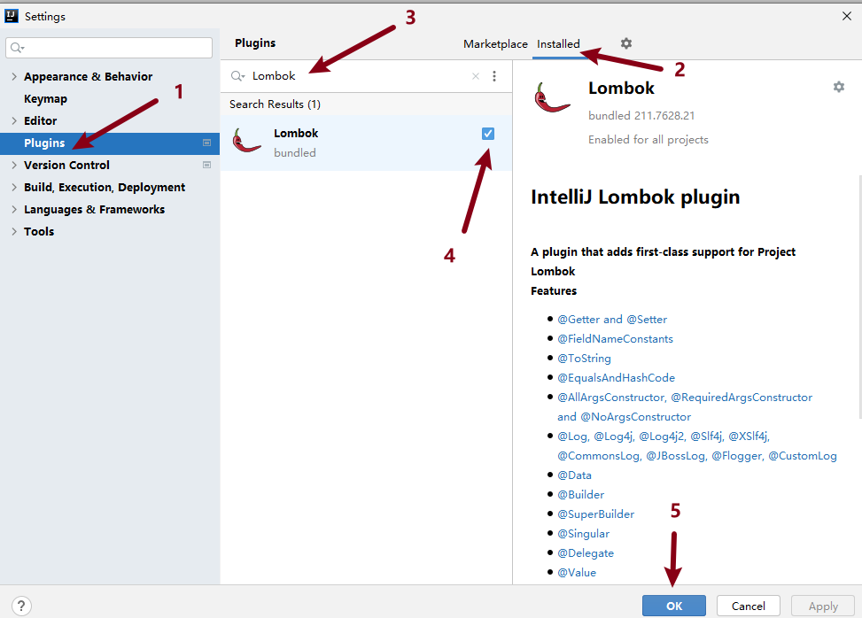

[toc]

## 整合Lombok基礎組件

### 1 Lombok簡介

Lombok 是一個 Java 庫，可以通過在代碼中添加注解來消除模板代碼，以簡化 Java 代碼的編寫過程；

Lombok 支持自動生成 getter、setter、toString等方法，減少了重覆性的開發工作。


### 2 安裝和配置 Lombok

- pom.xml中引入 Lombok 的依賴並刷新Maven

  ```xml
  <!--引入Lombok依賴-->
  <dependency>
      <groupId>org.projectlombok</groupId>
      <artifactId>lombok</artifactId>
  </dependency>
  ```

- 在Idea中確認是否安裝Lombok 插件

  * 引入 Lombok 的依賴是讓編譯器能夠找到 Lombok 提供的注解並對其進行處理，但是這不足以讓 IDE 可以正常地識別和支持 Lombok 的注解。       

  * 為了在 IDE 中正常地使用 Lombok，需要安裝 IDE 插件來支持 Lombok 的注解。插件會將 Lombok 的注解轉換為相應的代碼，以便能夠在 IDE 中正確地顯示代碼提示等功能。      

  * 所以，為了使 Lombok 的注解在 IDE 中正常運行，需要同時引入 Lombok 的依賴並安裝對應的 IDE 插件。

  

  <font color=red>**如果沒有安裝請安裝此插件**</font>

  1. 打開 IntelliJ IDEA，點擊 File -> Settings -> Plugins。

  2. 在搜索框中輸入 lombok，並點擊搜索按鈕。

  3. 選擇 Lombok 插件，點擊 Install 按鈕進行安裝。

     

  4. 安裝完成後，彈出提示框，一般會提示重啟 IntelliJ IDEA 以激活 Lombok 插件。點擊 Restart IntelliJ IDEA 按鈕進行重啟。

  5. 重啟後，即可使用 Lombok 注解。


### 3 Lombok常用注解

Lombok 提供了許多注解，每個注解用來生成特定的代碼塊。下面是一些常用的注解：

#### 3.1 `@Getter` 和 `@Setter`

用來生成 getter 和 setter 方法。

```java
@Getter
@Setter
public class Student {
    private String name;
    private int age;
}
```

這將自動生成 `getName()`, `setName()`, `getAge()`, `setAge()` 方法。

#### 3.2 `@ToString`

用來生成 toString 方法。

```java
@ToString
public class Student {
    private String name;
    private int age;
}
```

這將自動生成 `toString()` 方法。

#### 3.3 `@AllArgsConstructor` 和 `@NoArgsConstructor`

用來生成帶參數的和無參的構造函數。

```java
@AllArgsConstructor
@NoArgsConstructor
public class Student {
    private String name;
    private int age;
}
```

這將自動生成一個有參構造函數和一個無參構造函數。

#### 3.4 `@Data`

是一個組合的注解，它等價於同時使用了 `@Getter`、`@Setter`、`@NoArgsConstructor`、`@AllArgsConstructor` 和 `@ToString` 注解。

```java
@Data
public class Student {
    private String name;
    private int age;
}
```

這將自動生成 `getName()`, `setName()`, `getAge()`, `setAge()`，有參構造函數、無參構造函數，以及 `toString()` 方法。


### 4 @Slf4j 日志注解

`@Slf4j` 是 lombok 中的注解；

此注解描述類時會在類中創建一個日志對象，基於日志對象可以輸出一些日志。

#### 4.1 使用方法

在需要使用日志的類上加上 `@Slf4j` 注解即可。

* `log.debug("日志信息")`
* `log.info("日志信息")`

示例：

```java
@Slf4j
public class MyClass{
    public void myMethod(){
        log.info("myMethod方法被執行");
    }
}
```

在上述代碼中， `@Slf4j` 注解被加在了 `MyClass` 類上。這樣就可以在 `MyClass` 中直接使用 `log` 對象輸出日志了。

#### 4.2 日志級別

<font color=red>**日志級別：TRACE<DEBUG<INFO<WARN<ERROR**</font>

* TRACE

  用於輸出程序運行過程中的細節信息，通常用於調試。

  此級別的日志信息最詳細，雖然對於大多數問題的解決都很有幫助，但是產生大量信息會對性能會造成一定影響。

* DEBUG

  用於輸出程序中詳細的運行信息，通常用於調試或診斷問題。

  相對於 TRACE 級別，DEBUG 級別不太詳細，但是在調試或診斷問題時也有用，不過這種級別的日志信息也可能會產生較多，對性能也會有一定影響。

* INFO（**默認的級別**）

  用於記錄程序運行的基本信息，例如，程序啟動、配置信息等。

  通常在正式運行時才會輸出此級別的日志信息。此級別的日志信息比較基礎，能夠充分說明程序運行的核心情況。

* WARN

  用於輸出警告信息，例如，接口調用失敗、處理異常情況等。

  此級別的日志信息一般不會影響程序的正常運行，但需要注意，並及時處理。這種日志信息屬於一種中等級別，需要引起注意，但不是必須的。

* ERROR

  ERROR 級別的日志用於記錄程序中的錯誤信息，此級別的日志信息表示出現嚴重錯誤，需要及時處理，以避免程序無法正常運行。


注意：在 `@Slf4j` 注解中，日志級別的選擇應根據具體情況而定，要保證日志輸出足夠詳細，但又不能浪費過多的系統資源。

#### 4.3 設置日志級別

`@Slf4j` 注解默認的日志級別為 INFO，即只會輸出 INFO級別 以及 比INFO日志級別更高級別的日志信息，如需配置則需要在配置文件 `application.properties` 配置文件中進行配置

```properties
# 設置日志級別為WARN
logging.level.root=WARN

# 將cn.tedu包及其包中的所有類的日志級別設置為DEBUG級別
logging.level.cn.tedu=DEBUG
```

#### 4.4 `@Slf4j` 注解優點

使用 `@Slf4j` 注解相比 `System.out.println("xxx")` 的好處

* 更加高效

  使用 `@Slf4j` 注解輸出日志，可以避免產生大量的無用日志信息，減少對內存和磁盤等資源的消耗。

  而使用 `System.out.println()` 會產生大量冗余的輸出信息，不僅對調試造成困擾，而且會對應用程序的性能產生影響。

* 日志級別更加明確

  使用 `@Slf4j` 注解，可以根據需要輸出不同級別的日志，例如，警告、錯誤等。通過靈活控制日志輸出的級別，可以及時發現並解決問題。

  而使用 `System.out.println()` 輸出的日志級別是不可控的，並且無法選擇性地過濾日志。


### 5 微博項目優化

* `@Data` 注解優化微博項目

  在微博項目的所有pojo類中添加 `@data` 注解，將原來的 `setter() getter() toString()` 方法都去掉；

  重啟工程後測試項目功能是否能夠成功執行。

* `@Slf4j` 注解優化微博項目

  在微博項目中將打印調試的代碼，使用 `@Slf4j` 注解完成調試，在配置文件 `application.properties` 中設置日志級別。
