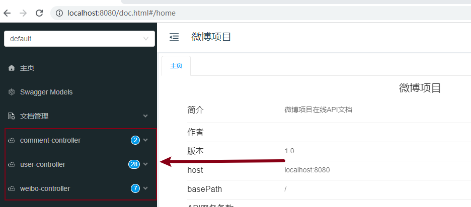
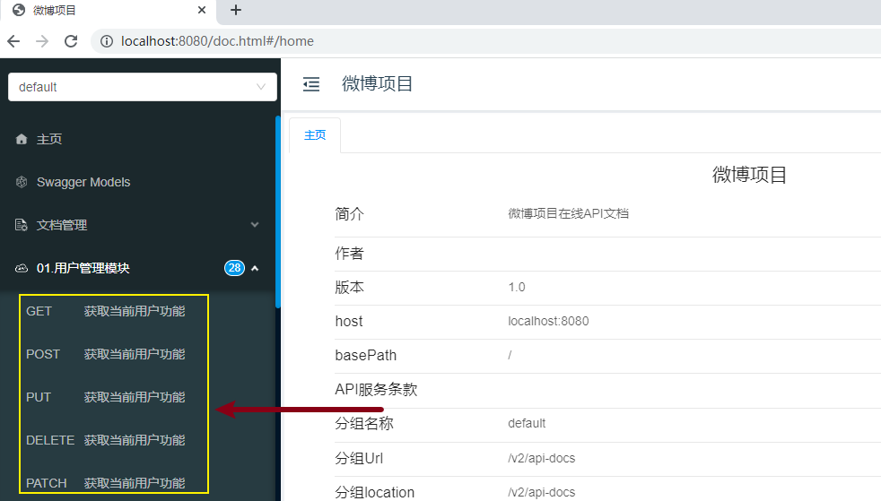
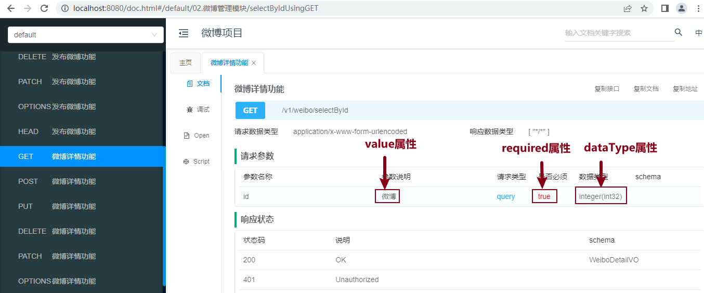
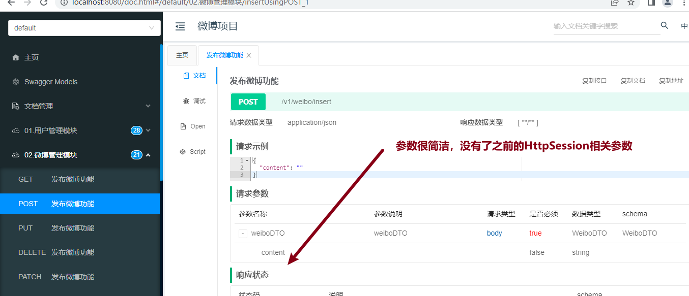

[toc]

# Knife4j

Knife4j是基於SpringBoot構建的一個文檔生成工具，它可以讓開發者為我們的應用生成API文檔；

目的是可以更加方便的基於API文檔進行測試。

生成的文檔還可以導出，然後給到前端開發團隊，前端開發團隊可以基於API接口寫具體的調用。

## 1 Knife4j的優點

- Knife4j 功能強大，易於操作。
- Knife4j 的UI界面非常美觀，使用流暢。
- Knife4j 可以高度定制化，讓其符合你的項目需求。

## 2 Knife4j快速上手

### 2.1 pom.xml添加依賴

在你的SpringBoot項目的pom.xml文件中，添加如下依賴：

```xml
<!--添加Knife4j依賴-->
<dependency>
    <groupId>com.github.xiaoymin</groupId>
    <artifactId>knife4j-openapi2-spring-boot-starter</artifactId>
    <version>4.1.0</version>
</dependency>
```

### 2.2 配置Swagger的相關信息

<font color=red>**工程目錄下創建config.Knife4jConfig**</font>

```java
package cn.tedu._053mvcweibo.config;

import org.springframework.context.annotation.Bean;
import org.springframework.context.annotation.Configuration;
import springfox.documentation.builders.ApiInfoBuilder;
import springfox.documentation.builders.PathSelectors;
import springfox.documentation.builders.RequestHandlerSelectors;
import springfox.documentation.service.ApiInfo;
import springfox.documentation.spi.DocumentationType;
import springfox.documentation.spring.web.plugins.Docket;
import springfox.documentation.swagger2.annotations.EnableSwagger2WebMvc;

@Configuration
@EnableSwagger2WebMvc
public class Knife4jConfig {
    //配置Swagger2的Docket的Bean實例
    @Bean
    public Docket createRestApi() {
        return new Docket(DocumentationType.SWAGGER_2)
                // apiInfo()：配置 API 的一些基本信息，比如：文檔標題title，文檔描述description，文檔版本號version
                .apiInfo(apiInfo())
                // select()：生成 API 文檔的選擇器，用於指定要生成哪些 API 文檔
                .select()
                // apis()：指定要生成哪個包下的 API 文檔
                .apis(RequestHandlerSelectors.basePackage("cn.tedu._053mvcweibo.controller"))
                // paths()：指定要生成哪個 URL 匹配模式下的 API 文檔。這里使用 PathSelectors.any()，表示生成所有的 API 文檔。
                .paths(PathSelectors.any())
                .build();
    }

    //文檔信息配置
    private ApiInfo apiInfo() {
        return new ApiInfoBuilder()
                // 文檔標題
                .title("微博項目")
                // 文檔描述信息
                .description("微博項目在線API文檔")
                // 文檔版本號
                .version("1.0")
                .build();
    }
}
```

### 2.3 查看生成的接口文檔

在 SpringBoot 項目啟動後，訪問 `http://localhost:8080/doc.html` 地址即可查看生成的Knife4j接口文檔。



## 3 常用注解應用分析

- **@Api注解**

  添加在控制器類上的注解；

  通過此注解的tags屬性可以修改原本顯示控制器類名稱的位置的文本；

  通常建議在配置的tags屬性值上添加序號，例如：“01. 用戶模塊”、“02. 微博模塊”，則框架會根據值進行排序。

  * 參數說明

    * tags：配置模塊名稱

  * 代碼示例

    ```java
    // 1. UserController
    @Api(tags = "01.用戶管理模塊")
    public class UserController {...}
    
    // 2. WeiboController
    @Api(tags = "02.微博管理模塊")
    public class WeiboController {...}
    
    // 3. CommentController
    @Api(tags = "03.評論管理模塊")
    public class CommentController {...}
    ```

  * 文檔效果（**重啟工程並刷新頁面：http://localhost:8080/doc.html#/home**）

    

  

- **@ApiOperation注解**

  添加在控制器類中處理請求的方法上的注解；

  用於配置此方法處理的請求在API文檔中顯示的文本。

  * 參數說明

    * value：配置業務名稱

  * 代碼示例

    **此處以注冊功能為例，其他所有方法請添加說明**

    ```java
    /**注冊功能*/
    @PostMapping("reg")
    @ApiOperation(value = "注冊功能")
    public int reg(@RequestBody UserRegDTO userRegDTO){...}
    ```

  * 文檔效果（**重啟工程並刷新頁面：http://localhost:8080/doc.html#/home**）

    

- **@ApiModelProperty注解**

  是添加在POJO類的屬性上的注解；

  用於對請求參數或響應結果中的某個屬性進行說明；

  主要通過其value屬性配置描述文本，並可通過example屬性配置示例值。

  * 參數說明

    * value屬性：配置參數名稱
    * required屬性：配置是否必須提交此請求參數
    * example屬性：配置示例值

    <font color=red>注意：如果配置了 required=true,只是一種顯示效果，Knife4j框架並不具備檢查功能</font>

  * 代碼示例

    **以注冊功能UserRegDTO為例**

    ```java
    @Data
    public class UserRegDTO {
        @ApiModelProperty(value = "用戶名", required = true, example = "趙麗穎")
        private String username;
        @ApiModelProperty(value = "密碼", required = true)
        private String password;
        @ApiModelProperty(value = "昵稱", required = true)
        private String nickname;
    }
    ```

  * 文檔效果（**重啟工程並刷新頁面：http://localhost:8080/doc.html#/home**）

    

- **@ApiImplicitParam注解**

  添加在控制器類中處理請求的方法上的注解；

  主要用於配置非封裝的參數

  * 參數說明

    * name：指定參數名稱（**參數變量名**）
    * value：配置參數名稱
    * dataType：配置數據類型
    * required：配置是否必須提交此請求參數
    * example：配置參數的示例值

    <font color=red>注意：一旦使用此注解，各個參數的數據類型默認都會顯示String，可以通過dataType指定數據類型</font>

  * 代碼示例

    **此處以微博詳情功能為例**

    ```java
    @ApiImplicitParam(name = "id", value = "微博", required=true, dataType = "int")
    public WeiboDetailVO selectById(int id){...}
    ```

  * 文檔效果（**重啟工程並刷新頁面：http://localhost:8080/doc.html#/home**）

    

- **@ApiImplicitParams注解**

  添加在控制器類中處理請求的方法上的注解；

  當方法有多個非封裝的參數時，在方法上添加此注解，並在注解內部通過@ApiImplicitParam數組配置多個參數。

  * 代碼示例

    **此處以微博詳情功能為例**

    ```java
    /**微博詳情頁功能*/
    @GetMapping("selectById")
    @ApiOperation(value = "微博詳情功能")
    @ApiImplicitParams(value = {
        @ApiImplicitParam(name = "id", value = "微博", required=true, dataType = "int"),
        @ApiImplicitParam(name = "username", value = "用戶名", required=true)
    })
    // 額外增加username參數，僅僅用於測試
    public WeiboDetailVO selectById(int id, String username){
        return weiboMapper.selectById(id);
    }
    ```

  * 文檔效果（**重啟工程並刷新頁面：http://localhost:8080/doc.html#/home**）

    

* **@ApiIgnore注解**

  添加在處理請求的方法的參數上；

  用於表示API文檔框架應該忽略此參數。

  **以發布微博功能的HttpSession參數為例**

  * 代碼示例

    ```java
    // 參數中添加@ApiIgnore注解
    public int insert(@RequestBody WeiboDTO weiboDTO, @ApiIgnore HttpSession session){...}
    ```

  * 文檔效果（**重啟工程並刷新頁面：http://localhost:8080/doc.html#/home**）

    

## 4 限制請求方式

API文檔中默認每個功能會展示7種請求方式，遵循RESTful規則將 `@RequestMapping` 注解修改為對應請求方法的注解，比如：`@GetMapping  @PostMapping  @PutMapping  @DeleteMapping` 注解，重啟工程後刷新測試。


## 5 導出離線API文檔

1. 文檔管理 - 離線文檔 中存在多種格式的導出格式

   

2. 選擇合適的文檔格式，導出即可到本地磁盤
