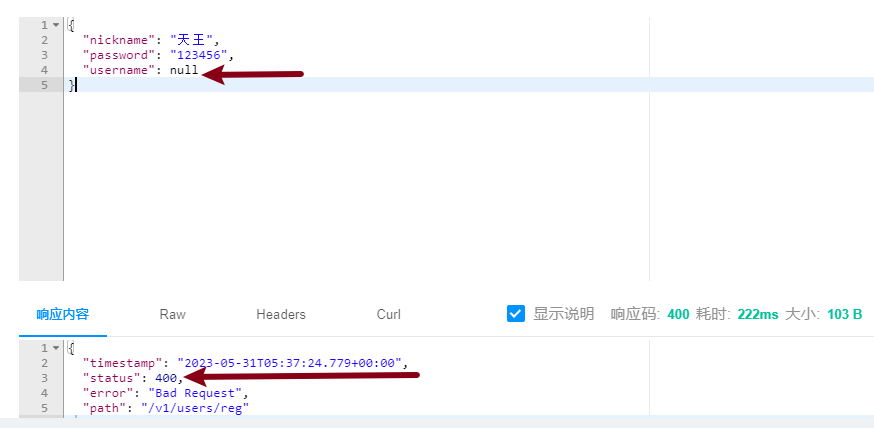
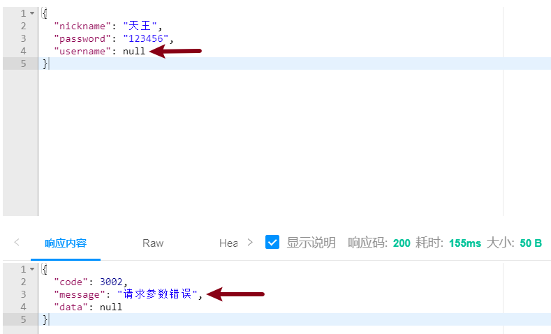

[toc]

# Spring Validation

## 1 關於Spring Validation

在實際項目我們需要對客戶端傳遞到服務端的參數進行校驗，用於判定請求參數的合法性，假如請求參數不合法則不可以再去執行後續的業務了。那如何校驗呢？

一種方式是我們在控制層方法中每次都自己進行參數有效值的判斷，不合法可以拋出異常，但是工作量和代碼覆雜度會比較高；

第二種方式就是采用市場上主流的 `Spring Validation` 框架去實現校驗，所以 `Spring Validation` 框架的主要作用是  檢查參數的基本有效性。

## 2 使用流程

在Spring Boot工程中，使用此框架需要添加依賴，並刷新maven

```xml
<!-- Spring Boot支持Spring Validation的依賴項，用於檢查參數的基本有效性 -->
<dependency>
    <groupId>org.springframework.boot</groupId>
    <artifactId>spring-boot-starter-validation</artifactId>
</dependency>
```


## 3 快速入門

1. 在處理請求的方法的參數列表中，在POJO類型的參數上添加`@Validated`注解，表示需要通過Spring Validation框架檢查此參數，例如UserController中注冊功能：

   ```java
   @ApiOperation(value = "注冊功能")
   @PostMapping("reg")
   public JsonResult reg(@RequestBody @Validated UserRegDTO userRegDTO){}
   ```

2. 在此POJO類中的屬性上，添加對應的檢查注解，以配置檢查規則，

   例如，添加`@NotNull`注解，就表示“不允許為`null`”的規則！

   在`UserRegDTO`類

   ```java
   @Data
   public class UserRegDTO {
       @NotNull
       @ApiModelProperty(value = "用戶名", required = true, example = "趙麗穎")
       private String username;
       @ApiModelProperty(value = "密碼", required = true, example = "123456")
       private String password;
       @ApiModelProperty(value = "昵稱", required = true, example = "螢火蟲")
       private String nickname;
   }
   ```

3. 重啟工程，在Knife4j中測試，當提交請求時，如果沒有提交username參數，服務器端將響應`400`錯誤。

   

   **同時在終端也會出現異常**

   


## 4 運行異常處理

### 4.1 說明

在使用Spring Validation框架執行參數的檢查時，如果檢查不通過，除了響應`400`錯誤以外，在控制台還會拋出錯誤：<font color=red>`MethodArgumentNotValidException` 使用全局異常處理器解決。</font>

```java
[org.springframework.web.bind.MethodArgumentNotValidException: Validation failed for argument [0] in public cn.tedu._043mvcweibo.common.response.JsonResult cn.tedu._043mvcweibo.controller.UserController.reg(cn.tedu._043mvcweibo.pojo.dto.UserRegDTO): [Field error in object 'userRegDTO' on field 'username': rejected value [null]; codes [NotNull.userRegDTO.username,NotNull.username,NotNull.java.lang.String,NotNull]; arguments [org.springframework.context.support.DefaultMessageSourceResolvable: codes [userRegDTO.username,username]; arguments []; default message [username]]; default message [不能為null]] ]
```


### 4.2 處理異常

**使用全局異常處理器來處理 `MethodArgumentNotValidException` 異常**

第1步：全局異常處理器 `GlobalExceptionHandler` 中定義處理異常方法

```java
@ExceptionHandler
public JsonResult handleBindException(MethodArgumentNotValidException ex){
    return new JsonResult(3002, "請求參數錯誤");
}
```


第2步：重啟工程，在Knife4j中測試



### 4.3 明確提示消息

當提交的`username`的值為 null 時，可以發現異常已被處理！

但是，處理結果並不合適，因為，客戶端得到此結果後，仍無法明確出現了什麽錯誤！

所有的檢查注解都可以配置`message`參數，用於對錯誤進行描述。


第1步：`@NotNull` 注解中添加 `message` 參數

```java
@NotNull(message = "必須提交用戶名")
private String username;
```


第2步：自定義枚舉狀態碼 `StatusCode`

```java
VALIDATE_ERROR(3002, "參數校驗失敗")
```


第3步：異常方法中獲取提示信息 `message`

在處理異常時，需要調用`MethodArgumentNotValidException`對象的`getFieldError().getDefaultMessage()`獲取以上配置的描述文本

```java
@ExceptionHandler
public JsonResult handleBindException(MethodArgumentNotValidException ex){
    /*
    	ex.getFieldError().getDefaultMessage():獲取 @NotNull(message="xxx") 中message的消息
    */
    String message = ex.getFieldError().getDefaultMessage();
    return new JsonResult(StatusCode.VALIDATE_ERROR, message);
}
```


第3步：重啟工程，在Knife4j中測試


## 5 常用注解

### 5.1 `@NotNull`注解

* 作用：用於驗證對象是否為 null

* 用法：`@NotNull` 注解用於對象類型上

* 示例

  ```java
  @NotNull(message = "用戶名不能為null")
  private String username;
  ```

  

### 5.2 `@NotEmpty` 注解

* 作用：用於驗證字符串是否為空，並且會檢查是否為 null 值（為null值時報錯）

* 用法：用於字符串類型上

* 示例

  ```java
  @NotEmpty(message = "用戶名不能為空")
  private String username;
  ```

  

### 5.3 `@NotBlank` 注解

* 作用：不允許為空白，即不允許是“僅由空格、TAB等空白值組成的字符串”，也不允許為空字符串，也不允許為空值null

* 用法：用於字符串類型上

* 示例

  ```java
  @NotBlank(message = "用戶名不能為空白串")
  private String username;
  ```


### 5.4 `@Size` 注解

* 作用：可以指定最小值和最大值限制字符串的長度

* 用法：用於字符串類型參數

* 示例

  ```java
  @Size(min = 6, max = 20, message = "用戶名長度必須在6到20之間")
  private String username;
  ```


### 5.5 `@Range` 注解

* 作用：用於驗證數字類型字段的取值範圍，通過配置min和max屬性來限制數值類型參數的值區間包括最小值和最大值

* 用法：用於數值類型參數

* 示例

  ```java
  @Range(min = 1, max = 10, message = "年齡必須在1-10歲之間")
  private int age;
  
  @Range(min = 0.1, max = 1.0, message = "成績必須在0.1到1.0之間")
  private double score;
  ```

  

## 6 非POJO參數校驗

在 Spring Validation 中，除了對 POJO（Plain Old Java Object）進行校驗的功能外，還支持對非 POJO 進行校驗，比如 String、Integer、Double 等類型的參數。

### 6.1 使用流程

* <font color=red>**在當前方法所在的類上添加 `@Validated` 注解**</font>
* 在參數上添加對應的檢查注解

### 6.2 使用示例

對於微博詳情頁的 id 參數進行範圍校驗，範圍只能在1-10之間

第1步：在類 `WeiboController` 中添加 `@Validated` 注解

```java
@Validated
public class WeiboController {}
```


第2步：在控制器方法參數 `id` 上添加對應的檢查注解

```java
public JsonResult selectById(@Range(min = 1, max=10, message = "請提交合法的ID值！") int id)
```


第3步：重啟工程，在Knife4j或者瀏覽器中測試
