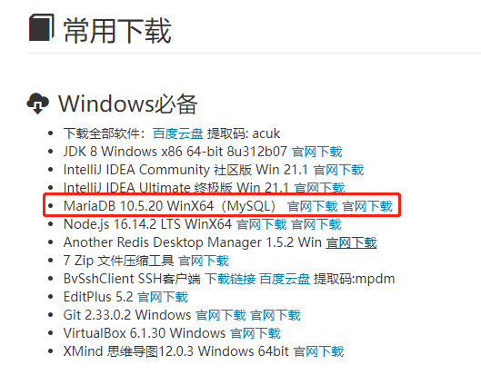
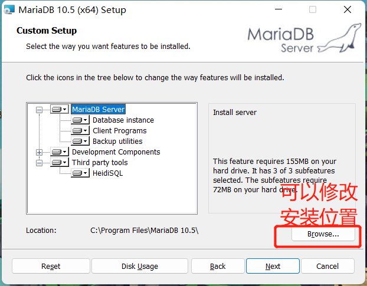
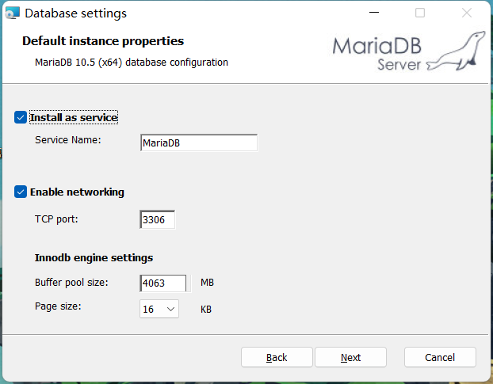
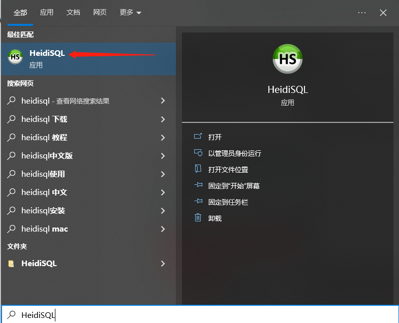
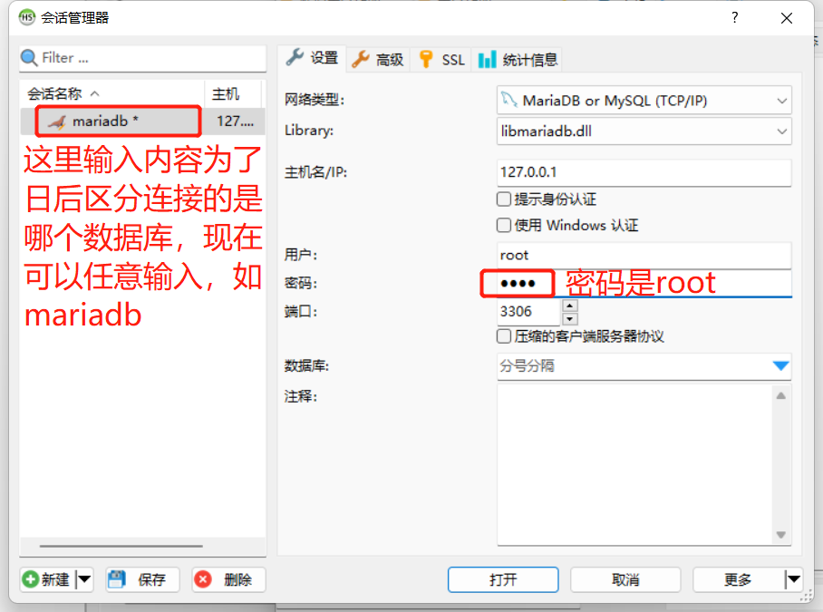
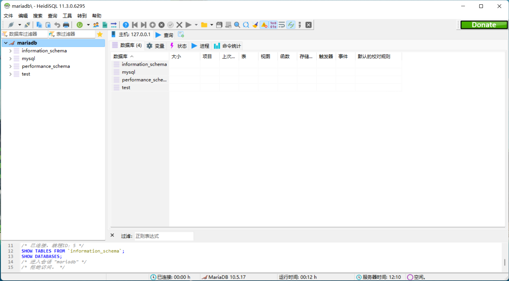

[toc]

# MariaDB安裝

## 1. 下載安裝包

**下載地址：http://doc.vrd.net.cn **

## 2. 運行下載後的安裝文件

## 3. 按照途中步驟進行安裝

- 點擊next

- 勾選圖中的接受條款後點擊next

- 這里可以點擊Browse按鈕修改安裝路徑，但是一般默認位置即可。之後點擊next

- 這里為root用戶添加密碼，密碼也先輸入root即可，之後字符集勾選Use UTF8...選項後點next

  

- 直接點擊next

  

- 點擊Install安裝

  

- 等待安裝...

  

- 點擊finish完成安裝

  

## 4. 測試MariaDB的連接

在開始菜單中找到 HeidiSQL

創建一個會話用於測試連接數據庫

輸入下圖內容後點擊打開

可以看到下圖說明一切正常

