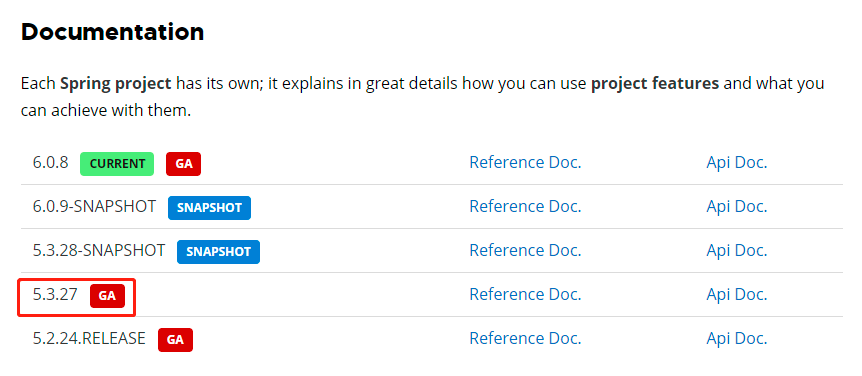
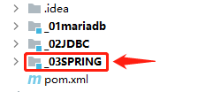
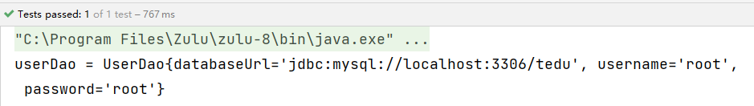
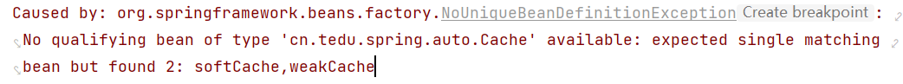
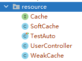
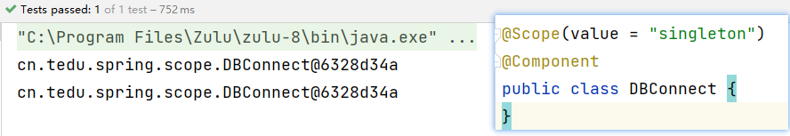
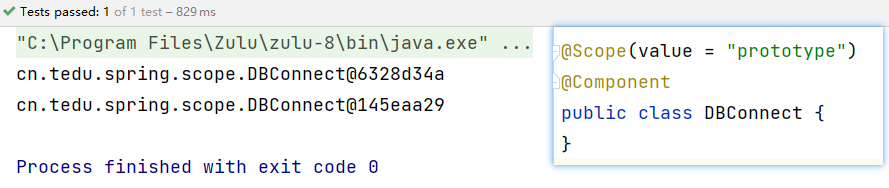
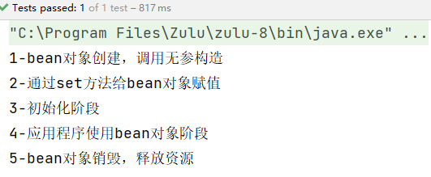

[toc]

# Spring


## spring概述

### 1 Spring定義

Spring是一款主流的 Java EE 開源框架，目的是用於簡化Java企業級引用的開發難度和開發周期。從簡單性、可測試性和松耦合度的角度而言，任何Java應用都可以從Spring中受益。Spring框架提供自己提供功能外，還提供整合其他技術和框架的能力。

自2004年4月，Spring1.0 版正式發布以來，Spring已經步入到了第6個大版本，即 Spring6，本課程采用 **Spring5.3.24** 正式版本。

Spring官網地址：https://spring.io/




### 2 Spring核心

Spring指的是Spring Framework，通常我們稱之為Spring框架。

Spring的兩個核心模塊

* IoC控制反轉

  Inverse of Control的簡寫，為 控制反轉，指把創建對象交給Spring進行管理。

  即：反轉資源獲取方向，把自己創建資源、向環境索取資源的方式變為環境自動將資源準備好，我們享受資源注入。

* AOP面向切面編程

  Aspect Oriented Programming 的簡寫，為 面向切面編程。AOP用來封裝多個類的公共行為，將那些與業務無關，卻為業務模塊共同調用的邏輯封裝起來，減少系統的重覆代碼，降低模塊間的耦合度。


## 入門案例

### 1 環境要求

* JDK：Java8-15
* Spring：5.3.24

### 2 構建工程

#### 2.1 構建子工程 _03spring




#### 2.2 入門案例

**① 在_03SPRING/pom.xml中引入相關依賴，並 刷新maven**

```xml
<dependencies>
    <!-- 引入spring context依賴-->
    <dependency>
        <groupId>org.springframework</groupId>
        <artifactId>spring-context</artifactId>
        <version>5.3.24</version>
    </dependency>
</dependencies>
```

**② 在工程中（java目錄下）創建包 cn.tedu.spring.example**

**③ 在 cn.tedu.spring.example 下創建類 User，並添加 @Component注解**

```java
package cn.tedu.spring.example;
import org.springframework.stereotype.Component;

/**
 * @Component 注解描述的類，表示此類交給Spring框架管理。
 */
@Component
public class User {
    public void doSomething(){
        System.out.println("User is do something~~");
    }
}
```

**④ 創建測試類cn.tedu.spring.example.TestUser進行測試**

```java
package cn.tedu.spring.example;
import org.springframework.context.ApplicationContext;
import org.springframework.context.annotation.AnnotationConfigApplicationContext;

public class TestUser {
    public static void main(String[] args) {
        // AnnotationConfigApplicationContext掃描這個包中所有帶有@Component注解的類,並根據這些類創建相應的Spring組件
        ApplicationContext context = new AnnotationConfigApplicationContext("cn.tedu.spring.example");
        // getBean()方法法獲取User對象，並調用它的run方法
        User user = context.getBean(User.class);
        System.out.println("user = " + user);
        user.doSomething();
    }
}
```


## 相關概念

### 1 IoC

IoC（Inversion of Control，控制反轉）是一種編程思想；

是將對象的創建和管理交由框架來完成，而不是由開發人員手動創建和管理。

### 2 IoC容器

IoC容器是用來實現IoC思想的一個工具或者說技術手段；

它能夠自動掃描應用程序中的對象，將它們實例化，並自動注入它們所需要的依賴對象;

使應用程序的開發人員能夠更加專注於業務邏輯的實現，而不用關心對象的創建和管理。

Spring通過IoC容器來管理所有的Java對象的實例化和初始化，控制著對象與對象之間的依賴關系。我們將由IoC容器管理的Java對象成為 Spring Bean，它與使用關鍵字 new 創建的Java對象沒有任何區別。

### 3 依賴注入DI

DI （Dependency Injection）：依賴注入，依賴注入實現了控制反轉的思想，是指Spring創建對象的過程中，將對象依賴屬性通過配置進行注入。

所以 IoC 是一種控制反轉的思想，而 DI 是對 IoC 的一種具體實現。

Bean管理：指Bean對象的創建，以及Bean對象中屬性的賦值


## IoC容器實現

Spring中的IoC容器就是IoC思想的一個落地產品實現。IoC容器中管理的組件也叫做bean。在創建bean之前，首先需要創建IoC容器，Spring提供了IoC容器的兩種實現方式

* BeanFactory

  這是IoC容器的基本實現，是Spring內部使用的接口，面向Spring本身，不提供給開發人員使用。

* ApplicationContext

  BeanFactory的子接口，提供了更多高級特性，面向Spring的使用者，幾乎所有場合都使用 ApplicationContext，而不使用底層的BeanFactory。

<font color=red>**源碼說明：**</font>


* ApplicationContext的主要實現類

  |                類型                |                 說明                  |
  | :--------------------------------: | :-----------------------------------: |
  | AnnotationConfigApplicationContext |        使用注解方式構建IoC容器        |
  |   ClassPathXmlApplicationContext   | 使用XML配置文件方式構建Spring IoC容器 |

  

## 基於注解管理bean

### 1 Bean對象定義及獲取

在Spring框架規範中，所有由spring管理的對象都稱之為Bean對象。

#### 1.1 Bean對象定義

Spring提供了以下多個注解，這些注解可以直接標注在java類上，將它們定義成Spring Bean。

|    注解     |                             說明                             |
| :---------: | :----------------------------------------------------------: |
| @Component  | 該注解用於描述Spring中的Bean，它是一個泛化的概念，僅僅標識容器中的一個組件（Bean），並且可以作用在任何層次，例如Service層、Dao層等，使用時只需將該注解標注在相應的類上即可。 |
| @Repository | 該注解用於數據訪問層（Dao層）的類標識為Spring中的Bean，功能與@Component相同。 |
|  @Service   | 該注解通常作用在業務層（Service層），用於將業務層的類標識為Spring中的Bean，其功能與@Component相同。 |
| @Controller | 該注解通常作用在控制層（如SpringMVC的Controller），用於將控制層的類標識為Spring中的Bean，其功能與@Component相同。 |

#### 1.2 Bean對象獲取

通過ApplicationContext對象獲取：調用ApplicationContext對象的getBean()方法，傳入對應類的類型即可獲取該Bean對象，示例：

```java
ApplicationContext context = new AnnotationConfigApplicationContext("包掃描路徑");
User user = context.getBean(類名.class);
```

#### 1.3 應用分析

在 **cn.tedu.spring** 下創建子包 **bean** ，進行 bean 對象的創建及獲取

第1步：在bean包下創建類：**UserDao**

```java
@Repository
public class UserDao {
    private String databaseUrl;
    private String username;
    private String password;
}
```

第2步：在bean包下創建測試類：**UserDaoTest**

```java
public class TestUserDao {
    @Test
    public void testBean(){
        ApplicationContext context = new AnnotationConfigApplicationContext("cn.tedu.spring.bean");
        UserDao userDao = context.getBean(UserDao.class);
        System.out.println("userDao = " + userDao);
    }
}
```

**說明：將java類中的 @Repository注解 替換為 @Component注解、@Service注解、@Controller注解 都是可以的。**


### 2 依賴注入DI

#### 2.1 @Value注解

@Value注入是將屬性值直接注入到bean中，主要用於注入一些簡單類型的屬性（如字符串、基本類型等；

使用時需要注意屬性的類型和格式，否則會導致注入失敗。


**示例：在UserDao中進行屬性值注入**

第1步：在UserDao的屬性中通過@Value注解注入屬性值

```java
@Repository
public class UserDao {
    @Value("jdbc:mysql://localhost:3306/tedu")
    private String databaseUrl;
    @Value("root")
    private String username;
    @Value("root")
    private String password;

    @Override
    public String toString() {
        return "UserDao{" +
                "databaseUrl='" + databaseUrl + '\'' +
                ", username='" + username + '\'' +
                ", password='" + password + '\'' +
                '}';
    }
}
```

第2步：執行測試方法進行測試




#### 2.2 @Autowired注解

@Autowired注入是將對象注入到bean中，並且在注入對象時會根據依賴注入容器中bean的類型進行匹配。如果容器中有多個類型匹配的bean存在，則會拋出異常。因此，@Autowired注入常用於注入覆雜對象、接口類型的屬性或其他bean實例。

##### 2.2.1 根據類型注入

**定義UserService類，並注入UserDao對象**

第1步：在包bean下創建 `UserService` 類

```java
@Service
public class UserService {
    @Value("注冊業務")
    private String sname;
    // Autowired自動裝配
    @Autowired
    private UserDao userDao;

    @Override
    public String toString() {
        return "UserService{" +
                "sname='" + sname + '\'' +
                ", userDao=" + userDao +
                '}';
    }
}
```

第2步：調整測試方法

```java
@Test
public void testAuto(){
    ApplicationContext context = new AnnotationConfigApplicationContext("cn.tedu.spring.bean");
    UserService userService = context.getBean(UserService.class);
    System.out.println("userService = " + userService);
}
```

第3步：執行測試方法測試


##### 2.2.2 根據接口注入

進行依賴注入時，如果指定的是接口Interface，Spring框架會自動找到該接口對應的實現類並創建bean對象注入嗎？

**在 cn.tedu.spring 下創建子包 auto**

第1步：創建接口 `Cache`

```java
package cn.tedu.spring.auto;

public interface Cache {
}
```


第2步：創建該接口實現類 `SoftCache` ，並添加 `@Component注解`

```java
package cn.tedu.spring.auto;

import org.springframework.stereotype.Component;

@Component
public class SoftCache implements Cache{
}
```


第3步：創建類 `UserController` ，並注入 `SoftCache對象`

```java
@Component
public class UserController {
    @Autowired
    private Cache cache;
}
```


第4步：創建測試類 `TestAuto` 進行測試

```java
public class TestAuto {
    @Test
    public void test01(){
        ApplicationContext context = new AnnotationConfigApplicationContext("cn.tedu.spring.auto");
        UserController userController = context.getBean(UserController.class);
        System.out.println(userController);
    }
}
```


**總結：** 當一個接口有一個唯一的實現類時，Spring框架會通過接口找到該接口對應的實現類，並進行bean對象的創建以及DI注入操作。

那麽如果一個接口有多個實現類，Spring框架會創建對應的 java bean 對象嗎？


第1步：創建 Cache 接口的實現類 `WeakCache`

```java
@Component
public class WeakCache implements Cache{
}
```


第2步：執行測試方法，確認是否成功




<font color=red>總結： 當一個接口有多個實現類時，Spring無法確定注入哪個實現類對象，因此會報錯，可以結合 `@Qualifier注解` 來解決這個問題。</font>


#### 2.3 @Qualifier注解

@Qualifier注解是用於限定一個接口有多個實現類時，根據指定的限定條件來選擇具體的實現類的注解；

當Spring容器中存在多個實現同一接口的bean時，在注入時，由於不能確定注入哪一個實現類，就需要通過@Qualifier注解來明確指定要注入的bean的名稱。


第1步：在 `UserController` 中添加 `@Autowired注解` 和 `@Qualifier注解`

```java
@Component
public class UserController {
    @Autowired
    @Qualifier("softCache")
    private Cache cache;
}
```


第2步：在 `SoftCache` 實現類中 `@Component注解` 中添加組件名

```java
@Component("softCache")
public class SoftCache implements Cache{
}
```


第3步：執行測試方法進行測試


<font color=red>總結：在@Component注解中可以不用指定組件名稱，默認為當前類的 類名首字母小寫。</font>


#### 2.4 @Resource注解（了解）

`@Resource` 注解是JavaEE提供的注解之一，也支持在Spring Framework中使用。在Spring中，它可以用來注入Bean實例，與`@Autowired`注解的作用類似，但其也有自己的一些特點。

* @Resource注解是JDK擴展包中的，也就是說屬於JDK的一部分。所以該解釋是標準注解，而@Autowired注解是Spring框架自己的。

* 裝配規則

  * `@Resource` 注解默認根據名稱裝配byName；

  * 當未指定 name 時，則使用屬性名作為 name 進行裝配；

  * 如果通過name也未找到，則會自動啟動通過類型byType裝配。

  **而@Autowired注解默認根據類型裝配byType，如果想根據名稱匹配，需要配合@Qualifier注解一起使用。**

  

##### 示例

第1步：**cn.tedu.spring** 下創建子包 `resource` ，將上個案例包auto中所有文件拷貝到此包下




第2步：將之前所有關於 `@Autowired` 注解去掉，使用 `@Resource` 注解

```java
@Component
public class UserController {
    /**
     * 根據名稱進行裝配
     */
    @Resource(name = "softCache")
    /**
     * 如果未指定名稱name，則會使用屬性名作為名稱進行裝配
     */
    //@Resource
    /**
     * 如果未指定名稱name，屬性名也不匹配，則會默認根據類型進行匹配
     */
    private Cache cache;
}
```


第3步：修改測試方法中的包掃描路徑，執行測試方法進行測試


**總結**

1. 指定@Resource中的name，則根據名稱裝配
2. 未指定name時，則根據屬性名裝配
3. 未指定name，屬性名也不一致，則根據類型裝配


### 3 bean對象作用域分析

#### 3.1 說明

在Spring框架中，Bean是按照作用域來創建的，常見的作用域有兩種：Singleton和Prototype。其中，Singleton (單例)是指整個應用中只有一個實例，並在第一次請求時創建實例。而Prototype(多例)是指每次請求都會創建一個新的實例並返回，每個實例之間是相互獨立的。可以通過 `@Scope` 注解來指定，默認是單實例。

#### 3.2 單實例與多實例

* 單實例

  單實例（Singleton）是指某個類只能創建唯一的一個實例對象，並且該類提供一個全局的訪問點（靜態方法）來讓外界獲取這個實例，常常用在那些只需要一個實例來處理所有任務的場景下，例如數據庫連接池。

* 多實例

  多實例（Multiple Instance）則是指可以在同一個類的定義下，創建多個實例對象。每個對象都是相互獨立的，有自己的狀態和行為；常常用於需要同時處理多個任務的場景。


在Spring中可以通過 `@Scope` 注解來指定bean的作用域範圍，具體如下

|              取值               |                含義                 |
| :-----------------------------: | :---------------------------------: |
| @Scope("singleton")（**默認**） | 在IoC容器中，這個bean的對象為單實例 |
|       @Scope("prototype")       |    這個bean在IoC容器中有多個實例    |

#### 3.3 應用分析

第1步：在 **cn.tedu.spring** 下創建子包 **scope** ，並創建類 `DBConnect`

```java
@Scope(value = "singleton")
@Component
public class DBConnect {
}
```


第2步：創建測試類進行測試

```java
public class TestDBConnect {
    @Test
    public void testScope(){
        ApplicationContext context = new AnnotationConfigApplicationContext("cn.tedu.spring.scope");
        // 第一次獲取
        DBConnect dbConnect1 = context.getBean(DBConnect.class);
        System.out.println(dbConnect1);
        // 第二次獲取
        DBConnect dbConnect2 = context.getBean(DBConnect.class);
        System.out.println(dbConnect2);
    }
}
```


**總結**

* **當為單例模式 singleton 時，多次獲取bean實例的地址是相同的**

  

* **當為多例模式 prototype 時，多次獲取bean實例的地址是不同的**

  


<font color=red>單例模式適用於需要共享數據並且需要避免重覆創建實例的情況。而多例模式適用於需要動態地創建對象並提供獨立實例的情況。</font>


### 4 bean對象生命周期管理

#### 4.1 說明

程序中的每個對象都有生命周期，對象的創建、初始化、應用、銷毀的整個過程稱之為對象的生命周期；

在對象創建以後需要初始化，應用完成以後需要銷毀時執行的一些方法，可以稱之為是生命周期方法；

在spring中，可以通過 `@PostConstruct` 和 `@PreDestroy` 注解實現 bean對象 生命周期的初始化和銷毀時的方法。

* `@PostConstruct` 注解

  生命周期初始化方法，在對象構建以後執行。

* `@PreDestroy` 注解

  生命周期銷毀方法，比如此對象存儲到了spring容器，那這個對象在spring容器移除之前會先執行這個生命周期的銷毀方法（注：prototype作用域對象不執行此方法）。


**問題：為什麽要將對象交給spring管理？**

spring框架管理對象時，會為對象提供一些更加科學的特性，比如作用域Scope、生命周期方法以及對象與對象之間的解耦，通常這些特性的植入，可以讓我們更好的應用對象。


#### 4.2 完整生命周期

1. 實例化階段（bean對象創建）

   在這個階段中，容器會創建一個Bean的實例，並為其分配空間。這個過程可以通過構造方法完成。

2. 屬性賦值階段

   在實例化完Bean之後，容器會把Bean中的屬性值注入到Bean中，這個過程可以通過set方法完成。

3. 初始化階段（bean對象初始化）

   在屬性注入完成後，容器會對Bean進行一些初始化操作；

4. 使用階段

   初始化完成後，Bean就可以被容器使用了

5. 銷毀階段

   容器在關閉時會對所有的Bean進行銷毀操作，釋放資源。


#### 4.3 生命周期驗證

第1步：`DBConnect` 類中打印生命周期過程

```java
@Scope(value = "singleton")
@Component
public class DBConnect {
    private String username;

    /**
     * 1.調用無參構造方法進行bean對象創建
     */
    public DBConnect() {
        System.out.println("1-bean對象創建，調用無參構造");
    }

    /**
     * 2.通過setter()方法進行屬性賦值
     */
    @Value("root")
    public void setUsername(String username) {
        this.username = username;
        System.out.println("2-通過set方法給bean對象賦值");
    }

    /**
     * 3.對象創建後可以通過此方法進行初始化
     */
    @PostConstruct
    public void init(){
        System.out.println("3-初始化階段");
    }

    /**
     * 5.對象銷毀前可以通過此方法進行資源釋放
     */
    @PreDestroy
    public void destroy(){
        System.out.println("5-bean對象銷毀，釋放資源");
    }
}
```


第2步：測試類中打印生命周期過程

```java
public class TestDBConnect {
    @Test
    public void testScope(){
        AnnotationConfigApplicationContext context = new AnnotationConfigApplicationContext("cn.tedu.spring.scope");
        DBConnect dbConnect = context.getBean(DBConnect.class);
        // 4.bean對象初始化完成，可以使用
        System.out.println("4-應用程序使用bean對象階段");
        // 銷毀bean
        context.close();
    }
}
```


第3步：生命周期結果驗證




#### 4.4 生命周期擴展

Bean初始化和銷毀方法很有用，它們可以在Bean生命周期的特定時機執行自定義邏輯，方便地對Bean進行管理和配置。

* 初始化常見應用場景
  - 創建連接池
  - 加載資源文件
  - 進行數據校驗
* 銷毀常見應用場景
  - 關閉連接池
  - 保存數據
  - 釋放占用的資源


### 5 引用外部屬性文件

#### 5.1 說明

實際開發中，很多情況下我們需要對一些變量或屬性進行動態配置，而這些配置可能不應該硬編碼到我們的代碼中，因為這樣會降低代碼的可讀性和可維護性。

我們可以將這些配置放到外部屬性文件中，比如`database.properties`文件，然後在代碼中引用這些屬性值，例如`jdbc.url`和`jdbc.username`等。這樣，我們在需要修改這些屬性值時，只需要修改屬性文件，而不需要修改代碼，這樣修改起來更加方便和安全。

而且，通過將應用程序特定的屬性值放在屬性文件中，我們還可以將應用程序的配置和代碼邏輯進行分離，這可以使得我們的代碼更加通用、靈活。


#### 5.2 使用流程

1. 創建外部屬性文件：`resources/database.properties`
2. 引入外部屬性文件：`@PropertySource`
3. 獲取外部屬性文件中的變量值：`"${變量名}"`
4. 進行屬性值注入


#### 5.3 應用分析

第1步：在 `resources` 目錄下創建文件 ：`database.properties`

```properties
jdbc.user=root
jdbc.password=root
jdbc.url=jdbc://mysql://localhost:3306/test
jdbc.driver=com.mysql.cj.jdbc.Driver
```


第2步：工程目錄下創建子包 `file` 並創建類 `Database`

* 通過 `@PropertySource` 注解引入外部文件
* 通過 `${變量名}` 獲取屬性值
* 通過 `@Value()` 注解進行屬性值注入

```java
@Component
@PropertySource("classpath:database.properties")
public class Database {
    @Value("${jdbc.url}")
    private String url;
    @Value("${jdbc.user}")
    private String username;
    @Value("${jdbc.password}")
    private String password;
    @Value("${jdbc.driver}")
    private String driver;

    @Override
    public String toString() {
        return "Database{" +
                "url='" + url + '\'' +
                ", username='" + username + '\'' +
                ", password='" + password + '\'' +
                ", driver='" + driver + '\'' +
                '}';
    }
}
```


第3步：創建測試類 `TestDatabase` 進行測試

```java
public class TestDatabase {
    @Test
    public void testFile(){
        ApplicationContext context = new AnnotationConfigApplicationContext("cn.tedu.spring.file");
        Database database = context.getBean(Database.class);
        System.out.println(database);
    }
}
```


### 6 自動掃描配置

#### 6.1 說明

自動掃描配置是 Spring 框架提供的一種基於注解（Annotation）的配置方式，用於自動發現和注冊 Spring 容器中的組件。當我們使用自動掃描配置的時候，只需要在需要被 Spring 管理的組件（比如 Service、Controller、Repository 等）上添加對應的注解，Spring 就會自動地將這些組件注冊到容器中，從而可以在其它組件中使用它們。

在 Spring 中，通過 `@ComponentScan` 注解來實現自動掃描配置。`@ComponentScan` 注解用於指定要掃描的包或類。Spring 會在指定的包及其子包下掃描所有被 `@Component`（或 `@Service`、`@Controller`、`@Repository` 等）注解的類，把這些類注冊為 Spring 的 Bean，並納入 Spring 容器進行管理。


#### 6.2 使用示例

```java
@Configuration
@ComponentScan("com.example.app")
public class AppConfig {

}
```

在此示例中，

* `@Configuration` 注解

  表示將類 `AppConfig` 標識為一個 Spring 配置類，Spring 會來加載這個類，並且讀取其中的配置。

* `@ComponentScan` 注解

  用於指定掃描的包路徑 `com.example.app`。

  Spring 會自動在 `com.example.app` 包及其子包下掃描所有被 `@Component` 等注解標注的類，並將這些類注冊為 Spring 的 Bean。


#### 6.3 應用分析

第1步： 工程下創建包 **config**，並在此包下創建類 **SpringConfig**

```java
/**
 * @Configuration注解： 將類 SpringConfig 標識為一個 Spring 配置類
 */
/**
 * @ComponentScan注解：指定要掃描的包路徑 cn.tedu.spring，包含該包下的子包
 */
@Configuration
@ComponentScan("cn.tedu.spring")
public class SpringConfig {

}
```


第2步：創建測試類 **TestScan** 進行測試

```java
public class TestScan {
    @Test
    public void testScan(){
        // 指定配置類:SpringConfig
        ApplicationContext context = new AnnotationConfigApplicationContext(SpringConfig.class);
        // 獲取bean對象
        Database database = context.getBean(Database.class);
        System.out.println(database);
		// 獲取bean對象
        SoftCache softCache = context.getBean(SoftCache.class);
        System.out.println(softCache);
    }
}
```
