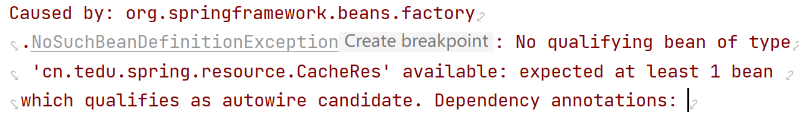
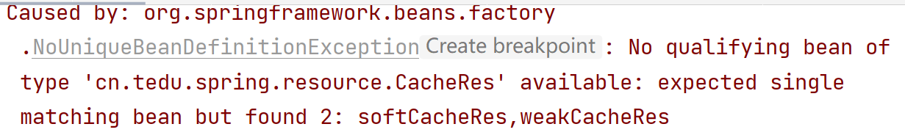

[toc]

## 1 重點（必須記住）

### 1.1 Spring Framework核心

* IoC控制反轉
* AOP面向切面編程

### 1.2 Spring Framework相關概念

* IoC控制反轉

  編程思想，將對象的創建和管理交由框架來管理，無需開發人員手動創建和管理對象

* IoC容器

  實現IoC控制反轉思想技術工具（**ApplicationContext**）

  Spring通過IoC容器進行對象的實例化、初始化、銷毀等操作

* DI依賴注入

  Spring在創建對象的過程中，將屬性值注入到對象中

### 1.3 什麽是Spring Bean對象

由Spring的IoC容器創建和管理的對象叫做：Spring Bean對象，和普通的Java對象沒有區別

### 1.4 注解

|      注解      |           添加位置           |          功能          |
| :------------: | :--------------------------: | :--------------------: |
|   @Component   |              類              | 標記為普通的spring組件 |
|  @Controller   |              類              | 標記為控制層spring組件 |
|    @Service    |              類              | 標記為業務層spring組件 |
|  @Repository   |              類              | 標記為數據層spring組件 |
|     @Value     |      屬性、setter()方法      |        依賴注入        |
|   @Autowired   | 屬性、構造方法、setter()方法 |     自動裝配[類型]     |
|   @Qualifier   |             屬性             |      根據名稱裝配      |
| @Configuration |              類              |      標記為配置類      |

### 1.5 Bean生命周期

1. 實例化階段（bean對象創建）

   在這個階段中，容器會創建一個Bean的實例，並為其分配空間。這個過程可以通過構造方法完成。

2. 屬性賦值階段

   在實例化完Bean之後，容器會把Bean中的屬性值注入到Bean中，這個過程可以通過set方法完成。

3. 初始化階段（bean對象初始化）

   在屬性注入完成後，容器會對Bean進行一些初始化操作；

4. 使用階段

   初始化完成後，Bean就可以被容器使用了

5. 銷毀階段

   容器在關閉時會對所有的Bean進行銷毀操作，釋放資源。

### 1.6 `@Autowired` 和 `@Resource` 區別

* `@Autowired` 是Spring框架的注解，`@Resource` 是JDK的標準注解

* `@Autowired` 注解是根據 `類型` 進行裝配，如果需要指定名稱則需要配合 `@Qualifier` 注解

  `@Resource` 注解首先根據名稱進行裝配，

                       如果未找到，則以屬性名作為名稱進行裝配，
      
                       如果未找到，則根據類型進行裝配

## 2 了解

### 2.1 IoC容器實現

ApplicationContext接口

**實現類**

* AnnotationConfigApplicationContext：基於注解方式構建IoC容器
* ClassPathXmlApplicationContext：基於xml配置文件方式構建IoC容器

### 2.2 注解

|      注解       | 位置 |                  功能                  |
| :-------------: | :--: | :------------------------------------: |
|    @Resource    | 屬性 |          對象類型數據自動裝配          |
|     @Scope      |  類  | 單實例singleton[默認]和多實例prototype |
| @PropertySource |  類  |            引入外部屬性文件            |
| @ComponentScan  |  類  |                自動掃描                |
| @PostConstruct  | 方法 |   Bean對象生命周期初始化時的執行方法   |
|   @PreDestroy   | 方法 |    Bean對象生命周期銷毀時的執行方法    |

### 2.3 作用域

* 單實例：某個類只能創建唯一的一個實例對象，比如：數據庫的連接池。
* 多實例：某個類可以創建多個實例對象，比如：每個用戶的購物車功能。

## 3 常見異常

* 未找到需要裝配的bean對象
  * 在類上確認是否添加 `@Component` 注解
  * 確認 `@Resource(name="xxx")` 或 `@Qualifier(value="xxx")` 中的名字是否和 `@Component(value="xxx")` 中的名字是否一致

* 預期裝配一個bean對象，但是找到了多個(接口中有多個實現類時)
  * `@Resource` 注解中，添加name參數
  * `@Qualifier` 注解中，添加value參數

### 覆制包路徑的快捷鍵

* Windows

  * 沒有Fn按鍵

    覆制：Ctrl + Shift + Alt + c

    粘貼：Ctrl + v

  * 有Fn按鍵

    覆制：Fn + Ctrl + Shift + Alt + c

    粘貼：Ctrl + v

* Mac

  * 覆制：Command + Shift + c
  * 粘貼：Command + v
