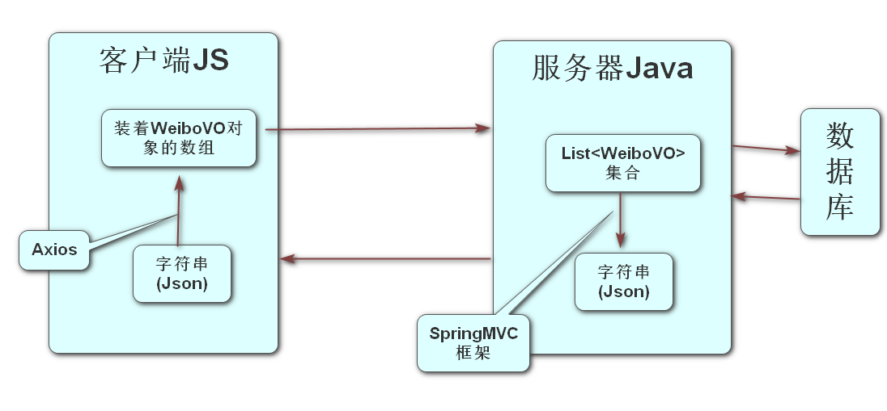

### 同步請求和異步請求

- 同步:指單線程依次做幾件事 
- 異步:指多線程同時做幾件事 
- 同步請求:指客戶端只有一個主線程,主線程既要負責頁面渲染\監聽用戶操作,還需要負責發請求,當主線程發請求時,會將頁面內容清空,直到服務器響應了數據之後再將響應的數據展示到頁面中, 這種頁面整體改變稱為頁面整體刷新, 同步請求是無法實現頁面的局部刷新的.
- 異步請求: 指客戶端瀏覽器主線程只負責頁面渲染\監聽用戶操作,由子線程負責發出請求,當子線程請求到數據後,可以將數據展示到原頁面中, 這就是頁面的局部刷新.


### 客戶端和服務器之間數據交互過程




### Security框架認證流程:

1. 在pom.xml里面添加Security框架的依賴, 然後刷新Maven, 此時工程訪問任何資源都會跳轉到Security框架自帶的登錄頁面

   ```xml
   <!-- Spring Boot支持Spring Security的依賴項，用於處理認證與授權 -->
   <dependency>
       <groupId>org.springframework.boot</groupId>
       <artifactId>spring-boot-starter-security</artifactId>
   </dependency>
   ```

2. 創建Security框架的配置類,重寫configure方法並刪除掉調用父類方法的代碼, 在里面配置了自己的登錄頁面,設置白名單,關閉跨域攻擊防禦 

	​	

```java
@Slf4j
@Configuration
public class SecurityConfig extends WebSecurityConfigurerAdapter {

    @Override
    protected void configure(HttpSecurity http) throws Exception {
        //super.configure(http);
        //配置自己的登錄頁面 當判斷沒有登錄的時候 自動跳轉到自己的登錄頁面
        http.formLogin().loginPage("/login.html");

        //配置白名單(無需登錄也可以訪問的資源)
        String[] urls = {"/reg.html","/login.html","/reg","/login"};
        http.authorizeRequests()
                .mvcMatchers(urls)//匹配某些路徑
                .permitAll() //直接放行(不需要登錄可以訪問)
                .anyRequest()//其它請求
                .authenticated();  //需要登錄認證才能訪問

        //關閉默認開啟的跨域攻擊防禦
        http.csrf().disable();
    }
}
```

	3. 創建了UserDetailServiceImpl.java這是UserDetailService接口的實現類, 在里面實現了loadUserByUsername方法,  此方法是當開啟Security框架的認證時自動調用的方法, 此方法里面如果return出的是一個null代表用戶輸入的用戶名是不存在的, 如果想要出的是一個UserDetails對象 代表用戶名存在,密碼是否正確由框架內部的代碼進行判斷.

```xjava
@Override //此方法的username代表用戶輸入的用戶名
public UserDetails loadUserByUsername(String username) throws UsernameNotFoundException {
    //此方法當Security框架進行登錄認證時,自動調用
    //當此方法響應null時 代表用戶名不存在, 下面模擬用戶輸入的用戶名是沒問題的
    //假設tom和123456是從數據庫里面查詢出來的數據
    if (username.equals("tom")){
        UserDetails userDetails = User.builder()
                .username("tom").password("123456")
                .disabled(false)//賬號是否禁用
                .accountLocked(false)//賬號是否鎖定
                .accountExpired(false)//賬號是否過期
                .credentialsExpired(false)//登錄憑證是否過期
                .authorities("權限名") //授予當前登錄的用戶的權限
                .build();
        return userDetails;
    }
    return null;//代表用戶名不存在
}
```