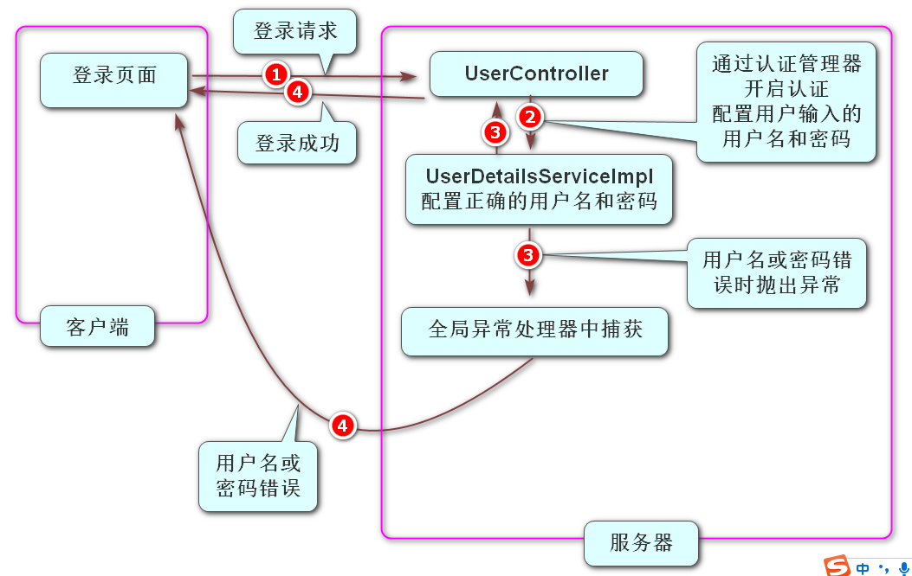
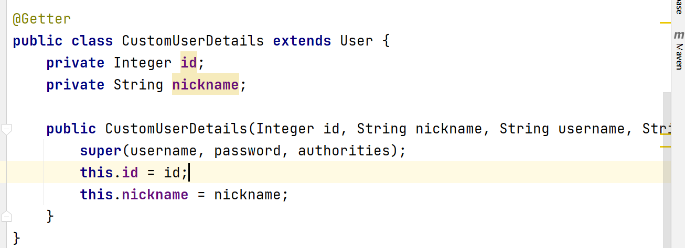
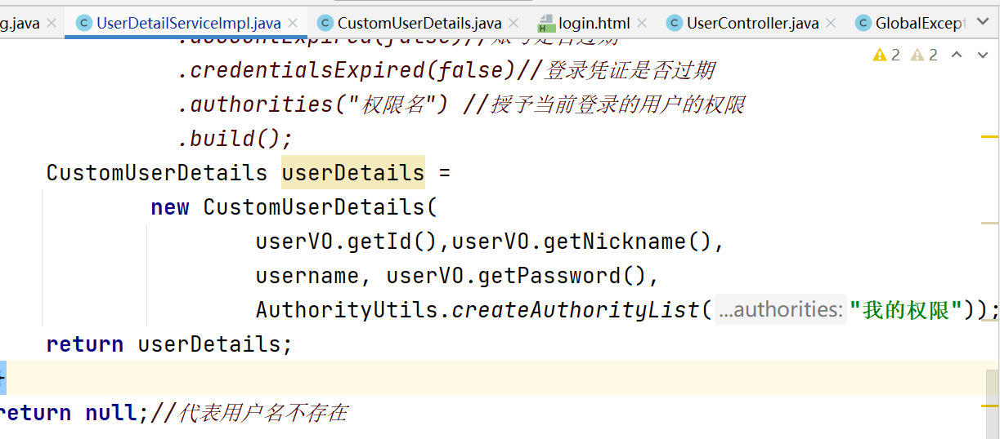

- ### Security框架認證流程:

  1. 在pom.xml里面添加Security框架的依賴, 然後刷新Maven, 此時工程訪問任何資源都會跳轉到Security框架自帶的登錄頁面

     ```xml
     <!-- Spring Boot支持Spring Security的依賴項，用於處理認證與授權 -->
     <dependency>
         <groupId>org.springframework.boot</groupId>
         <artifactId>spring-boot-starter-security</artifactId>
     </dependency>
     ```

  2. 創建Security框架的配置類,重寫configure方法並刪除掉調用父類方法的代碼, 在里面配置了自己的登錄頁面,設置白名單,關閉跨域攻擊防禦 

  	​	

  ```java
  @Slf4j
  @Configuration
  public class SecurityConfig extends WebSecurityConfigurerAdapter {
  
      @Override
      protected void configure(HttpSecurity http) throws Exception {
          //super.configure(http);
          //配置自己的登錄頁面 當判斷沒有登錄的時候 自動跳轉到自己的登錄頁面
          http.formLogin().loginPage("/login.html");
  
          //配置白名單(無需登錄也可以訪問的資源)
          String[] urls = {"/reg.html","/login.html","/reg","/login"};
          http.authorizeRequests()
                  .mvcMatchers(urls)//匹配某些路徑
                  .permitAll() //直接放行(不需要登錄可以訪問)
                  .anyRequest()//其它請求
                  .authenticated();  //需要登錄認證才能訪問
  
          //關閉默認開啟的跨域攻擊防禦
          http.csrf().disable();
      }
  }
  ```

  	3. 創建了UserDetailServiceImpl.java這是UserDetailService接口的實現類,在類名上添加@Service注解, 在里面實現了loadUserByUsername方法,  此方法是當開啟Security框架的認證時自動調用的方法, 此方法里面如果return出的是一個null代表用戶輸入的用戶名是不存在的, 如果想要出的是一個UserDetails對象 代表用戶名存在,密碼是否正確由框架內部的代碼進行判斷.

  ```java
  @Override //此方法的username代表用戶輸入的用戶名
  public UserDetails loadUserByUsername(String username) throws UsernameNotFoundException {
      //此方法當Security框架進行登錄認證時,自動調用
      //當此方法響應null時 代表用戶名不存在, 下面模擬用戶輸入的用戶名是沒問題的
      //假設tom和123456是從數據庫里面查詢出來的數據
      if (username.equals("tom")){
          UserDetails userDetails = User.builder()
                  .username("tom").password("123456")
                  .disabled(false)//賬號是否禁用
                  .accountLocked(false)//賬號是否鎖定
                  .accountExpired(false)//賬號是否過期
                  .credentialsExpired(false)//登錄憑證是否過期
                  .authorities("權限名") //授予當前登錄的用戶的權限
                  .build();
          return userDetails;
      }
      return null;//代表用戶名不存在
  }
  ```

  4. 在UserController中接收到客戶端的登錄請求時開啟Security框架的登錄認證

     - 在Security框架的配置類中配置認證管理器

       ```java
       //配置認證管理器
       @Bean //添加此注解是為了能夠在Controller中自動裝配
       @Override
       protected AuthenticationManager authenticationManager() throws Exception {
           return super.authenticationManager();
       }
       ```

     - 在Controller里面 裝配認證管理器並在方法中調用認證方法,同時把用戶輸入的用戶名和密碼傳給Security框架 

       ```java
       @Autowired
       AuthenticationManager manager;
       
       @RequestMapping("/login")
       public JsonResult login(@RequestBody UserLoginDTO userLoginDTO){
       
           //開啟Security框架的認證流程,會自動調用UserDetailsServiceImpl里面的方法
           Authentication result = manager.authenticate(
                   new UsernamePasswordAuthenticationToken(
                           userLoginDTO.getUsername(),userLoginDTO.getPassword()
                   ));
           //把認證完成之後的結果保存到Security框架的上下文中
           SecurityContextHolder.getContext().setAuthentication(result);
           //當順利執行完上面兩行代碼時說明登錄無異常 代表登錄成功
           //如果用戶名錯誤或密碼錯誤時,Security框架會拋出對應的異常,
           // 我們需要在全局異常處理的地方處理這兩個異常
           return JsonResult.ok();//登錄成功
       }
       ```

  5. 此時如果登錄成功會直接響應給客戶端JsonResult.ok()  ,如果用戶名或密碼錯誤時Security框架會拋出對應的兩個異常, 需要在全局異常處理器中進行捕獲,捕獲後響應給客戶端

     ```java
     @ExceptionHandler({InternalAuthenticationServiceException.class,
             BadCredentialsException.class})
     public JsonResult handleAuthenticationException(
             AuthenticationException e){
         if (e instanceof InternalAuthenticationServiceException){
             log.warn("用戶名不存在!");
             return new JsonResult(StatusCode.USERNAME_ERROR);
         }
         log.warn("密碼錯誤!");
         return new JsonResult(StatusCode.PASSWORD_ERROR);
     }
     ```

  6. 在Security配置類中,設置密碼無加密

     ```java
     //配置密碼的加密方式
     @Bean
     public PasswordEncoder passwordEncoder(){
         //下面代碼是獲取了一個不加密的實例
         return NoOpPasswordEncoder.getInstance();
     }
     ```

  7. 運行工程測試!

  - Security框架認證流程圖

    

  - 當登錄成功後需要獲取當前登錄用戶的信息時,使用UserDetails只能獲取到用戶名,如果需要獲取其它信息需要自定義UserDetails

    

  	

  

  ### 烘焙坊項目後端

  - 創建工程:

    - 創建SpringBoot工程, 工程名 baking

    - 勾選 Spring Web, LOmbok, MyBatis Framework, MySQL Driver

    - 在pom.xml里面添加 以下兩個依賴   , 刷新maven

      ```xml
      <!--添加Knife4j依賴-->
      <dependency>
          <groupId>com.github.xiaoymin</groupId>
          <artifactId>knife4j-openapi2-spring-boot-starter</artifactId>
          <version>4.1.0</version>
      </dependency>
      
      <!-- Spring Boot支持Spring Validation的依賴項，用於檢查參數的基本有效性 -->
      <dependency>
          <groupId>org.springframework.boot</groupId>
          <artifactId>spring-boot-starter-validation</artifactId>
      </dependency>
      ```

    - 把boot01工程中application.properties里面的內容賦值到新工程, 把數據庫名blog改成baking

    - 把老師工程中的static里面的頁面和imgs文件夾 copy到自己工程的static里面

    - 把老師工程中baking.sql 導入到自己的數據庫里面,  把文件覆制到自己的工程中 在上面右鍵Run

  ### 首頁輪播圖展示功能

  - 創建Banner實體類和BannerVO
  - 創建BannerMapper.java和BannerMapper.xml
  - 創建MyBatis配置類 
  - 在首頁中引入Axios  ,添加created方法, 在方法中向/v1/banners/發請求獲取輪播圖數據, 把得到的數據賦值給bannerArr數組, 讓頁面輪播圖內容和bannerArr數組進行綁定
  - 在application.properties中添加以下配置信息

  ```properties
  # 配置當表字段名和實體對象的屬性名命名規範不一致時 自動匹配
  mybatis.configuration.map-underscore-to-camel-case=true
  ```

  - 創建BannerController, 在里面添加方法處理/v1/banners/請求, 方法中調用mapper的select方法把得到的裝著BannerVO的List集合響應給客戶端  
