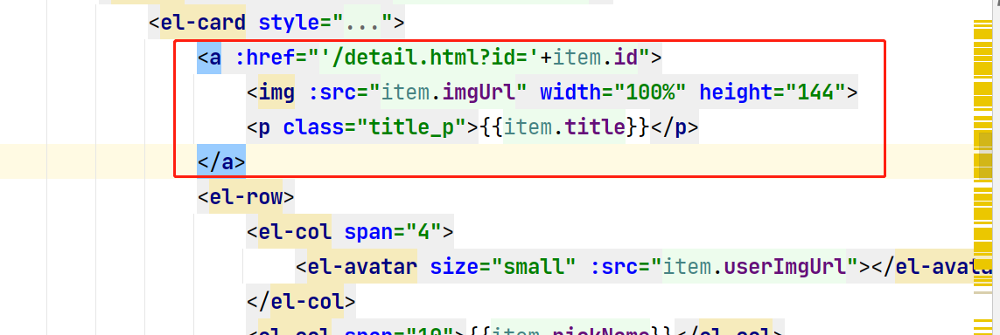
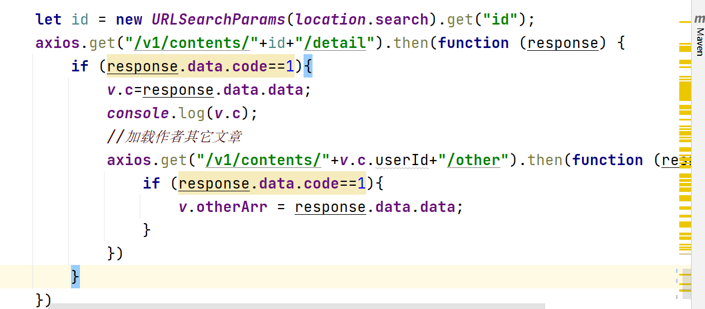
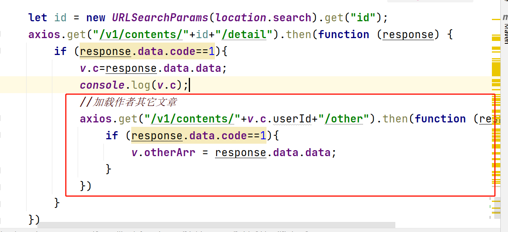
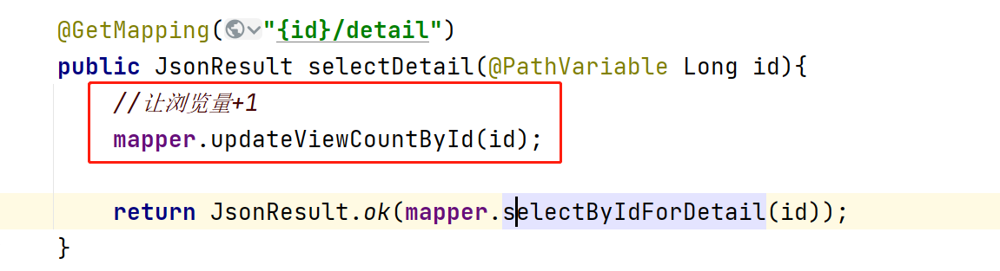

2. ### 首頁三個類型下的分類展示

   1. 在created方法里面請求三種類型下的分類數據

      ```javascript
      //請求食譜相關分類數據
      axios.get("/v1/categories/1/sub").then(function (response) {
          if (response.data.code==1){
              v.recipeCategoryArr = response.data.data;
          }
      })
      //請求視頻相關分類數據
      axios.get("/v1/categories/2/sub").then(function (response) {
          if (response.data.code==1){
              v.videoCategoryArr = response.data.data;
          }
      })
      //請求資訊相關分類數據
      axios.get("/v1/categories/3/sub").then(function (response) {
          if (response.data.code==1){
              v.infoCategoryArr = response.data.data;
          }
      })
      ```
   
   2. 在頁面中和分類數組進行綁定
   
      ```
      <el-menu @select="recipeSelect" mode="horizontal" default-active="0"
               active-text-color="orange">
          <el-menu-item index="0">全部</el-menu-item>
          <el-menu-item v-for="r in recipeCategoryArr" :index="r.id">{{r.name}}</el-menu-item>
      
      </el-menu>
      ```
   
   ### 首頁三種類型的內容展示
   
   1. 在created方法中請求三種類型的所有數據
   
      ```java
      //請求三種分類所有的數據中的前4條
      this.loadContent(1,0);
      this.loadContent(2,0);
      this.loadContent(3,0);
      ```
   
   ```java
   loadContent(type,categoryId){
       //請求食譜所有數據的前4條
       axios.get("/v1/contents/"+type+"/"+categoryId+"/index").then(function (response) {
           if (response.data.code==1){
               switch (type){
                   case 1:
                       v.recipeArr = response.data.data;
                       break;
                   case 2:
                       v.videoArr = response.data.data;
                       break;
                   case 3:
                       v.infoArr = response.data.data;
                       break;
               }
           }
       })
   }
   ```
   
    2. 在ContentController中處理上面的請求 
   
       ```java
       @GetMapping("{type}/{categoryId}/index")
       public JsonResult selectIndex(@PathVariable Integer type,
                                     @PathVariable Long categoryId){
           System.out.println("type = " + type + ", categoryId = " + categoryId);
       
           List<ContentIndexVO> list = mapper.selectByTypeAndCategoryId(type,categoryId);
       
           return JsonResult.ok(list);
       }
       ```
   
   3. 當點擊每個類型下的分類導航菜單時 需要再次發出請求 
   
   	
   
   ```java
   recipeSelect(key,keyPath){
       //key代表二級分類的id
       this.loadContent(1,key);
   },
   videoSelect(key,keyPath){
     this.loadContent(2,key);
   },
   infoSelect(key,keyPath){
     this.loadContent(3,key);
   },
   ```
   
   
   
   
   
   ### 點擊首頁和內容列表頁面中的內容時查看詳情
   
   1. 給列表中的內容添加超鏈接 請求地址為 /detail.html?id=xxxx
   
   
   
   2. 在detail.html詳情頁面中 created方法里面得到地址欄中的id,通過id查詢內容詳情,把得到的數據賦值給data里面的c變量, 讓頁面中顯示的內容和c進行綁定
   
      
   
   3. 在ContentController中處理上面的請求
   
      ```java
      @GetMapping("{id}/detail")
      public JsonResult selectDetail(@PathVariable Long id){
          //讓瀏覽量+1
          mapper.updateViewCountById(id);
      
          return JsonResult.ok(mapper.selectByIdForDetail(id));
      }
      ```
   
   ### 作者其它文章
   
   1. 在detail.html詳情頁面中查詢到內容詳情時 再次發出請求獲取當前內容作者相關的其它內容
   
      
   
   2. 在ContentController里面處理上面的請求
   
   	​	
   
   ```java
   @GetMapping("{id}/detail")
   public JsonResult selectDetail(@PathVariable Long id){
       //讓瀏覽量+1
       mapper.updateViewCountById(id);
   
       return JsonResult.ok(mapper.selectByIdForDetail(id));
   }
   ```
   
   3. 最後在detail.html頁面中 讓顯示的內容和得到的數組進行綁定  
   
      ```html
      <!--作者其它文章開始-->
      <el-card style="margin: 10px 0">
          <h3>作者其它文章</h3>
          <el-divider></el-divider>
          <el-row gutter="10" v-for="c in otherArr">
              <el-col span="10">
                  <a :href="'/detail.html?id='+c.id">
                      
                  </a>
              </el-col>
              <el-col span="14">
                  <a :href="'/detail.html?id='+c.id">
                      <p class="title_p">{{c.title}}</p>
                  </a>
                  <i class="el-icon-time">{{c.createTime}}</i>
              </el-col>
          </el-row>
      </el-card>
      <!--作者其它文章結束-->
      ```
   
   ### 熱門文章步驟同上
   
   
   
   ### 瀏覽量
   
   1. 在ContentController中 處理通過id查詢詳情的方法中 調用mapper里面修改瀏覽量的方法
   
      
   
   2. 在ContentMapper中實現上面的方法
