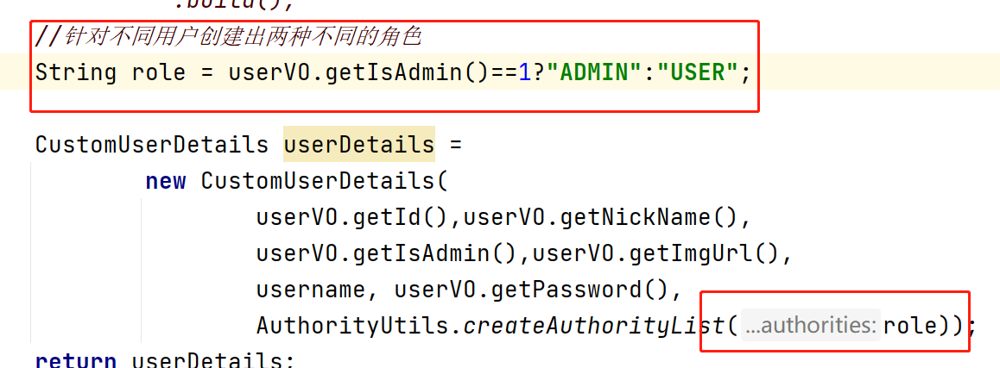
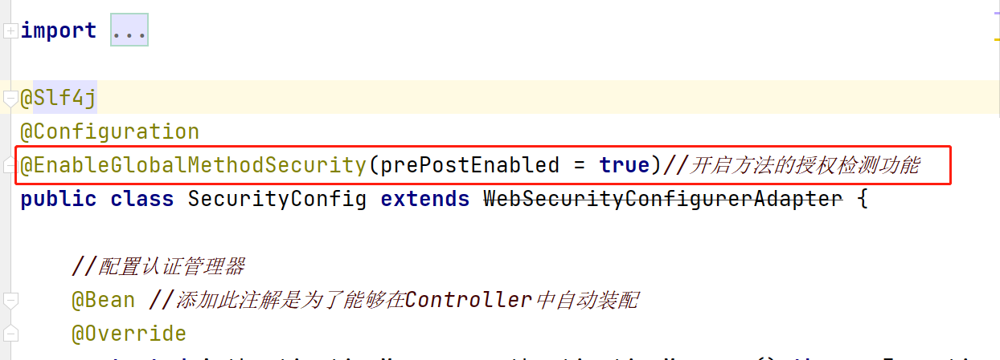
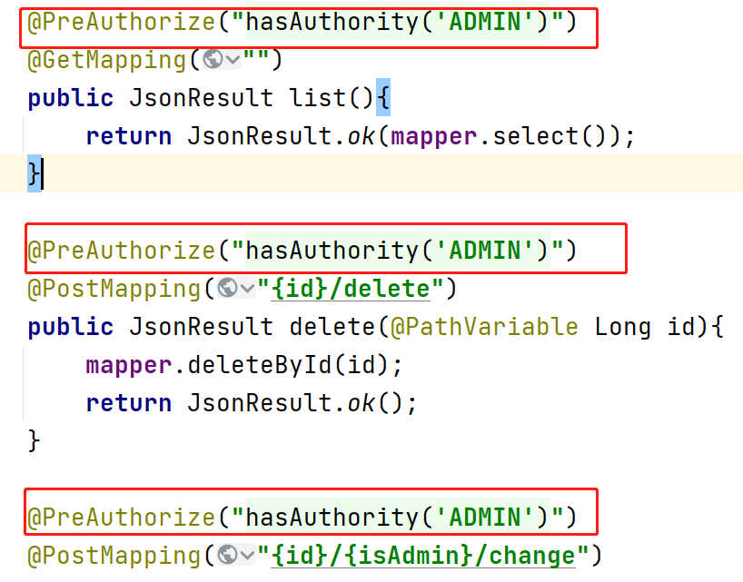
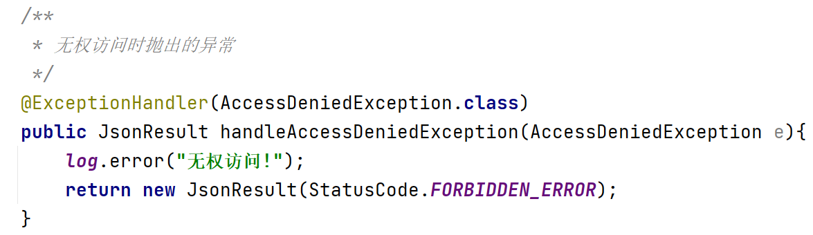

### Security框架授權流程

1. 在登錄認證時對當前登錄的用戶進行授權

   

2. 在Security配置類中添加開啟方法授權檢測的注解

   

3. 在Controller中的方法上面添加注解判斷當前登錄的用戶是否擁有此權限, 如果沒有此權限則拋出異常,在全局異常處理器中進行捕獲

   

- 在全局異常處理器中處理異常

  

### Security框架配置路徑的通配符

- ?: 代表單個未知字符(不包含/)
  - /v1/?/delete
    - /v1/a/delete
    - /v1/b/delete
- *:代表的是多個未知字符(不包含/)
  - /v1/*/delete
    - /v1/abc/delete
    - /v1/abcd/delete
- **:代表的是多個未知字符(包含/)
  - /v1/**/delete
    - /v1/abc/delete
    - /v1/abcd/delete
    - /v1/abc/delete
    - /v1/a/b/c/d/delete
