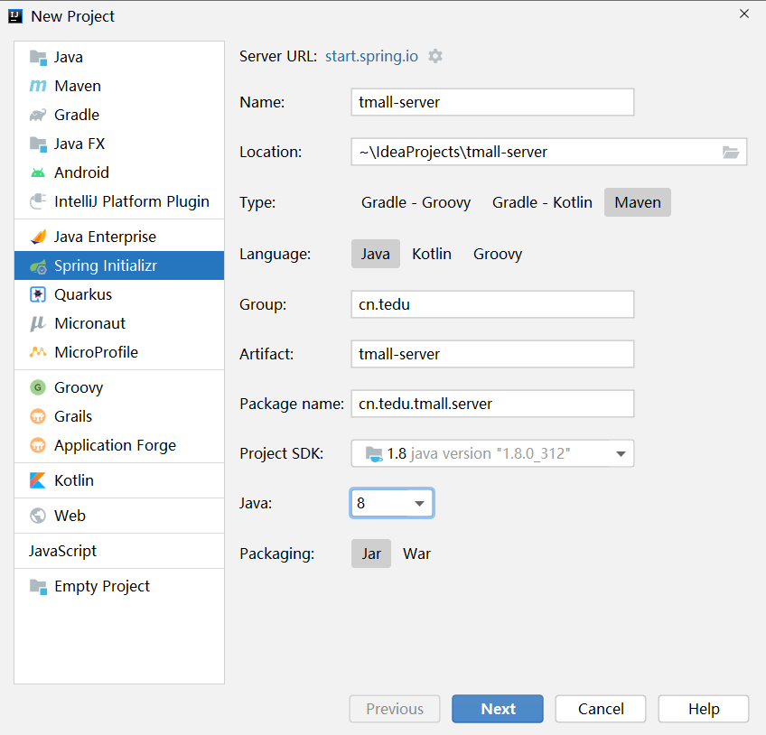
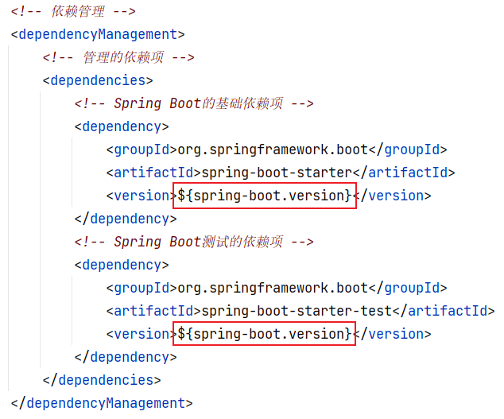
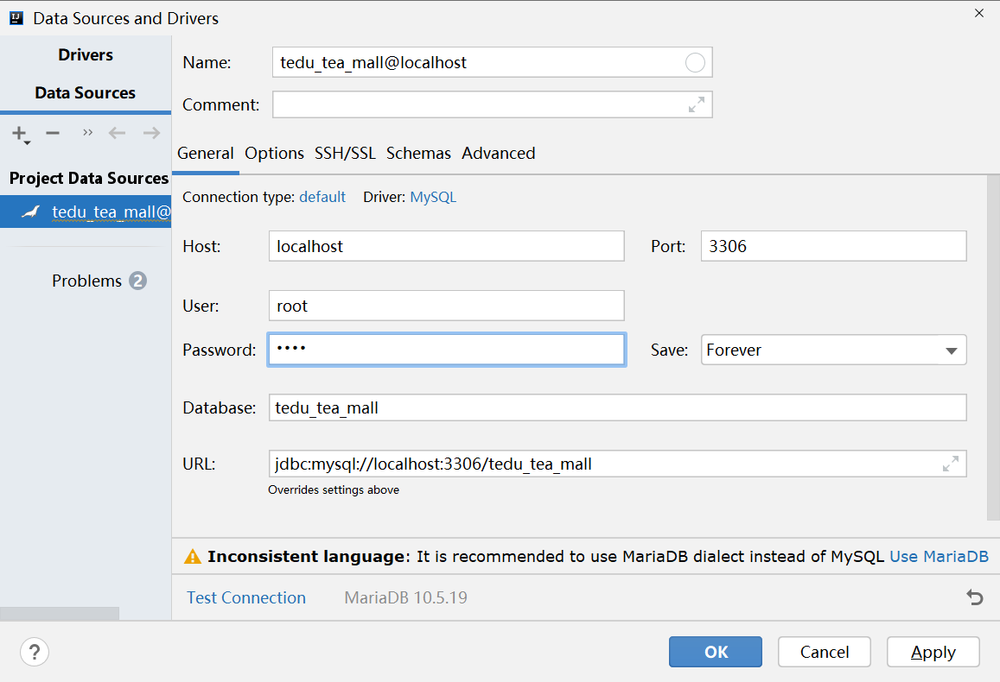
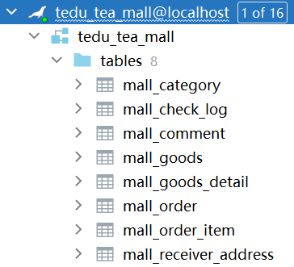
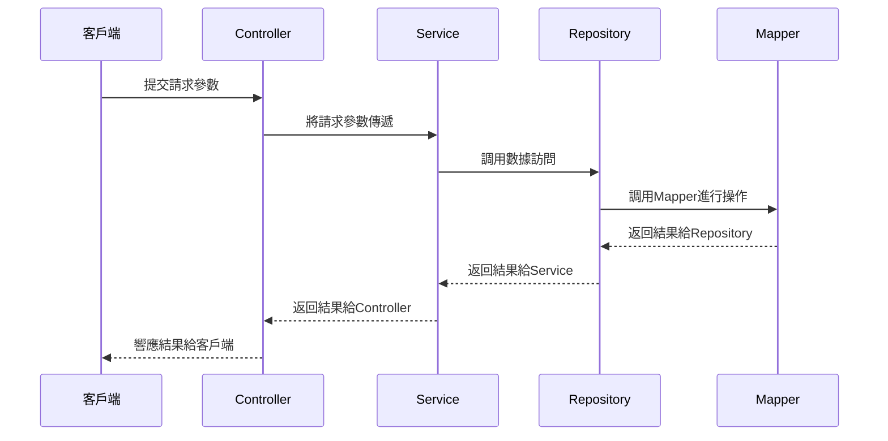
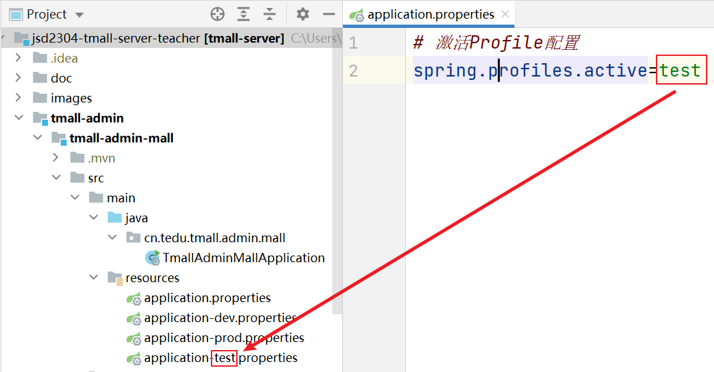
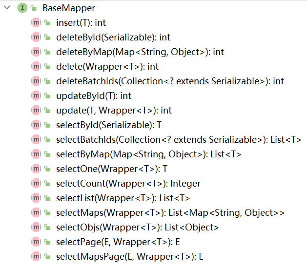
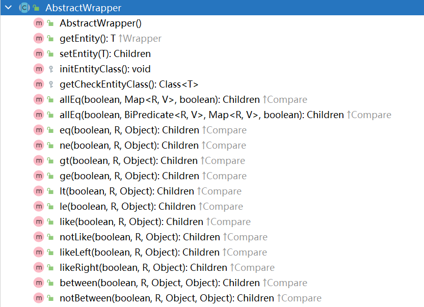
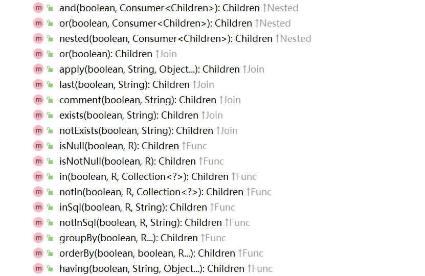
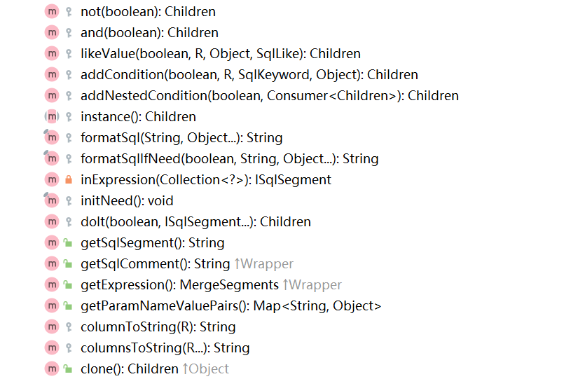

# 創建項目

創建參數如下：



在後續的創建向導界面中，選擇使用Spring Boot 2.x系列的某個版本（暫時不推薦使用3.x系列版本），不需要勾選任何依賴項，直接完成創建即可！

創建完成後，首先，打開`pom.xml`，將依賴的父級項目版本改為`2.5.x`系列的版本。

然後，在`src/test/java`下找到默認存在的測試類，執行其中的無代碼的測試方法，此測試方法應該通過成功執行，如果執行測試失敗，則應該檢查開發環境是否正確！

# 關於項目結構

當前項目需要區分出前台（普通用戶使用的）和後台（管理或運營團隊使用的）這2大類不同的項目，但是，又存在許多相同的部分（例如依賴項等），所以，應該將當前項目規劃成聚合的Maven項目，大致是：

```
整個項目：tmall-server
-- 前台項目：tmall-front
-- 後台項目：tmall-admin
-- -- 賬號管理後台項目：tmall-admin-account
-- -- 資訊管理後台項目：tmall-admin-content
-- -- 商城管理後台項目：tmall-admin-mall
-- 其它項目
```

所以，你需要：

- 刪除`tmall-server`中的`src`（因為父項目不需要編寫代碼）及`target`（如果存在的話則刪除）

- 對`tmall-server`項目名稱點右鍵，通過`New` > `Module`來創建`tmall-admin`子模塊項目

- 在`tmall-admin`的`pom.xml`中，將父級項目配置為`tmall-server`

- 在`tmall-server`的`pom.xml`中，需要配置：

  - 添加`<packaging>`標簽，此標簽默認值為`jar`，如果作為父級項目，則需要顯式的配置為`pom`，例如：

    ```xml
    <packaging>pom</packaging>
    ```

  - 添加`<modules>`標簽，顯式的列舉所有直接子級模塊項目

    ```xml
    <modules>
    	<module>tmall-admin</module>
    </modules>
    ```

- 在`tmall-admin`的`pom.xml`中，不再需要配置：

  - `groupId`
  - `version`
  - `properties`
  - `build`

## 使用父項目管理依賴項

在父項目的`pom.xml`中配置的`<denpendencies>`中的所有依賴項，將可以被子級項目繼承得到！

注意：通常不會在父項目中通過`<dependencies>`來添加依賴項，因為並不是所有的子項目都需要這里的每個依賴項！

通常，會在父項目中添加`<dependencyManagement>`標簽，此標簽的子級就是`<dependencies>`，例如：

```xml
<!-- 依賴管理 -->
<dependencyManagement>
    <!-- 管理的依賴項 -->
    <dependencies>
        <!-- Spring Boot的基礎依賴項 -->
        <dependency>
            <groupId>org.springframework.boot</groupId>
            <artifactId>spring-boot-starter</artifactId>
            <version>2.5.0</version>
        </dependency>
        <!-- Spring Boot測試的依賴項 -->
        <dependency>
            <groupId>org.springframework.boot</groupId>
            <artifactId>spring-boot-starter-test</artifactId>
            <version>2.5.0</version>
        </dependency>
    </dependencies>
</dependencyManagement>
```

使用`<dependencyManagement>`時，子級項目並不會繼承得到這些依賴項，但是，在`<dependencyManagement>`中應該顯式的配置各依賴項的版本，然後，在子級項目中添加依賴時，不再指定各依賴項的版本號！

所以，`<dependencyManagement>`的作用就是用於管理所有依賴項的版本的！

並且，所有依賴項的版本，推薦配置在`<properties>`中，例如：

```xml
<!-- 屬性配置 -->
<properties>
    <java.version>1.8</java.version>
    <spring-boot.version>2.5.0</spring-boot.version>
</properties>
```

然後，在各依賴項的管理代碼中，使用`${}`引用以上的配置值即可，例如：



完成後，使用相同的模式，在`tmall-admin`下創建`tmall-admin-mall`項目。

# 創建數據庫與數據表

登錄MySQL / MariaDB客戶端，創建`tedu_tea_mall`數據庫：

```sql
CREATE DATABASE tedu_tea_mall;
```

在IntelliJ IDEA中配置Database面板，連接到以上數據庫：



將創建數據表的SQL腳本（`create_table_mall.sql`）中的全部代碼覆制並粘貼到Console中，全部選中並執行，即可創建商城相關的數據表：



# 項目的開發流程

首先，你應該列舉當前項目中涉及的數據類型，以本項目為例，數據類型有：商品類別，審核日志，評論，商品，商品詳情，訂單，訂單項（訂單中包含的商品），收貨地址

然後，分析以上各數據類型的開發順序，通常，應該先開發基礎數據，且先開發簡單的數據，例如，以上數據類型的開發順序可以排列為：商品類別 > 商品 + 商品詳情 > 審核日志 > 收貨地址 > 訂單 + 訂單項 > 評論

接下來，應該分析各數據類型涉及的業務功能，以商品類別為例，應該包括：新增類別，刪除類別，修改類別，根據ID查詢類別，根據父級查詢子級類別列表，啟用和禁用，顯示和隱藏

關於以上業務功能，其開發順序大致遵循：增 > 查（列表）> 刪 > 改，所以，以上各業務功能的開發順序應該是：新增類別 > 根據父級查詢子級類別列表 > 根據ID查詢類別 > 刪除類別 > 啟用和禁用 > 顯示和隱藏 > 修改類別

無論是哪個業務功能，代碼的開發順序幾乎都是（不考慮中間件的情況下）：Mapper > Repository > Service > Controller > 頁面




所以，當下短期的開發目標應該是：

- 新增類別 -- Mapper 
- 新增類別 -- Repository 
- 新增類別 -- Service 
- 新增類別 -- Controller 
- 新增類別 -- 頁面
- 根據父級查詢子級類別列表 -- Mapper 
- 根據父級查詢子級類別列表 -- Repository 
- 根據父級查詢子級類別列表 -- Service 
- 根據父級查詢子級類別列表 -- Controller 
- 根據父級查詢子級類別列表 -- 頁面
- …… ……

# 添加數據庫編程的相關依賴項

數據庫編程的相關依賴項主要有：

- `mysql`
- `mybatis-spring-boot-starter`
- `lombok`（用於簡化編寫POJO類）
- `druid-spring-boot-starter`（Druid數據庫連接池）
- `mybatis-plus-boot-starter`（MyBatis Plus整合Spring Boot）

則先在`tmall-server`的`pom.xml`添加依賴管理的相關代碼：

```xml
<!-- 屬性配置 -->
<properties>
    <java.version>1.8</java.version>
    <spring-boot.version>2.5.0</spring-boot.version>
    <mybatis-spring-boot.version>2.2.2</mybatis-spring-boot.version>
    <mybatis-plus-spring-boot.version>3.3.0</mybatis-plus-spring-boot.version>
    <druid-spring-boot.version>1.2.16</druid-spring-boot.version>
    <mysql.version>8.0.27</mysql.version>
    <lombok.version>1.18.20</lombok.version>
</properties>
```

```xml
<!-- Mybatis整合Spring Boot的依賴項 -->
<dependency>
    <groupId>org.mybatis.spring.boot</groupId>
    <artifactId>mybatis-spring-boot-starter</artifactId>
    <version>${mybatis-spring-boot.version}</version>
</dependency>
<!-- Mybatis Plus整合Spring Boot的依賴項 -->
<dependency>
    <groupId>com.baomidou</groupId>
    <artifactId>mybatis-plus-boot-starter</artifactId>
    <version>${mybatis-plus-spring-boot.version}</version>
</dependency>
<!-- Alibaba Druid數據庫連接池 -->
<dependency>
    <groupId>com.alibaba</groupId>
    <artifactId>druid-spring-boot-starter</artifactId>
    <version>${druid-spring-boot.version}</version>
</dependency>
<!-- MySQL的依賴項 -->
<dependency>
    <groupId>mysql</groupId>
    <artifactId>mysql-connector-java</artifactId>
    <version>${mysql.version}</version>
</dependency>
<!-- Lombok的依賴項，主要用於簡化POJO類的編寫 -->
<dependency>
    <groupId>org.projectlombok</groupId>
    <artifactId>lombok</artifactId>
    <version>${lombok.version}</version>
</dependency>
```

再在`tmall-admin-mall`的`pom.xml`添加需要使用的依賴項：

```xml
<!-- Mybatis整合Spring Boot的依賴項 -->
<dependency>
    <groupId>org.mybatis.spring.boot</groupId>
    <artifactId>mybatis-spring-boot-starter</artifactId>
</dependency>
<!-- Mybatis Plus整合Spring Boot的依賴項 -->
<dependency>
    <groupId>com.baomidou</groupId>
    <artifactId>mybatis-plus-boot-starter</artifactId>
</dependency>
<!-- Alibaba Druid數據庫連接池 -->
<dependency>
    <groupId>com.alibaba</groupId>
    <artifactId>druid-spring-boot-starter</artifactId>
</dependency>
<!-- MySQL的依賴項 -->
<dependency>
    <groupId>mysql</groupId>
    <artifactId>mysql-connector-java</artifactId>
</dependency>
<!-- Lombok的依賴項，主要用於簡化POJO類的編寫 -->
<dependency>
    <groupId>org.projectlombok</groupId>
    <artifactId>lombok</artifactId>
</dependency>
```

提示：由於還沒有配置連接數據庫的參數，所以，當添加以上依賴項後，執行測試將出現異常！

需要在`application.properties`中添加配置：

```properties
# 連接數據庫的配置
spring.datasource.url=jdbc:mysql://localhost:3306/tedu_tea_mall?useUnicode=true&characterEncoding=utf-8&serverTimezone=Asia/Shanghai
spring.datasource.username=root
spring.datasource.password=root
```

由於Spring Boot只會在啟動或執行測試時讀取以上信息，並不會連接到數據庫服務器，所以，即使配置信息錯誤，也可以成功啟動項目或測試通過！

可以在基於Spring Boot的測試類中編寫代碼：

```java
@Autowired
DataSource dataSource;

@Test
void getConnection() throws Exception {
    dataSource.getConnection();
}
```

通過以上測試方法，可以檢查配置信息是否正確！

# 關於數據庫連接池

在Spring Boot項目中，當添加了數據庫編程的依賴項後，會自動配置並啟用`Hikari`數據庫連接池！

也可以按需替換為其它數據庫連接池，例如，當添加了`druid-spring-boot-starter`依賴項後，不需要添加或修改任何代碼，會自動切換為`Druid`數據庫連接池。

典型的數據庫連接池有：`commons-dbcp` / `commons-dbcp2` / `tomcat` / `Hikari` / `Druid`等

提示：如果添加的數據庫連接池的依賴項的`artifactId`並沒有`spring-boot-starter`字樣，例如添加的就是`druid`，則需要在`application.properties`中配置，例如：

```properties
spring.datasource.type=com.alibaba.druid.pool.DruidDataSource
```

關於數據庫連接池的配置參數：

```properties
# Druid數據庫連接池的配置：初始化連接數
spring.datasource.druid.initial-size=2
# Druid數據庫連接池的配置：最大激活數量
spring.datasource.druid.max-active=5
```

# 關於Profile配置

在項目中，許多配置值會因為環境的變化需要調整，例如，同一個屬性，在開發環境、測試環境、生產環境中，配置值可能是不同的！

Spring框架支持Profile配置，Spring Boot簡化了對於Profile配置的使用，在Spring Boot項目中，`application.properties`是始終會加載的配置文件，開發者可以自行創建更多文件名為`application-自定義名稱.properties`的配置文件，這些文件就是Profile配置文件，默認是不加載的，需要在`application.properties`中通過`spring.profiles.active`屬性顯式的激活才會生效！



提示：如果`application.properties`與激活的配置文件中存在相同的屬性，但值不同，以Profile配置文件中的配置值為準！

提示：在`spring.profiles.active`屬性上，可以配置多個值，使用逗號分隔即可，如果激活的多個Profile配置文件中存在相同的屬性且值不同，以`spring.profiles.active`屬性值中偏右側激活的文件為準

# 關於YAML配置

Spring框架默認並不支持YAML配置，需要添加`snakeyaml`工具包才可以解析此配置文件，在Spring Boot的基礎依賴項中，已經包含此工具包，所以，在Spring Boot項目中，可以直接使用YAML配置。

YAML配置是一種編寫配置文件的語法，這類配置文件將使用`.yaml`或`.yml`作為擴展名，其語法特征為：

- 屬性名與屬性值之間使用1個冒號和1個空格進行分隔
- 屬性名中原本使用小數點分隔的部分，改為使用冒號+換行+縮進2個空格
- 如果多個屬性的名稱有相同的前綴，則不必反覆寫相同的部分，只需要保持相同的縮進即可

假設原本存在`.properties`配置：

```properties
spring.datasource.url=jdbc:mysql://localhost:3306/tedu_tea_mall?useUnicode=true&characterEncoding=utf-8&serverTimezone=Asia/Shanghai
spring.datasource.username=root
spring.datasource.password=root
```

改為YAML配置：

```yaml
spring:
  datasource:
    url: jdbc:mysql://localhost:3306/tedu_tea_mall?useUnicode=true&characterEncoding=utf-8&serverTimezone=Asia/Shanghai
    username: root
    password: root
```

提示：使用YAML配置時，屬性名中的小數點並不一定需要替換為冒號+回車+縮進

注意：YAML配置對語法要求非常嚴格，甚至對標點符號要求也非常嚴格，如果YAML文件解析失敗，需要檢查整個文件

# 關於MyBatis Plus

MyBatis Plus是一款由國人開發的基於MyBatis的無侵入性的框架。

在Spring Boot中，在已經添加MyBatis編程相關的依賴項後，補充添加`mybatis-plus-boot-starter`即可在項目中使用MyBatis Plus。

就像使用MyBatis那樣，你需要先準備一個配置類，通過`@MapperScan`來指定Mapper接口的包，例如：

```java
@Configuration
@MapperScan("cn.tedu.tmall.admin.mall.dao.persist.mapper")
public class MyBatisConfiguration {
}
```

然後，以對應的包下創建Mapper接口文件，例如：

```java
package cn.tedu.tmall.admin.mall.dao.persist.mapper;

import org.springframework.stereotype.Repository;

@Repository
public interface CategoryMapper {
}
```

當使用了MyBatis Plus後，你應該讓自己的Mapper接口繼承自MyBatis Plus提供的`BaseMapper`接口，關於`BaseMapper`接口：



當自定義的Mapper接口繼承自`BaseMapper`後，可以直接使用以上所有方法實現數據訪問！

注意：使用`BaseMapper`時，需要指定其聲明的泛型類型，此類型就是當前你需要訪問的數據表對應的實體類型！

所以，還需要自行創建數據表對應的實體類，例如：

```java
/**
 * 實體類：商品-類別
 *
 * @author java@tedu.cn
 * @version 2.0
 */
@Data
public class Category implements Serializable {

    /**
     * 數據ID
     */
    private Long id;

    /**
     * 類別名稱
     */
    private String name;

    /**
     * 父級類別ID，如果無父級，則為0
     */
    private Long parentId;

    /**
     * 深度，最頂級類別的深度為1，次級為2，以此類推
     */
    private Integer depth;

    /**
     * 關鍵詞列表，各關鍵詞使用英文的逗號分隔
     */
    private String keywords;

    /**
     * 排序序號
     */
    private Integer sort;

    /**
     * 圖標圖片的URL
     */
    private String icon;

    /**
     * 是否啟用，1=啟用，0=未啟用
     */
    private Integer enable;

    /**
     * 是否為父級（是否包含子級），1=是父級，0=不是父級
     */
    private Integer isParent;

    /**
     * 是否顯示在導航欄中，1=啟用，0=未啟用
     */
    private Integer isDisplay;

    /**
     * 數據創建時間
     */
    private LocalDateTime gmtCreate;

    /**
     * 數據最後修改時間
     */
    private LocalDateTime gmtModified;

}
```

準備好實體類後，使得自定義的Mapper接口繼承自`BaseMapper`，例如：

```java
package cn.tedu.tmall.admin.mall.dao.persist.mapper;

import cn.tedu.tmall.admin.mall.pojo.entity.Category;
import com.baomidou.mybatisplus.core.mapper.BaseMapper;
import org.springframework.stereotype.Repository;

@Repository
public interface CategoryMapper extends BaseMapper<Category> {
}
```

注意：當使用`BaseMapper`時傳入了實體類型後，MyBatis Plus會根據實體類的名稱得到數據表名稱，例如實體類名為`Category`，則MyBatis Plus認為對應的數據表名稱就是`category`，如果需要自行指定數據表名稱，需要在實體類上添加`@TableName`注解進行配置，例如：

```java
@Data
@TableName("mall_category")
public class Category implements Serializable {
    // ...
}
```

在插入數據時，MyBatis Plus有自己的ID編號規則，並不是從1開始自動編號的，如果需要使用自動編號的ID，需要在主鍵對應的屬性上配置`@TableId`注解，例如：

```java
@Data
@TableName("mall_category")
public class Category implements Serializable {

    /**
     * 數據ID
     */
    @TableId(type = IdType.AUTO) // 自動編號，步長為1
    private Long id;
    
    // ...
    
}
```

經過以上配置後，新插入的數據會在現有的最大ID值基礎上自增1，得到新的ID值！

注意：如果插入數據的表的主鍵是自動編號的，當成功插入數據後，MyBatis Plus會獲取新數據的自動編號ID值，並存入到參數對象中與主鍵對應的屬性（通常是`id`屬性）上，即：

```java
@Test
void insert() {
    Category category = new Category();
    category.setName("測試的類別的名稱");
    System.out.println("插入數據之前，參數：" + category);
    int rows = mapper.insert(category);
    System.out.println("受影響的行數：" + rows);
    System.out.println("插入數據之後，參數：" + category); // 參數的id是有值的
}
```

MyBatis Plus提供的許多方法都可以使用`Wrapper`類型的參數，其簡單使用方式如下：

```java
@Test
void delete() {
    // eq >>> equals
    // ne >>> not equals
    // lt >>> less than
    // gt >>> greater than
    QueryWrapper<Category> wrapper = new QueryWrapper<>();
    wrapper.lt("id", 15);
    int rows = mapper.delete(wrapper);
    System.out.println("受影響的行數：" + rows);
}
```

使用`QueryWrapper`時，可以用於指定條件的方法都來自其父類`AbstractWrapper`，大致包括：






