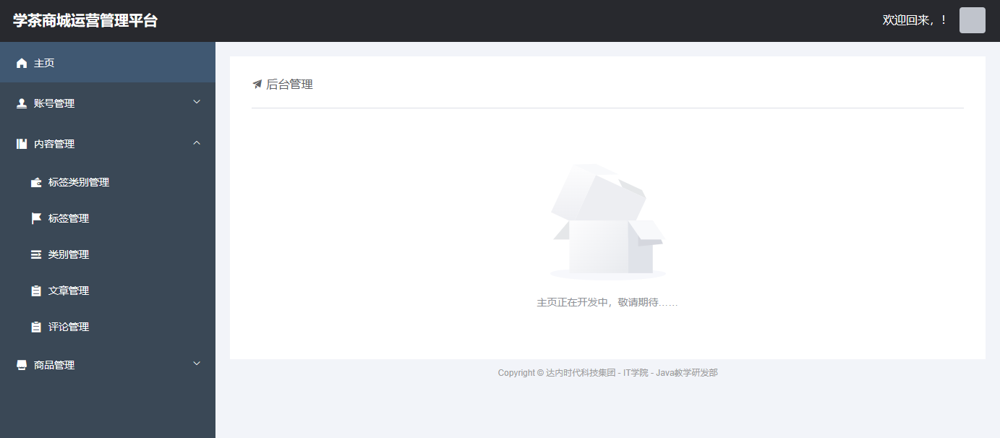

# 關於VUE Cli項目

VUE Cli創建的項目通常稱之為“VUE腳手架項目”。

VUE Cli項目是一種單頁面的項目，在這種項目中，只有1個HTML文件！具體的內容顯示是由各個`.vue`文件（視圖組件文件）來實現的，每個顯示效果都可能是由多個`.vue`共同組成的，每個`.vue`的顯示位置也可以輕松替換為另一個`.vue`文件的顯示效果，就可以實現“搭積木”的方式來構建頁面！

# 關於VUE Cli項目的結構

- `[.idea]`：由IntelliJ IDEA打開的項目都有此文件夾，是由IntelliJ IDEA維護的，不需要手動管理，如果此文件夾下的文件出錯，刪除即可，後續IntelliJ IDEA會自動重新創建所需的文件
- `[node_modules]`：當前項目的所有依賴項，此文件夾通常會被配置到`.gitignore`文件中，如果項目中缺少此文件夾，或缺少此文件夾下的部分依賴項，都可能導致項目無法正常使用，需要通過`npm install`命令來安裝相關軟件（下載必要的依賴項），此命令會根據`package.json`中配置的依賴列表來下載各依賴項
- `[public]`：項目的靜態資源文件夾，用於存放`.html`、`.css`、`.js`、圖片等靜態資源，在具體使用時，可以按需自行創建文件夾來管理各文件，在訪問時，此文件夾相當於主機的根路徑，例如在`public`下直接存放`a.jpg`，訪問路徑則是`http://localhost:8080/a.jpg`
  - `favicon.ico`：圖標文件
  - `index.html`：當前項目唯一的HTML文件
- `[src]`：源代碼
  - `[assets]`
  - `[components]`
  - `[router]`：路由配置文件的文件夾
    - `index.js`：默認的路由配置文件
  - `[store]`
  - `[views]`：存放視圖組件的文件夾
  - `App.vue`：默認會被注入到`index.html`中的視圖組件
  - `main.js`：當前項目的主要配置文件
- `.gitignore`：用於配置使用GIT倉庫時忽略的文件或文件夾，在此文件中配置的文件、文件夾均不會被提交到GIT倉庫
- `babel.config.js`：~
- `jsconfig.json`“：~
- `package.json`
- `package-lock.json`
- `vue-config.js`：~

# 關於視圖組件

在VUE Cli項目中，以`.vue`作為擴展名的文件就是視圖組件文件，這類文件通常可能包含：

- `<template>`：用於設計頁面中的元素
  - 注意：此標簽只能有1個直接子標簽
- `<script>`：用於編寫JavaScript程序
- `<style>`：用於編寫CSS樣式

# 關於路由配置

在VUE Cli項目中，`src/router/index.js`是默認的路由配置文件，此文件中配置了“路徑”與“視圖組件”的映射關系。

默認的配置如下：

```java
import HomeView from '../views/HomeView.vue'

const routes = [
  {
    path: '/',
    name: 'home',
    component: HomeView
  },
  {
    path: '/about',
    name: 'about',
    component: () => import('../views/AboutView.vue')
  }
]
```

以上`routes`常量是數組類型的，其中的元素是對象，每個對象都是一個“路由對象”！

在路由對象中，`path`表示訪問路徑，`component`表示視圖組件，`name`是可以缺省的！

其中，`component`屬性的值可以是通過`import`語句來導入某個視圖組件，也可以通過`import()`函數來導入某個視圖組件。

# 關於`<router-view/>`標簽

在VUE Cli項目中，在視圖組件中可以添加`<router-view/>`標簽，表示此標簽所在的位置將由其它視圖組件來完成顯示及對應的功能！具體由哪個視圖組件來顯示，取決於路由配置！

# 使用Element UI

在VUE Cli項目中，當需要使用Element UI時，需要先在當前項目中安裝，安裝命令為：

```
npm i element-ui -S
```

並且，在`main.js`中補充添加配置：

```javascript
import ElementUI from 'element-ui';
import 'element-ui/lib/theme-chalk/index.css';

Vue.use(ElementUI);
```

至此，配置完成，並且，整個項目的任何視圖組件都可以直接使用Element UI。

# 設計登錄頁


# 作業

在客戶端項目中，將原`HomeView`的內容調整為以下顯示效果：



注意：提交作業時，將壓縮包中的`node_modules`文件夾刪掉再上傳！

作業提交截止時間：明天(07.08)上午09:00。
