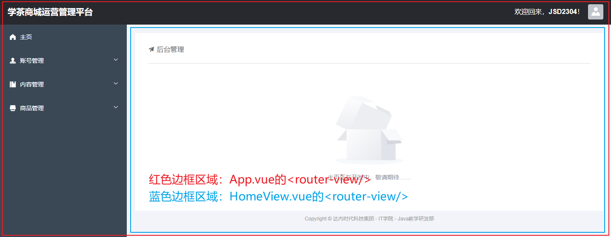
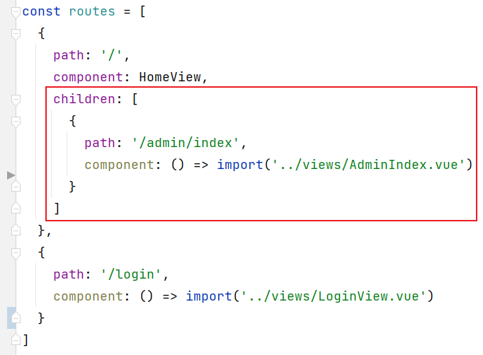

# 關於跨域訪問

服務器端默認不允許異步的跨域請求。

> 關於跨域：只要主機名、端口號、通訊協議中的任何一項不同，即為跨域訪問。

跨域訪問導致的錯誤信息中，關鍵字為：CORS。完整的錯誤信息大致如下：

```
Access to XMLHttpRequest at 'http://localhost:8080/v1/users/login' from origin 'http://localhost:8081' has been blocked by CORS policy: Response to preflight request doesn't pass access control check: No 'Access-Control-Allow-Origin' header is present on the requested resource.
```

在基於Spring MVC的服務器端項目中，可以自定義配置類，實現`WebMvcConfigurer`接口，重寫其中的`addCorsMappings()`方法，以配置允許的跨域訪問！

簡單的配置如下：

```java
import lombok.extern.slf4j.Slf4j;
import org.springframework.context.annotation.Configuration;
import org.springframework.web.servlet.config.annotation.CorsRegistry;
import org.springframework.web.servlet.config.annotation.WebMvcConfigurer;

/**
 * Spring MVC配置類
 *
 * @author java@tedu.cn
 * @version 2.0
 */
@Slf4j
@Configuration
public class WebMvcConfiguration implements WebMvcConfigurer {

    public WebMvcConfiguration() {
        log.debug("創建配置類對象：WebMvcConfiguration");
    }

    @Override
    public void addCorsMappings(CorsRegistry registry) {
        registry.addMapping("/**")
                .allowedHeaders("*")
                .allowedMethods("*")
                .allowedOriginPatterns("*")
                .allowCredentials(true)
                .maxAge(3600);
    }

}
```

# 在VUE Cli項目中使用axios

首先，需要安裝axios，安裝命令為：

```
npm i axios -S
```

然後，在`main.js`中添加配置：

```javascript
import axios from 'axios';

Vue.prototype.axios = axios;
```

登錄示例：

```javascript
submitForm(formName) {
  this.$refs[formName].validate((valid) => {
    if (valid) {
      let url = 'http://localhost:8080/v1/users/login';
      console.log('url = ' + url);

      this.axios.post(url, this.ruleForm).then((response) => {
        let jsonResult = response.data;
        if (jsonResult.code == 1) {
          this.$message({
            message: '登錄成功！',
            type: 'success'
          });
        } else {
          this.$alert(jsonResult.msg, '錯誤', {
            confirmButtonText: '確定',
            callback: action => {
            }
          });
        }
      });
    } else {
      return false;
    }
  });
}
```

# 嵌套路由

在VUE Cli項目中，只要訪問“非靜態資源”，都會認為你嘗試訪問`index.html`，則會由`App.vue`注入到頁面中，而`App.vue`基本上是通過`<router-view/>`由其它視圖組件來完成顯示的，其它視圖組件中可能也包含`<router-view/>`，就出現了`<router-view/>`的嵌套，則在配置路由時，也需要配置嵌套的路由！

例如：



在`src/router/index.js`中配置路由時，如果某個視圖組件使用到了`<router-view/>`，則可以在對應的路由對象中添加`children`屬性，此屬性的配置方式與`routes`常量完全相同，例如：



簡單理解：

- 如果把路由對象配置在`routes`常量中，此視圖組件將顯示在`App.vue`的`<router-view/>`位置
- 如果把路由對象配置在某個路由的`children`中，此視圖組件將顯示在此路由對應的視圖組件的`<router-view/>`位置

需要注意：由於`HomeView`中設計了`<router-view/>`，則`HomeView`是一個不完整的View，不應該允許直接訪問，可以在當前路由對象上添加`redirect`屬性，表示“重定向”，即：當嘗試訪問`HomeView`時，直接重定向（跳轉）到另一個視圖組件
