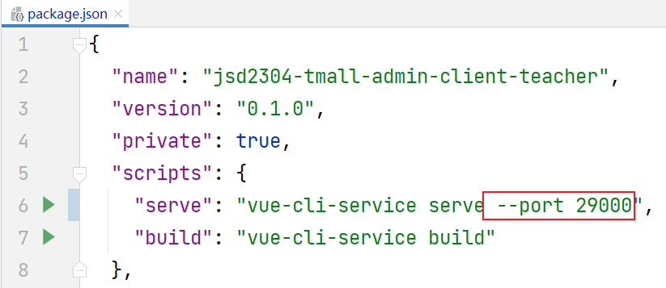
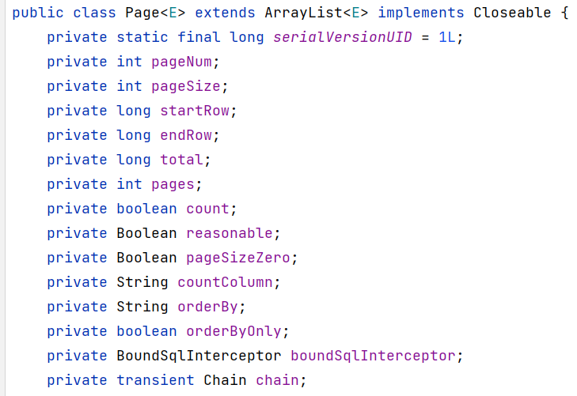

# 在VUE Cli項目中使用qs

qs是前端技術中，可以實現“對象與FormData格式的字符串”的轉換的工具包！

安裝命令為：

```
npm i qs -S
```

並且，需要在`main.js`中補充配置：

```javascript
import qs from 'qs';
Vue.prototype.qs = qs;
```

然後，就可以在視圖組件中，通過`qs`將對象轉換成FormData格式的字符串，例如：

```javascript
let formData = this.qs.stringify(this.ruleForm);
console.log('formData = ' + formData);
```

# 指定服務端口

在Spring Boot項目中，可以通過配置文件中的`server.port`屬性指定端口號，例如：

```yaml
server:
  port: 28182
```

在VUE Cli項目中，可以通過`package.json`中的`scripts`屬性的`serve`屬性值修改端口號，在原值的基礎上添加`--port 新端口號`即可，例如：



# 關於PageHelper框架

PageHelper框架是專門用於MyBatis的無侵入性的分頁框架（是通過MyBatis攔截器實現的）。

在Spring Boot項目中，需要添加`pagehelper-spring-boot-starter`依賴項後才可以使用PageHelper框架：

```xml
<pagehelper-spring-boot.version>1.3.0</pagehelper-spring-boot.version>
```

```xml
<!-- 基於MyBatis或MyBatis Plus的分頁查詢框架 -->
<dependency>
    <groupId>com.github.pagehelper</groupId>
    <artifactId>pagehelper-spring-boot-starter</artifactId>
    <version>${pagehelper-spring-boot.version}</version>
</dependency>
```

然後，如果項目中已經使用MyBatis / MyBatis Plus實現了列表查詢功能，就可以直接開始處理分頁，例如：

```java
@SpringBootTest
public class PageHelperTests {

    @Autowired
    CategoryMapper mapper;

    @Test
    void listByParent() {
        Integer pageNum = 1; // 第幾頁
        Integer pageSize = 6; // 每頁幾條
        Long parentId = 0L;
        PageHelper.startPage(pageNum, pageSize); // 設置分頁，注意：這句話必須直接出現在查詢之前，否則可能導致線程安全問題
        List<?> list = mapper.listByParent(parentId);
        for (Object item : list) {
            System.out.println(item);
        }
    }

}
```

注意：以上調用`PageHelper.startPage()`與Mapper的查詢，必須是連續的2條語句，否則，可能導致線程安全問題！

當通過PageHelper執行分頁查詢後，查詢返回的集合將是`com.github.pagehelper.Page`類型的，是`ArrayList`的子級類型，並且，其中包含了許多分頁的相關數據：



由於使用MyBatis查詢列表時，抽象方法的返回值類型都會聲明為`List`類型，則獲取的返回結果不利於從中獲取以上分頁相關數據，為了便於獲取以上分頁數據，還應該結合PageHelper框架中的`PageInfo`類一起使用，將查詢結果作為`PageInfo`的構造方法參數傳入即可，再調用`PageInfo`對象的方法獲取數據，例如：

```java
PageInfo<?> pageInfo = new PageInfo<>(list);
System.out.println("數據總量：" + pageInfo.getTotal());
System.out.println("總頁數：" + pageInfo.getPages());
```
