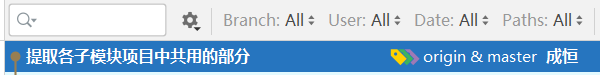

# 提取各子模塊項目中共用的部分

多個子模塊項目可能使用到相同的類，反覆編寫這些類是沒有必要的！所以，應該將這些類提取到專門的子模塊項目中，其它子模塊項目直接依賴它即可！

則在根項目下創建`tmall-common`子模塊項目，並且，`tmall-admin-content`和`tmall-admin-mall`均依賴於`tmall-common`。

然後，將`tmall-admin-content`和`tmall-admin-mall`中相同的，且不是組件的類，移動到`tmall-common`中，並調整各源代碼文件的`import`語句。

具體調整項可參考GIT提交日志（2023-08-02 09:47）：



# 基於RBAC的用戶權限管理

**RBAC**：**R**ole-**B**ased **A**ccess **C**ontrol，即“基於角色的訪問控制”

在設計用戶的訪問權限的相關數據表時，應該包括：

- 用戶表
- 角色表
- 權限表
- 用戶與角色的關聯表
- 角色與權限的關聯表

# 登錄 -- 創建項目

在根項目下創建`tmall-passport`子模塊項目，用於處理“單點登錄”相關事項。

單點登錄：在集群或分布式系統中，用戶只需要在某個特定的服務器上完成登錄的驗證，後續，在任何一個服務器上都可以識別此用戶的身份！

參考此前創建項目的做法創建出新的項目，並添加`spring-boot-starter-security`依賴項，完成後，在項目中添加配置文件（`application.yaml`系列），並且，由於已經添加了`knife4j-spring-boot-starter`，還需要在項目中添加`Knife4jConfiguration`配置類，完成後，即可啟動項目，在瀏覽器中訪問此項目的任何URL，都會被重定向到Spring Security內置的默認登錄頁面！

# 簡單的配置Spring Security

```java
package cn.tedu.tmall.passport.config;

import org.springframework.context.annotation.Configuration;
import org.springframework.security.config.annotation.web.builders.HttpSecurity;
import org.springframework.security.config.annotation.web.configuration.WebSecurityConfigurerAdapter;

@Configuration
public class SecurityConfiguration extends WebSecurityConfigurerAdapter {

    @Override
    protected void configure(HttpSecurity http) throws Exception {
        // 白名單
        // 配置路徑時，使用Ant-Style匹配模式：
        // 使用1個星號可以匹配當前層級的任何內容，例如 /user/* 可以匹配 /user/delete、/user/list，但不可以匹配 /user/9527/delete
        // 使用2個星號可以匹配若幹層級的任何內容，例如 /user/** 可以匹配 /user/delete、/user/list、/user/9527/delete
        String[] urls = {
                "/doc.html",
                "/**/*.js",
                "/**/*.css",
                "/swagger-resources",
                "/v2/api-docs",
                "/favicon.ico",
                "/test/**",
                "/passport/login",
        };

        // 禁用“防止偽造的跨域攻擊”的防禦機制（CSRF）
        http.csrf().disable();

        // 配置請求授權
        http.authorizeRequests()
                .mvcMatchers(urls).permitAll()
                .anyRequest().authenticated();

        // 是否啟用登錄表單
        // 如果調用以下方法，則啟用，當未通過認證時，會重定向到登錄表單
        // 如果未調用以下方法，則禁用，當未通過認證時，會響應403
        // http.formLogin();
    }

}
```

經過以上配置，可以：

- 自定義“白名單”列表
- 提交POST請求（禁用“防止偽造的跨域攻擊”的防禦機制）
- 控制是否使用登錄表單

# 自定義賬號的登錄

Spring Security在驗證登錄時，會自動使用客戶端提交的用戶名來調用`UserDetailsService`對象的`loadUserByUsername(String username)`方法，並得到此方法返回的`UserDetails`類型的對象，接下來，Spring Security框架會自動的判斷`UserDetails`對象中的賬號狀態，並對比客戶端提交的密碼與`UserDetails`對象中的密碼是否匹配，最終返回登錄成功與否的結果！

```java
package cn.tedu.tmall.passport.security;

import org.springframework.security.core.userdetails.User;
import org.springframework.security.core.userdetails.UserDetails;
import org.springframework.security.core.userdetails.UserDetailsService;
import org.springframework.security.core.userdetails.UsernameNotFoundException;
import org.springframework.stereotype.Component;

@Component
public class UserDetailsServiceImpl implements UserDetailsService {

    @Override
    public UserDetails loadUserByUsername(String s) throws UsernameNotFoundException {
        // root / 123456
        if (!"root".equals(s)) {
            return null;
        }

        UserDetails userDetails = User.builder()
                .username("root")
                .password("$2a$10$N.ZOn9G6/YLFixAOPMg/h.z7pCu6v2XyFDtC4q.jeeGm/TEZyj15C")
                .disabled(false)
                .accountLocked(false)
                .accountExpired(false)
                .credentialsExpired(false)
                .authorities("山寨權限")
                .build();
        return userDetails;
    }

}
```

當Spring容器中存在`UserDetailsService`類型的對象時，啟動項目時，不再生成隨機的UUID密碼，且默認的`user`賬號是不可用的！

# 使用數據庫中的賬號實現登錄

需要實現“根據用戶名查詢用戶的登錄信息”的DAO層的訪問！

創建`UserLoginInfoVO`類：

```java
@Data
public class UserLoginInfoVO implements Serializable {

    private String username;
    private String password;
    private Integer enable;

}
```

覆制`MyBatisConfiguration`，並注意修改`@MapperScan`指定的包。

創建`UserMapper`接口，並聲明抽象方法：

```java
public interface UserMapper {
    UserLoginInfoVO getLoginInfoByUsername(String username);
}
```

創建`UserMapper.xml`用於配置SQL語句：

```xml
<?xml version="1.0" encoding="UTF-8" ?>
<!DOCTYPE mapper PUBLIC "-//mybatis.org//DTD Mapper 3.0//EN" "http://mybatis.org/dtd/mybatis-3-mapper.dtd">

<mapper namespace="cn.tedu.tmall.passport.dao.persist.mapper.UserMapper">

    <!-- UserLoginInfoVO getLoginInfoByUsername(String username); -->
    <select id="getLoginInfoByUsername"
            resultType="cn.tedu.tmall.passport.pojo.vo.UserLoginInfoVO">
        SELECT
            username, password, enable
        FROM
            account_user
        WHERE
            username=#{username}
    </select>

</mapper>
```

創建`IUserRepository`接口，並聲明抽象方法：

```java
public interface UserMapper {
    UserLoginInfoVO getLoginInfoByUsername(String username);
}
```

創建`UserRepositoryImpl`類，實現以上方法：

```java
@Repository
public class UserRepositoryImpl implements IUserRepository {

    @Autowired
    private UserMapper userMapper;

    @Override
    public UserLoginInfoVO getLoginInfoByUsername(String username) {
        return userMapper.getLoginInfoByUsername(username);
    }

}
```

修改`UserDetailsServiceImpl`中的實現，返回的結果將根據以上查詢功能進行處理：

```java
@Override
public UserDetails loadUserByUsername(String s) throws UsernameNotFoundException {
    UserLoginInfoVO loginInfo = userRepository.getLoginInfoByUsername(s);
    if (loginInfo == null) {
        return null;
    }

    UserDetails userDetails = User.builder()
            .username(loginInfo.getUsername())
            .password(loginInfo.getPassword())
            .disabled(loginInfo.getEnable() == 0)
            .accountLocked(false)
            .accountExpired(false)
            .credentialsExpired(false)
            .authorities("山寨權限")
            .build();
    return userDetails;
}
```

# 使用前後端分離的登錄

核心處理步驟：

- 禁用Spring Security的登錄表單
- 創建登錄的參數類，至少包含：用戶名、密碼
- 自定義控制器，添加方法，用於接收客戶端提交的登錄請求
- 在配置類中使用`@Bean`方法配置`AuthenticationManager`
- 使用Service處理驗證登錄：通過`AuthenticationManager`

在`SecurityConfiguration`中的配置方法中，不再調用`http.formLogin()`，以禁用Spring Security的登錄表單。

創建`UserLoginInfoParam`參數類：

```java
@Data
public class UserLoginInfoParam implements Serializable {

    private String username;
    private String password;
    
}
```

在`SecurityConfiguration`類中配置`AuthenticationManager`對象：

```java
@Bean
@Override
public AuthenticationManager authenticationManagerBean() throws Exception {
    return super.authenticationManagerBean();
}
```

創建`IUserService`接口，添加抽象方法：

```java
public interface IUserService {
    
    void login(UserLoginInfoParam userLoginInfoParam);
    
}
```

創建`UserServiceImpl`類，實現以上方法：

```java
@Service
public class UserServiceImpl implements IUserService {

    @Autowired
    private AuthenticationManager authenticationManager;

    @Override
    public void login(UserLoginInfoParam userLoginInfoParam) {
        Authentication authentication
                = new UsernamePasswordAuthenticationToken(
                        userLoginInfoParam.getUsername(), userLoginInfoParam.getPassword());
        Authentication authenticateResult
                = authenticationManager.authenticate(authentication);
        SecurityContext securityContext = SecurityContextHolder.getContext();
        securityContext.setAuthentication(authenticateResult);
    }

}
```

創建`UserController`，處理登錄請求：

```java
@RestController
@RequestMapping("/passport")
public class UserController {

    @Autowired
    private IUserService userService;

    @PostMapping("/login")
    public JsonResult login(UserLoginInfoParam userLoginInfoParam) {
        userService.login(userLoginInfoParam);
        return JsonResult.ok();
    }

}
```

建議創建測試的控制器，對各種情況進行模擬的訪問，例如：

```java
@RestController
@RequestMapping("/test")
@Api(tags = "測試訪問")
public class TestController {

    @GetMapping("/simple-get")
    @ApiOperation("【無需登錄】簡單的GET請求")
    @ApiOperationSupport(order = 100)
    public String simpleGet() {
        return "服務器端響應了簡單的GET請求！";
    }

    @PostMapping("/simple-post")
    @ApiOperation("【無需登錄】簡單的POST請求")
    @ApiOperationSupport(order = 101)
    public String simplePost() {
        return "服務器端響應了簡單的POST請求！";
    }

    @GetMapping("/authenticated-get")
    @ApiOperation("【需要登錄】簡單的GET請求")
    @ApiOperationSupport(order = 200)
    public String authenticatedGet() {
        return "【需要登錄】服務器端響應了簡單的GET請求！";
    }

}
```

# 關於Session

HTTP協議是無狀態的協議，即：同一個客戶端向同一個服務器發起的多次請求，每次請求時，服務器端都無法判斷此客戶端是不是此前來訪問的客戶端！

在開發軟件時，為了使得服務器端能夠識別客戶端的身份，就引入了Session機制，當某個客戶端第1次向服務器端發起請求後，服務器端會向客戶端響應一個Session ID，本質是一個UUID值，後續，當客戶端向服務器端發起請求時，會自動攜帶此Session ID（由瀏覽器或編程相關的API等），服務器端將根據Session ID來識別客戶端的身份！

同時，在服務器端的內存中，Session表現為一個很大的K-V結構數據，將使用Session ID作為Key，則每個曾經來訪的客戶端（在Session未過期之前）在服務器端都有一份對應的Value。

由於Session的工作機制，導致Session可能存在以下不足：

- 不適合存儲大量的數據
  - 可以通過開發規範來解決
- 不適合用於集群或分布式系統
  - 可以通過共享Session來解決，但是會帶來新的問題
- 不可以長時間保存用戶數據
  - 無解
