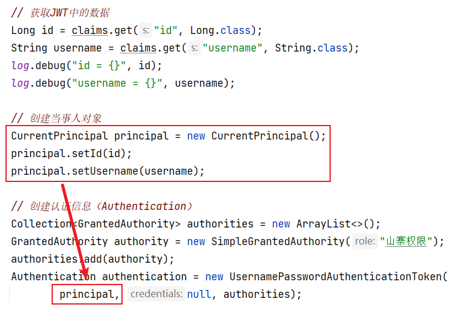
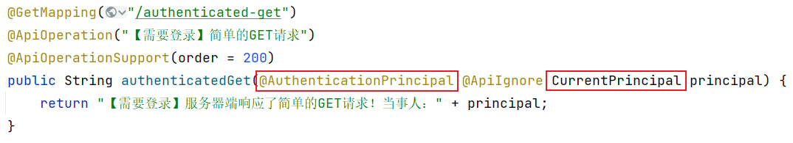
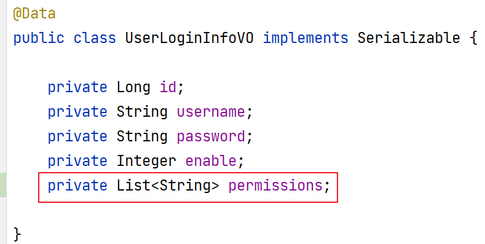
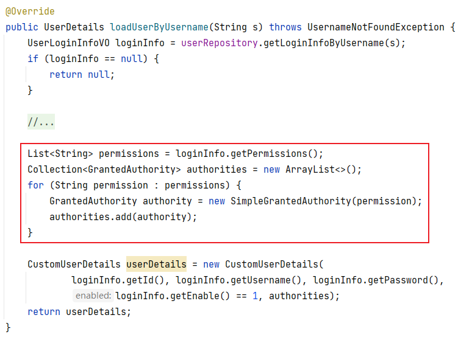
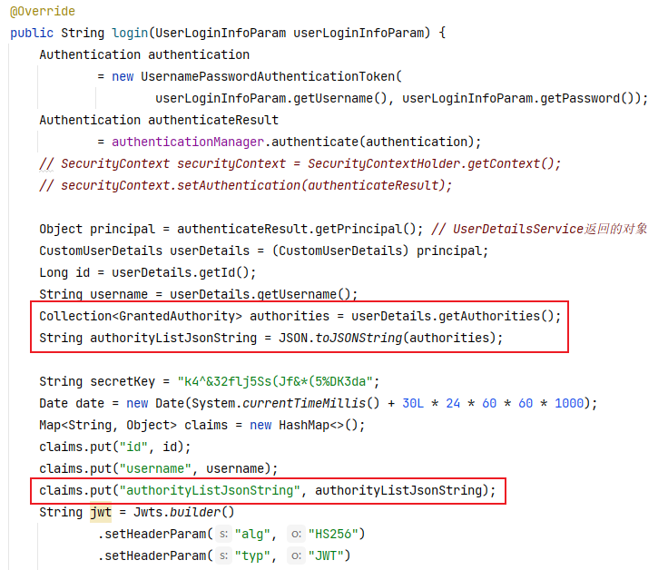
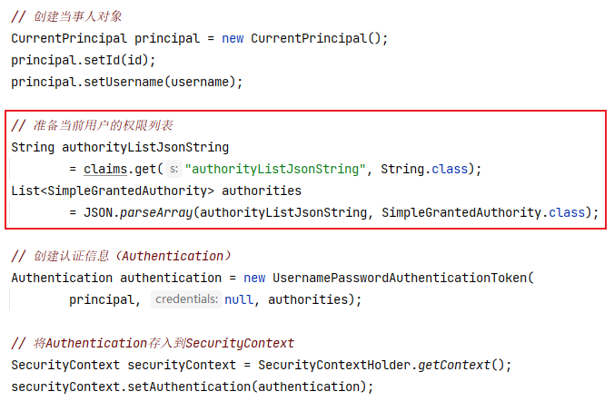
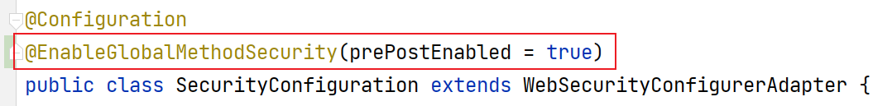
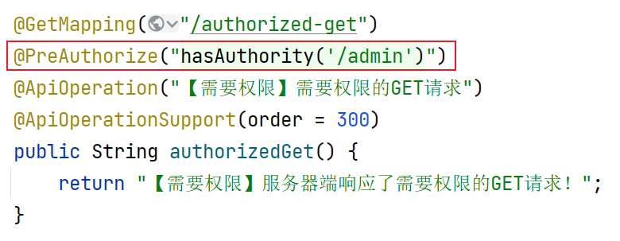

# 處理解析JWT時可能出現的異常

由於當前在Filter中解析JWT，而全局異常處理器只能處理Controller拋出的異常，所以，本次處理異常不可以使用全局異常處理器，則可以使用傳統的`try...catch`語法進行捕獲並處理：

```java
// 嘗試解析JWT
response.setContentType("application/json; charset=utf-8");
String secretKey = "k4^&32flj5Ss(Jf&*(5%DK3da";
Claims claims = null;
try {
    claims = Jwts.parser()
            .setSigningKey(secretKey)
            .parseClaimsJws(jwt)
            .getBody();
} catch (SignatureException e) {
    String message = "非法訪問！";
    JsonResult jsonResult = JsonResult.fail(ServiceCode.ERR_JWT_SIGNATURE, message);
    String jsonResultString = JSON.toJSONString(jsonResult);
    PrintWriter printWriter = response.getWriter();
    printWriter.println(jsonResultString);
    printWriter.close();
    return;
} catch (MalformedJwtException e) {
    String message = "非法訪問！";
    JsonResult jsonResult = JsonResult.fail(ServiceCode.ERR_JWT_MALFORMED, message);
    String jsonResultString = JSON.toJSONString(jsonResult);
    PrintWriter printWriter = response.getWriter();
    printWriter.println(jsonResultString);
    printWriter.close();
    return;
} catch (ExpiredJwtException e) {
    String message = "您的登錄信息已過期，請重新登錄！";
    JsonResult jsonResult = JsonResult.fail(ServiceCode.ERR_JWT_EXPIRED, message);
    String jsonResultString = JSON.toJSONString(jsonResult);
    PrintWriter printWriter = response.getWriter();
    printWriter.println(jsonResultString);
    printWriter.close();
    return;
} catch (Throwable e) {
    log.debug("全局異常處理器開始處理Throwable");
    log.debug("異常跟蹤信息如下：", e);
    String message = "服務器忙，請稍後再試！【同學們，看到這句時，你應該檢查服務器端的控制台，並在JwtAuthorizationFilter中補充catch代碼塊進行處理】";
    JsonResult jsonResult = JsonResult.fail(ServiceCode.ERROR_UNKNOWN, message);
    String jsonResultString = JSON.toJSONString(jsonResult);
    PrintWriter printWriter = response.getWriter();
    printWriter.println(jsonResultString);
    printWriter.close();
    return;
}
```

# 正確的使用當事人

Spring Security並不關心你使用什麽類型的當事人，你可以按需使用任何數據類型作為當事人，並且，在Controller中，可以使用`@AuthenticationPrincipal`注解來注入當事人（根據`SecurityContext`中的認證信息的當事人類型來注入參數）。

可以在`tmall-common`中（因為各子模塊項目均可能需要使用）自定義當事人類型：

```java
@Data
public class CurrentPrincipal implements Serializable {

    /**
     * 當事人ID
     */
    private Long id;
    /**
     * 當事人用戶名
     */
    private String username;

}
```

然後，創建認證信息時，存入自定義的當事人對象：



後續，當Controller需要識別當事人時，注入即可，例如：



# 處理用戶的權限

在“根據用戶名查詢用戶的登錄信息”功能中，必須查詢出此用戶對應的權限列表，需要執行的SQL語句大致是：

```sql
SELECT
    account_user.id,
    account_user.username,
    account_user.password,
    account_user.enable,
    account_permission.value
FROM account_user
LEFT JOIN account_user_role ON account_user.id=account_user_role.user_id
LEFT JOIN account_role_permission ON account_user_role.role_id=account_role_permission.role_id
LEFT JOIN account_permission ON account_role_permission.permission_id=account_permission.id
WHERE username='root';
```

在`UserLoginInfoVO`類中添加“權限列表”屬性：



查詢數據庫中的數據時，需要將用戶的權限列表也查出來：

```xml
<?xml version="1.0" encoding="UTF-8" ?>
<!DOCTYPE mapper PUBLIC "-//mybatis.org//DTD Mapper 3.0//EN" "http://mybatis.org/dtd/mybatis-3-mapper.dtd">

<mapper namespace="cn.tedu.tmall.passport.dao.persist.mapper.UserMapper">

    <!-- UserLoginInfoVO getLoginInfoByUsername(String username); -->
    <select id="getLoginInfoByUsername" resultMap="LoginInfoResultMap">
        SELECT
            account_user.id,
            account_user.username,
            account_user.password,
            account_user.enable,
            account_permission.value
        FROM account_user
        LEFT JOIN account_user_role ON account_user.id=account_user_role.user_id
        LEFT JOIN account_role_permission ON account_user_role.role_id=account_role_permission.role_id
        LEFT JOIN account_permission ON account_role_permission.permission_id=account_permission.id
        WHERE username=#{username}
    </select>

    <resultMap id="LoginInfoResultMap" 
               type="cn.tedu.tmall.passport.pojo.vo.UserLoginInfoVO">
        <id column="id" property="id"/>
        <result column="username" property="username"/>
        <result column="password" property="password"/>
        <result column="enable" property="enable"/>
        <collection property="permissions" ofType="java.lang.String">
            <constructor>
                <arg column="value"/>
            </constructor>
        </collection>
    </resultMap>

</mapper>
```

在`UserDetailsService`中返回的`UserDetails`中需要包含權限列表：



驗證登錄成功後，向JWT中存入權限列表，注意：不要將權限列表直接存入，否則，後續解析時將無法正確的反序列化，應該將權限列表生成為JSON格式的字符串，後續解析時將JSON字符串反序列化為原本的對象！



過濾器中，從JWT中獲取權限列表：



# 基於方法的權限檢查

首先，需要在Spring Security的配置類上開啟基於方法的權限檢查：



然後，在需要檢查權限的方法上，使用`@PreAuthorize`注解來配置所需的權限：

