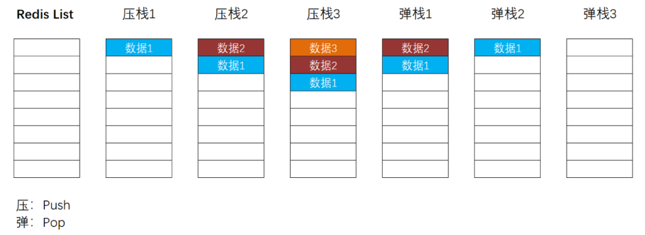
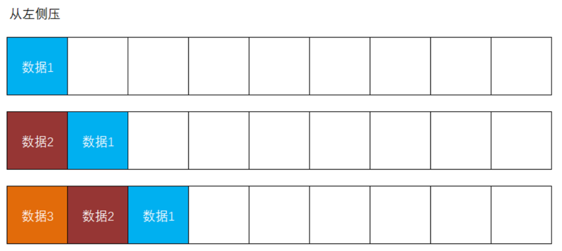
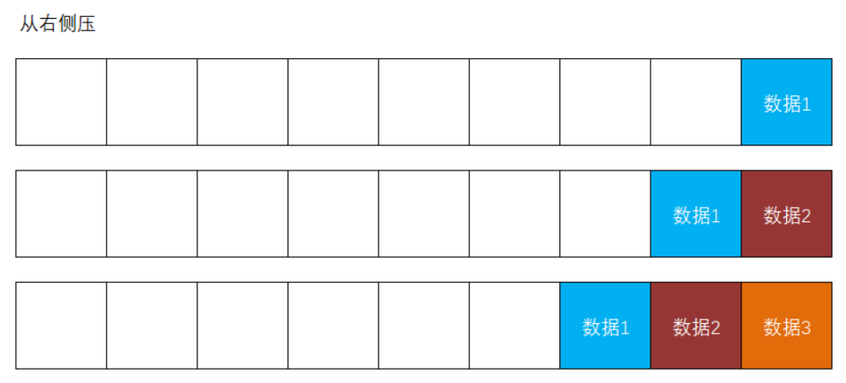
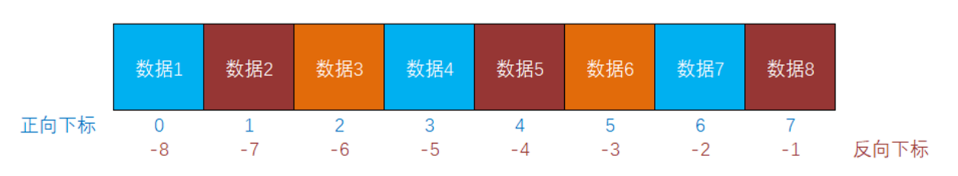

# 關於SSO

**SSO** = **S**ingle **S**ign **O**n，單點登錄，表現為在集群或分布式系統中，客戶端只需要在某1個服務上登錄，接下來，無論訪問到集群中的哪個服務，都可以被識別身份！

單點登錄的常用實現手段有：

- 使用Session並共享Session：使用1台或多台專門的服務器用於存放Session數據，所有的應用服務器都從專門的Session服務器上讀寫Session
- 使用Token機制：每個應用服務器上都需要有相同的解析Token的程序代碼

基於當前項目，如果需要在`tmall-admin-mall`中識別客戶端的身份（客戶端攜帶了JWT發起請求），則需要：

- 添加依賴：`spring-boot-starter-security`、`fastjson`、`jjwt`
- 覆制`JwtAuthorizationFilter`
- 覆制`SecurityConfiguration`
  - 可以刪除配置`PasswordEncoder`的`@Bean`方法
  - 可以刪除配置`AuthenticationManager`的`@Bean`方法
  - 應該調整“白名單”
- 覆制自定義的JWT配置

完成後，由於在`tmall-admin-mall`項目中添加了`spring-boot-starter-security`，只要不在“白名單”中的請求都是需要通過認證的，只需要攜帶在`tmall-passport`項目中登錄時得到的JWT，在`tmall-admin-mall`項目中也可以被識別身份，將視為“已登錄”（或“已通過認證”）的狀態！

# 關於覆雜請求的跨域訪問

當客戶端提交請求時，如果請求頭中包括特定的屬性（例如`Authorization`等），則此請求會被視為覆雜請求！

當客戶端嘗試提交覆雜請求時，瀏覽器會執行“預檢（PreFlight）”，即默認先對請求路徑提交`OPTIONS`類型的請求，如果此請求被允許，則會自動提交原本嘗試提交的請求，如果被拒絕，則不會提交原本嘗試提交的請求！

在使用Spring Security時，默認情況下，不允許客戶端提交跨域的覆雜請求！如果要允許，可以：

- 在Spring Security的配置類中，調用`HttpSecurity`對象的`cors()`方法，即可啟用Spring Security的`CorsFilter`，將對覆雜請求的預檢進行放行
- 在Spring Security的配置類中，調用`HttpSecurity`對象來配置請求授權，對`OPTIONS`類型的請求放行即可

注意：瀏覽器會對覆雜請求的預檢結果進行緩存，如果此前預檢通過，則後續請求時不再執行預檢！

# 關於Redis

Redis是一款基於內存的、使用K-V結構存儲數據的NoSQL非關系型數據庫。

> 數據庫：數據的倉庫，只要能夠實現數據的讀寫，這類的軟件都可以稱之為數據庫，通常，在沒有特定的修飾的表達中，泛指“關系型數據庫”。
>
> 非關系型數據庫：對所有的數據一視同仁，並不表現數據之間的關系。
>
> NoSQL：No SQL / No Operation SQL，不使用SQL語句操作數據庫的數據。
>
> 基於內存的：Redis的數據是直接存儲在內存中的。注意：Redis會自動的將所管理的數據同步到磁盤上，並且，在每次啟動時都會自動將磁盤上的數據同步到內存中，所以，即使計算機重啟或斷電，Redis中的數據基本上不會丟失。

由於Redis是基於內存的，所以，Redis的讀寫效率非常高！

Redis的主要作用是“緩存數據”，通常的表現為：將關系型數據庫（例如MySQL）中的數據取出，並存入到Redis中，後續，當需要讀取相關數據時，不再從關系型數據庫中讀取，而是優先從Redis中讀取！

由於Redis是基於內存的，所以，讀寫效率遠高於基於磁盤的關系型數據庫，Redis的查詢效率非常高，單次查詢耗時更短，就可以承受更大的訪問量，並減少了對關系型數據庫的訪問，從而起到保護關系型數據庫的作用！


# Redis中的常用命令

當登錄Redis客戶端（命令提示符變成`127.0.0.1>6379`後），可以執行Redis的相關命令：

- `set KEY VALUE`：存入數據，例如`set username1 tom`，如果KEY不存在，則表示新增數據，如果KEY已經存在，則會覆蓋原有的數據，所以，`set`命令既是新增數據的命令，也是修改數據的命令
- `get KEY`：取出數據，例如`get username1`，如果KEY存在，則返回對應的VALUE，如果KEY不存在，則返回`(nil)`，相當於Java中的`null`

- `keys PATTERN`：根據模式（`PATTERN`）獲取KEY的列表，例如`keys username1`，如果存在匹配模式的KEY，則返回這些KEY的集合，如果不存在，則返回`(empty list or set)`，在使用模式時，可以使用`*`作為通配符，例如`keys username*`，將返回所有以`username`作為前綴的KEY，甚至，你可以使用`keys *`查詢所有KEY
  - **注意：**在生產環境中，禁止使用此命令！

- `del KEY [KEY ...]`：根據若幹個KEY（至少1個）刪除數據，將返回受影響的數據量，例如執行`delete age1`，當此KEY存在時，將返回`(integer) 1`，當此KEY不存在時，將返回`(integer) 0`
- `flushdb`：清空當前數據庫

更多命令可參考：https://www.cnblogs.com/antLaddie/p/15362191.html

# Redis中的數據類型

Redis中的經典數據類型有5種，分別是：string（一般值，例如字符串、數值等可以直接字面表示的） / list / set / hash（對象，對應Java語句中的`Map`） / zset

另外，還有：bitmap / hyperloglog / Geo / Stream

# Redis中的list類型

在Redis中，list類型的數據使用的是先進後出、後進先出的棧結構：



在學習Redis時，應該把Redis中的棧結構水平旋轉90度來理解！

在操作Redis中的list數據時，可以從左側進行壓棧或彈棧的操作，例如：



也可以從右側進行壓棧或彈棧的操作，例如：



當從Redis中讀取list的數據時，**始終從左至右讀取數據**，通常，為了符合絕大多數開發者的使用習慣，會采“從右側壓入數據”的做法。

在Redis的list中，每個數據都有2個下標值，分別是從左至右、從0開始順序遞增的下標，和從右至左、從-1開始順序遞減的下標，例如：



注意：在獲取list的數據區間時，必須保證start在end的左側！

# Redis編程

在基於Spring Boot的項目中，實現Redis編程需要添加`spring-boot-starter-data-redis`依賴項。

然後，需要使用`RedisTemplate`工具類的API實現Redis編程，通常會在配置類中使用`@Bean`方法來配置`RedisTemplate`，則後續可以在任何組件類中自動裝配`RedisTemplate`，然後調用相關訪問來訪問數據。

關於配置類：

```java
package cn.tedu.tmall.admin.mall.config;

import org.springframework.context.annotation.Bean;
import org.springframework.context.annotation.Configuration;
import org.springframework.data.redis.connection.RedisConnectionFactory;
import org.springframework.data.redis.core.RedisTemplate;
import org.springframework.data.redis.serializer.RedisSerializer;

import java.io.Serializable;

@Configuration
public class RedisConfiguration {

    @Bean
    public RedisTemplate<String, Serializable> redisTemplate(
            RedisConnectionFactory redisConnectionFactory) {
        RedisTemplate<String, Serializable> redisTemplate = new RedisTemplate<>();
        redisTemplate.setConnectionFactory(redisConnectionFactory);
        redisTemplate.setKeySerializer(RedisSerializer.string());
        redisTemplate.setValueSerializer(RedisSerializer.json());
        return redisTemplate;
    }

}
```
