# 關於單點登錄的補充實現

## 向JWT中存入的數據調整為：用戶ID、用戶名、IP地址、瀏覽器信息

- **tmall-passport: IUserService**

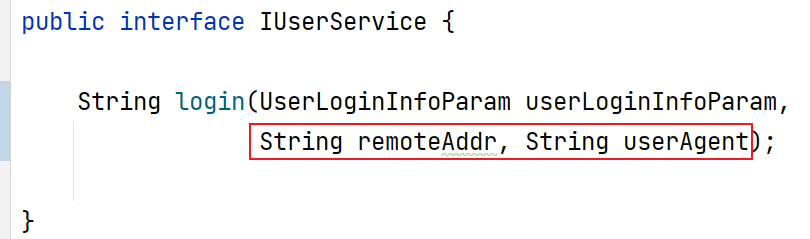

- **tmall-passport: UserServiceImpl**

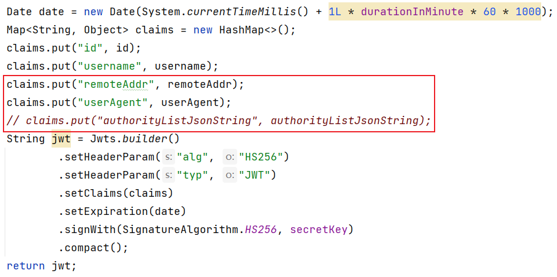

- **tmall-passport: UserController**

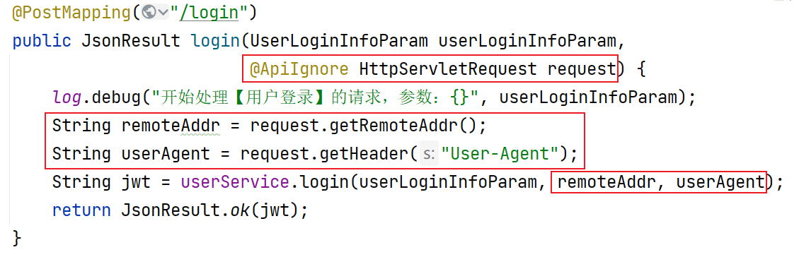

## 向Redis中存入數據：權限列表、啟用狀態

- 添加Redis編程的依賴項及`hutool`的依賴項

- **tmall-common**：新增PassportCacheConsts

  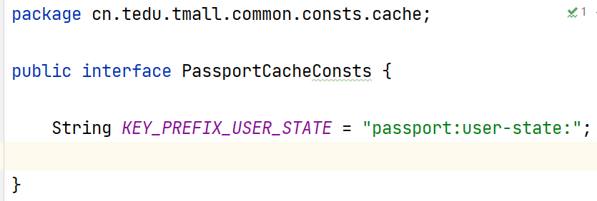

- **tmall-common**：UserStatePO

  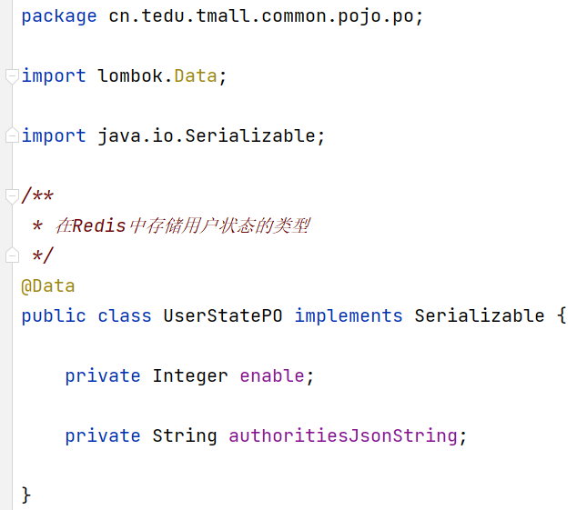

- **tmall-passport**：IUserCacheRepository

  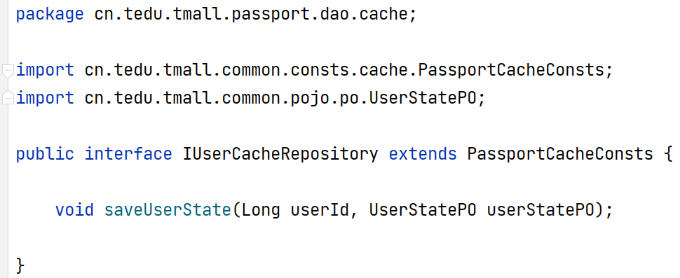

- **tmall-passport**：UserCacheRepositoryImpl

  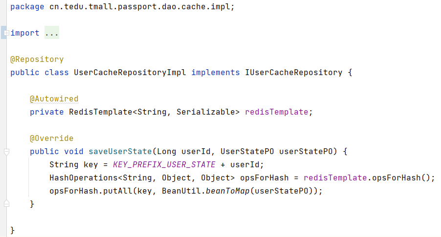

- **tmall-passport**：UserServiceImpl

  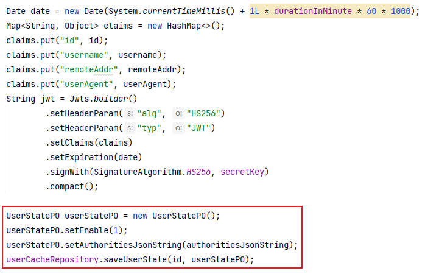

## 更新解析JWT的代碼

- **tmall-passport**：IUserCacheRepository

  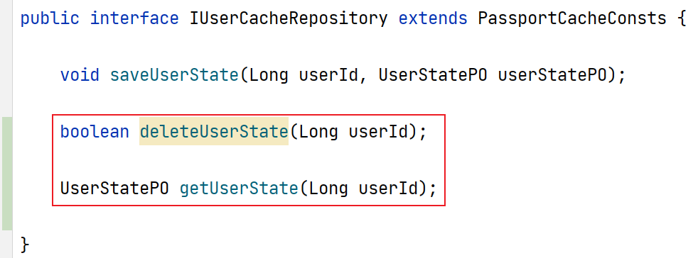

- **tmall-passport**：UserCacheRepositoryImpl

  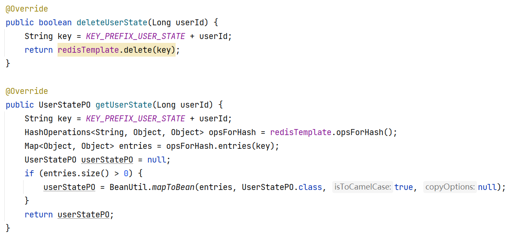

- **tmall-passport**：JwtAuthorizationFilter

  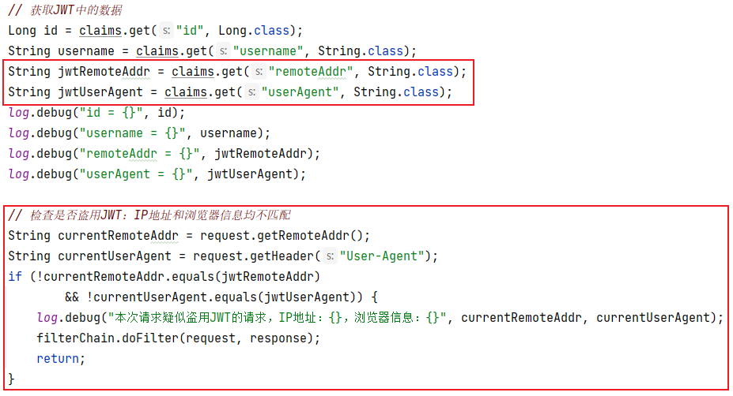

  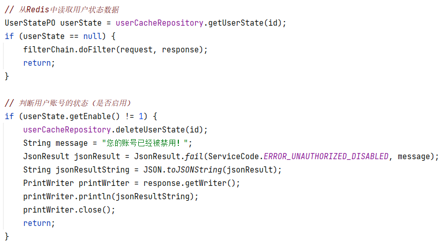

  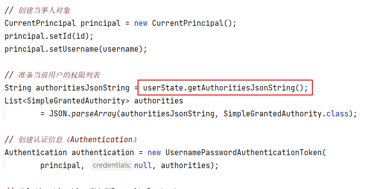

# 登錄成功的響應結果

當用戶登錄成功後，服務器端向客戶端響應的數據應該包括：

- id：備用
- 用戶名：用於顯示在客戶端的界面
- 頭像：用於顯示在客戶端的界面
- JWT
- 權限列表：用於客戶端程序判斷是否應該顯示某些內容，例如是否顯示某個菜單項、某個按鈕等

則應該創建`UserLoginResultVO`類，封裝以上屬性：

```java
@Data
public class UserLoginResultVO implements Serializable {
    private Long id;
    private String username;
    private String avatar;
    private String token;
    private String[] authorities;
}
```

在`IUserService`中的登錄方法的返回值類型改為以上創建的`UserLoginResultVO`類型，並同步調整實現類中的方法的返回值。

然後：

- 在`UserLoginInfoVO`類中添加`String avatar`屬性
- 在`UserMapper.xml`中配置查詢的字段列表與結果集，需要查詢頭像數據

- 在`CustomUserDetails`中添加`String avatar`屬性，並調整構造方法，通過構造方法的參數為此屬性賦值
- 在`UserDetailsServiceImpl`中創建`CustomUserDetails`時傳入頭像值（來自`UserLoginInfoVO`對象）
- 在`UserServiceImpl`中：
  - 從`CustomUserDetails`中取出頭像，用於創建`UserLoginResultVO`對象
  - 創建長度與前序權限列表相同的`String[]`，並遍歷前序得到的權限列表，為`String[]`的各元素賦值
  - 創建`UserLoginResultVO`對象，作為當前方法的返回值

最後，調整`UserController`中的登錄方法，向客戶端響應Service中返回的對象即可。

# 【新】關於SSO

經過調整後，如果其它項目需要識別來訪的客戶端的身份，或檢查權限，需要：

- 添加依賴：`spring-boot-starter-security`、`fastjson`、`jjwt`、`spring-boot-starter-data-redis`、`hutool`
- 覆制`RedisConfiguration`
- 覆制`IUserCacheRepository`及其實現類
- 覆制`JwtAuthorizationFilter`
- 覆制`SecurityConfiguration`
  - 可以刪除配置`PasswordEncoder`的`@Bean`方法
  - 可以刪除配置`AuthenticationManager`的`@Bean`方法
  - 應該調整“白名單”
- 覆制自定義的JWT配置

# 查詢商品列表

- 在項目的根包下創建`pojo.vo.GoodsListItemVO`類

- 在`GoodsMapper`接口中添加抽象方法：

  ```java
  List<GoodsListItemVO> list();
  
  List<GoodsListItemVO> listByCategory(Long categoryId);
  ```

- 在`GoodsMapper.xml`中配置以上抽象方法映射的SQL語句

- 測試以上完成的查詢功能

- 在`IGoodsRepository`接口添加抽象方法：

  ```java
  PageData<GoodsListItemVO> list(Integer pageNum, Integer pageSize);
  
  PageData<GoodsListItemVO> listByCategory(Long categoryId, Integer pageNum, Integer pageSize);
  ```

- 在`GoodsRepositoryImpl`類中實現以上方法

- 測試以上完成的查詢功能

- 在`IGoodsService`接口中添加抽象方法：

  ```java
  PageData<GoodsListItemVO> list(Integer pageNum);
  PageData<GoodsListItemVO> list(Integer pageNum, Integer pageSize);
  
  PageData<GoodsListItemVO> listByCategory(Long categoryId, Integer pageNum);
  PageData<GoodsListItemVO> listByCategory(Long categoryId, Integer pageNum, Integer pageSize);
  ```

- 在`GoodsServiceImpl`類中實現以上方法

- 測試以上完成的查詢功能

- 在`GoodsController`中添加方法，用於接收並處理“查詢商品列表”和“根據類別查詢商品列表”這2種請求的2個方法

# 數據庫中的索引

在關系型數據庫中，索引（index）是一種單獨的、物理層面的對數據庫中的一列或多列的值進行排序檢索的一種數據結構。

在關系型數據庫中，查詢數據的效率其實非常低下，在沒有做任何優化處理的情況下，查詢時，會將表中所有數據全部檢查一遍，看每一條數據是否匹配查詢條件，所以，數據量越大，查詢耗時就越久！並且，數據在磁盤上並不是連接排列的，而是分散在硬盤的不同區域的，所以，進一步導致查詢效率低下！

使用索引可以非常明顯的提升查詢效率！

如果需要手動創建索引，需要自行執行創建索引的SQL語句，其命令基本格式大致是：

```mysql
CREATE INDEX index_name ON table_name (field_name);
```

例如：

```mysql
CREATE INDEX idx_name ON mall_category (name);
```

提示：如果表中已經存在數據，數據量越大，創建索引的耗時就越久！

如果需要刪除已經存在的索引，其命令基本格式大致是：

```mysql
DROP INDEX index_name ON table_name;
```

在創建索引時，MySQL會將對應的字段的數據進行排序，並在索引中記錄下每條數據的位置信息，所以，索引相當於“書的目錄”，後續，當需要根據此字段查詢數據時，會先翻“書的目錄”，找出數據對應的“頁碼”，並直接翻到對應的“那一頁”，就可以把數據找出來了！所以，使用索引後，查詢效率會非常高！

索引的本質是一種B+Tree結構（是一種樹型結構）的數據，在MySQL中，InnoDB存儲引擎中頁的大小是16KB，如果使用BIGINT類型的主鍵，每個主鍵需要占用8Byte，在B+Tree中的指針是4~8Byte，所以，每個指針與主鍵形成1個B+Tree中的節點，每個節點最多占用16Byte，每頁最少可以存儲1024個節點，深度為3的B+Tree最少可以存儲1024 * 1024 * 1024個節點，大約是1000 * 1000 * 1000 = 1000000000個節點（10億），所以，每個B+Tree可以維護約10億個節點，即10億個“內容與頁碼”的對應關系，如果表中的數據量不超過約10億條，都只需要執行3次IO操作，就可以找出數據的位置。

在數據庫中，即使你沒有顯式的創建索引，某個字段的查詢效率可能也非常高，是因為索引有多種：

- PRIMARY KEY：主鍵索引
- UNIQUE：唯一索引
- INDEX：普通索引
- FULLTEXT：全文索引

基於索引的數據結構的特性，在使用時，必須注意：

- 索引不會包含有NULL值的列
- 數據量非常少的表沒有必要創建索引，索引也需要維護，並占用一定的存儲空間
- 數據經常變化的字段不要創建索引，因為，數據的變化可能需要同步更新索引，導致寫數據的效率降低
- 查詢時需要計算字段的值時，索引是無效的（不會發揮作用），例如：`where age / 10 > 8`時，`age`列的索引就是無效的
- 左側的模糊查詢無法使用索引，因為索引是基於這一列的數據進行排序得到的，如果執行左側模糊查詢，則排序是無意義的，所有數據都需要被檢查是否匹配
  - 在開發實踐中，幾乎不使用模糊查詢

除了以上限制以外，不同的企業可能有更高的要求：

- 類別為`text`的字段不允許使用索引
- 類別為`varchar`且字段值可能很長的字段不允許使用索引


# 下次課前準備

請提前下載（不需要使用，不需要運行）Elasticsearch與Elasticsearch ik plugin：

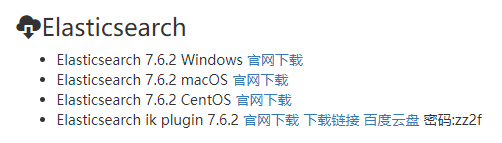
