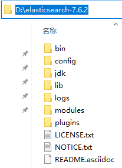
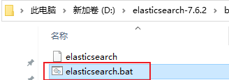
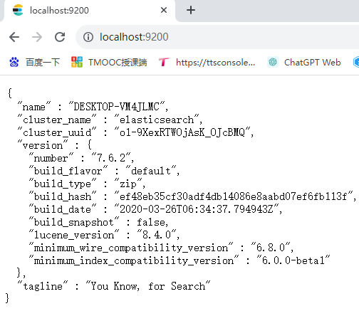
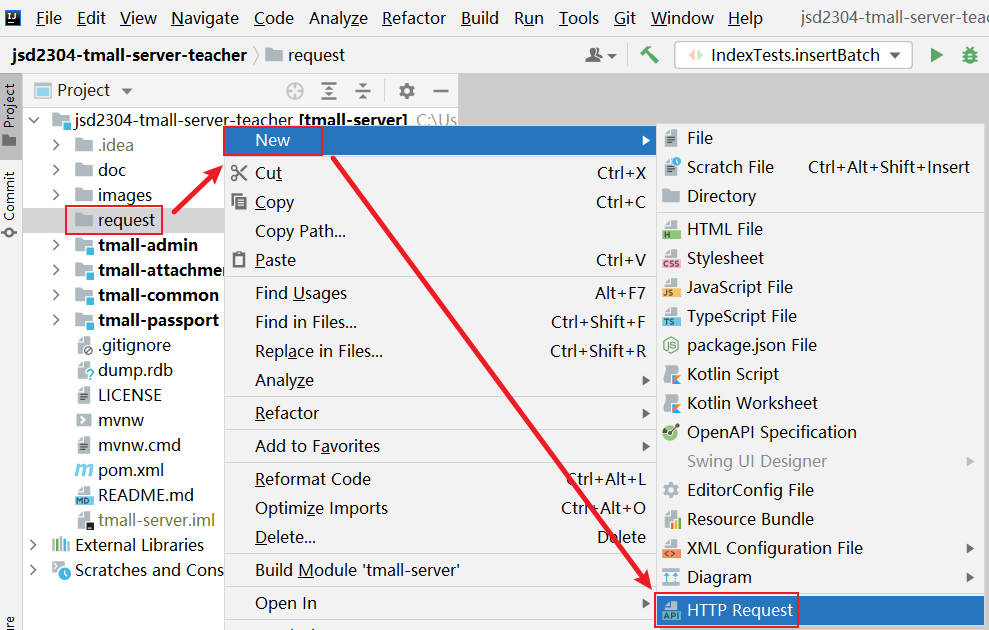
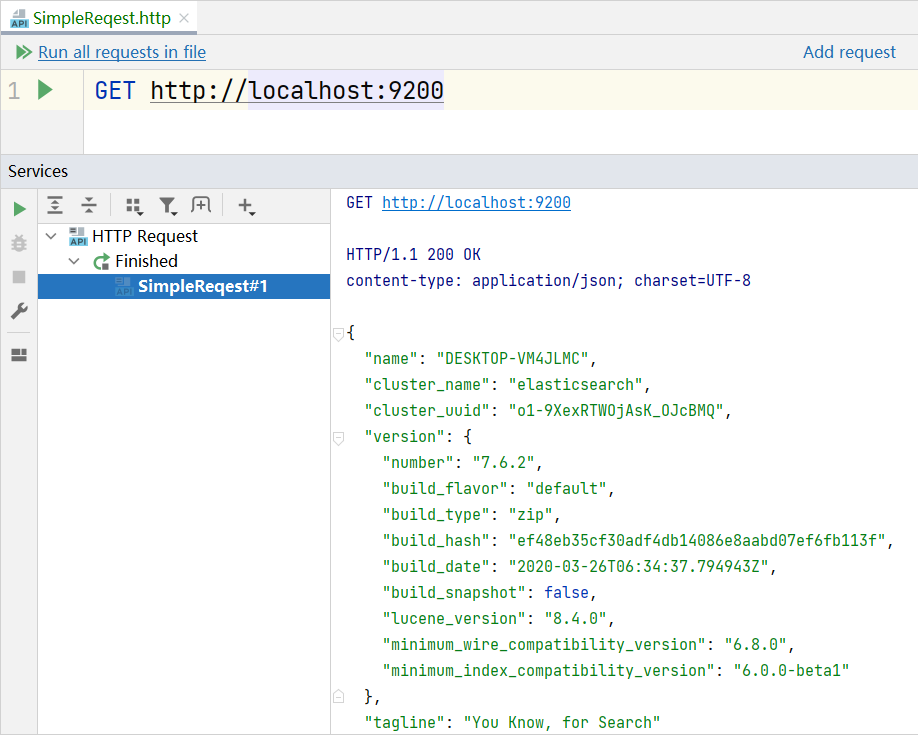
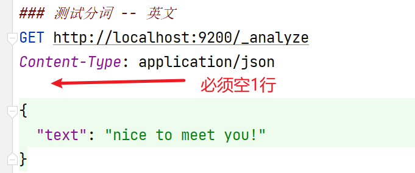
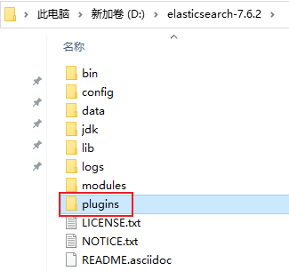
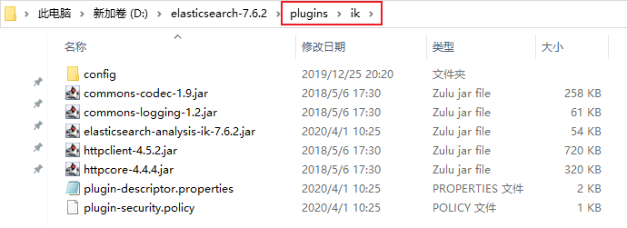
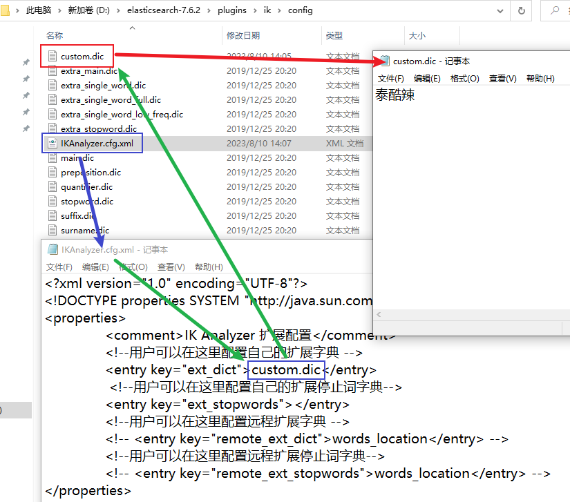

# 關於Elasticsearch

Elaticsearch是專門用於解決搜索問題的NoSQL的文檔數據庫。

無論使用哪種操作系統，只需要下載elasticsearch的壓縮包並解壓即可使用，需要注意，elasticsearch文件夾的各層級的父級文件夾的名稱中不允許包含非ASCII碼字符和空格！例如放在D盤根目錄下：



執行`bin`目錄下的`elasticsearch`即可啟用Elasticsearch服務：



啟動成功後，效果大致如下：


**注意：**在使用Elasticsearch的過程中，以上窗口不可關閉！

當啟動成功後，你可以通過瀏覽器訪問 http://localhost:9200，頁面顯示內容如下：



elasticsearch提供了一套基於RESTful的訪問，你可以使用任何一種可以提交REST請求的工具來訪問elasticsearch及其中的數據，例如常見的測試工具PostMan等。

或者，你也可以在IntelliJ IDEA中，使用HTTP Request進行訪問：



在HTTP Request文件中編寫需要提交的請求，然後，點擊左側的運行圖標即可發起請求



# 使用elasticsearch分詞

Elasticsearch之所以能夠高效處理搜索，是因為它會將你的數據進行“分詞”處理，即將一段文本拆成若幹個文本，在執行搜索時，會嘗試檢查是否匹配“拆”出來的某個文本。

向 http://localhost:9200/_analyze 提交請求即可分詞，並且，請求中必須包含請求參數，參數名稱固定為`text`，整個請求的格式大致如下：



提示：在同一個`.http`文件中，可以編寫多個請求，但是，後續的請求的代碼必須使用 `###` 和前序的請求分開，不能只使用1個 `#`！

你也可以嘗試對中文的句子進行分詞，會發現，在默認情況下，Elasticsearch只能將中文中的每個字拆出來，並不能正確的處理各個詞語！

示例代碼：

```
### 測試分詞 -- 中文
GET http://localhost:9200/_analyze
Content-Type: application/json

{
  "text": "很高興認識你！"
}
```

可以在Elasticsearch中添加新的分詞插件來解決以上問題，經典的中文分詞插件就是ik分詞器。

所有插件都應該放在Elasticsearch下的plugin文件夾下：



你需要將下載得到的ik分詞器的壓縮包解壓出來，將解壓得到的文件夾放在`plugins`文件夾下，而ik分詞器的文件夾名稱就叫`ik`即可：



**注意：**完成後，需要重啟Elasticsearch（關了再打開）才可以應用新添加的分詞器！

接下來，你就可以使用IK分詞器對中文的句子進行分詞！你需要在請求參數中通過`analyzer`屬性來指定分詞器，取值可以是IK分詞器提供的`ik_smart`或`ik_max_word`，例如：

```
### 測試分詞 -- 中文 -- ik_smart
GET http://localhost:9200/_analyze
Content-Type: application/json

{
  "analyzer": "ik_smart",
  "text": "很高興認識你！"
}

### 測試分詞 -- 中文 -- ik_max_word
GET http://localhost:9200/_analyze
Content-Type: application/json

{
  "analyzer": "ik_max_word",
  "text": "很高興認識你！"
}
```

使用IK分詞器時，可以自造詞！例如：



# Elasticsearch文檔數據庫的相關概念

**索引（index / indices）**

- 相當於MySQL中的Database

**類型（type / types）**

- 相當於MySQL中的Table，可以自行創建“類型”，或者，如果不關心“類型”，使用 `_doc` 表示類型名
- ES本身並不注重“類型”的概念，甚至在較高版本（8.x或以上）基本已廢棄此概念

**文檔（document / documents）**

- 相當於MySQL中各數據表中一行行的數據
- 在ES中每個數據都是由JSON格式組織的

**字段（field / fields）**

- 相當於MySQL中的Column

# 基於RESTful訪問Elasticsearch

## 操作匯總


## 添加文檔

**添加文檔（使用ES隨機生成的ID值）**

請求格式：

```
POST http://localhost:9200/{索引名}/{類型名}
```

提示：添加文檔時，如果索引不存在，會自動創建索引，如果類型不存在，會自動創建類型！

請求示例：

```
### 添加文檔
POST http://localhost:9200/index_crud/_doc
Content-Type: application/json

{
  "id": 998,
  "title": "2023新茶上市，賠本大甩賣",
  "sort": 188
}
```

**添加文檔（自行指定ID值）**

請求格式：

```
PUT http://localhost:9200/{索引名}/{類型名}/{文檔ID}
```

請求示例：

```
### 添加文檔（自行指定ID值）
PUT http://localhost:9200/index_crud/_doc/Tea9527
Content-Type: application/json

{
  "id": 999,
  "title": "2023老茶上市，賣得也相當不錯",
  "sort": 199
}
```

## 刪除

**根據ID刪除文檔**

請求格式：

```
DELETE http://localhost:9200/{索引名}/{類型名}/{文檔ID}
```

請求示例：

```
### 根據ID刪除文檔
DELETE http://localhost:9200/index_crud/_doc/Tea9527
```

提示：如果嘗試刪除的文檔不存在，將響應`404`錯誤！

**刪除索引**

請求格式：

```
DELETE http://localhost:9200/{索引名}
```

請求示例：

```
### 刪除索引
DELETE http://localhost:9200/index_crud
```

提示：如果嘗試刪除的索引不存在，將響應`404`錯誤！

## 修改文檔

**修改文檔（更新整篇文檔）**

請求格式：

```
PUT http://localhost:9200/{索引名}/{類型名}/{文檔ID}
```

請求示例：

```
### 修改文檔（更新整篇文檔）
PUT http://localhost:9200/index_crud/_doc/Tea9527
Content-Type: application/json

{
  "id": 999,
  "title": "2023老茶上市，賣得也相當不錯",
  "sort": 199,
  "description": "這個老茶味道很好，強烈推薦！"
}
```

注意：以上做法將使用請求參數替換原有的整篇文檔！

**修改文檔（局部修改）**

請求格式：

```
POST http://localhost:9200/{索引名}/{類型名}/{文檔ID}/_update
```

請求參數：

```json
{
	"doc": {
        需要更新的數據的參數
    }
}
```

請求示例：

```
### 修改文檔（局部修改）
POST http://localhost:9200/index_crud/_doc/Tea9527/_update
Content-Type: application/json

{
  "doc": {
    "sort": 189,
    "description": "老茶和新茶味道還是挺不一樣，要不，買個試試？"
  }
}
```

注意：如果請求參數中包含新的屬性（原文檔中沒有的屬性），也會更新成功，且在文檔中新增新的屬性！

## 查看文檔

**查看某個索引中的所有文檔**

請求格式

```
GET http://localhost:9200/{索引名}/_search
```

請求示例：

```
### 查看某個索引中的所有文檔
GET http://localhost:9200/index_crud/_search
```

**根據ID訪問文檔**

請求格式

```
GET http://localhost:9200/{索引名}/{類型名}/{文檔ID}
```

請求示例：

```
### 根據ID訪問文檔
GET http://localhost:9200/index_crud/_doc/yjEl3okBucTgSd_ILGK2
```

# Elasticsearch中的數據類型

在Elasticsearch中，各字段的值也是有數據類型的，大致為：

- 字符串類型：`text`、`keyword`
  - `text`類型在被處理時，默認會被分詞
    - 默認
  - `keyword`類型在被處理時，默認不會被分詞
- 數值類型：`byte`、`short`、`integer`、`long`、`float`、`double`等
- 布爾類型：`boolean`
- 日期類型：`date`

例如，準備一些測試數據：

| ID（id） | 標題（title）    | 簡介（description） | 排序序號（sort） | 售價（price） |
| -------- | ---------------- | ------------------- | ---------------- | ------------- |
| 1        | 散裝龍井         | 好喝又實惠          | 160              | 300           |
| 2        | 大紅袍大禮包     | 性價比之王          | 190              | 688           |
| 3        | 龍井禮盒         | 送禮必備            | 130              | 888           |
| 4        | 精裝陳年老普洱   | 收藏珍品            | 150              | 988           |
| 5        | 精裝鐵觀音大禮包 | 家中常備            | 160              | 700           |

在使用Elasticsearch時，應該先手動創建索引，並確定此索引中的文檔有哪些字段，及字段的數據類型！

請求格式：

```
### 自定義索引及其文檔的屬性和數據類型
PUT http://localhost:9200/{索引名}
Content-Type: application/json; charset=UTF-8

{
	"mappings": {
		"properties": {
			"{字段名1}": {
				"type": "{字段類型1}",
				"analyzer": "{分詞器名稱，僅用於text類型的字段}"
			},
			"{字段名2}": {
				"type": "{字段類型2}"
			},
			... ...
			"{字段名n}": {
				"type": "{字段類型n}"
			}
		}
	}
}
```

請求示例：

```
### 自定義索引及其文檔的屬性和數據類型
PUT http://localhost:9200/index_search
Content-Type: application/json; charset=UTF-8

{
  "mappings": {
    "properties": {
      "id": {
        "type": "long"
      },
      "title": {
        "type": "text",
        "analyzer": "ik_max_word"
      },
      "description": {
        "type": "keyword"
      },
      "sort": {
        "type": "long"
      },
      "price": {
        "type": "long"
      }
    }
  }
}
```

插入測試數據示例：

```
### 添加文檔--測試數據1
PUT http://localhost:9200/index_search/_doc/1
Content-Type: application/json

{
  "id": 1,
  "title": "散裝龍井",
  "description": "好喝又實惠",
  "sort": 160,
  "price": 300
}

### 添加文檔--測試數據2
PUT http://localhost:9200/index_search/_doc/2
Content-Type: application/json

{
  "id": 2,
  "title": "大紅袍大禮包",
  "description": "性價比之王",
  "sort": 190,
  "price": 688
}

### 添加文檔--測試數據3
PUT http://localhost:9200/index_search/_doc/3
Content-Type: application/json

{
  "id": 3,
  "title": "龍井禮盒",
  "description": "送禮必備",
  "sort": 130,
  "price": 888
}

### 添加文檔--測試數據4
PUT http://localhost:9200/index_search/_doc/4
Content-Type: application/json

{
  "id": 4,
  "title": "精裝陳年老普洱",
  "description": "收藏珍品",
  "sort": 150,
  "price": 988
}

### 添加文檔--測試數據5
PUT http://localhost:9200/index_search/_doc/5
Content-Type: application/json

{
  "id": 5,
  "title": "精裝鐵觀音大禮包",
  "description": "家中常備",
  "sort": 160,
  "price": 700
}
```

# 搜索

**簡單的搜索**

請求格式：

```
GET http://localhost:9200/{索引名}/_search?q={字段名:查詢關鍵字}
```

請求示例：

```
### 根據關鍵字執行簡單的搜索
GET http://localhost:9200/index_search/_search?q=title:龍井
```

**高級搜索**

```
### 添加文檔--測試數據1
PUT http://localhost:9200/index_search/_doc/1
Content-Type: application/json

{
  "id": 1,
  "title": "散裝龍井",
  "description": "好喝又實惠",
  "sort": 160,
  "price": 300
}

### 添加文檔--測試數據2
PUT http://localhost:9200/index_search/_doc/2
Content-Type: application/json

{
  "id": 2,
  "title": "大紅袍大禮包",
  "description": "性價比之王",
  "sort": 190,
  "price": 688
}

### 添加文檔--測試數據3
PUT http://localhost:9200/index_search/_doc/3
Content-Type: application/json

{
  "id": 3,
  "title": "龍井禮盒",
  "description": "送禮必備",
  "sort": 130,
  "price": 888
}

### 添加文檔--測試數據4
PUT http://localhost:9200/index_search/_doc/4
Content-Type: application/json

{
  "id": 4,
  "title": "精裝陳年老普洱",
  "description": "收藏珍品",
  "sort": 150,
  "price": 988
}

### 添加文檔--測試數據5
PUT http://localhost:9200/index_search/_doc/5
Content-Type: application/json

{
  "id": 5,
  "title": "精裝鐵觀音大禮包",
  "description": "家中常備",
  "sort": 160,
  "price": 700
}
```

```
### 刪除索引
DELETE http://localhost:9200/index_search

### 自定義索引及其文檔的屬性和數據類型
PUT http://localhost:9200/index_search
Content-Type: application/json; charset=UTF-8

{
  "mappings": {
    "properties": {
      "id": {
        "type": "long"
      },
      "title": {
        "type": "text",
        "analyzer": "ik_max_word"
      },
      "description": {
        "type": "keyword"
      },
      "sort": {
        "type": "long"
      },
      "price": {
        "type": "long"
      }
    }
  }
}

### 查看某個索引中的基本信息
GET http://localhost:9200/index_search

### 查看某個索引中的所有文檔
GET http://localhost:9200/index_search/_search

### 簡單搜索：根據關鍵字執行簡單的搜索：搜索title中包含“龍井”的數據
GET http://localhost:9200/index_search/_search?q=title:龍井

### 簡單搜索：根據關鍵字執行簡單的搜索：搜索title中包含“精裝”的數據，注意，包含“散裝”或其它“?裝”的數據也會出現在結果中
GET http://localhost:9200/index_search/_search?q=title:精裝

### 簡單搜索：根據關鍵字執行簡單的搜索：搜索description中包含“收藏珍品”的數據
GET http://localhost:9200/index_search/_search?q=description:珍品

### 高級搜索：自定義query，在query屬性下配置match屬性，在match屬性下再配置搜索的字段名與關鍵字
GET http://localhost:9200/index_search/_search
Content-Type: application/json

{
  "query": {
    "match": {
      "title": "龍井"
    }
  }
}

### 高級搜索：多條件搜索：自定義query，在query屬性下配置bool屬性，在bool屬性下再配置must，must的值是數組，數組元素就是匹配規則，must下的多個規則必須同時匹配才能被搜索到
### 除了must以外，還可以是should，should只需要匹配其中任意1個條件即可
### 另外，還可以是must_not，即不允許是某種規則
### must >>> AND
### should >>> OR
### must_not >>> !=
GET http://localhost:9200/index_search/_search
Content-Type: application/json

{
  "query": {
    "bool": {
      "should": [
        {
          "match": {
            "title": "龍井"
          }
        },
        {
          "match": {
            "description": "送禮必備"
          }
        }
      ]
    }
  }
}

### 高級搜索：查詢指定字段的數據，在query同級配置_source，此屬性的值是數組，用於指定字段列表
GET http://localhost:9200/index_search/_search
Content-Type: application/json

{
  "query": {
    "match_all": {}
  },
  "_source": [
    "id",
    "title",
    "price"
  ]
}

### 高級搜索：指定排序，在query同級配置sort屬性，在sort屬性中配置排序規則，默認根據字段值升序排列，也可以配置order屬性來指定規則，取值為desc時為降序
GET http://localhost:9200/index_search/_search
Content-Type: application/json

{
  "query": {
    "match_all": {}
  },
  "sort": [
    {
      "sort": {},
      "id": {
        "order": "desc"
      }
    }
  ]
}

### 高級搜索：分頁搜索，在query同級配置from和size屬性
GET http://localhost:9200/index_search/_search
Content-Type: application/json

{
  "query": {
    "match_all": {}
  },
  "sort": [
    {
      "id": {}
    }
  ],
  "from": 1,
  "size": 3
}

### 高級搜索：高亮顯示，在query同級配置highlight屬性進行配置，在highlight中配置fields屬性，可以指定對應的字段
### 執行搜索後，匹配的結果中會出現同級的highlight數據，其中搜索的關鍵字默認會被<em>標簽框住，後續在客戶端拿到此結果後可以對<em>標簽設計CSS樣式
### 或者，在配置高亮搜索時，還可以在highlight標簽下配置pre_tags和post_tags屬性，以替換<em>和</em>標簽
GET http://localhost:9200/index_search/_search
Content-Type: application/json

{
  "query": {
    "match": {
      "title": "精裝"
    }
  },
  "highlight": {
    "fields": {
      "title": {}
    },
    "pre_tags": "<font style='color: red;'>",
    "post_tags": "</font>"
  }
}
```
